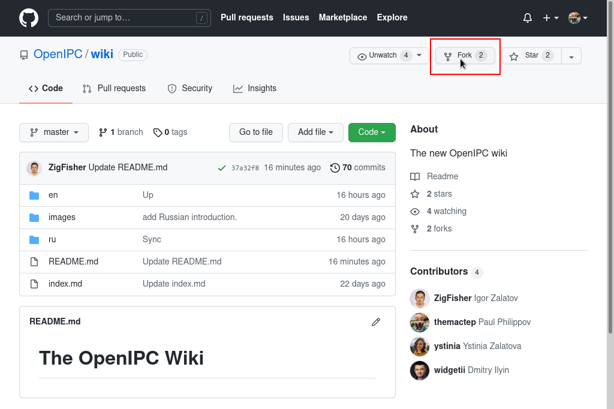
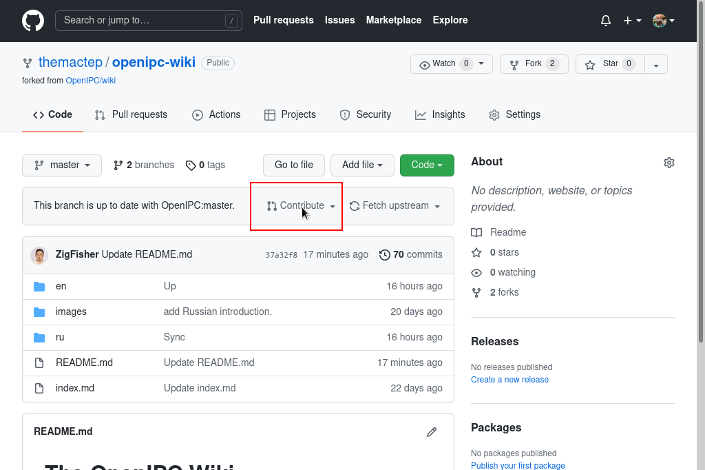

OpenIPC Wiki
============

[English](en/index.md) | [Русский](ru/index.md)

> "Improving the world, one patch at a time."

### This is an open project, so you can help, too.

We try to collect, organize and share as much information regarding different
aspects of the project as we can. But sometimes we overlook things that seem
obvious to us, developers, but are not so obvious to end-users, people who are
less familiar with nuts and bolts behind the scene. That is why we set up this
wiki and let anyone having a GitHub account to make additions and improvements
to the knowledgebase.

### How to contribute.

Sign in into your GitHub account, or [get yourself one][gh-signup] if you don't
have it yet. It's free.

Go to [the wiki repository](https://github.com/openIPC/wiki/) and fork it.

Make changes (correct a typo, add another record into a table, or write a new
article) and commit them to your own fork of the repository.

From your repository, create a pull request, so we could review and incorporate
your changes into our version of the wiki.

[gh-signup]: https://github.com/signup
