# OpenIPC Wiki
[Table of Content](../README.md)

Autofocus and manual focus
--------------------------

A camera with a motorised lens can be focused from the web interface, can
focus itself, and — on the cameras that report a focus measurement — can be
taught what it should count as sharp. This page covers all three: the lens
controls on the **Live** page, what the autofocus pass actually does and how
long it takes, and the calibration tool in the raw editor's **Focus** tab,
which is the advanced half and most people will never need.

Every screenshot here comes from one camera: a hi3516ev300 with an IMX335
sensor and a XiongMai 85H50AI motorised zoom block, on a nightly build. The
numbers in them are that camera's on that day, and yours will differ; what
they look like and what they mean is the same on any camera that has the
feature.

### What you need

Three things, and all three have to be there:

1. **A motorised lens on a serial line the camera can drive.** Two protocols
   are spoken: `pelco-xm`, the near-Pelco dialect the XiongMai zoom blocks use
   (the 85H50AI family, found in many varifocal cameras), and `pelco-d`,
   standard Pelco-D. A lens on GPIO stepper pins can be zoomed and focused from
   the pad but cannot autofocus — the engine needs to own the serial port.
2. **An ISP that reports a focus measurement.** Today that is the HiSilicon and
   Goke family — the hi3516ev300 in the screenshots and its relatives. The
   quickest check is the **Dashboard**: the *ISP — what this SoC reports* card
   has a **Focus metric** row on a camera that has the statistic, with a number
   that moves when the lens does.

   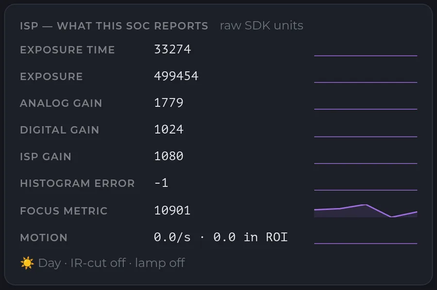

3. **Firmware with the focus engine in it.** Majestic hands the motor work to a
   plugin, [majestic-af](https://github.com/OpenIPC/majestic-af), and the
   nightly builds carry it. Use a nightly from **2026-09-23 or later**: builds
   before that shipped an older plugin that could not find focus at all at some
   zoom settings, and a camera on one of them will report *Autofocus finished*
   while the picture stays soft.

Then the camera has to be told what it has. The lens is declared in the boot
environment, once, from a shell:

```sh
fw_setenv ptz_control pelco-xm      # or pelco-d
fw_setenv ptz_caps 'zoom focus'     # the axes it really has
```

`ptz_caps` matters on a zoom block: the 85H50AI accepts pan and tilt frames
and silently ignores them, and a pad must not draw buttons that cannot work.
Leave it unset on a lens that has every axis.

The engine's own settings are on the **Settings** page, in the **ISP /
Exposure** section, under **Autofocus**: **Motorized lens** (the switch), the
protocol, the serial port and its baud rate, the **PTZ button step** and the
**Focus mode**. The [settings reference](#settings-reference) at the end lists
them.

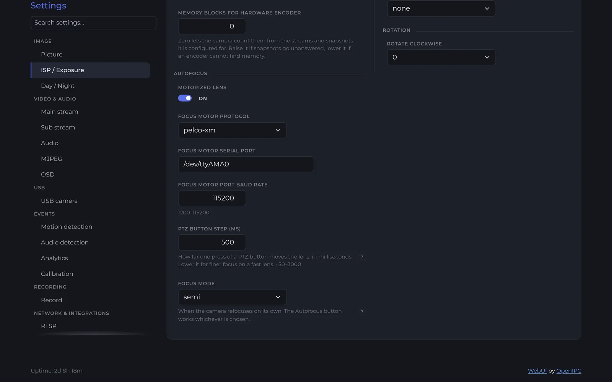

Two things about the switch that are easy to trip over:

- **Turning Motorized lens on or off needs a restart of majestic.** The setting
  saves live, but the motor driver is loaded at start. Until the restart the
  Live page says so: *The camera is not driving the lens. Restart majestic to
  load the motor driver.*
- Some ready-made firmware profiles — the 85H50AI's among them — ship with it
  already on, with the port and protocol filled in. On a generic build it is
  off until you switch it on.

If your board came with a serial console on the same UART as the lens, the
console has to go: the ready-made profile disables it, but on a board you
converted yourself a login prompt on `/dev/ttyAMA0` will talk over the lens.

### Focusing from the Live page

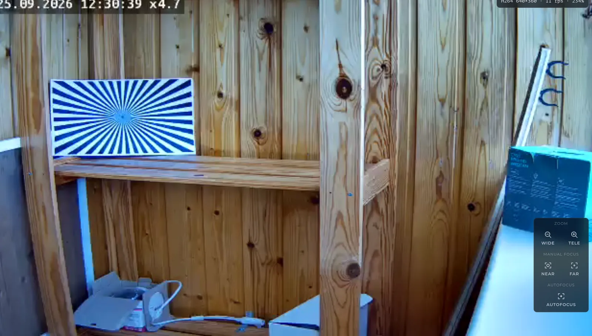

On a camera with a lens the Live page grows a pad over the picture, at the
bottom right. It shows only what the lens has: **Zoom** (Wide, Tele),
**Manual focus** (Near, Far), and **Autofocus** when the engine is switched on.
The caption above Near and Far reads *Focus* on a camera with no engine and
*Manual focus* once the camera has said there is one.

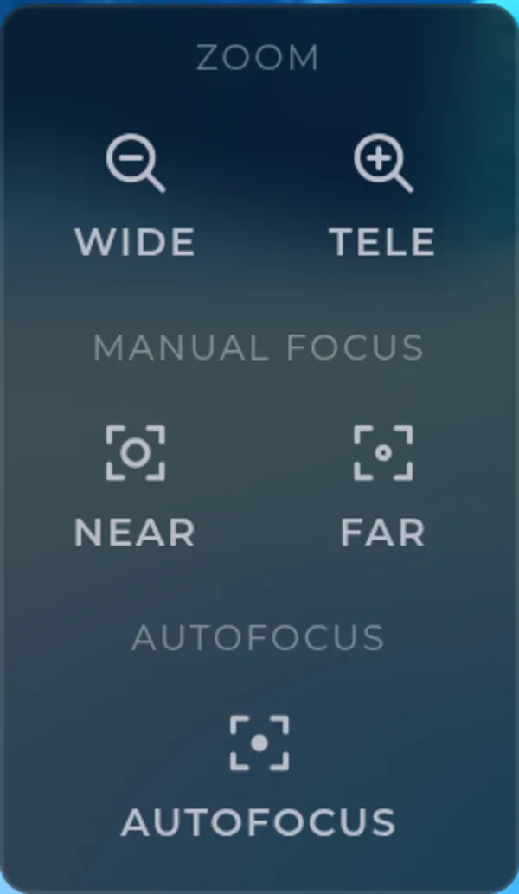

**Tap or hold.** A tap on Near, Far, Wide or Tele is a short nudge — one fifth
of the configured step, so a delicate adjustment is a series of taps. Holding
the button moves the lens continuously until you let go. The keyboard works
too: with the picture focused, the arrow keys drive the pad, and Enter or Space
on a button is a single nudge.

**Watch the number, not just the picture.** Open the stats panel with the
**STATS** button in the control bar. Its **Focus** section shows the camera's
own sharpness measurement — the same statistic the autofocus hunts — as
*sharpness now* and *best since you started focusing*, with a small graph.
Focusing by hand is then a matter of holding a button until the number peaks
and starts to fall, and coming back to the peak. The *best* figure resets
itself when you zoom or start an autofocus, because a best from a different
zoom is not a target you can reach.

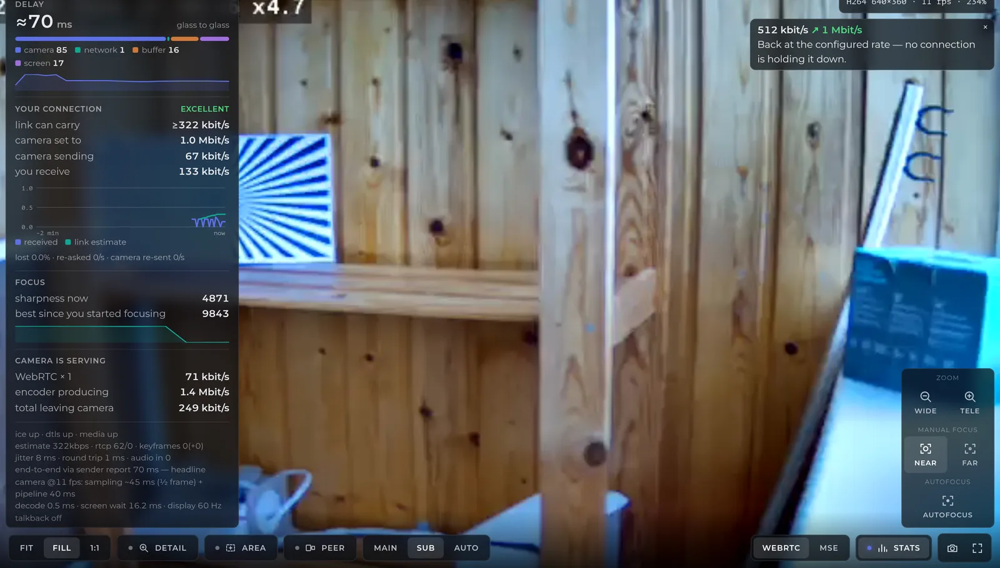

The number has no absolute meaning. The same view read about 10 000 in
daylight and would read a fraction of that at dusk; the peak swings by an
order of magnitude with the light. What you compare is *now* against *best*,
in one scene, at one zoom.

**Autofocus** is one press, and it takes a while — this is not a phone camera.
While it runs the picture goes soft and comes back, and a toast on the picture
says *Autofocus…*; when it lands the toast says *Autofocus finished* and the
stats panel's *sharpness now* sits on its *best*.

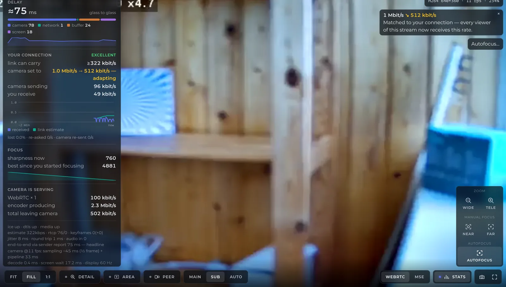

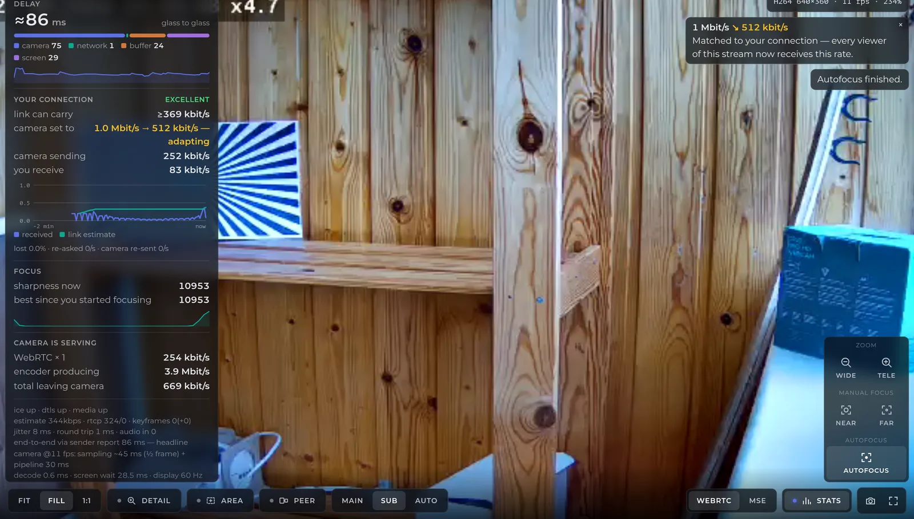

How long it takes depends on what the camera already knows:

- **10 to 20 seconds** when the lens is roughly where it was last focused and
  the zoom has not changed since. This is the everyday case.
- **40 to 90 seconds** when it has to start cold: after a restart, after a zoom
  change, or after a pass was interrupted. The toast says *searching the full
  range* once a pass has run longer than about 25 seconds, so a long wait is
  announced rather than looking like a hang. A cold pass drives the lens to its
  near stop first and sweeps the whole travel from there, which on the 85H50AI
  is about 38 seconds end to end.

Touching Near, Far, Wide or Tele while a pass runs cancels it: the toast says
*Autofocus was interrupted*. That is deliberate — your hand always wins — but
it has a cost: the next pass starts cold.

**After a zoom, the camera refocuses itself.** Zooming moves the point of
focus mechanically, so about a second after you let go of Wide or Tele the
camera books a focus pass and runs it. The stats panel's *best* resets at the
same moment. If you would rather set focus by hand after zooming, either touch
Near or Far before the pass starts — a manual focus cancels the booked pass —
or set **Focus mode** to *manual*, which stops the camera booking one at all.
The default, *semi*, refocuses after every zoom and never otherwise.

When a pass cannot run, the toast says why, in the camera's own words:

| The toast says | What it means |
|---|---|
| *The camera could not open the focus motor's serial port.* | The port in the settings is wrong, or something else holds it — a serial console, most often. |
| *This camera's image pipeline does not report a focus measurement, so it cannot focus itself.* | The ISP has no focus statistic. Manual focus still works. |
| *The lens did not answer.* | The camera sent commands and measured no change. Wiring, baud rate, or a lens that is asleep (see [troubleshooting](#troubleshooting)). |
| *Autofocus failed: no contrast to focus on.* | The scene has nothing with edges in it, or is too dark to measure. Point it at something, or wait for light. |
| *Autofocus searched from the wrong end…* | The camera did not know where the zoom was and started its search from the wrong side of the travel. Zoom once, in either direction, and try again. |

### How the camera decides it is in focus

This is the short version, and it is enough to understand everything above.

The ISP divides the frame into a grid of 255 zones and, for every frame,
measures how much fine detail each zone contains — how strongly a sharpening
filter responds to it. Blend that across the grid and you have one number that
is largest when the picture is sharpest. That number is the *Focus metric* on
the Dashboard, *sharpness now* in the stats panel, and the whole of what the
autofocus knows.

The engine drives the lens one way while watching the number rise, keeps going
until it has clearly passed the peak, then comes back onto it. It never hunts
back and forth around the peak: one sweep, one return. It also keeps a
dead-reckoned position for the lens in milliseconds of travel from the near
stop, which is what lets a warm pass start close and finish in seconds. That
position is invalidated by any zoom, because zooming shifts the focus element
by an amount no focus command accounts for — hence the cold pass and the
automatic refocus after a zoom.

Two consequences worth keeping in mind:

- **A peak can sit against an end stop.** At wide angle, infinity focus is at
  the near limit of travel on many zoom blocks. The engine handles that, but a
  manual sweep that stops at the wall is not a sweep that missed.
- **The nearest thing with edges wins.** A smear of dirt on the dome, a cobweb,
  a drop of water: they are a few millimetres from the lens, and a contrast
  autofocus can lock onto them and stay there. On a live picture that only
  looks like a soft image. The Focus tab below is where it becomes visible.

### Teaching the camera what is sharp

Where the autofocus lands is decided by the filter the ISP measures detail
with. The filter that ships is tuned for the sensors OpenIPC has met, and for
most cameras it is right. If yours focuses on the wrong thing, lands soft, or
you are building a firmware image for a sensor nobody has tuned, the
**Focus** tab of the [raw editor](raw-editor.md) is where the filter is seen,
tried and kept. It lives under **Camera → Raw** and needs everything the raw
editor needs: a camera that can serve a raw frame, and an internet route to
fetch the editor the first time.

The tab is built for an ISP engineer, and its first line says so: to focus the
camera, use the Live page. What it adds is the measurement underneath.

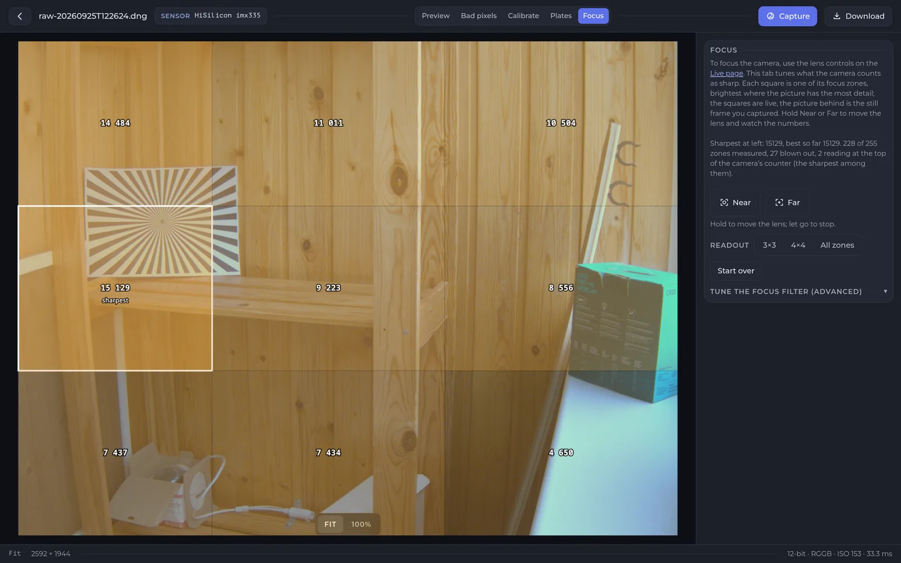

**The grid.** The picture is the still frame the editor captured; the squares
over it are live, re-read from the camera every 0.7 seconds. Each block shows
the focus reading for that part of the frame, brightest where there is most
detail, and the sharpest is outlined. Hold **Near** or **Far** (on a camera
with a motor) and the numbers move while the picture does not — the frame is
a still, and the numbers are what you are reading. The line above the buttons
sums it up: *Sharpest at left: 15 129, best so far 15 129. 228 of 255 zones
measured, 27 blown out, 2 reading at the top of the camera's counter*.

- *blown out* zones contain a highlight so bright the filter cannot measure
  through it. They are drawn without a fill and never named the sharpest.
- *too dark* zones have nothing the filter can see. Same treatment.
- *at the top of the camera's counter* is the one that matters for
  calibration: each zone's reading has a ceiling, and a filter with too much
  gain pins it there. A pinned reading looks like a strong, steady, sharp one — and
  cannot rise, so no comparison made against it means anything. The designer
  below says what to do about it.

**Readout** switches between 3×3, 4×4 and every one of the 255 zones. The
fine grid is always what is measured; the readout only changes what is drawn.
With every zone drawn there are no numbers, only brightness.

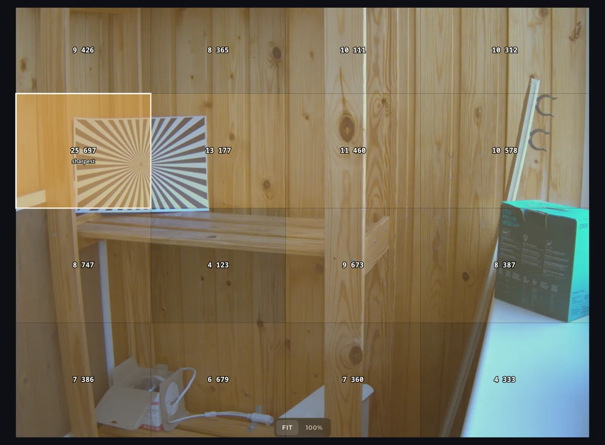

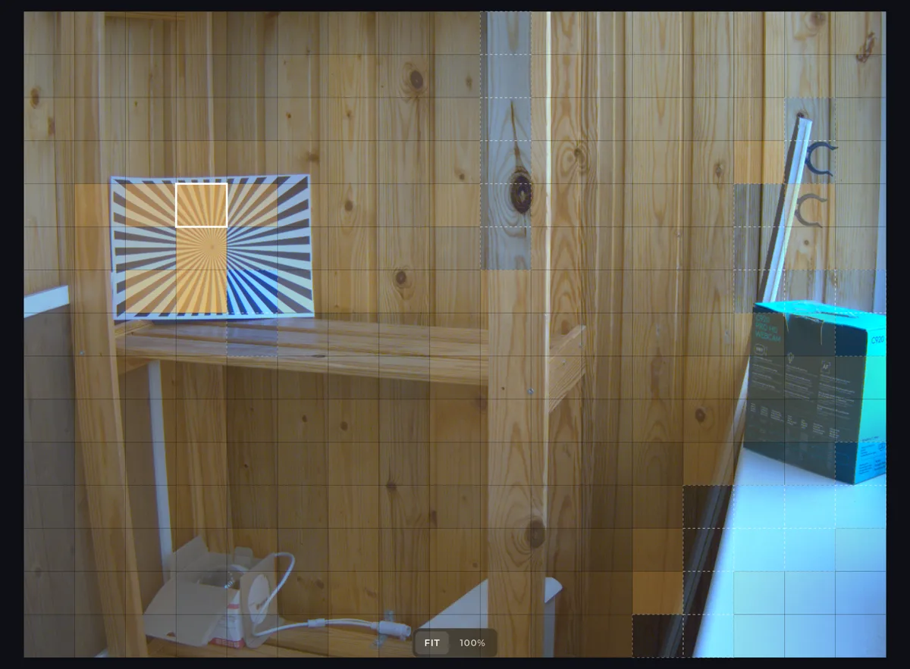

**Start over** forgets the *best so far*. Do that whenever the scene or the
zoom changes: a best from a different picture is a target that can never be
reached, and reads as "you are getting worse".

After a lens has moved through focus, blocks that never responded to the move
are captioned *nothing to focus on* and their number dimmed. A blank wall and a
patch of sky score low wherever the lens is; that is not softness, and the
caption stops it reading as such.

#### The filter designer

Open **Tune the focus filter (advanced)**.

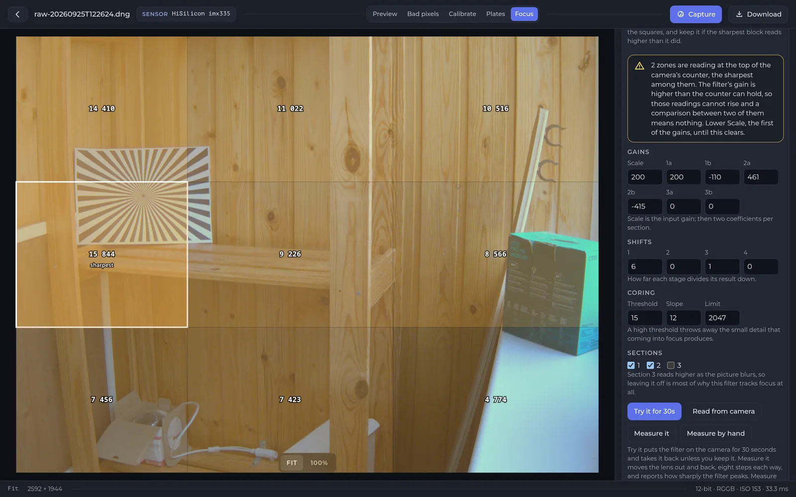

What you see is the filter the camera measures focus through, as the camera
holds it: **Gains** — an input scale (*Scale*) and two numbers for each of
three sections — **Shifts**, which scale each section's result down,
**Coring** (a threshold below which detail is thrown away, a slope and a
limit) and **Sections**, which switches the three parts of the filter on and
off. You do not need to know what every number does to use the workflow
below. The two that matter in practice are *Scale*, and the third section,
which reads *higher* as the picture blurs — which is why it ships off and why
the panel warns you about it.

The values shown are what the camera is running, read back from the chip —
not what is in the configuration file, which is usually empty for these keys
because the filter comes from the firmware or the sensor's profile.

The workflow is: change something, watch the grid, keep it if it is better.
Four buttons:

- **Try it for 30s** puts the filter on the camera without saving it, and
  starts a countdown. Watch the squares. After thirty seconds the camera puts
  the old filter back by itself unless you press **Keep it**; **Put it back**
  does so at once. This is the same bargain the colour calibration makes, for
  the same reason: a filter that measures the wrong thing looks exactly like a
  camera that will not focus, and nothing on screen would tell you which
  change to undo.

  

- **Keep it** writes the filter to the camera's configuration *and* into its
  sensor profile. The configuration is per camera and a factory reset takes
  it; the profile is the file a firmware image carries, so a filter kept there
  can be built into your own image and flashed onto every camera with that
  sensor — which is the whole reason to tune one rather than live with what
  shipped.

  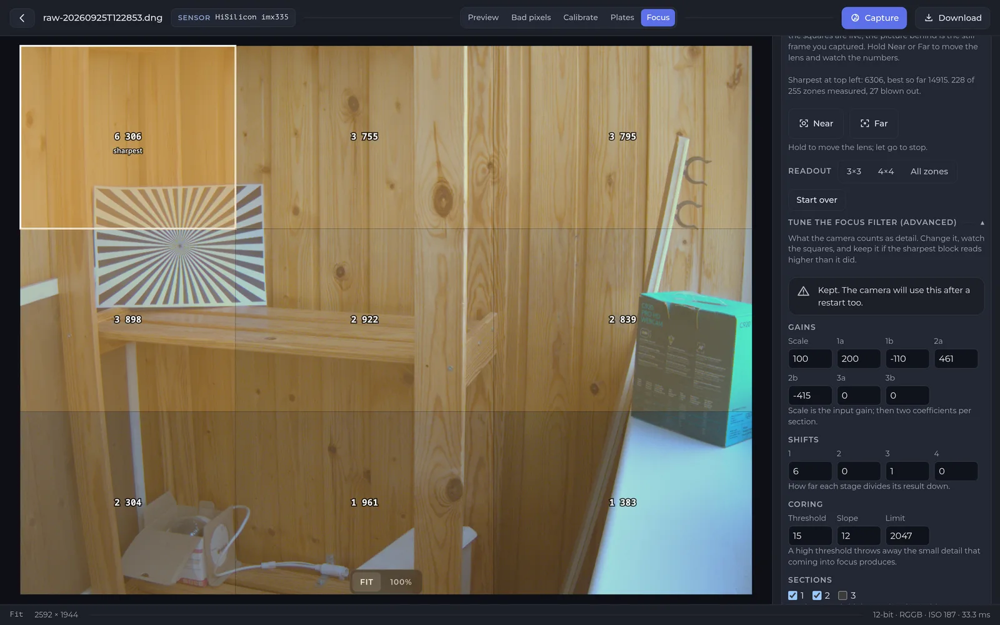

- **Read from camera** discards your edits and reloads what is running.
- **Measure it** and **Measure by hand** answer the question the grid alone
  cannot, below.

**Bigger is not better.** The obvious way to read the panel — make the
sharpest number go up — is wrong. Switching section 3 on more than doubles the
reading on a focused scene *and makes the filter worse*, because that section
reads higher as the picture blurs. What separates a good filter from a loud
one is how steeply its reading *falls* as the lens leaves focus, and nothing on
a still scene can show that. So the lens has to move:

- **Measure it** (on a camera with a motor) walks the lens eight steps out,
  reading the grid at each, and eight steps back to where it started. On the
  85H50AI those eight steps are a small fraction of the travel, so it is a
  quick check rather than a thorough one.
- **Measure by hand** collects readings while *you* move the lens — with Near
  and Far on a motorised camera, or by turning the barrel on one focused by
  hand — from one end of the travel right through focus to the other, and
  **Done** scores what it saw. It covers the whole range, which is why it is
  offered even where a motor is present.

  

Either way the verdict is the same shape. A filter worth keeping falls to a
small fraction of its peak across the sweep; a loud one barely moves.

**The filter that shipped, on this scene.** The camera in the screenshots
looks at a test chart, which is about the worst case for a pinned counter: two zones sat at
the top of the counter, and both measurements said so rather than reporting
a ratio that would have been meaningless.

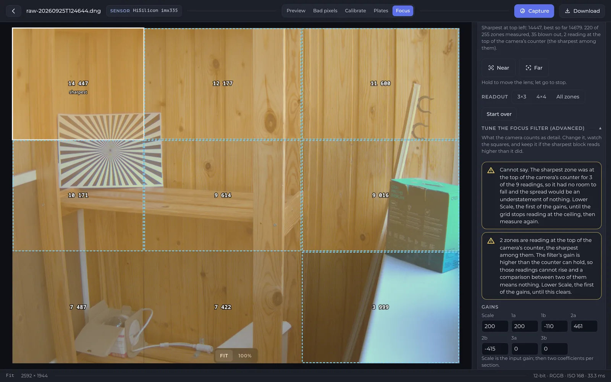

Lowering **Scale** from 200 to 100 and keeping it cleared the ceiling, and the
next sweep could be scored:

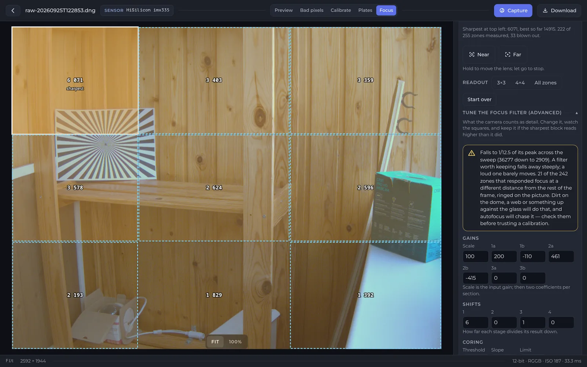

*Falls to 1/12.5 of its peak across the sweep (36 277 down to 2 909)* is a
filter that can see focus. The second sentence is the finding an autofocus
cannot make and a live picture cannot show: **zones that focus at a different
distance from the rest of the frame**, ringed on the picture.

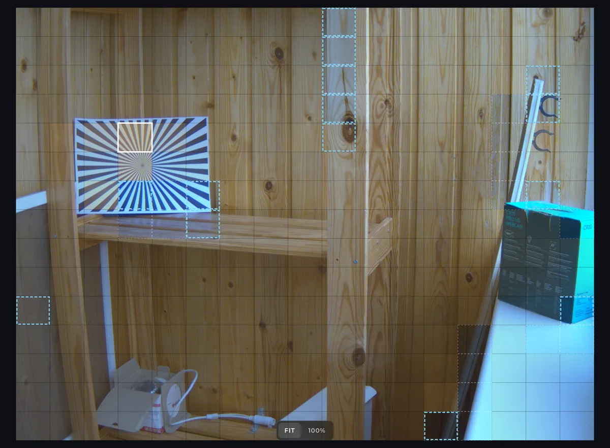

The sweep reads every zone at every lens position, so it holds one focus curve
per zone, and where a zone peaks is the distance that part of the frame is at.
Most of a scene agrees. A zone that peaks somewhere else entirely is either a
genuine near object — in the screenshots, the chart and the box are closer
than the wall, and the rings above are on them — or something on the glass: dirt, a
web, a drop. The second kind sits millimetres from the lens, peaks nowhere
near where the picture does, and is exactly what drags a contrast autofocus
onto the dome and keeps it there. Check the ringed parts of the frame before
trusting a calibration, and before blaming the autofocus.

The camera was put back to Scale 200 afterwards. That is worth saying:
the filter that ships is not wrong for this sensor, it is merely loud for a
scene that is nothing but edges, and a ceiling is a symptom of the scene as
much as of the filter. Tune for the scene the camera will actually watch.

### Settings reference

Majestic's own keys, on the **Settings** page under **ISP / Exposure →
Autofocus**, and the
[`/api/v1/config`](majestic-streamer.md) endpoint:

| Setting | Key | What it does |
|---|---|---|
| Motorized lens | `isp.autofocus.enabled` | Loads the motor driver and the engine. Restart majestic after changing it. |
| Focus motor protocol | `isp.autofocus.actuator` | `pelco-xm` (XiongMai zoom blocks, the default) or `pelco-d`. |
| Focus motor serial port | `isp.autofocus.port` | The UART the lens is on, `/dev/ttyAMA0` on the 85H50AI. |
| Focus motor port baud rate | `isp.autofocus.speed` | 115200 on the 85H50AI; 9600 is common for Pelco-D. |
| PTZ button step (ms) | `isp.autofocus.pulse` | How long one held tick moves the lens, 50–3000 ms, default 500. A tap moves a fifth of it. |
| Focus mode | `isp.autofocus.mode` | `semi` (default) refocuses after every zoom; `manual` never refocuses on its own. |
| AF focus filter … | `isp.af.iir1*` | Written by the designer's **Keep it**. Unset means the firmware or sensor profile's filter is in force. |

The boot environment, set with `fw_setenv` and read by the web interface to
decide what to draw:

| Variable | Values |
|---|---|
| `ptz_control` | `pelco-xm`, `pelco-d`, `gpio`, `motor`. Unset means no lens. Autofocus needs one of the two Pelco variants. |
| `ptz_caps` | Any of `pan tilt zoom focus`. Unset means all four. |

The serial port and its baud rate are majestic's settings, above — the older
`ptz_port` and `ptz_speed` variables belonged to scripts that no longer ship
and are not read by anything now.

Everything the pad does goes through the camera's own endpoints, so a script
can do the same: `POST /ptz?move=near&ms=200` (verbs `near`, `far`, `wide`,
`tele`, `stop`), `GET /autofocus` to start a pass and `GET /autofocus/status`
to watch it. See [Majestic streamer](majestic-streamer.md) for the API
generally.

### Troubleshooting

**The pad is there but nothing moves, and the Live page says the camera is not
driving the lens.** Motorized lens was switched on (or off and on) without a
restart. Restart majestic.

**Nothing moves after a power cut, and the camera claims every move worked.**
The XiongMai lens controller ignores every command after a cold power-up
until it is sent a wake-up sequence. Current firmware sends it when majestic
starts; a build from before 2026-09-23 does not, and a camera on one looks
exactly like this after every power cut — a restart of majestic is not a
power cut, which is why it can go unnoticed for a long time. Update.

**Zoom stops responding, or focus only covers a small slice of its range.**
The lens controller keeps its position in memory with soft limits and can lose
them after being driven into its mechanical stops repeatedly. A reboot does
not help, because the lens stays powered; **physically power-cycle the
camera**, and the controller re-homes on power-up.

**Autofocus finishes, and the picture is still soft at one zoom setting.**
The plugin pinned in firmware before 2026-09-23 searched only the first part
of the travel and reported *done* where it stopped. Update to a current
nightly. On a current build, zoom once so the camera learns the
magnification, then focus again.

**One focus direction seems dead.** On older builds the automatic refocus
after a zoom could run *after* a manual move and undo it, which read as the
button not working. Current builds cancel the booked pass the moment you touch
focus. If it persists on a current build, drive the lens by hand from both
ends of its travel while watching the Dashboard's focus metric: a direction
the lens acts on sweeps the number, one it ignores leaves it flat.

**Every command is ignored, or the lens twitches at random.** The baud rate
in the settings does not match the lens. XiongMai zoom blocks run at 115200;
many Pelco-D lenses at 9600 or 2400. A wrong rate turns every frame into
garbage the lens discards.

**Autofocus keeps landing on the glass.** Look at the Focus tab after a sweep:
zones ringed as focusing at a different distance, sitting on nothing in the
scene, are dirt or a web on the dome. Clean it.

**The Focus tab says "Cannot say" when you measure.** The sharpest zone was
pinned at the top of the camera's counter, so the sweep had nothing to
measure. Lower *Scale*, the first of the gains, until the grid stops reporting
zones at the ceiling, then measure again — and remember that a scene made of
nothing but edges will pin a counter that an ordinary scene never touches.
