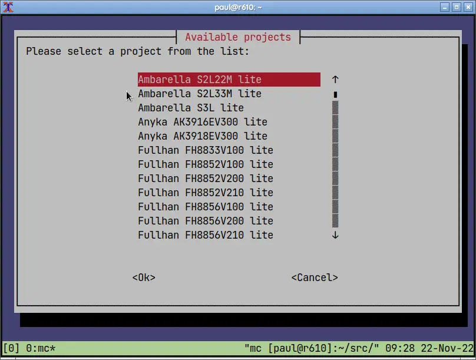

Building from sources
=====================

Before you start building your own firmware, make a few changes to your system.

### Clone OpenIPC Firmware Git repository.
```
cd
mkdir -p local/src
cd local/src
git clone https://github.com/OpenIPC/firmware.git openipc-firmware
cd openipc-firmware
```

### Install required packages.
```
sudo make install-deps
```

### Create a permanent storage for downloaded bundles.

By default, Buildroot stores all downloaded files in `dl/` directory inside
buildroot file tree.

OpenIPC building script creates a fresh buildroot file tree before every
compilation, meaning either deletes all dosnloaded packages or copies them back
and forth prior and after creating a fresh setup.

You can set your own storage directory outside of the buildroot tree. Add the
following piece of code to `.profile` file in your home directory:
```
BR2_DL_DIR="${HOME}/buildroot_dl"
[ ! -d "$BR2_DL_DIR" ] && mkdir -p $BR2_DL_DIR
export BR2_DL_DIR
```

Then, source the changes.

```
source ~/.profile
```

### Build the firmware.

Building of a binary firmware for your IP camera is fairly easy. Just clone
source code from the repository and run a provided script.
```
./building.sh
```

You will be greeted with a list of available targets.



Each target's name consists of a name of vendor, SoC model (System-on-Chip,
the heart of an IP camera, central processor with extra features) and flavor
denoting releases for different purposes - **Lite**, a compact release for
cameras with only 8MB of ROM; **Ultimate**, an extended release for cameras
with 16MB+ ROM, **FPV**, a release crafted specifically for use in drones,
or **Mini**, a fully liberated version of the firmware with an alternative
open-source streamer.

Select desired target and hit enter. Building ensues.

Process of building firmware binary takes from 15-20 minutes to several hours
depending on your computer performance and selected target. If you want to
speed up the process, make sure you use a computer with SSD rather than HDD as
the process of compiling involves a lot of reading and writing. Faster CPU is
also beneficial, and one cannot have too much RAM, either. You could even rent
an online virtual server for a handfull of cents to compile your firmware with
the power of cloud computing.

The very first run is the longest as the script will download every source
bundle required for successful compilation. Consequent runs will take a little
less time.

After the compilation is done, you'll find the final binary kernel and rootfs
image in `output/images/` directory.

```
paul@r610:~/src/openipc-firmware$ ls -l output/images/
total 35628
-rw-r--r-- 1 paul paul  4816896 Nov 22 06:06 rootfs.squashfs.t10
-rw-r--r-- 1 paul paul 14520320 Nov 22 06:06 rootfs.t10.cpio
-rw-r--r-- 1 paul paul 15544320 Nov 22 06:06 rootfs.t10.tar
-rw-r--r-- 1 paul paul  1597586 Nov 22 06:02 uImage.t10
```

Anatomy of the project
----------------------

OpenIPC firmware v2 utilizes [Buildroot][1] to build its firmware binaries. So
you should make yourself familiar with the [Buildroot documentation][2] if you
want not only to compile provided source code but make your own modifications
to the firmware.

You can add drivers or software not included in the our official releases, you
can remove unneeded drivers or software that you're not going to use, to free
up some space in the firmware. You can change default settings to better suit
your needs. The beauty of open source is that anyone can improve it, anytime.
Just don't forget to contribute your changes back to the upstream repo so that
everyone can benefit from it.

Please note that OpenIPC uses a slightly outdated version of Buildroot. As of
today, it is Buildroot [2021.02.12][3], so you might need to check out the
documentation for that particular version, as later versions may have
incompatible changes.

OpenIPC firmware sources are organized in directories by IP camera SoC vendors
as Buildroot external trees, namely `br-ext-chip-<vendor name>`. Each of such
directories has a number of subdirectories: `board/`, `configs/`, `linux/` and
`packages/`, and a few config files, all related to different boards bearing
chips from that particular vendor.

`board/` directory includes subdirectories named by groups of processors called
families. Inside each of such a family directory reside kernel configuration
files for individual processors in that family, common patches and other
family-specific files.

`configs/` directory includes default configuration files (defconfig) for
various boards with processors from the given vendor. These config files also
can differ by hardware settings, set of included packages, different default
settings, branding, and so on. Each of these defconfig files is a separate
package resulting in a separate firmware binary.

`linux/` directory includes configuration files for patching kernel to make it
work with vendor-provided binary blobs, if any.

`package/` directory has symlinks to packages used for building the resulting
firmware.

`Config.in` is a configuration file consolidating configuration files from all
provided packages.

`external.mk` is a makefile referring to makefiles from all provided packages.

`external.desc` is a file with the description of the external tree.

Making changes and rebuilding a package
---------------------------------------

Once you start tinkering with the packages you'll realize you need a way to
rebuld only one particular package, without rebuilding the whole project.
Is it even possible? Fortunately, yes. All you have to do after making changes
to the package configs is to run a couple of commands:
```
make br-<package>-dirclean
make br-<package>-rebuild
```
where _\<package>_ is the name of the package you want to recompile. Although,
as Buildroot manual states,

> While `br-<package>-rebuild` implies `br-<package>-reinstall` and `br-<package>-reconfigure`
implies `br-<package>-rebuild`, these targets as well as `<package>` only act on
the said package, and do not trigger re-creating the root filesystem image.
If re-creating the root filesystem in necessary, one should in addition run
`make br-all`.

Run `make br-linux-rebuild br-all` to rebuild Linux kernel image, 
`make br-busybox-rebuild br-all` to rebuild busybox and pack it into a rootfs image.

Making changes to Buildroot packages
------------------------------------

If you need to make a change to a package already supplied with Buildroot, 
place your patches to `global/package/all-patches/<pkg-name>/` directory. 
These patches will be added after Buildroot package is extracted and patches
from Buildroot package applied.
  
Building a custom version of the firmware
-----------------------------------------
Sometimes your need to add a driver or a package to the firmware. How can you
do that using provided OpenIPC Firmware sources? It is really easy. Clone the
firmware repository locally and compile binary files for your particular
hardware.

Compilation process heavily depends on your computer performance. The more CPU
threads and memory you get, the faster the process. Anyway, you can expect the
initial compilation to last about half an hour, give or take. The resulting
binary files will reside in `output/images` directory. If you did not make any
changes to the sources then these files should be identical to those
[available from GitHub][4].

Compilation process has also built a toolchain suitable for compiling packages
for your version of firmware. The toolchain is located in `output/host`
directory.

To customize your firmware, add or remove a package run `make br-menuconfig`. 
That will load buildroot configuration menu where you can make changes following
[The Buildroot user manual][5]. Make your changes and save amended config on exit.
Then run `make clean all`.

__Be aware that building firmware directly with buildroot will not rename
resulting image files adding a soc suffix to them. You either can to it
yourself or adjust your firmware updating commands accordingly.__

[1]: https://buildroot.org/
[2]: https://buildroot.org/docs.html
[3]: https://github.com/OpenIPC/firmware/blob/96b2a0ed2f5457fda5b903ab67146f30b5062147/Makefile#L25
[4]: https://github.com/OpenIPC/firmware/releases/tag/latest
[5]: https://buildroot.org/downloads/manual/manual.html
