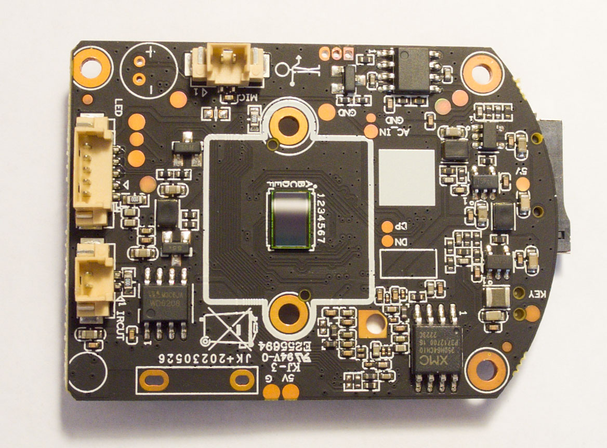
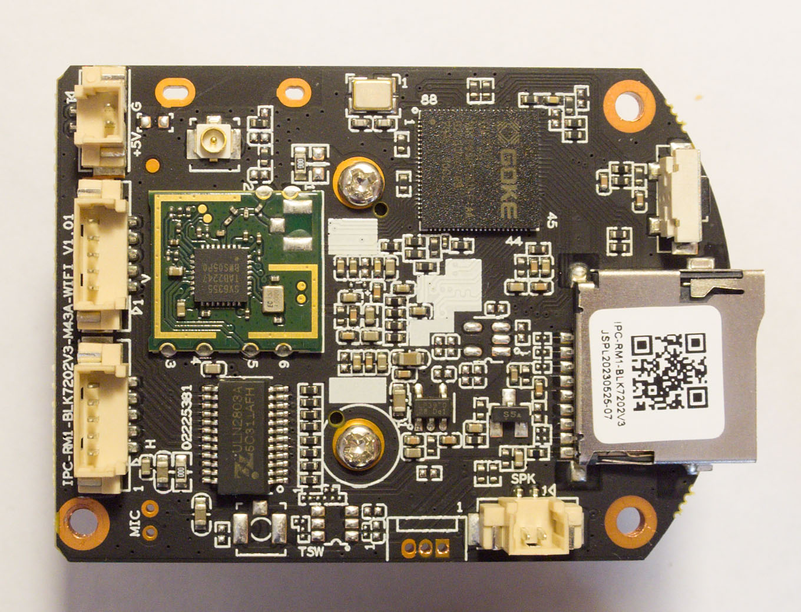
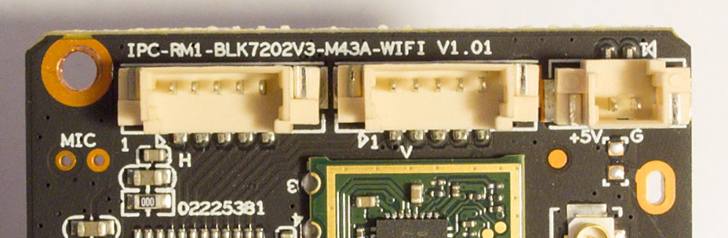
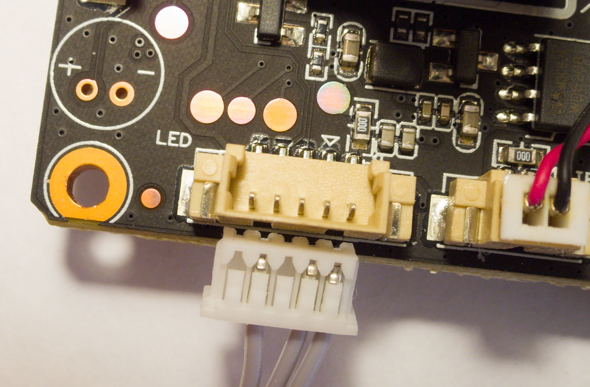

# IPC-RM1-BLK7202V3-M43A-WIFI
- [Overview](#overview)
  - [Device info](#Device-info)
- [Connectors](#Connectors)
  - [Front side](#Front-side)
  - [Back side](#Back-side)
- [GPIOs](#GPIOs)
  - [Muxing](#Muxing)
  - [SD Card](#SD-Card)
  - [Speaker](#Speaker)
- [Flashing](#Flashing)
  - [Flash memory layout](#Flash-memory-layout)
- [Summary](#Summary)
- [TODO](#TODO)

# Overview
Board found in cheap indoor Cootli WiFi PTZ cam. Board looks very similar to [XM IPG-G4-WR-BL](http://baike.xm030.cn:81/%E4%BA%A7%E5%93%81%E5%8F%82%E6%95%B0/English/IPG%E6%A8%A1%E7%BB%84/Parameters%20for%20IPG-G4-WR.pdf) but PCB layout a bit different.

All tests are complete on [gk7202v300_lite_cootli_camv0103-nor](https://github.com/OpenIPC/builder/releases/download/latest/gk7202v300_lite_cootli_camv0103-nor.tgz) firmware (build Feb 8 2024).

## Device info
| System | Description | Comments | 
|-|-|-|
| SoC | GK7202V300 | |
| Flash | XMC XM25QH64CHIQ | 8MB |
| Sensor | SmartSens SC223A* | 1920x1080 |
| Audio | MIC + SPK | |
| Storage | Micro SD | |
| LAN | - | - |
| WiFi | iComm SV6355 | UF.L (IPX) |
| BT | +? | +? |
| Motors | 2x Stepper | GPIO + ULN2803A |
| Dimensions | 38 x 54 mm | |

\* - reported by ipctool

Front side


Back side


PCB markings


# Connectors
Connectors type JST 1.25mm


## Front side
| Connector | Type |
|:-:|:-|
| IRCUT | 2pin JST |
| LED | 5pin JST |
| MIC | 2pin JST |

## Back side
- Micro SD Card Socket
- UART (unsoldered, to the left of SPK, pin1 RX, pin2 TX)

| Connector | Type |
|:-:|:-|
| SPK | 2pin JST |
| H | 5pin JST |
| V | 5pin JST |
| +5V | 2pin JST |
| RF | UF.L (IPX) |

# GPIOs
| GPIO | Connector | Description |
|:-:|:-:|:-:|
| 0* | - | Reset button |
| 4 | LED pin 5 | WLED |
| 8 | WiFi module pin 3 | LO - Power ON |
| 12 | H pin 5 | Mot H |
| 13 | H pin 2 | Mot H |
| 14 | H pin 4 | Mot H |
| 15 | H pin 3 | Mot H |
| 16 | LED pin 4 | IRLED |
| 52 | V pin 2 | Mot V |
| 53 | V pin 3 | Mot V |
| 54 | V pin 4 | Mot V |
| 55 | V pin 5 | Mot V |
| 56 | IRCUT pin 1 | LO - IRCUT ON |
| 57* | LED pin 3 | IRSens |
| 58 | IRCUT pin 2 | LO - IRCUT OFF |
| 70 | - | SD PWR (LO - Power ON) |
| 51 | - | AUDIO AMP |

\* - unconfirmed.

## Muxing
No muxing required if Majestic takes control over pins. Otherwise, muxing can be done using the following commands.

Muxing GPIO16 for taking control over IRLED pin:
```sh
devmem 0x120c0020 32 0x432      # GPIO2_0 (GPIO16)
```

Also for motors.  
Muxing GPIO12, GPIO14, GPIO15 (motors H connector):
```sh
devmem 0x120c0010 32 0x1e02     # GPIO1_4 (GPIO12)
devmem 0x120c0018 32 0x1d02     # GPIO1_6 (GPIO14)
devmem 0x120c001c 32 0x1402     # GPIO1_7 (GPIO15)
```

Shortly after **Loading of kernel modules...** GPIO13 turns to HI (one of motors winding constantly powered), so maybe necesary turn it to LO:
```sh
gpio clear 13
gpio unexport 13
```

## SD Card
By default SD Card unpowered, so we need turn GPIO70 to LO somehow.

To poweron SD CARD from Kernel:
```sh
gpio clear 70
```
or
```sh
devmem 0x120B8400 32 0x40       # turn GPIO8_6 to output mode
devmem 0x120B8100 32 0x00       # set GPIO8_6 to LO
```
And reattach SD card.

To poweron SD CARD from U-Boot:
```sh
mw 0x120B8400 0x40      # turn GPIO8_6 to output mode
mw 0x120B8100 0x00      # set GPIO8_6 to LO
mmc rescan
```

## Speaker
Device supports playing PCM signed 16-bit little-endian, 8000 Hz, 1CH by sending data to http://192.168.0.10/play_audio endpoint.

Audio file can be encoded like this:
```sh
ffmpeg -i input.wav -f s16le -ar 8000 -ac 1 output.pcm
```

And send to camera's speaker:
```sh
curl -v -u user:pass -H "Content-Type: application/json" -X POST --data-binary @audio.pcm http://192.168.0.10/play_audio
```

# Flashing
Stock firmware is pwd locked and LAN interface does not present, so I'm guessing following methods are available to flash this board:
- [burn](https://github.com/OpenIPC/burn)  + [u-boot-gk7202v300-universal.bin](https://github.com/OpenIPC/firmware/releases/download/latest/u-boot-gk7202v300-universal.bin) and then upload FW via X/Y/ZMODEM (e.g. **loady**. Tip: use **baud** option for speed up) or from SD card (power supply required, [see above](#SD-Card))
- load full image thru stock web interface (untested)
- flash programmer
- somehow get into stock bootloader

## Flash memory layout
| Offset | Size | Description | 
|:-|:-|:-|
| 0x00000000 | 0x00040000 (262144 bytes) | bootloader |
| 0x00040000 | 0x00010000 (65536 bytes) | env |
| 0x00050000 | 0x00200000 (2097152 bytes) | kernel |
| 0x00250000 | 0x00500000 (5242880 bytes) | rootfs |
| 0x00750000 | 0x000B0000 (720896 bytes) | rootfs_data |

# Summary
- [X] WiFi works
- [X] Video tested/streamed
- [X] Day/night works (IRCUT and IRLED)
- [X] MIC works
- [X] Speaker works
- [ ] PTZ/Motors (GPIO pins found/accessible, driver untested)

# TODO
- somehow patch/adapt camhi-motor.ko, so make it works on this board.