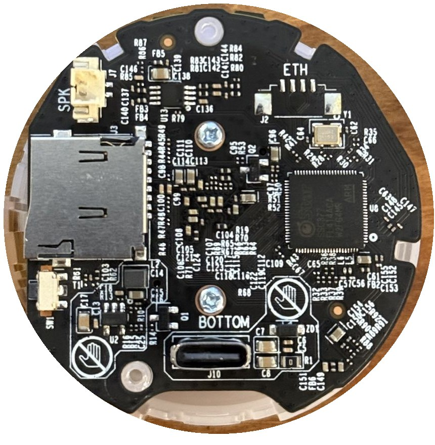

# OpenIPC Wiki
[Table of Content](../README.md)

TP-Link Tapo C120
---

SoC SSC377, sensor SC430AI (4 MP), 16 MB NOR (XM25QH128C), Wi-Fi RTL8188FTV on USB.
Firmware: `ssc377_lite`, sensor `sc430ai`. The SC430AI driver is in
[OpenIPC/sensors](https://github.com/OpenIPC/sensors/tree/master/sigmastar/infinity6c) (PR #7) and the
loader entry in OpenIPC/firmware#2445; until both are in a release, build the image yourself.



### UART
Five pads next to the flash chip on the top side: `VCC TP1 TP2 TP3 TP4`

VCC | TP2 | TP3 | TP4
-|-|-|-
3.3V (do not feed) | TX | RX | GND

115200 8N1. Connect RX (TP3) only after the camera is powered, otherwise it does not boot.

Stock U-Boot stop string is `slp` (prompt `SigmaStar #`). It has `sf`, `md`, `mw`, `go` but no `mmc`/`fatload`.

### Flash
Dump the whole chip before writing anything. The OpenIPC bootloader image overwrites data the stock
firmware needs to work, so only a complete backup lets you go back to Tapo.

The kernel needs 3 MB (cfg80211 built in for the Wi-Fi driver):
```
mtdparts=NOR_FLASH:256k(boot),64k(env),3072k(kernel),9216k(rootfs),-(rootfs_data)
```

### Sensor
Detection works by itself: `ipcinfo -s` prints `sc430ai`, and after start `logread | grep "Sensor index"`
shows `2688x1520@30fps`. The IQ file is not shipped with OpenIPC: take the SC430AI IQ file out of your
own stock firmware dump (`binwalk` finds the squashfs) and copy it to `/etc/sensors/sc430ai.bin`.

### GPIO
IRCut | IRLed | WhiteLed | RedLed | GreenLed | WiFi power
-|-|-|-|-|-
GPIO81 | GPIO12 GPIO13 | GPIO14 | GPIO10 | GPIO11 | GPIO42

IR cut: high = day. LEDs: high = on. Speaker amplifier (GPIO48) is handled by the audio driver.

```
curl http://localhost/api/v1/config --data-binary @- <<'EOF'
{
  "nightMode": {
    "irCutPin1": 81,
    "irCutSingleInvert": true,
    "backlightPin": 14
  }
}
EOF
```

---

### Wireless
The RTL8188FTV is powered through GPIO42. Add to `/etc/wireless/usb`:
```
if [ "$1" = "rtl8188fu-tapo-c120" ]; then
	set_gpio 42 1
	sleep 2
	modprobe 8188fu
	exit 0
fi
```

```
fw_setenv wlandev rtl8188fu-tapo-c120
fw_setenv wlanssid Router
fw_setenv wlanpass 12345678
```

Driver: `8188fu` from openipc/realtek-wlan (branch `rtl8188fu`), kernel with `CONFIG_CFG80211=y`.
WPA3 networks need wpa_supplicant built with `CONFIG_SAE`.

### Ethernet
`J2` (marked ETH) on the bottom side has TX/RX from the internal PHY, no connector fitted.
