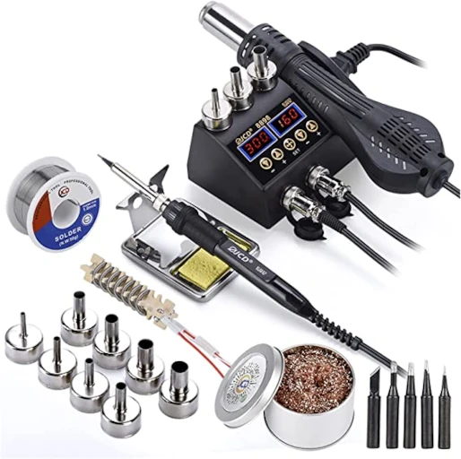
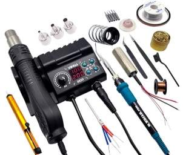
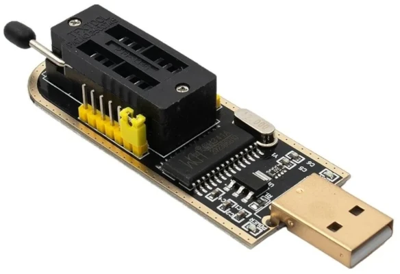
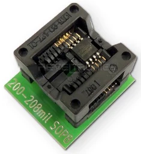
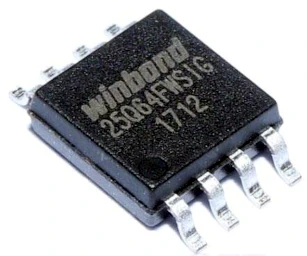
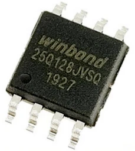

# OpenIPC Wiki
[Table of Content](../index.md)

Equipment for flashing
----------------------

### A rework station with accessories.

While some hardened technicians would insist on getting things done
with a grandfather's kilowatt soldering iron, we suggest you to buy
a modern soldering station with a hot air nozzle and temperature
control. You don't need to be fancy, an entry level soldering station
like YIHUA 882D, or JCD 8898, or YOUYUE 8586 would do, and it won't
break the bank with its price tag of $50-70, more or less.

Throw in a silicone mat, a tube of no-clean flux, a can of solder paste,
desoldering copper wick, ceramic tweezers, nonwoven swabs and a bottle
of isopropyl alcohol. Many of these things can be already included as 
perks with the soldering station.

### A programmer for flashing memory chips.

Again, some would say that you need a multi-thousand dollar branded
programmer but in real life the cheapest CH341A USB programmer works
like a charm, especially after you [fix the voltage bug][1].

Or you can but an improved model, version 1.7 and higher, where that
problem has alredy been fixed in design.

Add a SOP8 208mil to DIP8 socket adapter.

Also, it's a good idea to have a bunch of spare flash memory chips.

[1]: hardware-programmer-ch341a-voltage-fix.md
