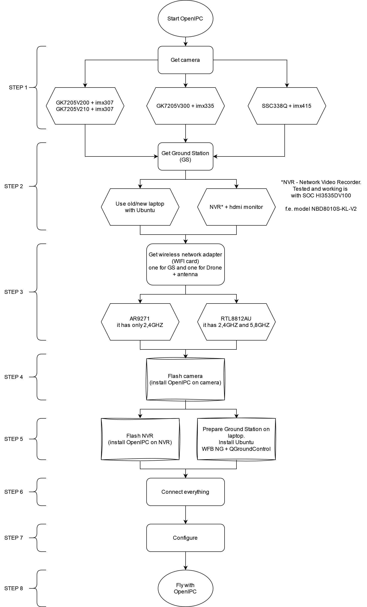
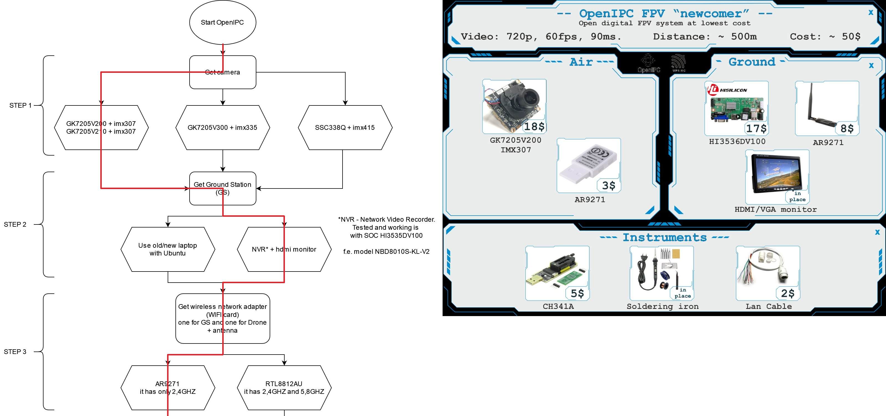
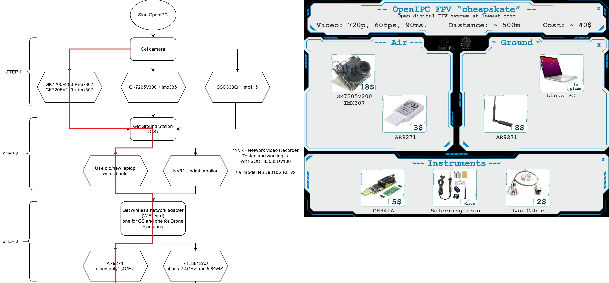

# OpenIPC Wiki
[Table of Content](../README.md)

## Steps from buy to fly (for beginners)
---------------------------------------------------

  

---------------------------------------------------
### STEP 1
### STEP 2
### STEP 3
### STEP 4
### STEP 5
- [OpenIPC FPV - NVR Ground Station](https://www.youtube.com/watch?v=vSJiUanWA9I)
- [OpenIPC FPV - Prepare GroundStation: Ubuntu + QGroundControl](https://www.youtube.com/watch?v=JMtRAsOm0Dc)
### STEP 6
- [OpenIPC FPV - connections](https://www.youtube.com/watch?v=LOD5xsAJu5o)
### STEP 7
### STEP 8
- [OpenIPC SSC338Q-IMX415, DVR in h265 with the World’s Cheapest 120fps Digital FPV System](https://www.youtube.com/watch?v=avXbcvqNKWM)
- [25km in a windy and cloudy day with OpenIPC.](https://www.youtube.com/watch?v=-AeKldKGVhg)
- [OpenIPC FPV - Test Flight](https://www.youtube.com/watch?v=-4f7XHnu3mY)

## Examples

  

  

