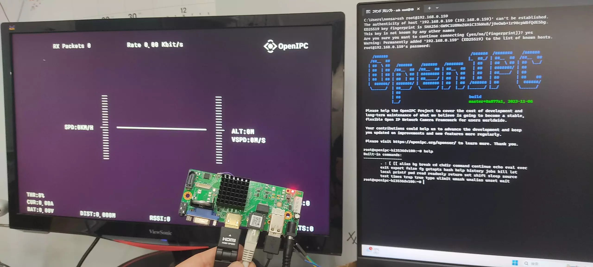

# OpenIPC Wiki
[Table of Content](../README.md)

OpenIPC FPV ground station
--------------------------


#### Upgrade from original HI3536DV100 NVR board firmware to OpenIPC FPV firmware

- Install [PUTTY](https://www.chiark.greenend.org.uk/~sgtatham/putty/latest.html) and [TFTP](https://pjo2.github.io/tftpd64/) server
- Download actual [image](https://openipc.org/cameras/vendors/hisilicon/socs/hi3536dv100/download_full_image?flash_size=16&flash_type=nor&fw_release=fpv) for NVR from OpenIPC site
- Upload this image to your TFTP server
- Turn off NVR power, connect USB adapter to your NVR UART, specify which COM port on your PC
- Go to U-Boot with quick press Ctrl+C at power on
- Execute a set of commands each line separately

```
# Сhanging the ip address of the NVR board and the ip address of your TFTP server
setenv ipaddr 192.168.1.10; setenv serverip 192.168.1.254
mw.b 0x82000000 0xff 0x1000000
tftp 0x82000000 openipc-hi3536dv100-fpv-16mb.bin
sf probe 0; sf lock 0;
sf erase 0x0 0x1000000; sf write 0x82000000 0x0 0x1000000
reset
```

#### The result


