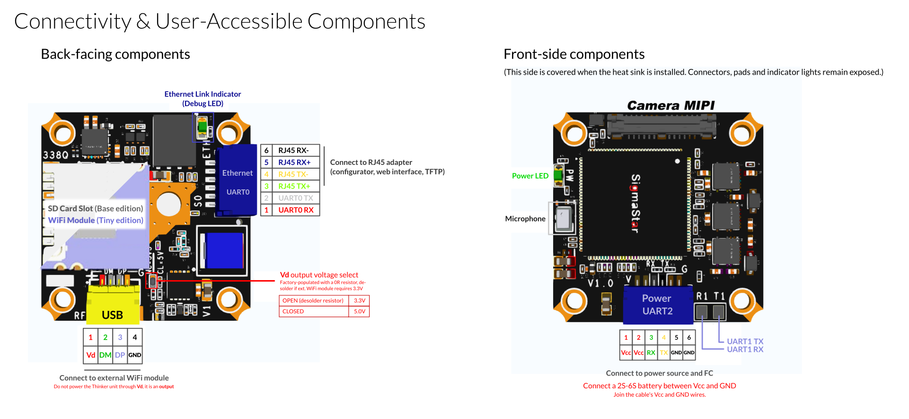
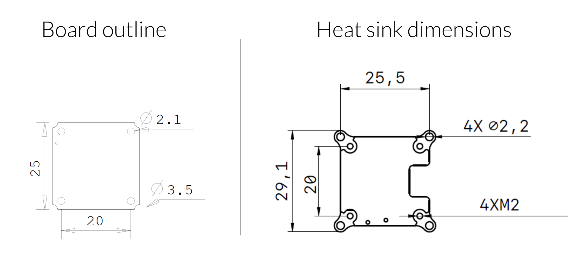

# OpenIPC AIO "Thinker" v1.0 

The OpenIPC Thinker is a compact and lightweight camera and video transmission unit, which integrates seamlessly with various RC vehicles.

Two variants of the unit are available:
- Base Edition ([Store Link](https://store.openipc.org/OpenIPC-Thinker-v1-0-Base-with-SD-p711054393)) - Features an SD card slot, requires an external WiFi module
- Tiny Edition ([Store Link](https://store.openipc.org/OpenIPC-Thinker-v1-0-Tiny-with-WiFi-p633445803)) - Features a low power integrated WiFi module[^1], does not have an SD card slot 

[^1]: RTL8731BU, typical peak TX power is 50mW @ 5G, 125mW @ 2.4G  

## Technical Specifications

### Features

- SSC338Q SoC
- Power Supply: 2–6S
- Integrated 3A BEC
- Analog MEMS Microphone
- Connectivity:
  - 3x UART ports
  - 1x MIPI camera interface
  - 1x USB with configurable 5V or 3.3V power output for ext. WiFi module
  - 1x Ethernet
  - 1x DC power Input

### Physical Characteristics

- **Board Size:** 25x25mm
- **Weight** (main unit and connected camera module only):
  - Without heat sink: ~8.8g
  - With heat sink: ~13.4g
- **Mounting Holes:**
  - **PCB**: 20x20mm
  - **With heat sink installed**: 25.5x25.5mm
- **Cooling:** Optional aluminium heat sink with passive cooling

### Camera Options

#### IMX335 Module ([Store Link](https://store.openipc.org/OpenIPC-IMX335-v2-module-without-cable-p721231276))

- 14x14mm camera module in aluminium housing
- Lens: 140° FOV, f/2.8
- IMX335 sensor, integrated 6DOF IMU

This is the default camera unit that comes with the Thinker AIO.

#### IMX415 Module ([Store Link](https://store.openipc.org/OpenIPC-IMX415-v2-module-without-cable-p721152215))

This module uses the same hardware as the IMX335 module but features an IMX415-based sensor.

### Drawings (Dimensions, Connectivity)

#### Connectivity & User-Accessiuble Components



##### Installation Notes

- Power Connection
  - Connect a 2S-6S battery between Vcc and GND terminals
  - **Do not power** the unit **through USB Vd**, it is a power output

- Network Connection
  - Use the supplied RJ45 cable and adapter to access the web interface, and other management and update utilities
  - The ETH link indicator LED shows connection status

- Camera Module
  - A camera modules is attached to the main unit out of the box.
  - Camera modules can be exchanged, compatible camera modules are listed in this document.

- Optional Hardware
  - SD Card Slot (available on Base edition)
  - **On Base edition** units, an **external WiFi module must be connected** to designated pins
  - **On Tiny edition** units, the **USB** header **cannot be used** to connect external hardware, as the connection is used by the integrated WiFi module.
  - The UART available for communication with flight controller

Various notes:
- Do not remove the **thermal putty** from the heatsink, it **cannot be replaced with thermal paste**. If already removed, use low hardness thermal pads, or thermal putty as a replacement.

##### Pin Descriptions

| Pin Name    | Dir  | Description                                                    |
|-------------|------|----------------------------------------------------------------|
| **RJ45 / UART0 Header**                                                         | | |
| UART0 RX    | In   | UART0 receive line (connect to RJ45 adapter or serial console) |
| UART0 TX    | Out  | UART0 transmit line                                            |
| RJ45 TX+    | Out  | Ethernet transmit (positive)                                   |
| RJ45 TX−    | Out  | Ethernet transmit (negative)                                   |
| RJ45 RX+    | In   | Ethernet receive (positive)                                    |
| RJ45 RX−    | In   | Ethernet receive (negative)                                    |
| **USB Header**                                                                  | | |
| Vd          | Out  | Ext. WiFi Module Power output[^2][^3]                          |
| DM          | I/O  | Ext. WiFi Module USB Data -                                    |
| DP          | I/O  | Ext. WiFi Module USB Data +                                    |
| GND         | —    | Ground                                                         |
| **Power / UART1 Header**                                                        | | |
| Vcc         | In   | Power input                                                    |
| Vcc         | In   | Power input (duplicate pin, merge wires)                       |
| RX          | In   | UART2 receive line (to FC)                                     |
| TX          | Out  | UART2 transmit line (to FC)                                    |
| GND         | —    | Ground                                                         |
| GND         | —    | Ground (duplicate pin, merge wires)                            |

[^2]: Output voltage can be programmed, 
[^3]: The use of Vd is optional, high-power WiFi modules can be powered externally. In such cases, connect DM, DP, and GND only.

#### PCB Outline & Heat Sink Dimensions 



## Firmware Update

To update the firmware, [download the latest release](https://github.com/OpenIPC/builder/releases/download/latest/ssc338q_fpv_openipc-thinker-aio-nor.tgz). This release includes drivers for RTL8812AU and RTL873XBU. 

**Note:**
The RTL8731BU has limitations as a receiving unit (does not support LDPC), disable it on the ground station when using tunnel/MAVLink. It works well as a transmission unit for both 2.4 GHz and 5.8 GHz.[^4].

[^4]: Ref. https://t.me/c/1809358416/127308/129654

To disable LDPC, add the following to the `/etc/wifibroadcast.cfg` file on your ground station:
```
[tunnel]
ldpc = 0
```

If you are using an RTL8812EU module, use [this firmware release](https://github.com/OpenIPC/builder/releases/download/latest/ssc338q_fpv_openipc-urllc-aio-nor.tgz).

## Built-in RF output settings


