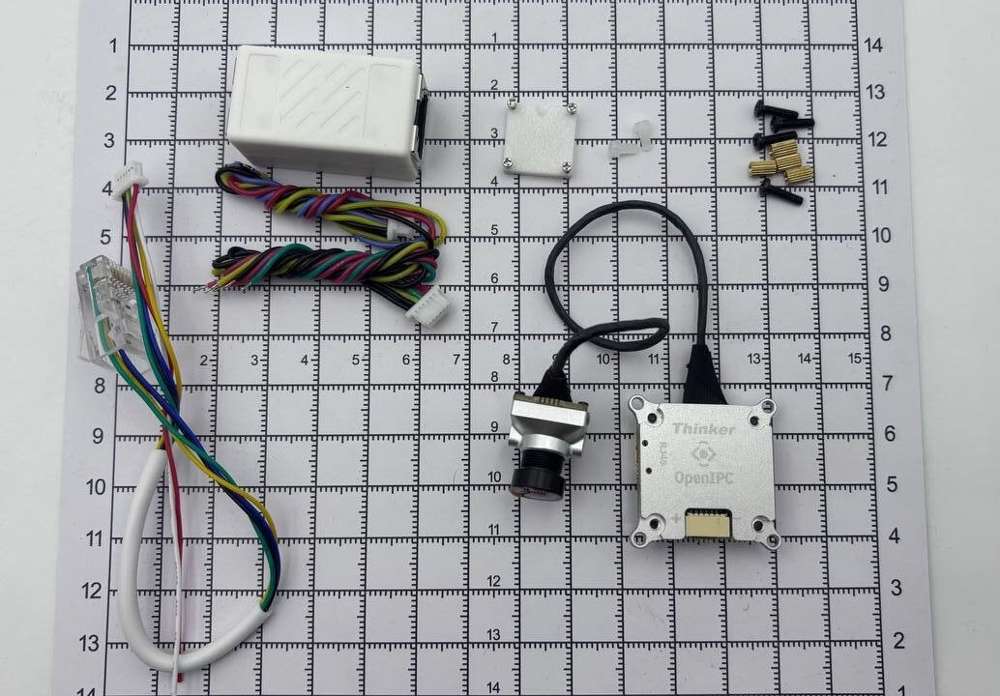

# OpenIPC "Thinker" v1.0 Air Unit

The OpenIPC Thinker is a compact and lightweight camera and video transmission unit, which integrates seamlessly with a variety of remote-controlled vehicles.

Two variants of the unit are available:

- Base Edition ([Store Link](https://store.openipc.org/OpenIPC-Thinker-v1-0-Base-with-SD-p711054393)) - Comes with an SD card slot, requires an external WiFi module
- Tiny Edition ([Store Link](https://store.openipc.org/OpenIPC-Thinker-v1-0-Tiny-with-WiFi-p633445803)) - Features an integrated low-power WiFi module[^1], however does not have an SD card slot

[^1]: RTL8731BU, typical peak TX power is 50mW @ 5G, 125mW @ 2.4G

## Specifications

### Features

- SSC338Q SoC
- Power Supply: 2-6S
- Integrated 3A BEC
- Analog MEMS Microphone
- Connectivity:
  - 3x UART ports
  - 1x MIPI camera interface
  - 1x USB for ext. WiFi module (with configurable 5V or 3.3V power output)
  - 1x Ethernet
  - 1x Power Input

### Physical Characteristics

- **Board Size:** 25x25mm
- **Weight** (main unit and connected camera module only):
  - Without heat sink: ~8.8g
  - With heat sink: ~13.4g
- **Mounting Holes:**
  - **PCB**: 20x20mm
  - **With heat sink installed**: 25.5x25.5mm
- **Cooling:** Optional aluminium heat sink with passive cooling

### Camera Options

**IMX335 Module** ([Store Link](https://store.openipc.org/OpenIPC-IMX335-v2-module-without-cable-p721231276))

*This is the default camera unit that comes with the Thinker AIO.*

- 14x14mm camera module in aluminium housing
- Lens: 140° FOV, f/2.8
- IMX335 sensor, integrated 6DOF IMU

**IMX415 Module** ([Store Link](https://store.openipc.org/OpenIPC-IMX415-v2-module-without-cable-p721152215))

This module uses the same hardware as the IMX335 module but features an IMX415-based sensor.

## Hardware Installation

The Thinker Air Unit consists of three distinct hardware components in the Thinker Base model, or two in the Thinker Tiny model, which has the WiFi module integrated.

These components include the main unit, the camera module, and the WiFi module. Properly connecting and powering them is necessary for the unit to function correctly.

### Connecting Power & The Flight Controller

1. Locate the *Power & UART cable* in your Thinker AIO Kit. It has 6 leads attached to a JST connector, with the following color sequence: Black, Black, Yellow, Green, Red, and Red.
2. Solder the black leads to the negative terminal and the red leads to the positive terminal of your vehicle's battery connector or power source.
(Ensure that similarly colored leads are connected at the power source. **Do not use this cable for power pass-through.**)
3. Solder the green wire to the TX pin and the yellow wire to the RX pin of a free UART on your flight controller.
4. If the UART leads are colored differently on your cable, refer to the connectivity diagram below.
For proper communication, connect TX to RX and RX to TX between your flight controller and the Thinker.
5. Connect the cable to the Power & UART2 connector on the side of the unit where the heat sink is located.

### Connecting An External WiFi Module

1. If you have the Thinker Base model, connecting an external WiFi module is necessary for operation. **If you have the Thinker Tiny unit, skip this step.**
2. Locate the *4-pin USB cable*. The leads are color-coded as follows: Red, Blue, Yellow, and Black.
3. The specific connections depend on your WiFi module.
You will need to connect the black lead of the cable to the module's GND pad, the red lead to its power input (either +5V, +3.3V, VIN, or VCC), the yellow lead to the USB DP (or D+) pad, and the blue lead to the USB DM (or D-) pad.
4. If the USB cable’s leads are colored differently, refer to the connectivity diagram below.
For proper communication, ensure that D+ is connected to D+ and D- is connected to D- between the WiFi module and the Thinker.

### Replacing The Camera Module

1. Your Thinker AIO unit comes with an IMX335 camera module pre-installed. **If you do not intend to replace the camera module with a different model, you can skip the remainder of this step.**
2. To replace the camera module, start by removing the aluminium heat sink. Unscrew the 4 screws securing the heat sink, then gently separate it from the circuit board.
(Do not remove the thermal putty from the heat sink, as it does not need to be replaced when reseating the heat sink and cannot be substituted with thermal paste.)
3. Carefully disconnect the old camera module from the unit and attach the replacement module. Then, reposition the heat sink and secure it to the circuit board by fastening the mounting screws.

### Ethernet Connectivity For Configuration And Updates

1. Locate the Ethernet cable, which has a 6-pin JST connector on one end and an RJ45 jack on the other.
2. Plug the 6-pin JST connector into the *Ethernet & UART0 port* on the side of the unit opposite the heat sink.
3. The RJ45 jack on the other end can be connected directly to a computer, or to a standard Ethernet cable using the included adapter.

### System Connectivity & Physical Specifications

| Pin Name    | Dir  | Description                                                    |
|-------------|------|----------------------------------------------------------------|
| **RJ45 / UART0 Header**                                                         | | |
| UART0 RX    | In   | UART0 receive line                                             |
| UART0 TX    | Out  | UART0 transmit line                                            |
| RJ45 TX+    | Out  | Ethernet TX+                                                   |
| RJ45 TX-    | Out  | Ethernet TX-                                                   |
| RJ45 RX+    | In   | Ethernet RX+                                                   |
| RJ45 RX-    | In   | Ethernet RX-                                                   |
| **USB Header**                                                                  | | |
| Vd          | Out  | Ext. WiFi Module Power output                                  |
| DM          | I/O  | Ext. WiFi Module USB Data-                                     |
| DP          | I/O  | Ext. WiFi Module USB Data+                                     |
| GND         | —    | Ground                                                         |
| **Power / UART2 Header**                                                        | | |
| Vcc         | In   | Power input                                                    |
| Vcc         | In   | Power input (duplicate pin, join wires)                        |
| RX          | In   | UART2 receive line (to FC)                                     |
| TX          | Out  | UART2 transmit line (to FC)                                    |
| GND         | —    | Ground                                                         |
| GND         | —    | Ground (duplicate pin, join wires)                             |
| **UART1 Solder Pads**                                                           | | |
| RX          | In   | UART1 receive line                                             |
| TX          | Out  | UART1 transmit line                                            |

### *Installation Tips and Precautions*

- **Do not power the unit through USB Vd**, as it is a power output, not an input.
- When removing the heat sink for any reason, **do not remove the thermal putty** from the heat sink. It does not need to be replaced and **cannot be substituted with thermal paste**.
- If your external WiFi module requires a 3.3V input voltage instead of 5V, be sure to de-solder the Vd voltage select resistor before connecting Vd to the module.
- The use of Vd is optional. High-power WiFi modules can be powered externally. In such cases, only connect DM, DP, and GND.
- **Base** (SD) units **require an external WiFi module**.
- **Tiny** (WiFi) units **cannot use an external WiFi module**, as the USB connection is already occupied by the integrated WiFi module.
- Both the Ethernet and Power cables use similar 6-pin connectors. Take care to avoid plugging them into the wrong ports.

## Software Setup And Installation

### Get up and running

The Thinker Air Unit is designed to be plug-and-play on the software side. Upon powering up, it should automatically connect to a ground station (provided it has the default gs.key file installed, commonly included with most OpenIPC FPV software).

#### Connecting Ethernet & Accessing The Web UI

You can access the Thinker’s configuration utilities over a wired Ethernet connection. Some advanced features - such as automatic firmware updates - also require internet access.

There are two main connection methods:

- **Using DHCP (Automatic Network Configuration):**
  This method allows connecting the unit into your existing network and provides internet access to the device.
  When connected to a network (e.g., your home router), the unit will first attempt to obtain an IP address via DHCP.
  To access the Web UI in this case, you'll need to look up the unit's assigned IP address, typically through the configuration page of your home router.
- **Using Static IP (Direct Connection to a Computer):**
  If a DHCP server is unavailable—such as when connecting the unit directly to a computer—the device will fall back to a static IP configuration:
  - **IP Address:** `192.168.1.10`
  - **Subnet Mask:** `255.255.255.0`
  - **Gateway:** `192.168.1.1`

  To connect in this mode, configure your computer's network interface with a compatible static IP address (e.g., `192.168.1.11`). All major operating systems support manual IP configuration; simply apply the above settings to the network adapter associated with the Thinker connection.

Once connected, you can access the Web UI by navigating to either the IP address assigned via DHCP or the static address `http://192.168.1.10` in your web browser.

> **Default Credentials:**
> The default login for the Web UI is:
>
> - **Username:** `root`
> - **Password:** `12345`
>
> These credentials are used system-wide. Upon first login, you will be prompted to set a new password.

#### Updating the Firmware

There are several ways to update the firmware on your Thinker Air Unit, but the two most user-friendly methods are:

- **Via the Web UI** — If the unit has access to the global internet, open the Web UI and navigate to the **Firmware Update** tab.
- **Using the [OpenIPC Configurator](https://github.com/OpenIPC/openipc-configurator)** — Ideal for offline updates.

The latest standard firmware can be downloaded [here](https://github.com/OpenIPC/builder/releases/download/latest/ssc338q_fpv_openipc-thinker-aio-nor.tgz). This version (`ssc338q_fpv_openipc-thinker-aio-nor`) includes drivers for **RTL8812AU** and **RTL873xBU** WiFi modules.

If you're using an **RTL8812EU** module, use [this alternate firmware](https://github.com/OpenIPC/builder/releases/download/latest/ssc338q_fpv_openipc-urllc-aio-nor.tgz)  (`ssc338q_fpv_openipc-urllc-aio-nor`).

### Advanced Configuration

For more advanced setup options use the [OpenIPC Configurator](https://github.com/OpenIPC/openipc-configurator), and refer to the [OpenIPC Documentation](https://docs.openipc.org).
