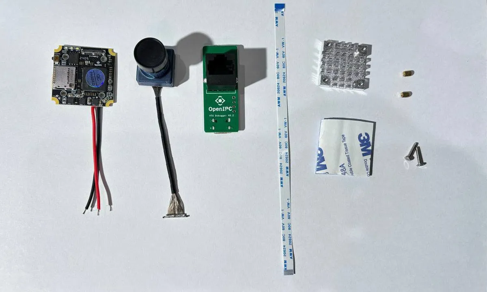

# OpenIPC Wiki
[Table of Content](../README.md)

OpenIPC AIO "UltraSight"
---

---

## What's in the box

</a>

## How to mount the heatsink

The package comes with a heatsink and thermal pad. The thermal pad is covered in 3M double sided tape on both sides. Two screws are included with the set that can be used to mount the heatsink. The heatsinks purpose is to dissipate heat from the WiFi components on the PCB. The thermal pad and heatsink therefore need to be placed on the side that has the WiFi components on it (e.g. antenna connectors, WiFi chip and power amplifiers).

## Connections

### Power

The set comes with a capacitor to decouple the power rail from the rest of your copter. Install it as close to the AIO-PCB as possible.

### Debug/Ethernet

A Ethernet/Debug adapter is included. The flat-flex cable is used to connect it to the AIO-PCB. The connectors pins are located on the PCB side of the connector, pay attention to connect the flat flex cable with the exposed connections towards the PCB. The "handle" strips on the flat-flex cable will point towards the heatsink side on the AIO-PCB and away from the RJ45 connector on the Debugger PCB.

### Camera

The MIPI connector can pe pushed into the corresponding socket on the AIO-PCB vertically. No great force is needed and there are no levers to move or clips to disengage. For removal, the connector has two little prongs on the sides to aid with gripping it.
