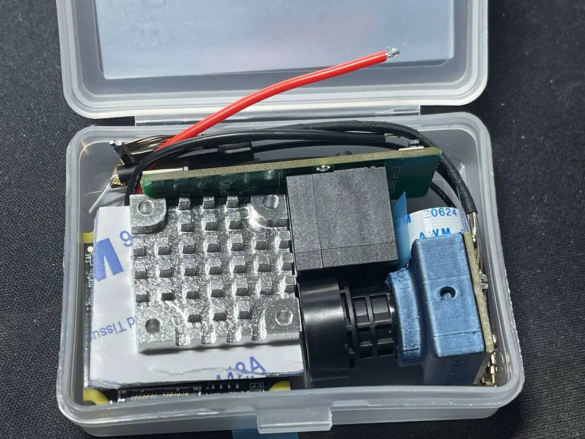

# OpenIPC Wiki
[Table of Content](../README.md)

OpenIPC AIO "UltraSight"
---
<a href="https://store.openipc.org"></a>

## What's in the box
<a href="https://raw.githubusercontent.com/OpenIPC/wiki/master/images/fpv-openipc-aio-content-1.webp"></a>
<a href="https://raw.githubusercontent.com/OpenIPC/wiki/master/images/fpv-openipc-aio-content-2.webp"></a>

## First start
- Connect the Wireless antennas and install the heatsink (see Heatsink section).
- Connect the Debug PCB and connect a network cable or USB-C cable.
- Ensure proper cooling, airflow will be necessary to protect the board from overheating.
- Power the board (see Power section) and either check your DHCP-Server (often your router) for a new device and it's IP address, the board will try to get an IP assigned through DHCP.
- You can login to the WebUI of OpenIPC using the username **admin** and the password **12345** to check for connectivity.

## Heatsink
- The package comes with a heatsink and thermal pad. The thermal pad is covered in 3M double sided tape on both sides. Two screws are included with the set that can be used to mount the heatsink.
- The heatsinks purpose is to dissipate heat from the Wireless components on the PCB. The thermal pad and heatsink therefore need to be placed on the side that has the Wireless chipset on it (e.g. antenna connectors, Realtek chip and power amplifiers).

## Overview
<a href="https://raw.githubusercontent.com/OpenIPC/wiki/master/images/fpv-openipc-aio-manual.webp"></a>

### Power
- Before powering on AIO board, the power pad must be soldered or connected to a reliable **3A at 5V DC** power source or BEC. This figure will be higher if higher RF power levels are selected.
- When there is not enough load capacitance on the BEC, it is recommended to add a 470uF electrolytic capacitor (included in the set) between the BEC and AIO board to protect the AIO board from surge damage and provide decoupling. Install the capacitor as close to the AIO-PCB as possible. 

### Debug/Ethernet
- A Ethernet/Debug adapter is included. The flat-flex cable is used to connect it to the AIO-PCB. The connectors pins are located on the PCB side of the connector, pay attention to connect the flat flex cable with the exposed connections towards the PCB. The "handle" strips on the flat-flex cable will point towards the heatsink side on the AIO-PCB and away from the RJ45 connector on the Debugger PCB.

### Camera
- The MIPI connector can pe pushed into the corresponding socket on the AIO-PCB vertically. No great force is needed and there are no levers to move or clips to disengage. For removal, the connector has two little prongs on the sides to aid with gripping it.

## Software

### Activate UART debug
- Connect the debug board with a USB-C cable.
- Interrupt uboot by holding the enter key.
- Run the following commands:
```
setenv fpv false
saveenv
```

### Manual system upgrade
- Prepare a sdcard formatted in FAT32 with 1GB size.
- Download and extract [this package](https://github.com/openipc/builder/releases/download/latest/ssc338q_fpv_openipc-urllc-aio-nor.tgz).
- Copy uImage.ssc338q and rootfs.squashfs.ssc338q to the sdcard.
- Interrupt uboot by holding the enter key.
- Run the following commands:
```
run setsdcard
run uknor
run urnor
```

### Connect to wireless router
- Upgrade firmware to the newest version.
- Log into the system (default credentials are root:12345).
- Run the following commands:
```
fw_setenv wlandev rtl8812au-generic
fw_setenv wlanssid Router
fw_setenv wlanpass Password
network restart
```

### Upgrade bootloader
```
curl -L -o /tmp/uboot.bin https://github.com/openipc/firmware/releases/download/latest/u-boot-ssc338q-nor.bin
flashcp -v /tmp/uboot.bin /dev/mtd0
flash_eraseall /dev/mtd1
```
