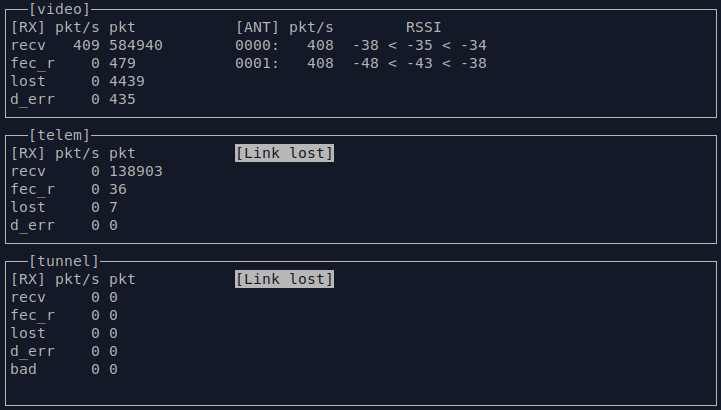

# OpenIPC Wiki
[Table of Content](../README.md)

Using OpenIPC as a budget video link for FPV system
---------------------------------------------------

<p align="center">
  
</p>

In 2015, German enthusiast Befi [pitched the idea of an OpenSource drone](https://befinitiv.wordpress.com/wifibroadcast-analog-like-transmission-of-live-video-data/), where he proposed to use ordinary WiFi adapters, the number of which has already reached several billion pieces worldwide, and the price has dropped so much that they have become the most affordable types of digital transceivers.

The key idea was not the WiFi adapters themselves, but an unconventional method of using them: refusing to establish a network connection and switching to broadcast mode, when one adapter acts as a transmitter of a digital signal, while the second one is a receiver.

It was suggested to take a budget SBC Raspberry Pi, connect a camera to it via MIPI interface and a USB WiFi dongle from among the recommended ones, and on the other side on the receiver - a similar WiFi module with HDMI monitor. In this case, instead of the traditional UDP protocol for low-latency video transmission, a lower-level protocol was used for flexible data management: bandwidth control, transmitter power, and the ability to recover data if the packet was [partially corrupted](https://en.wikipedia.org/wiki/Error_detection_and_correction) during transmission. One of the technical problems is that not every WiFi adapter is able to work in this low-level mode, moreover: you almost always have to install special drivers that exist only for Linux.

The receiver in this mode operates in the so-called `monitor mode`, where it receives and transmits to the operating system each packet of a given WiFi channel, where it decides whether to decode or discard it. The WiFi transmitter adapter must operate in `injection mode`, where the operating system kernel does not actually participate in the network packet generation prescribed by the ISO network model. Some adapters support both modes, some support only some one, so may only stand on the transmitter or receiver side.

<p align="center">
  
</p>


## Advice for newcomers
<span style="color:red;">
OpenIPC FPV is still under development. Linux skills are required for installing and using/testing it.
If there are no such skills available or a person who does not want to learn, then it is better for the person to buy and use professional FPV Equipment which works out of the box.
</span>

You should have the following skills:
* Connect to the IPcamera / NVR with SSH (Secure Shell)
* Exchage files over SCP (Secure Copy)
* Using [VIM Editor](https://github.com/vim/vim)
* View the contents of a file using the CAT command
* Skills in adapting or creating a bash script


There are good books, websites and videos available which can be used to learn.

* [Linux Basics Course](https://github.com/kodekloudhub/linux-basics-course)
* [Video: Introduction to Linux – Full Course for Beginners](https://www.youtube.com/watch?v=sWbUDq4S6Y8)


## Revolution from OpenIPC

The classic set-up in the [OpenHD](https://openhdfpv.org/) project (and other similar projects) consists of a MIPI or USB camera connected to a Raspberry Pi, which act as a video encoder and router for the airborne system and in turn are connected to a WiFi adapter via USB and to the flight controller via UART. The ground station usually consists of the same WiFi adapter, a second Raspberry Pi or an x86 linux laptop and a high-contrast monitor or goggles.

Sometimes a MIPI or USB camera is swapped for an IP camera, which is both more powerful (has its own hardware encoder) and cheaper with similar characteristics. Most modern video cameras are typical devices with Linux on board (but much more modest in RAM and flash memory size compared to the Raspberry Pi), which allows you to recompile and run almost any portable software on them.

While working with this technology, the idea of simplifying the flight system and porting all the necessary software directly to the IP camera came up. Technically FPV firmware of OpenIPC project is a special assembly with two types of drivers of popular WiFi adapters, Majestic streamer (which performs the role of GStreamer in the classical scheme on the transmitter system) and [WFB-ng](https://github.com/svpcom/wifibroadcast).

### Benefits

* Reduces system cost (H.265 IP camera vs. H.264 MIPI camera with Raspberry Pi)
* Reduces overall consumption and increases system reliability by simplifying the circuitry
* Reduces video latency: in our Glass-to-Glass tests, we got about 80ms latency for 1080p@60 (on mid-budget cameras), and about 60 ms for 720p@60 and about 100 ms for 1080p@30 (for the most budget cameras).
* There is a possibility of tuning hardware encoder, for example, more frequent formation of I frame (the specifics depend on the vendor of IP camera)
* The community has accumulated a lot of experience in [repairing IP cameras](https://t.me/ExIPCam), which makes it possible to further reduce the cost of operation of the system.

### Disadvantages

* Due to limited resources (installed RAM and permanent memory), most of the trendy programming languages (such as Java, Python, NodeJS) will not be supported by the camera. If you like to write in these languages (or want to port software written in these languages to the camera), you will have to use additionally a NanoPi and use the OpenIPC camera as a regular IP camera connected to the NanoPi(https://www.aliexpress.com/item/1005004679805441.html).
Replacing flash memory with a larger one is another option:
* You'll have to do some soldering to replace the onboard memory, but I'm sure nobody in the FPV world will be intimidated by this
* In most systems the Linux kernel version is limited by the IP camera vendor due to the fact that some modules are shipped in binary form. Developing kernel drivers for new WiFi adapters or specific peripherals can be time-consuming.
* On budget cameras (for which FPV firmware was primarily developed) there are very limited resources, so at the time of writing this text there are no possibilities to run neural networks. The situation should change in the near future.

### Ingredients

* IP Camera. Considering the popularity among FPV community of [VEYE 307](http://www.veye.cc/en/product/cs-mipi-imx307/) model, we recommend you to buy the board IVG-G2S IP camera manufactured by XiongMai company with exactly the same sensor IMX307, but [at a more pleasant price](https://aliexpress.com/item/1005003386137528.html) (or even [more pleasant](https://item.taobao.com/item.htm?id=660122799616), if there is a possibility to buy on Taobao, for example, [through an intermediary](https://www.youcanbuy.ru/)). When ordering the board, specify the focal length of the lens that the seller will set for your order (more focal length - more magnification, but less angle of view).
In the future, the lens can be changed to another with the same thread, or immediately buy several models to choose from (the standard in the world of video surveillance is considered 3.6mm).
IP-camera board is powered from 12V (actually 5V is enough, if you do not use it as a video camera with backlight) and for initial tests it is desirable to take a combined power-Ethernet cable, which is of two types: 12V with [power supply via jack](https://aliexpress.com/item/32961238897.html) and active PoE 48V (choose depending on the capabilities of your network switch).

* WiFi adapter. At the moment FPV firmware supports two types of drivers for RT8812au and AR9271 chips (but in principle nobody prevents to add other adapters). It is highly recommended to use the same adapters on both sides of the link (moreover, take them from the same batch in pairs) and use only 5GHz frequencies due to the complete overload of 2.4GHz. The firmware is tested with two adapters on [RT8812au](https://aliexpress.ru/item/32664378094.html) and [AR9271](https://aliexpress.co/item/32884675724.html) (the last mentioned chip works only on 2.4GHz frequency).

* [UART-USB adapter](https://aliexpress.com/item/1005001625391776.html) at 3.3V. Note that using a 5V adapter can burn your camera. Do not buy/use adapters based on [PL2303](https://aliexpress.com/item/704553060.html), although they are cheaper, they will not work with this SoC. The programmer mentioned in the previous paragraph can work with UART adapter, so if you have one, you don't need to buy a separate one.

* [Connectors with JST 1.25 type connectors](https://aliexpress.com/item/32863841787.html) in `3 Pin` and `8 Pin` configuration to connect to the UART port of the camera and replace the standard power-Ethernet cable in the flight version.

Optional:

* SPI NOR flash memory chip of 16 megabytes or more to replace the standard 8 megabyte one. We recommend [W25Q128FVIQ](https://www.aliexpress.com/item/1005003093500630.html) or [any other](https://www.winbond.com/hq/product/code-storage-flash-memory/serial-nor-flash/?__locale=en&selected=128Mb#Density) compatible with the firmware (new modules can also be added to the project by chip ID). Please note that there are a lot of Winbond knockoffs on the market and you should choose your seller carefully.

* [SPI NOR programmer for flash memory](https://aliexpress.com/item/32902635911.html). In principle you can do without it by using of the project [burn][github_burn], which allows you to flash the system file into an empty/killed flash (see the section [Fill image to empty/killed flash](https://github.com/OpenIPC/burn). section [Flashing image to empty flash with burn](#pour-the-image-onto-an-empty-flash-using-burn-if-you-dont-have-a-programmer)). Note that although many programmers have a "clothespin" in the kit, it is absolutely impossible to dump/program flash memory directly on the board, because of the fact that the programmer besides the chip will also power the rest of the board (there is a way to overcome this problem by cutting the VCC leg).

* [SoC radiators](https://aliexpress.com/item/32859349038.html) are welcome (as usual not installed by the manufacturer due to cheapening).

* [F0.95 fast lens](https://aliexpress.com/item/32876034491.html) (other options are [one](https://aliexpress.com/item/32957334039.html) and [two](https://aliexpress.com/item/4000142214594.html)) to fully utilize the Sony IMX307 sensor and enjoy flying at night.

* [Zoom Lens 2.8-12mm](https://aliexpress.com/item/32809397197.html). Please note that the kit comes with an outdated HiSilicon 3516EV100 based IP camera board, which can also be reflashed to OpenIPC. Since the board controlling the motors communicates with the main board via UART, you will have to creatively solve the issue with multiplexing the two UART ports or outputting unsoldered pins.

* [16 pin FPC connector](https://aliexpress.com/item/33013766973.html) for better soldering of connection to USB adapter and corresponding [cable](https://aliexpress.com/item/32958943450.html).

There are two variants of using OpenIPC firmware on the board under consideration: with replacement of flash memory with a higher capacity one (for installing your own programs) and without replacement (it is easier, but in this case further expansion possibilities of the new system will be very limited). Both of these options will be discussed step by step below:

### Installation on the camera (common start)

* Connect the cable to the camera and check that it works (default IP address is 192.168.1.10, link for VLC `"rtsp://192.168.1.10/user=admin&password=&channel=0&stream=0"`).
* Solder the three-wire UART connector to the free pads on the camera board

<p align="center">

</p>

* Connect the UART-USB adapter to the computer (port speed 115200N1, flow control disabled, adapter should be set to 3.3V, not 5V) and check that when the camera is turned on, data is being output and you can abort the download via `Ctrl-C` (both RX and TX lines are working).

### Installation using IP Cam DMS (no flash soldering)

* Download, unzip the archive and run the [IP Cam DMS](https://team.openipc.org/ipcam_dms/IPCam_DMS_20201121_EN.zip) program, which allows you to control the camera using the camera manufacturer's protocol.
* Download the [special archive](https://github.com/OpenIPC/coupler/releases/download/latest/000659A7_fpv_IPC_GK7205V200_50H20AI_S38.bin) and perform a firmware upgrade, which will effectively make a seamless transition from the original firmware to OpenIPC.

> Note! Despite the fact it is the easiest way to flash firmware it has few disadvantages:
> * It won't backup a stock firmware. There are chances you need the backup to extract some important parameters from the stock firmware. So even if you are 100% sure you don't need the stock firmware it's still a good idea to have a backup.
> * In fact there is a prebuild fpv version only for IPC_GK7205V200_50H20AI_S38 board. For other boards you need to find and flash the lite version first. So that makes no sense using this installation type for other than IPC_GK7205V200_50H20AI_S38 boards.

### Installation using burn (no flash soldering)

This will work even in case you have locked bootloader or flashed wrong bootloader to the SPI flash.
* On the workstation, install a TFTP server
* Find your SoC on [openIPC][supported_hardware] and Generate `Installation Guide` (note: select NOR 8M memory chip even if you have 16M or 32M chip since there is no fpv versions for those configurations. Don't worry after the first boot the overlay fs will be expanded.)
* There is a video tutorial for the [burn][github_burn] utility: [OpenIPC BURN Utility Playlist][youtube_burn] . Just select the video for your OS and follow the guide.
* At the end of the video tutorial you will be at the terminal with unlocked bootloader. Don't close it, you will need it further.
* Make sure the TFTP server is run and you downloaded OpenIPC firmware from the `Installation Guide` to the proper place
* Follow the `Installation Guide` from the second step to:
  - Save the original firmware
  - Flash full OpenIPC Firmware image

### Installation on camera (flash replacement)

* Turn off the camera, unsolder the original 8 megabyte SPI NOR flash chip and dump it with a programmer just in case. It is desirable to unsolder the chip with [hot air soldering gun](https://aliexpress.com/item/32980690787.html), but if you really want you can use a regular soldering iron [as Alexey Tolstov suggests](https://www.youtube.com/watch?v=M69JiBtuqq8) or [like this](https://www.youtube.com/watch?v=dspjVDv7hck). After unsoldering of the chip, the pads should be well cleaned from solder residue with a piece of copper cable.
When working with a hot air soldering gun it is desirable to remove the lens and insulate the other components, especially the plastic connectors with [kapton tape](https://aliexpress.com/item/1005003563721341.html) (in extreme case with chocolate bar foil). Never [use Rose alloy](https://habr.com/ru/post/437778/). If you're not very good with a finger, it's easier to go to the nearest cell phone repair service and show the master a part of this manual.

<p align="center">

</p>

* Fill [U-Boot](https://github.com/OpenIPC/firmware/releases/download/latest/u-boot-gk7205v200-universal.bin) into a new 16 megabyte flash (at the beginning of the memory) and solder it to the board. Verify that U-Boot starts and you get to the prompt.
* On the workstation, install a TFTP server, download and unzip to the [archive](https://github.com/OpenIPC/firmware/releases/download/latest/openipc.gk7205v200-nor-fpv.tgz) directory with the FPV firmware
* Give commands in U-Boot (where `192.168.1.17` is your TFTP server and `192.168.1.33` is the temporarily assigned address to the camera):

```
  setenv ipaddr 192.168.1.33; setenv serverip 192.168.1.17; saveenv
  run setnor16m
  #
  run uknor16m; run urnor16m
```

### Installation on the camera (general finalization)

* After booting the system, verify that it has obtained an IP address via Ethernet (it can be accessed via SSH via root@<IP address of the camera> without a password). Using a modern operating system and the name `openipc.local` you can find the camera within the local network without knowing its IP address. 
* Solder GND, DP and DM to the USB pads (USB 5V power supply should not be connected to the board due to the high power consumption of the adapter), and separately 5V and GND to power the WiFi adapter (possibly via an additional DC-DC converter depending on your circuit). The USB wire that comes to the board should be secured with a cable tie to avoid breaking off the pins on the contact pad:

<p align="center">
  

</p>

* Check that a new device has appeared after booting via `lsusb` command
* Check that the `free -m` command gives __at least__ 34 megabytes of system RAM (the rest is video memory), otherwise you may get an OOM killer on the fly (fixable via `fw_printenv bootargs / fw_setenv` with osmem=40M correction):

```
root@openipc-gk7205v200:~# free -m
              total        used        free      shared  buff/cache   available
Mem:             34          21           2           0           9           9
Swap:             0           0           0
```

### Check the ground station operation (on the desktop)

* Connect the second adapter to the desktop and compile a driver that works in monitoring mode (see the relevant project documentation) and load it via `insmod` if necessary.
* Activate the interface (in this example `wlan0` and specify [channel](https://en.wikipedia.org/wiki/List_of_WLAN_channels)) (in this example `14`):
```
sudo ip link set wlan0 down
sudo iw wlan0 set monitor control
sudo iwconfig wlan0 channel 14
sudo ip link set wlan0 up
```
* Make sure that the same frequency is set on the camera and desktop WiFi adapters via `iwconfig` command, if necessary change the frequency by editing `/etc/wfb.conf` on the camera (`channel` parameter) or `sudo iwconfig <adapter name> channel <number>` on the desktop.
* Compile from source [WFB-ng](https://github.com/svpcom/wifibroadcast), __must use brunch stable__, copy the `./etc/gs.key` from the IP camera to the desktop and run receive `sudo ./wfb_rx -p 0 -u 5600 -K gs.key -i 7669206 wlan0`.
* Check that the console output
```
32168228	PKT	0:0:0:0:0:0
32169229	PKT	0:0:0:0:0:0
32170230	PKT	0:0:0:0:0:0
32171231	PKT	0:0:0:0:0:0
32172232	PKT	0:0:0:0:0:0
32173233	PKT	0:0:0:0:0:0
```
change to
```
32178236	ANT	1	282:-54:-52:-50
32178236	ANT	0	282:-48:-46:-44
32178236	PKT	283:0:283:2:0:0
32179236	ANT	1	244:-54:-52:-50
32179236	ANT	0	244:-48:-45:-44
32179236	PKT	245:0:245:0:0:0
32180236	ANT	1	250:-54:-52:-50
32180236	ANT	0	250:-48:-45:-44
```
* Run Gstreamer `gst-launch-1.0 -vvvv udpsrc port=5600 ! application/x-rtp,encoding-name=H264,payload=96 ! rtph264depay ! h264parse ! queue ! avdec_h264 ! autovideosink sync=false -e` and check the image quality

### Ground station development, telemetry

It is assumed that the Linux machine has wfb-ng installed according to the instructions from [quick-start-using-ubuntu](https://github.com/svpcom/wfb-ng#quick-start-using-ubuntu-ground-station). The following examples use Hubuntu 18.04 LTS and wfb-ng 22.09.

* Run wfb-ng, start the wfb-cli console:
```
sudo systemctl restart wifibroadcast@gs
wfb-cli gs
```
* Make sure that video packets are streaming. Here you can also see the RSSI values of the WiFi adapter antennas:



If the recv value remains zero and the d_err value increases, the camera and ground station keys probably do not match. Make sure that /etc/gs.key is copied to the ground station. If no packages are present - make sure that `channel=xx` in /etc/wfb.conf on the camera and `wifi_channel=xx` in /etc/wifibroadcast.cfg on the ground have the same values. For the 5.8 GHz range of the RTL8812AU adapter, channels 60 and above are recommended.

* Configure the flight controller under ArduPilot to output telemetry in mavlink1 format at speed 115200 on e.g. port Serial1. In case of one-way telemetry (downlink only), make sure that the PC outputs the required telemetry stream by default, without connection to the ground station. This is accomplished through setting the SR1_xxx parameters, see [mavlink SR_ parameters]. [mavlink SR_ parameters](https://ardupilot.org/dev/docs/mavlink-requesting-data.html).
* Connect Serial1 of the PC to the UART of the camera, rx to tx, tx to rx. In case of modern PCs on STM32F4/7 the voltage levels are the same (3.3V), in case of 5V APM a level conversion will be required. The subtlety is the camera U-Boot boot loader stops on boot after receiving any bytes on the UART input. The PC should start outputting telemetry c delayed by a few seconds, through setting the TELEM_DELAY parameter. On the table it is easier to provide a break in the line from the PC to the camera.
* On the camera in /etc/datalink.conf file set the `telemetry=true` parameter, in /etc/telemetry.conf file set the `one_way=true` parameter for one-way or `one_way=false` for two-line telemetry respectively. The simplest way to edit files on the camera is Shell Link in Midnight Commander:
* 

* Restart the camera and the wfb-ng service. The second data stream - telemetry - should appear in wfb-cli:


* Install QGroundControl. Version 4.0.11 is used here because the latest versions do not work properly with video in 18.04 LTS. No new Comm Links need to be created. QGC should see the PC connection and display the telemetry input stream:


In the case of two-way telemetry, the QGC should download parameters, allow them to be changed, allow flight modes to be switched, and missions to be loaded and unloaded:


You can see that QGS is also already displaying video. The delay in 4.0.11 is quite significant due to purely software stream processing, it is wise to try modern versions under Ubuntu 20.04 and newer.

### Troubleshooting

* Via the command `sudo tcpdump -i wlan0` on the desktop without running WFG-ng, you can verify that the transmitter is actually sending packets over the air:


### Pour the image onto an empty flash using burn (if you don't have a programmer)

Run [burn](https://github.com/OpenIPC/burn) with the board turned off:
```
./burn --chip gk7205v200 --file=u-boot-gk7205v200-universal.bin -d ; screen -L /dev/ttyUSB0 115200
```

turn on the board power and wait for U-Boot to be filled and the command line to appear. Then we execute the following commands, where `192.168.0.8` is the TFTP server address and `192.168.0.200` is the temporary IP address of the camera.

```
setenv ipaddr 192.168.0.200
setenv serverip 192.168.0.8

sf probe 0; sf lock 0
mw.b 0x42000000 ff 1000000; tftpboot 0x42000000 u-boot-gk7205v200-universal.bin; sf probe 0
sf erase 0x0 0x50000; sf write 0x42000000 0x0 ${filesize}
reset

run setnor16m

setenv ipaddr 192.168.0.200
setenv serverip 192.168.0.8

run uknor16m ; run urnor16m

saveenv
reset
```

### Further refinements

#### Development of the adapter board

Taking into account that according to the text above we finalized the board from an ordinary budget video surveillance camera and the installation of USB connector was made without factory connectors, it is suggested to make an additional special board (similar to [board with built-in WiFi adapter](https://aliexpress.com/item/1005002369013873.html), which will have connectors for USB (possibly with an additional hub) and SD card. This would allow video to be broadcast with minimal latency in 720p, while simultaneously recording the original in 1080p for later publication on YouTube). If you have the ability to design such a board and share the circuit with the community, it would be greatly appreciated.

### FAQ

#### How much does the camera consume during its operation?

Consumption depends on whether the sensor is turned on (which is itself one of the big consumers) and according to our measurements is 1.7W in active mode and y 1.1W when the sensor is turned off (but the main system is running). From this we can conclude that if necessary, we can programmatically turn off/on the streamer to further reduce the system consumption at times when it is necessary.

Additionally worth considering:
* The ability to programmatically shut down the Ethernet adapter N minutes after system startup (composing the operation immediately after startup to allow for configuration changes and debugging)
* Put all unused GPIOs into input mode
* [Check the datasheet](https://drive.google.com/file/d/1zGBJ_SIazFqJ8d8bguURVVwIvF4ybFs1/view) and disable all unused functional blocks of the chip using registers.

#### Is WDR supported?

For WDR to work properly on IP cameras, both the main chip and the sensor must support the same WDR standard (there are several types). In this case, usually the sensor starts working at double frequency (for example, 60FPS instead of 30FPS), making one frame with a long shutter speed, the second - with a short shutter speed. Then ISP (Image Signal Processor) hardware produces a gluing of two frames of one, taking dark areas from the frame with a long shutter speed and light - with a short shutter speed, forming an image with an extended color range.
Unfortunately, to get a WDR image the whole system must work at least twice as fast (or to put it another way have more transistors, doing twice as much work at a moment in time), so the Goke V200 processor does not have this mode. If WDR support is fundamental to you, consider the next in the line of V300 processors, which is also supported by the project.

#### Can I use an LTE adapter instead of WiFi?

Yes, but firmware modification will be required. We recommend that you ask questions about adapting specific hardware [in the official group](https://t.me/openipc_modding).

#### Can I connect SD card for video recording?

Yes, you can. Photo from a subscriber:

<p align="center">

</p>

Pinout table for the auxiliary connector:

<p align="center">

</p>

#### What additional peripherals can be connected?

Based on the pinout of the unsoldered FC connector shown above, you can see that it is used for additional expansion cards with WiFi (via USB) and SD card. Unused pins can be reassigned as follows:

|Function|Additional|
|---|---|
|SD_CLK|GPIO32|
|SD_CMD|GPIO33|
|SD_DATA0|GPIO34|
|SD_DATA1|GPIO35|
|SD_DATA2|GPIO36|
|SD_DATA3|GPIO37|
|ALARM2_GPIO82||
|KEY_SET||
|BAT||
|ALARM_OUT||

D/N (day/night) can only be used as an input GPIO15 (due to the transistor installed). To the left of it on the same connector is GND and GPIO16 (which can be used as a GPIO in bi-directional mode or a PWM port).

There are two GPIOs on the power-network connector (ETH_STA - GPIO14, ETH_ACT - GPIO12), which are typically used to indicate active Ethernet physical connectivity and data transfer activity. They can also be used for normal two-way GPIOs, with GPIO12 being able to be set to UART2_RXD mode and realize an additional one-way UART port (for data reception only). This board has 330ohm resistors on these pins, but this should not affect UART operation.

Taking into account that the SoC case is made in QFN88 format, it is possible to solder a thin wire to almost any leg of the chip and use additional ports. The chip pinout and a photo of the real board without the chip are presented below:

<p align="center">

</p>

<p align="center">

</p>

Note that this solution is far from industrial (ideally you should make your own board) and if it cannot be avoided, sawing off the chip body for a more secure contact is recommended.

#### Can I use another IP camera?

If you have skills of an advanced Linux user, you can join our project and adapt FPV firmware to any processor [supported by OpenIPC](https://openipc.org/supported-hardware). In most cases, no programming skills are required (or you will get them naturally as you get to know and learn the system).

#### How can I reduce video latency even more?

To get the lowest possible latency, our firmware uses the low latency mode available in HiSilicon/Goke processors. Specific values depend on the SoC model, sensor, its resolution, current frame exposure and even chip heating during operation. The main contributor to the delay is the FPS of the system (60FPS without any tuning will be better than 30FPS with the maximum settings), so if you need low latency pay attention to more expensive hardware. To get even lower latency it is possible to disable intermediate blocks at the expense of deteriorating picture quality or switch to more modern chipsets.

Our team has extensive experience in low latency media transmission (some projects have achieved latency figures of 45ms). If you are interested in commercial services (consulting, hardware and software development, reverse engineering) [contact us](mailto:d.ilyin@openipc.org).

### Quick insertion of some links

**Please use the translator, there is a lot of interesting stuff on FPV here:**

- https://github.com/openipc/sandbox-fpv
- https://github.com/OpenIPC/silicon_research
- [OpenIPC for building FPV systems, chat in telegram messenger](https://t.me/+BMyMoolVOpkzNWUy)
- [WFB-ng Data Transport Standard (Draft)](https://github.com/svpcom/wfb-ng/blob/master/doc/wfb-ng-std-draft.md)

**And our general resources:**

- https://OpenIPC.org
- https://github.com/OpenIPC

### Usefull links

#### From Krzysztof Kuczek

- [Building OpenIPC FVP Gears](https://qczek.beyondrc.com/building-openipc-fvp-gears/)
- [Goke Gk7205V200 camera FPV case by qczek](https://www.printables.com/model/579791-goke-gk7205v200-camera-fpv-case)

  
#### Example board of SigmaStar equipment from TaoBao

- [Anjoy MC800S, SSC338Q+IM415, ~24$](https://demo.otcommerce.com/item?id=655383131557#0)
- [Anjoy MCL12, SSC30KQ+IMX335, ~11$](https://demo.otcommerce.com/item?id=600618143992)
- [Anjoy MC-A35, SSC337+?, ~4$](https://demo.otcommerce.com/item?id=708324402303#0)


### YouTube videos from friends

#### Let's Drone Out

- [LDO EP426 - w/ Special Guest MARIOFPV of OpenIPC](https://www.youtube.com/watch?v=af1LuUxZ5dY)


#### From Mario

- [Introducing OpenIPC SSC338Q-IMX415, the World’s Cheapest 120fps Digital FPV System](https://www.youtube.com/watch?v=tXwiZFD6-yc)
- [Introducing OpenIPC, the cheapest digital long range FPV system in the world](https://youtu.be/Z_41Dko-Iok?si=cdGWDcFss9WrvPPN)
- [OpenIPC Latency and Range Test with ExpressLRS and INAV 6.1](https://www.youtube.com/watch?v=4tlPJSQA6HA)
- [Introducing OpenIPC VRX Ground Station, the cheapest digital long range FPV system in the world](https://www.youtube.com/watch?v=aXJQIoBKjVE)
- [World’s Cheapest VRX with H265 compatible with all goggles! OpenIPC FPV with VENC/VDEC](https://www.youtube.com/watch?v=wZAHkWHfBF4)


#### From TipoMan

- [DIY FPV FullHD with OpenIPC, wfb-ng, qOpenHD](https://www.youtube.com/watch?v=MwcEvywzslA)
- [25km with OpenIPC+wfb-ng, qOpenHD. goke7205v200+imx307,3.6mm. H265 7Mbit/s. ARWing900](https://www.youtube.com/watch?v=c7XtKujrzSg)
- [Clouds with OpenIPC and Lidl Glider. 1366x768 video.](https://www.youtube.com/watch?v=1LavYm6jbL0)
- [15 km flight with DIY FPV sytem, based on OpenIPC, wfb-ng, qOpenHD](https://www.youtube.com/watch?v=6__OMDvJ6o0)
- [OpenIPC and wfb-ng in a windy day, imx335, mcs1, 7mbit/s, h265](https://www.youtube.com/watch?v=lUyhilWK1dE)


#### From Egor NiKO

- [Делаю FPV FullHD линк из китайской IP-камеры ДЕШЕВЫЙ АНАЛОГ OpenHD Digital FPV](https://www.youtube.com/watch?v=NOW99dwKbzI)
- [Инструкция по прошивке камеры Goke7205v200](https://youtu.be/pA6xQ5fcZ6Q?si=UgeibWNonE4_Wj3o)


#### From TAI

- [Flashing GK7205V200+IMX307 to firmware from OpenIPC, memory chip replacement](https://www.youtube.com/watch?v=M69JiBtuqq8)


#### From Antonio Silva

- [Test with Openipc goke7205v200 and NVR](https://www.youtube.com/watch?v=7GKyCo6Ezmw)


#### From Zipray

- [OpenIPC with ez-wifibroadcast](https://www.youtube.com/watch?v=Rg2W8xQ3RTA)


#### From HKR

- [OpenIPC - Prepare GroundStation: Ubuntu + QGroundControl](https://www.youtube.com/watch?v=JMtRAsOm0Dc)
- [OpenIPC FPV - connections](https://www.youtube.com/watch?v=LOD5xsAJu5o)
- [OpenIPC FPV - key configuration](https://m.youtube.com/watch?v=1_t_HDdHPho)
- [OpenIPC FPV - upgrade firmware offline](https://youtu.be/JF5auLHaPiw)


#### Joshua Bardwell

- [OpenIPC - FPV DRONE NEWS AUG 29 2023](https://www.youtube.com/watch?v=MRxxOGuZUq8&t=2298s)


[youtube_burn]: https://youtube.com/playlist?list=PLh0sgk8j8CfsMPq9OraSt5dobTIe8NXmw
[github_burn]: https://github.com/OpenIPC/burn
[supported_hardware]: https://openipc.org/supported-hardware/featured
