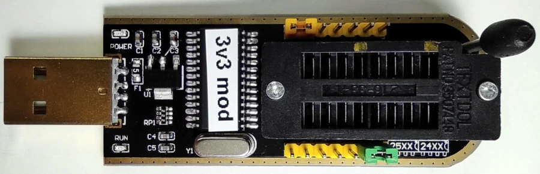
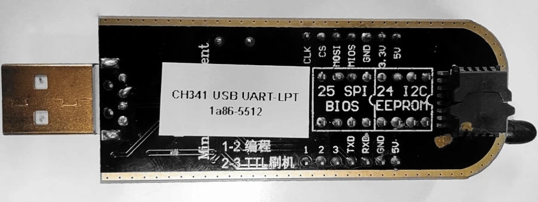
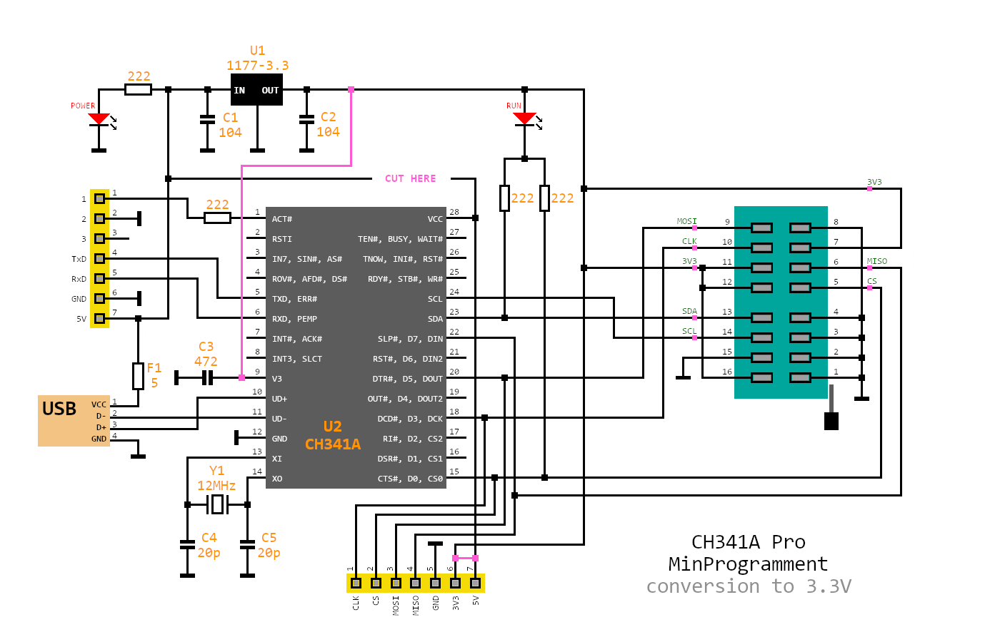
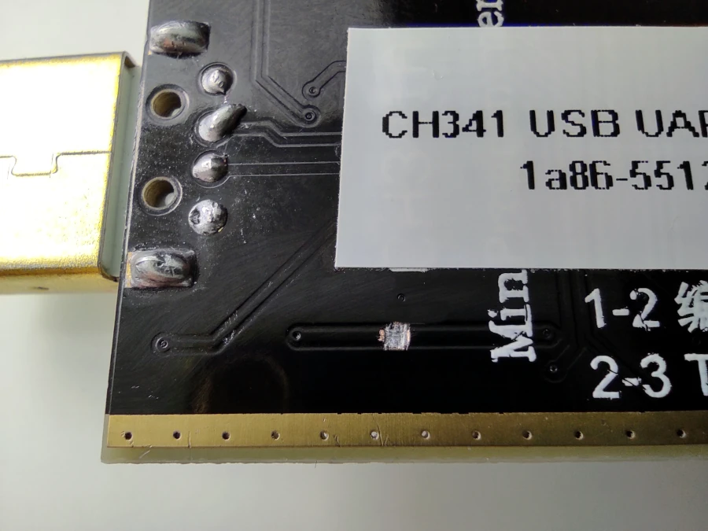
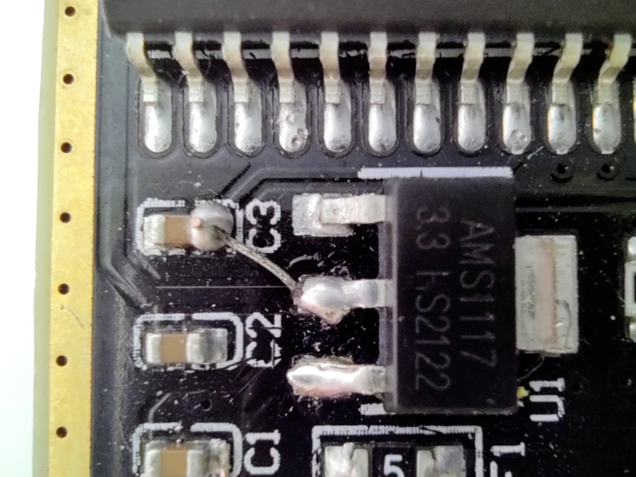
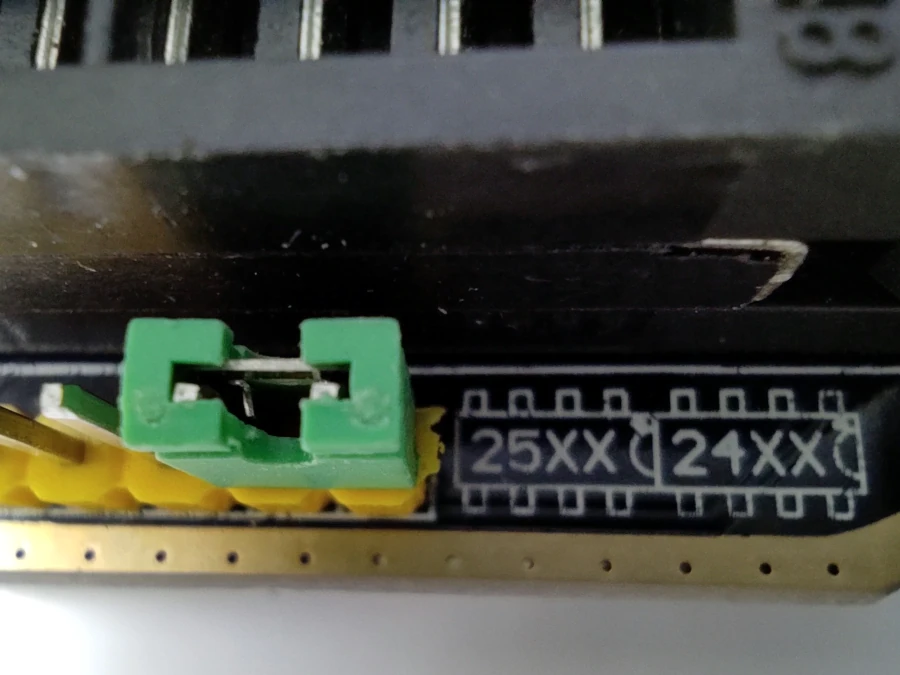

# OpenIPC Wiki
[Table of Content](../index.md)

CH341A Programmer
-----------------

### Fixing high voltage bug

Early versions, prior ver. 1.7, of the cheap and popular CH341A Mini Programmer
have a nasty bug where voltage levels on data lines remain at 5V despite the
programmer being set to 3.3V with the jumper.

@ddemos1963 came out with an interesting hack to fix the issue in an efficient
and artsy way.

Here's what you do.

Sever the connection between between 5V power line and the CH341A chip.
With a sharp utility knife, cut the trace on the back of the programmer board.

Connect 3.3v output leg of the voltage regulator to pin 9 of CH341A IC bridging
it to a corresponding trace at a nerby capacitor.

Restore power to the chip re-routing 3.3V voltage from 3v3 pin to pin 28
of CH341A IC through 5V pin connector on the header.

### Software

- [SNANDer](https://github.com/McMCCRU/SNANDer) or [this fork](https://github.com/Droid-MAX/SNANDer)
- [microsnander](https://github.com/OpenIPC/microsnander) from OpenIPC
- [ch341prog](https://github.com/setarcos/ch341prog/)
- [flashrom](https://www.flashrom.org/Flashrom)

