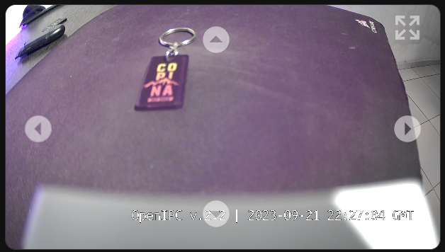

# OpenIPC Wiki
[Table of Content](../README.md)

## HomeAsistant PTZ INTEGRATION 

This integration is based on the ssh command to the open ipc firmware to integrate ptz controls, for cameras that do not have onvif support

## Camera configuration 
Load the modules with parameters (you may need to experiment with the hmaxstep and vmaxstep values for your specific camera)

Copy motor_sample.ko ---> internal memory (ssh copy)
```
scp "C:\Users\Downloads\sample_motor.ko" root@192.168.1.29:/sample_motor.ko
```
Edit new autostart script on your camera 
```
  $ vi /etc/rc.local
```
Add these lines
```
# addmod
insmod /sample_motor.ko vstep_offset=0 hmaxstep=2130 vmaxstep=1600
# go to 0 position 
t31-kmotor -d   h -r
```
Change file mod (add execute permissions )
```
 $ chmod +x /etc/rc.local
```

## Home Assistant configuration 
```
 docker ps
 docker exec -it <"ID_HA_container"> /bin/bash
```
install sshpass
```
apk add sshpass
```
```
sshpass -p '123456' ssh root@192.168.1.29
```

**Note:** run to add the fingerprints, otherwise the script will not work

Add those lines to configuration.yaml
```
shell_command:
  c101_x_down: /bin/bash c101_x_down.sh
  c101_x_up: /bin/bash c101_x_up.sh
  c101_y_down: /bin/bash c101_y_down.sh
  c101_y_up: /bin/bash c101_y_up.sh
  c101_r: /bin/bash c101_r.sh
```
Add those lines to scripts.yaml
```
c101_x_down:
  alias: c101_x_down
  sequence:
  - service: shell_command.c101_x_down
    data: {}
  mode: single
c101_x_up:
  alias: c101_x_up
  sequence:
  - service: shell_command.c101_x_up
    data: {}
  mode: single
c101_y_down:
  alias: c101_y_down
  sequence:
  - service: shell_command.c101_y_down
    data: {}
  mode: single
c101_y_up:
  alias: c101_y_up
  sequence:
  - service: shell_command.c101_y_up
    data: {}
  mode: single
c101_r:
  alias: c101_r
  sequence:
  - service: shell_command.c101_r
    data: {}
  mode: single
```

**SCRIPT**
This script is found in this repo 
https://github.com/OpenIPC/motors/tree/4c7dc45e5e877f38c076343f361159844374920a/t31-kmotor

Create this script in the /config directory

```
vi camara_scrip.sh
```
Paste this file 
```
#!/bin/bash

echo "Enter the camera user:"
read user
echo "Enter the camera password:"
read password
echo "Enter the camera IP:"
read ip
echo "Camera_Name_"
read name

echo "#!/bin/bash
# Conctate al servidor remoto utilizando sshpass y la contraseña
sshpass -p '"$password"' ssh "$user"@"$ip" <<EOF
# Dentro del servidor remoto, ejecuta el comando t31-kmotor con los argumentos
t31-kmotor -d   h -r
EOF 
"> "$name"_r.sh
echo "#!/bin/bash
# Conctate al servidor 
sshpass -p '"$password"' ssh "$user"@"$ip" <<EOF
# Dentro del servidor remoto, ejecuta el comando t31-kmotor
t31-kmotor -d g -x -300 -y 0
EOF 
"> "$name"_x_down.sh
echo "#!/bin/bash
# Conctate al servidor 
sshpass -p '"$password"' ssh "$user"@"$ip" <<EOF
# Dentro del servidor remoto, ejecuta el comando t31-kmotor
t31-kmotor -d g -x 300 -y 0
EOF 
"> "$name"_x_up.sh
echo "#!/bin/bash
# Conctate al servidor 
sshpass -p '"$password"' ssh "$user"@"$ip" <<EOF
# Dentro del servidor remoto, ejecuta el comando t31-kmotor
t31-kmotor -d g -x 0 -y -300
EOF 
"> "$name"_y_down.sh
echo "#!/bin/bash
# Conctate al servidor 
sshpass -p '"$password"' ssh "$user"@"$ip" <<EOF
# Dentro del servidor remoto, ejecuta el comando t31-kmotor
t31-kmotor -d g -x 0 -y 300
EOF 
"> "$name"_y_up.sh

# Change mod 
chmod +x "$name"_r.sh "$name"_x_down.sh "$name"_x_up.sh "$name"_y_down.sh "$name"_y_up.sh

```
Execute the following lines
```
chmod +x camara_scrip.sh
./camara_scrip.sh
```
Enter your camera data (name of before example c101)

**Note:**  need to make a script for the other files (configuration.yml and scrips.yml)


## Lovelace example 
Add this extract in a new card manually (yaml format)
```
camera_view: live
type: picture-elements
image: http://192.168.1.29/image.jpg
entities:
  - entity: script.c1_r
  - entity: script.c1_x_down
  - entity: script.c1_x_up
  - entity: script.c1_y_down
  - entity: script.c1_y_up
camera_image: camera.192_168_1_29
elements:
  - type: icon
    icon: mdi:arrow-left-drop-circle
    tap_action:
      action: call-service
      service: script.c1_x_down
    style:
      bottom: 45%
      left: 5%
      color: white
      opacity: 0.5
      transform: scale(1.5, 1.5)
  - type: icon
    icon: mdi:arrow-right-drop-circle
    tap_action:
      action: call-service
      service: script.c1_x_up
    style:
      bottom: 45%
      right: 5%
      color: white
      opacity: 0.5
      transform: scale(1.5, 1.5)
  - type: icon
    icon: mdi:arrow-up-drop-circle
    tap_action:
      action: call-service
      service: script.c1_y_up
    style:
      top: 10%
      left: 46%
      color: white
      opacity: 0.5
      transform: scale(1.5, 1.5)
  - type: icon
    icon: mdi:arrow-down-drop-circle
    tap_action:
      action: call-service
      service: script.c1_y_down
    style:
      bottom: 10%
      left: 46%
      color: white
      opacity: 0.5
      transform: scale(1.5, 1.5)
  - type: icon
    icon: mdi:arrow-expand-all
    tap_action:
      action: more-info
    entity: camera.192_168_1_29
    style:
      top: 5%
      right: 5%
      color: white
      opacity: 0.5
      transform: scale(1.5, 1.5)

```

Example of view


# Enjoy the stream.
