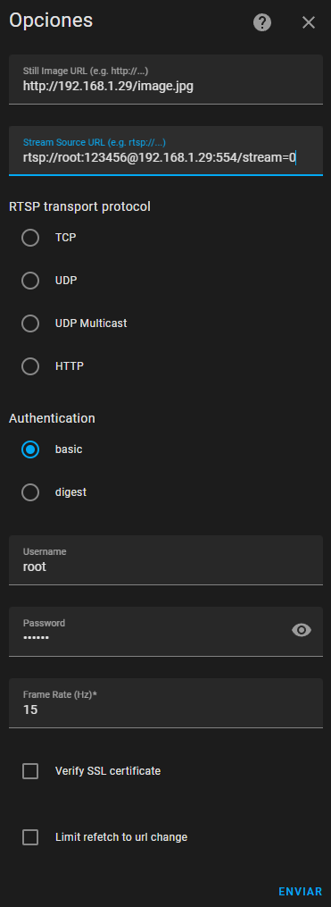
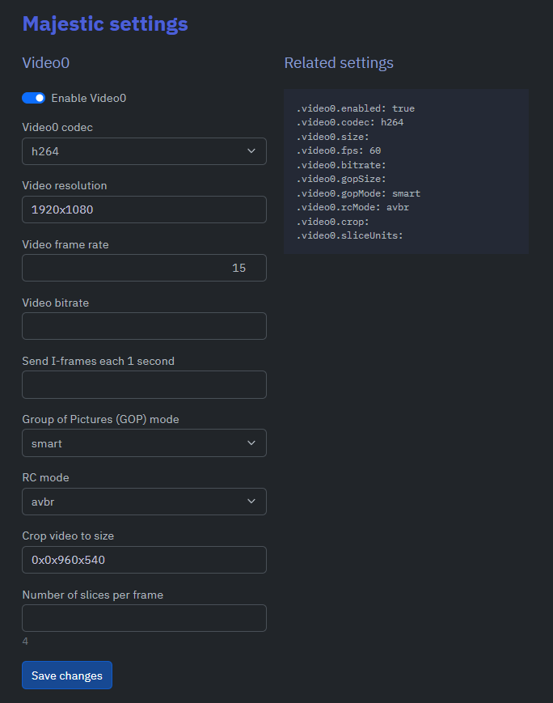

# OpenIPC Wiki
[Table of Content](../README.md)


## HomeAsistant Generic camera 

Go to <IP-HomeAsisstantServer>/config/integrations/dashboard

Add integrations --> Generic camera 

Config parameter 
```
Still Image URL -> http://<IP-OIPC_Camera>/image.jpg
Stream Source URL  -> rtsp://<User>:<PASS>@<IP-OIPC_Camera>:554/stream=0
RTSP transport protocol -> TCP
Authentication -> basic
Username -> <User>
Password -> <PASS>
Frame Rate -> 15
Verify SSL certificate -> empty
Limit refetch to url change ->empty
```
Default User and PASS OpenIPC -> ("root" ¨12345¨)
**Note:** Be carful with frame rate (Currently home assistant does not support more than 20 having flicker problems)

Example configuration generic camera home assitant (IP_Camera 192.168.1.29)



## Lovelace example 
Add this extract in a new card manually (yaml format)
```
camera_view: live
type: picture-glance
image: http://192.168.1.29/image.jpg
entities: []
entity: camera.192_168_1_29
view_layout:
  position: main
camera_image: camera.192_168_1_29
```
**OTHERNote:**
### Camera Configuration 


### Camera Router  
Remember to set a fixed IP address for your camera from your router, otherwise it could change when it reboots.


Enjoy the stream.

