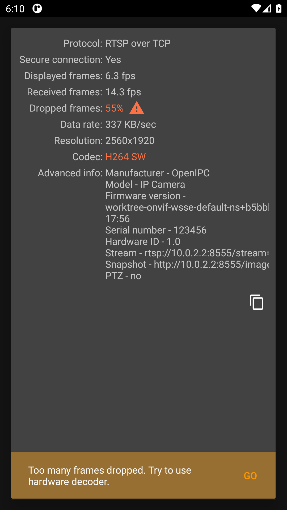

# OpenIPC Wiki
[Table of Content](../README.md)

## tinyCam Monitor (Android) with OpenIPC over ONVIF

[tinyCam Monitor](https://play.google.com/store/apps/details?id=com.alexvas.dvr)
is a popular Android app for viewing IP cameras. It talks to an OpenIPC camera
through majestic's **ONVIF Profile S** service (for discovery — device info,
profiles, stream URIs) and then pulls video over **RTSP**.

### ⚠️ The crucial requirement: set `onvif.password`

tinyCam authenticates its ONVIF requests using a WSSE **PasswordDigest** token,
and it sends **only** that form — it never falls back to `PasswordText` or HTTP
Basic. A PasswordDigest is

```
Base64( SHA1( nonce + created + password ) )
```

To verify it, the camera has to hash the **cleartext** password itself and
compare. majestic cannot do that against the hashed system password in
`/etc/shadow`, so it needs the password available in clear — the `onvif.password`
config key.

**If `onvif.password` is empty, tinyCam fails to authenticate even with correct
credentials** (you get an "authorization required" error or the credentials
prompt keeps reappearing). This is the single most common reason tinyCam "won't
connect" to an OpenIPC camera. Other clients that offer `PasswordText` or HTTP
Basic (e.g. ODM, VLC-style RTSP) can work without it; tinyCam cannot.

### Camera side (majestic)

Enable ONVIF and set an explicit ONVIF username/password. Over SSH:

```sh
cli -s .onvif.enabled true
cli -s .onvif.username root
cli -s .onvif.password 123456      # cleartext — required for PasswordDigest
killall -HUP majestic              # hot-reload, no reboot
```

Or the equivalent block in `/etc/majestic.yaml`:

```yaml
onvif:
  enabled: true
  username: root
  password: "123456"
```

Use whatever credentials you like — the point is that `onvif.password` must be
**set to a cleartext value**, and you enter that same value in tinyCam.

### tinyCam side

1. **Add camera → Manage cameras → `+` → Add IP camera by IP/hostname**.
2. **Camera brand:** choose **`(ONVIF)`**. The model auto-selects **Profile S**.
3. Fill the mandatory settings:
   - **Hostname/IP address:** your camera's IP.
   - **ONVIF port number:** `80` (majestic serves ONVIF on the web port).
   - **RTSP port number:** `554` (or leave **Auto**).
   - **Username / Password:** the `onvif.username` / `onvif.password` you set above.
4. Tap **Camera status** to run the connection test.

On success tinyCam fills in the **Advanced info** (Manufacturer `OpenIPC`, model,
firmware version, stream and snapshot URLs) from the authenticated ONVIF calls,
and shows a live H264 stream:



### Troubleshooting

- **"Authorization required" / the password dialog keeps coming back.** Almost
  always `onvif.password` is unset. Set it (see above) and retry. Double-check
  the username too — it must match `onvif.username`.
- **ONVIF connects but there is no video.** That is an RTSP problem, not ONVIF.
  Verify the RTSP port (`554`) and that the stream plays in a plain RTSP player:
  `rtsp://root:123456@<camera-ip>:554/stream=0`.
- **"Too many frames dropped" / low fps.** A rendering-performance note from
  tinyCam's decoder on a high-resolution stream, not an authentication or
  connectivity problem. Try tinyCam's hardware decoder, or a lower-resolution
  sub-stream.
- **Auth still fails with the password set, on older firmware.** Some older
  majestic builds could not parse tinyCam's ONVIF token because it uses an XML
  *default namespace* rather than a `wsse:` prefix. If you hit this, update to a
  current OpenIPC firmware. (Reference: majestic
  [PR #400](https://github.com/widgetii/majestic/pull/400).)

### Why PasswordDigest, specifically

`PasswordDigest` is the more secure WSSE variant — the password never crosses
the wire, only a salted hash of it does. The trade-off is that the receiver must
hold the cleartext to check it. Cameras that only keep a system password hash
therefore need a separate cleartext copy for ONVIF, which is exactly what
`onvif.password` provides. This is standard for ONVIF devices, not an OpenIPC
quirk — but because tinyCam offers no other auth mode, OpenIPC users hit the
requirement more visibly with this app.
