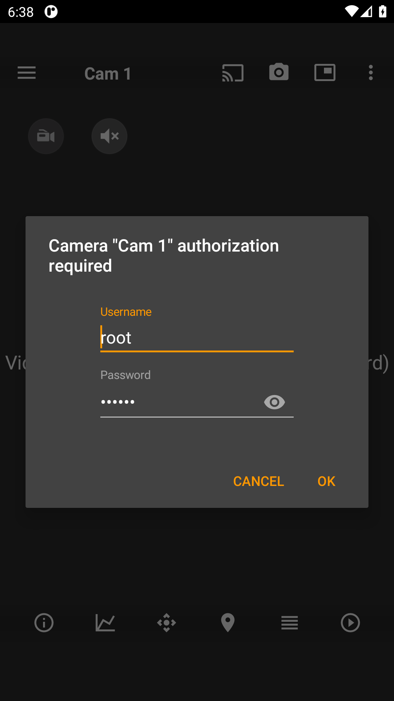
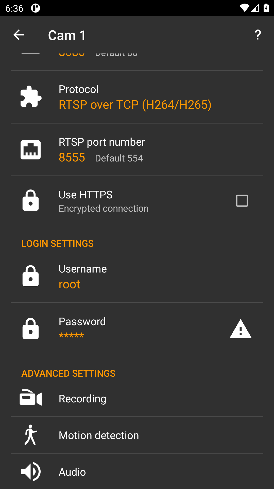

# OpenIPC Wiki
[Table of Content](../README.md)

## tinyCam Monitor (Android) with OpenIPC over ONVIF

[tinyCam Monitor](https://play.google.com/store/apps/details?id=com.alexvas.dvr)
is a popular Android app for viewing IP cameras. It talks to an OpenIPC camera
through majestic's **ONVIF Profile S** service (for discovery — device info,
profiles, stream URIs) and then pulls video over **RTSP**.

### ⚠️ The crucial requirement: set `onvif.password`

tinyCam authenticates its ONVIF requests using a WSSE **PasswordDigest** token,
and it sends **only** that form — it never falls back to `PasswordText` or HTTP
Basic. A PasswordDigest is

```
Base64( SHA1( nonce + created + password ) )
```

To verify it, the camera has to hash the **cleartext** password itself and
compare. majestic cannot do that against the hashed system password in
`/etc/shadow`, so it needs the password available in clear — the `onvif.password`
config key.

**If `onvif.password` is empty, tinyCam fails to authenticate even with correct
credentials** — it reports "authorization required" and the login prompt keeps
reappearing no matter what you type:



This is the single most common reason tinyCam "won't connect" to an OpenIPC
camera. Other clients that offer `PasswordText` or HTTP Basic (e.g. ODM,
VLC-style RTSP) can work without it; tinyCam cannot.

### Camera side (majestic)

Enable ONVIF and set an explicit ONVIF username/password through majestic's
HTTP API (this applies the change live and persists it to `/etc/majestic.yaml`
in one step — no reload or restart needed). Run these against the camera's web
port, substituting your own values:

```sh
curl 'http://<camera-ip>/api/v1/set?onvif.enabled=true'
curl 'http://<camera-ip>/api/v1/set?onvif.username=<user>'
curl 'http://<camera-ip>/api/v1/set?onvif.password=<your-onvif-password>'
```

The resulting section in `/etc/majestic.yaml` looks like:

```yaml
onvif:
  enabled: true
  username: <user>
  password: "<your-onvif-password>"
```

Notes:

- `onvif.password` must be a **cleartext** value (that is the whole point — see
  above), and you enter the same value in tinyCam.
- **Choose a strong password.** OpenIPC's published default web login is
  `root` / `123456`; do not leave a trivial password like that on a camera that
  is reachable from anywhere untrusted.
- From a shell on the camera, `cli -s .onvif.password …` does the same thing —
  it applies the change itself, with no `killall` needed. See
  [changing parameters](majestic-streamer.md#changing-parameters-via-the-http-api).

### tinyCam side

1. **Add camera → Manage cameras → `+` → Add IP camera by IP/hostname**.
2. **Camera brand:** choose **`(ONVIF)`**. The model auto-selects **Profile S**.
3. Fill the mandatory settings:
   - **Hostname/IP address:** your camera's IP.
   - **ONVIF port number:** your camera's **web/HTTP port** — majestic serves
     ONVIF on the same port as the WebUI. This is `80` by default; if you
     changed `system.webPort`, use that value.
   - **RTSP port number:** `554` (or leave **Auto**).
   - **Username / Password** (under **LOGIN SETTINGS**): the `onvif.username` /
     `onvif.password` you set above. This is the part that matters — the
     password here must equal the cleartext `onvif.password` on the camera.



4. Tap **Camera status** to run the connection test.

On success tinyCam authenticates over ONVIF, fills in the **Advanced info**
(Manufacturer `OpenIPC`, model, firmware version, stream and snapshot URLs) from
those calls, and shows a live stream.

### Troubleshooting

- **"Authorization required" / the password dialog keeps coming back.** Almost
  always `onvif.password` is unset. Set it (see above) and retry. Double-check
  the username too — it must match `onvif.username`.
- **ONVIF connects but there is no video.** That is an RTSP problem, not ONVIF.
  Verify the RTSP port (`554`) and that the stream plays in a plain RTSP player:
  `rtsp://<user>:<password>@<camera-ip>:554/stream=0`.
- **Cannot reach ONVIF at all.** Make sure you used the camera's web port, not a
  fixed `80`, and that ONVIF is enabled (`onvif.enabled=true`).
- **Auth still fails with the password set, on older firmware.** Some older
  majestic builds could not parse tinyCam's ONVIF token because it uses an XML
  *default namespace* rather than a `wsse:` prefix. This was fixed in majestic
  in August 2026, so if you hit it, update to a current OpenIPC firmware.

### Why PasswordDigest, specifically

`PasswordDigest` is the more secure WSSE variant — the password never crosses
the wire, only a salted hash of it does. The trade-off is that the receiver must
hold the cleartext to check it. Cameras that only keep a system password hash
therefore need a separate cleartext copy for ONVIF, which is exactly what
`onvif.password` provides. This is standard for ONVIF devices, not an OpenIPC
quirk — but because tinyCam offers no other auth mode, OpenIPC users hit the
requirement more visibly with this app.
