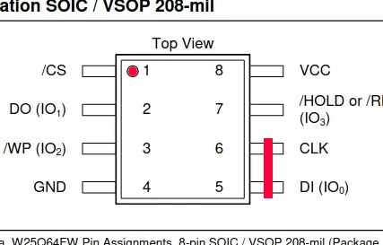
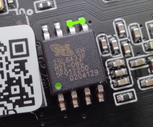

### Ingenic Cloner Utility

The ingenic cloner application is a PC side utility that interfaces with the "USB-Boot" mode built into Ingenic SOCs.  By placing the SOC into "USB-Boot" mode, you are able to use the ingenic clonger application to directly flash the firmware chip without physically removing, or interfacing to the flash chip.

This guide is a work in progress.  

#### Shorting pins on flash chip

The first thing to do is locate the flash memory chip on the camera circuit
board. Typically this is a square chip with 8 pins labeled 25Q64 or 25Q128,
rarely 25L64 or 25L128. If you have trouble locating the chip, try taking
some pictures of your board from both sides. Then ask for help
[in our Telegram channel](https://t.me/openipc).
__Do not try to short-circuit any random chip! It will most likely burn your camera circuit.__

Short-circuit pins 5 and 6 of the flash chip with a small metal object,
a screwdriver or tweezers, right after the bootloader starts but before it
calls up the Linux kernel.

Pins 5 and 6 of the SOIC8 chip are on the opposite corner of pin 1, indicated
by the embossed or drawn dot next to it.

