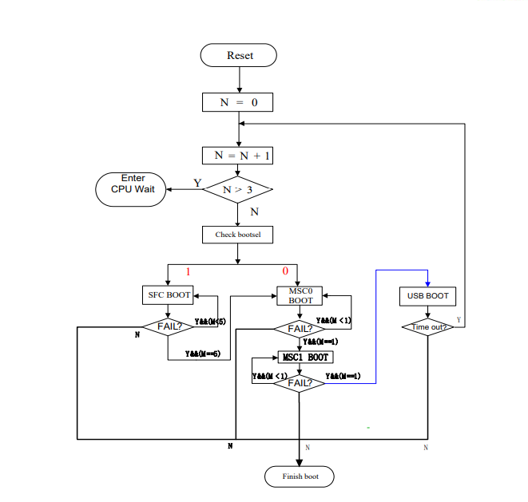

[Table of Content](../README.md)

Unbrick Ingenic T31 with SD Card
---

### Ingenic T31 boot squence



If failed to boot from uboot on flash memory, T31 will then try to boot from SD card, no matter what bootsel pin is set. So if the uboot on flash chip is somehow broken, we can burn uboot to a SD card and boot from it. The uboot file should be specially compiled for SD card boot, you can't use the one for normal flash boot.

### Compile uboot for SD card boot

```
mkdir /opt/openipc
cd /opt/openipc
git clone https://github.com/Dafang-Hacks/mips-gcc472-glibc216-64bit.git
git clone https://github.com/OpenIPC/u-boot-ingenic.git
export PATH="$PATH:/opt/openipc/mips-gcc472-glibc216-64bit/bin"
cd u-boot-ingenic
make distclean
```
Now choose the final `make` command according to your T31 chip type

SoC  | Command
---- | ---------------------------
T31N | make isvp_t31_msc0 
T31L | make isvp_t31_msc0_lite
T31X | make isvp_t31_msc0_ddr128M
T31A | make isvp_t31a_msc0_ddr128M

Now you will get the compiled uboot file `u-boot-with-spl.bin`

### Burn uboot to SD card

Insert SD card to your PC, run `fdisk -l` to check, you should see the device like in my case `Disk /dev/sdb: 29.72 GiB, 31914983424 bytes, 62333952 sectors`.

**CAUTION!** double check the `/dev` device name is actually your SD card, or you may lose data on other drives

```
dd if=./u-boot-with-spl.bin of=/dev/sdb bs=512 seek=34
```
This will burn the uboot file to SD card at 17KBytes offset from 0x0

### Boot from SD card

If the original uboot on flash chip is broken or empty, it will choose to boot from SD card automatically, but if you just want to sideload your own uboot when there's working uboot on flash chip and camera PCB board's `bootsel` pin is set to 1, it will still boot from uboot on flash chip. To force booting from SD card, you can short circut pin 5 and 6 of the SOIC8 flash chip when powering up camera to block reading of the flash memory, details [here](https://github.com/gitgayhub/wiki/blob/master/en/help-uboot.md#shorting-pins-on-flash-chip).

#### OpenIPC uboot auto reset issue

OpenIPC's uboot will auto reset if failed to load kernel from default address, if you are trying to sideload uboot from SD card when there's a valid one on flash chip, this will result in camera booted to the original uboot again. To disable the auto reset function, edit `include/configs/isvp_common.h`, delete `; reset` from the ending of the `bootcmd` line

### uboot for other Ingenic SoC T10 T20 T21 & T30

uboot can be built for SD card boot for these SoCs, but not verified on real device

#### T10 & T20

SoC | Command
--- | --------------------
T10	| `make isvp_t10_msc0`
T20	| `make isvp_t20_msc0`

#### T21 & T30

Edit `/opt/openipc/u-boot-ingenic/boards.cfg` add the following lines

```
isvp_t21_msc0                mips        xburst      isvp_t21            ingenic        t21         isvp_t21:SPL_MMC_SUPPORT,ENV_IS_IN_MMC,JZ_MMC_MSC0,SFC_COMMOND
isvp_t30_msc0                mips        xburst      isvp_t30            ingenic        t30        isvp_t30:SPL_MMC_SUPPORT,ENV_IS_IN_MMC,GPT_CREATOR,JZ_MMC_MSC0,SFC_COMMOND
isvp_t30_msc0_lite           mips        xburst      isvp_t30            ingenic        t30        isvp_t30:SPL_MMC_SUPPORT,ENV_IS_IN_MMC,GPT_CREATOR,JZ_MMC_MSC0,SFC_COMMOND,LITE_VERSION
isvp_t30_msc0_ddr128M        mips        xburst      isvp_t30            ingenic        t30        isvp_t30:SPL_MMC_SUPPORT,ENV_IS_IN_MMC,GPT_CREATOR,JZ_MMC_MSC0,SFC_COMMOND,DDR2_128M
isvp_t30a_msc0_ddr128M       mips        xburst      isvp_t30            ingenic        t30        isvp_t30:SPL_MMC_SUPPORT,ENV_IS_IN_MMC,GPT_CREATOR,JZ_MMC_MSC0,SFC_COMMOND,DDR2_128M,T30A
```

Choose  `make` command according to your chip type

SoC  | Command
-----| -----------------------------
T21  | `make isvp_t21_msc0`
T30N | `make isvp_t30_msc0`
T30L | `make isvp_t30_msc0_lite`
T30X | `make isvp_t30_msc0_ddr128M`
T30A | `make isvp_t30a_msc0_ddr128M`

### Install OpenIPC from SD card in uboot

Use T31ZX with 16MB NOR flash for example, download the [16MB full size image](https://openipc.org/cameras/vendors/ingenic/socs/t31x/download_full_image?flash_size=16&flash_type=nor&fw_release=ultimate)

#### Method 1

Used if there's `mmc` but no `fatload` command in uboot, we can burn firmware to SD card without any filesystem

**CAUTION! ** double check the `/dev` device name is actually your SD card, or you may lose data on other drives

```bash
dd if=./openipc-t31x-ultimate-16mb.bin of=/dev/[sd-card-device] seek=20480
```

This will burn OpenIPC image to SD card at 10MB offset, when card block size is 512 bytes

In uboot, run

```
mw.b 0x80600000 0xff 0x1000000
mmc read 0x80600000 0x5000 0x8000
sf probe 0
sf erase 0x0 0x1000000
sf write 0x80600000 0x0 0x1000000
```

#### Method 2

Used if there's `fatload` command in uboot to directly load file from FAT filesystem

Mount SD card's FAT filesystem to your PC, copy OpenIPC firmware image into it. In uboot, run `fatls mmc 0` to list files in the SD card, then

```
mw.b 0x80600000 0xff 0x1000000
fatload mmc 0 0x80600000 openipc-t31zx-ultimate-16mb.bin
sf probe 0
sf erase 0x0 0x1000000
sf write 0x80600000 0x0 0x1000000
```
