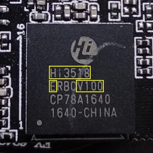
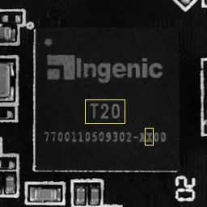
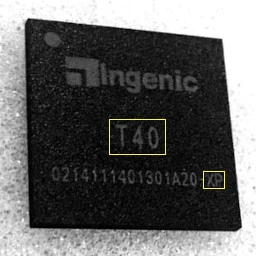
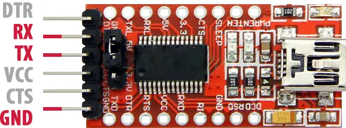

# OpenIPC Wiki

[Table of Content](../README.md)

Available Installation Methods
==============================

Unfortunately IP camera manufacturers aren't **yet** shipping hardware with
OpenIPC preinstalled, so to install OpenIPC onto a camera which is still using
factory firmware images, one of the following methods must be used:

* The [Coupler](https://github.com/openipc/coupler/) project makes available
  firmware images which can be installed using the firmware upgrade mechanisms
  which are built into the factory firmware of many cameras.

* Flashing the OpenIPC firmware using the [*U Boot*
  bootloader](https://en.wikipedia.org/wiki/Das_U-Boot) which is included in
  the vendor firmware. This method interrupts the normal boot process of the
  vendor firmware, and instead instructs U-Boot to load the OpenIPC firmware
  over the network, and write it to the flash storage (replacing the main
  portion of the vendor firmware). **This method requires the camera's case to
  be opened** to connect a [**UART adapter**][FTDI] to the camera's internal
  "console" serial/debug port.


OpenIPC firmware installation using Coupler.
--------------------------------------------

Instructions for using [Coupler](https://github.com/openipc/coupler/) can be
found in [the project's documentation](https://github.com/openipc/coupler/).

OpenIPC firmware installation via TFTP and UART, step by step.
--------------------------------------------------------------

### Step 1. Determine the System on Chip.

The SoC includes the CPU core of the camera, as well as all the necessary
peripherals such as the camera and network interfaces. For various reasons
(including the limited onboard storage space on most IP Cameras), the OpenIPC
project currently builds separate firmware binaries for each SoC model.  **You
must identify the SoC which your camera uses**, so that you can use the correct
firmware binaries.  This can be done by reading the markings on the SoC IC
package on the camera's main PCB (see example photo below), or by using
software such as [ipctool](https://github.com/openipc/ipctool/) to identify the
SoC model from the vendor firmware.






_Hisilicon Hi3518EV100, Ingenic T20, T31 and T40 SoCs marking.
Relevant symbols highlighted with yellow._

### Step 2. Install and set up a TFTP server.

TFTP stands for _Trivial File Transfer Protocol_. As the name implies, it is a
very simple protocol intended for transferring files over a local computer
network. TFTP does not support authentication. Its code is so tiny and simple
that TFTP-clients are widely used in thin-clients and embedded systems for
retrieving bootable images from a designated boot server on the local network.

#### If you have Linux...

...then it's easy. Pre-compiled and ready-to-use binary package for your distro
most likely already exists in distro's repo, and you only need to install it and
set it up.

```bash
sudo apt install tftpd-hpa
sudo sed -i '/^TFTP_OPTIONS/s/"$/ --create"/' /etc/default/tftpd-hpa
sudo systemctl restart tftpd-hpa.service
```

> **Note**: some users reported issues (connection timeouts) when using
`tftpd-hpa` with recent versions of Ubuntu. In that case, you can try with an
[alternative TFTP server](https://askubuntu.com/a/457105/1074320).

### Step 3. Connect to UART port of your camera.

In order to make a connection to UART port you will need a
[serial port adapter][FTDI] for your PC.



__Before you connect that adapter to you camera, make sure that it's working
voltage is set to 3.3 volt!__
Sometimes, you only need to flip a jumper to achieve that. But in some cases you
might need to solder a wire, a zero Ohm resistor, or make a connection between
two contacts with a blob of solder. Some adapters support only 5 volt. In that
case, you will need an additional [logic level converter][TLLC] connected
between the adapter and UART port on your camera.

One of the contact pads you will need to connect you adapter to is GND (ground).
It is easy to discover using a multimeter in continuity mode. Put one of the
leads onto a well-known exposed ground pads. Usually, these are large open
copper contact areas around mounting screw holes, USB port housing, SD card slot
metallic walls. Use another lead to slightly touch control pads until you see or
hear a notification from your multimeter that the circuit is closed. That means,
you found the ground. Now, you need to find two more: `RX` and `TX`, both used
for receiving and transmitting data, respectively. Start with `TX`. It transmits
series of characters and quite easy to spot.

Be aware that you are looking for a contact with 3.3v potential between it and
the ground. Test possible connection points with a multimeter and mark those
showing 3.3 volt. This way you won't have to test everything, and you save
yourself from hitting say a 12 volt connector intended for infrared LED array
or whatnot.

Connect `GND` pin on your camera to `GND` pad of the adapter, connect USB
connector of the adapter to a USB port on your PC, start a terminal emulator
application and connect to your adapter. Set your terminal settings to
115200 bps baudrate, 8 bits, no parity, 1 stopbit, no flow control.

Here's a few command lines for various terminal programs with session logging. Pick your poison.

#### screen

Start a sessions with

```bash
screen -L -Logfile ipcam-$(date +%s).log /dev/ttyUSB0 115200
```

Use `Ctrl-a` followed by `\` to exit the session.

#### `minicom`

Start a sessions with

```bash
minicom -b 115200 -8 --capturefile=ipcam-$(date +%s).log --color=on -D /dev/ttyUSB0
```

Use `Ctrl-a` followed by `x` to exit the session.

#### `picocom`

Start a sessions with

```bash
picocom -b 115200 --databits 8 --parity n --stopbits 1 --flow n --logfile=ipcam-$(date +%s).log /dev/ttyUSB0
```

Use `Ctrl-a` followed by `Ctrl-x` to exit the session.

#### PuTTY

If you opt for a GUI terminal, namely [PuTTY](https://www.putty.org/), this is how it should look like:


Then, connect `RX` pin on the adapter to a possible `TX` contact of UART port
on your camera. Power the camera with its standard power adapter. If you had a
lucky guess then you'll start seeing booting log in your terminal window. In
some cases, if you see garbled text on you screen instead of booting kernel,
you might need to change the connection speed to 57600 bps and try again.

If your screen remains blank, try another UART contact, and then another, until
you hit the proper one.

After you found the `TX` pad, connect it to `RX` pin on your adapter. Yes, it is
a cross-connection. Whatever transmits goes into a receiver and vice-versa. Now,
put a heavy object -- a railroad nut, an antique tin solder, a shot of vodka
(full) -- on any letter key of your computer keyboard and start connect
remaining `TX` pin of your adapter to different pads on the camera until you see
it backfeeding to the terminal. As it happens, you have successfully completed
a UART connection to you camera. Now you may drink the vodka.

NB! Usually, there is a fourth contact on a UART connector marked `VCC`. It is
used for powering camera during initial programming by manufacturer. We strongly
advise not to power your camera though that pin, but use the OEM power connector
for this purpose.

### Step 4. Get access to the bootloader.

Reboot the camera and try to interrupt its boot sequence in order to access
bootloader console by pressing a key combination on your computer keyboard,
between the time the bootloader starts and before Linux kernel kicks in.
Key combinations differ from vendor to vendor but, in most cases, it is
`Ctrl-C`, less commonly -- `Enter`, `Esc`, `*` or just any key. Carefully read text
appearing on screen while booting, you might see a hint there. Some cameras
require more exotic combinations not revealed in booting logs. You may try to
look them up on the internet, or ask on [our Telegram channel][telegram].
Chances are, we have already dealt with such a camera and know the combo.

If you succeeded and got a command prompt then congrats, you've got access to
your camera's bootloader.

From this point on, we strongly advise you to keep a record of everything you do.
Enable session logging in your terminal. Even better, create a text file on your
computer and write down all commands you run and how system responses to them.

### Step 5. Determine the flash memory size.

Most IP cameras nowadays are equipped with 8 or 16 MB NOR or NAND flash memory.
You can check the type and size of the chip installed on of your camera in the
bootloader log output. You'll see something like this:

```console
U-Boot 2010.06-svn (Oct 21 2016 - 11:21:29)

Check Flash Memory Controller v100 ... Found
SPI Nor(cs 0) ID: 0xс2 0x20 0x18
spi_general_qe_enable(294): Error: Disable Quad failed! reg: 0x2
Block:64KB Chip:16MB Name:"MX25L128XX"
SPI Nor total size: 16MB
```

Another example:

```console
U-Boot 2013.07 (Feb 27 2019 - 02:05:08)

DRAM:  64 MiB
MMC:   msc: 0
SF: Detected EN25QH64
```

Which shows the flash memory model (`EN25QH64`) that you can look up online to
find a data sheet. Also, `64` in the model number hints for a 64 Megabits memory,
which is equivalent to 8MB. Similarly, `128` would be equivalent to 16MB.

You should also be able to identify the model of the flash memory by looking up
at the board, but this is usually a difficult task because the chips are very
small and may not come with clear markings.

### Step 6. Save the original firmware.

After you get access to the bootloader console, run `help` to get a list of
available commands. Check if you have `tftp` among them. If you do, then saving
the original firmware should be a breeze. You only need to set up access to your
TFTP server from step 2.

NB! If your bootloader does not have `tftp`, you can still make a copy of the
original firmware. [Read here for more](help-uboot.md).

Check the system environment using `printenv` command. Look for `ipaddr`,
`netmask`, `gatewayip` and `serverip` parameters. The first three set IP address,
netmask of your camera, and the IP address of the network gateway for accessing
local network. The fourth parameter is an IP address of your TFTP server. Assign
the values by `setenv` command (use IP addresses and netmask corresponding to
your local network), then save the new values into environment with `saveenv`
command.

```bash
setenv ipaddr 192.168.1.253
setenv netmask 255.255.255.0
setenv gatewayip 192.168.1.1
setenv serverip 192.168.1.254
saveenv
```

To dump the original firmware, you need to save the contents of camera's flash
memory to a file. For that, you must first load the contents into RAM. Here's
how you do that. Initialize the Flash memory. Clean a region of RAM large enough to
fit whole content of flash memory chip. Read contents of the flash from into that
region, then export it to a file on the TFTP server.

Please note, that flash type, size and starting address differ for different cameras!
For exact commands please use [automatically generated instructions](https://openipc.org/supported-hardware/)
for your hardware, consult data sheets, or seek help on [our Telegram channel][telegram].

### Step 7. Install OpenIPC firmware.

#### Prelude.

No two camera models are alike. Different camera models consist of different
sets of components. The most important of them, the central processor and the
image sensor, directly affect the image quality and the range of functions
inherent in a particular camera. Unlike desktop computer CPU, camera's processor
handles so many functions that it got a specific name -- System-on-Chip or SoC,
for short.

But even seemingly less significant components can set limitations on the camera
and its firmware capabilities. For example, different cameras may have different
flash memory chips installed. Some cameras may have 8MB of flash memory, while
others may have 16MB or more. More flash memory can fit more software code and
allow the camera to run additional services that are not available on cameras
with less flash memory. So we decided to build two versions of our firmware:
the basic version (_Lite_) for cameras with 8 MB of flash memory and the
advanced version (_Ultimate_) with additional features for cameras with 16 MB
flash memory.

As said before, firmware installation routine differs for different cameras.
There are different memory addresses and different environment parameters,
so before proceeding, determine what kind of SoC is in your camera, what sensor,
what flash memory chip and what amount of memory is has.

Below we describe the procedure for installing the OpenIPC Lite firmware on a
camera with 8 MB of flash memory, as an example. Even if your camera has larger
flash memory, do not skip this text. Read it carefully to understand the
principle and the sequence of operations. We will provide specific commands
for different cameras in the second part of this section.

#### Preparing the firmware and the TFTP server.

Go to <https://openipc.org/supported-hardware>, find your SoC in the table of
supported hardware. Make sure there is a downloadable binary file for that SoC.
Hopefully there is a pre-compiled firmware file for your processor --
download it onto your PC.

If you followed step 2, you've got your own TFTP server serving files from
`/srv/tftp` directory. Extract files from the bundle you just downloaded into
that directory.

```bash
sudo tar -C /srv/tftp/ -xvf openipc.*.tgz
```

#### Preparing the camera for flashing.

So, we have a guinea pig, a camera with hi3518ev100 SoC, equipped with a OV9712
sensor, 64 MB of RAM and a 8MB NOR flash memory.

Connect to the camera via the UART port and access the bootloader console.
Set the component parameters to the appropriate environment variables. Set
environment variables for loading the Linux kernel and the root file system
of the new firmware. Set environment variables for the camera to access local network,
where `ethaddr` is the original camera MAC address, `ipaddr` is camera's IP address
on the network, `gatewayip` is the IP address of a router to access the network,
`netmask` is the subnet mask, and `serverip` is am IP address of the TFTP server
from step 3. Save updated values to flash memory.

#### Installation.

For exact commands please use [automatically generated instructions](https://openipc.org/supported-hardware/)
for your hardware, consult data sheets, or seek help on [our Telegram channel][telegram].

NB! Pay attention to the messages on the terminal screen! If any of the commands
throws an error, find out what went wrong. Maybe you made a typo? In any case,
do not continue the procedure until all previous commands succeed. Otherwise,
you might end up with a bricked camera!

### Step 8. First boot.

If all previous steps are done correctly, your camera should start with the new
firmware. Welcome to OpenIPC!

After the first boot with the new firmware you need to clean the overlay
partition. Run this in your terminal window:

```bash
firstboot
```

[logo]: ../images/logo_openipc.png
[FTDI]: https://www.google.com/search?q=ftdi+usb+ttl
[TLLC]: https://google.com/search?q=logic+level+converter+3.3v+5v
[telegram]: https://t.me/OpenIPC
