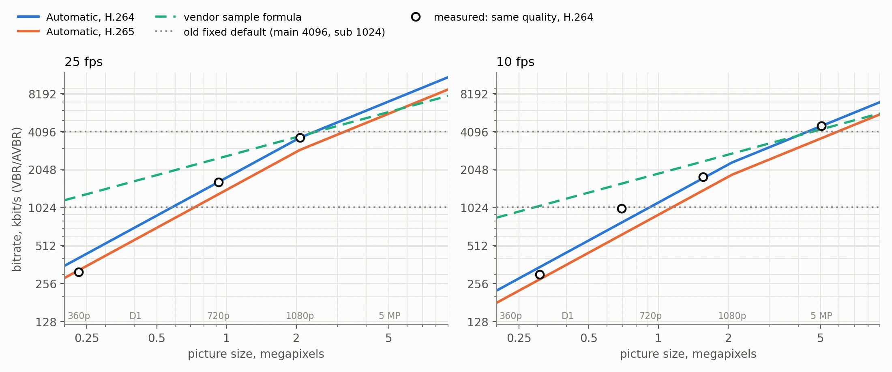
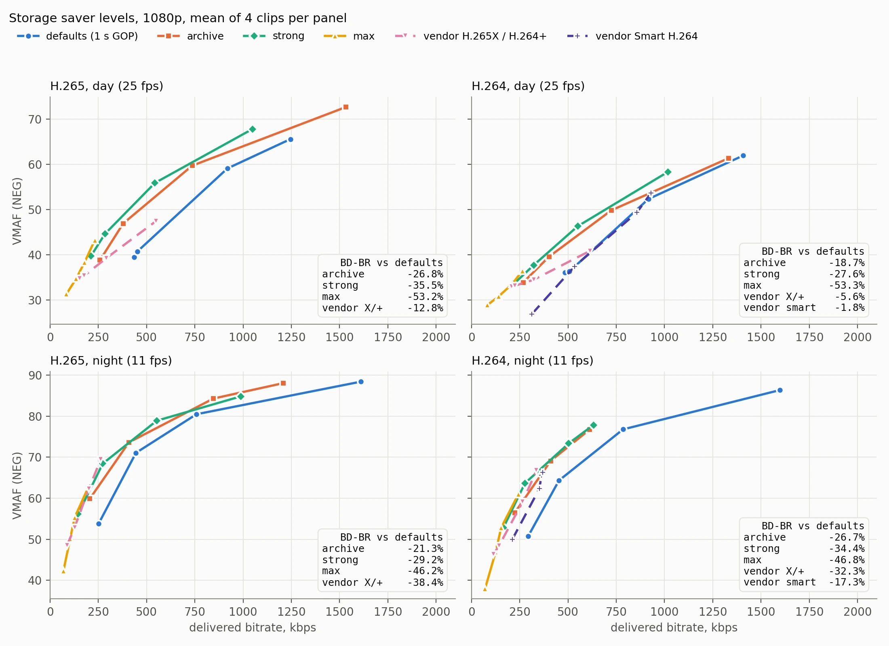
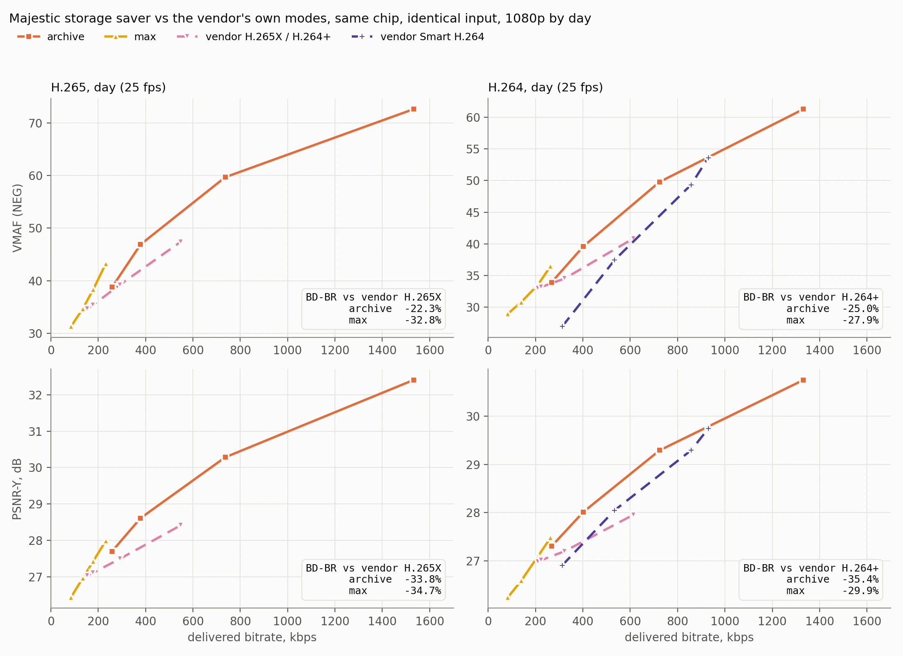
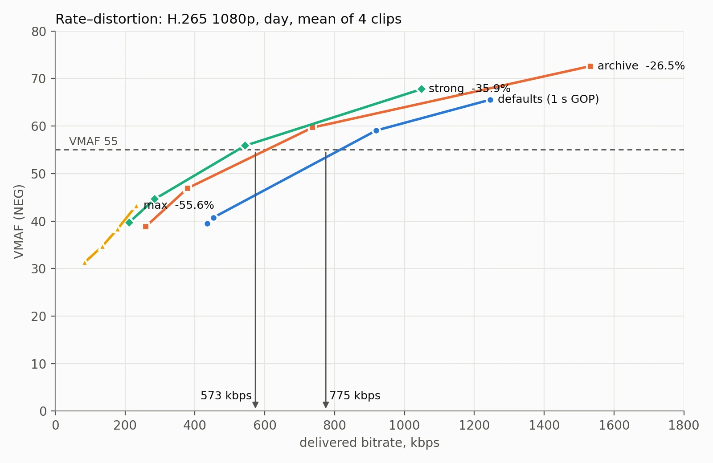
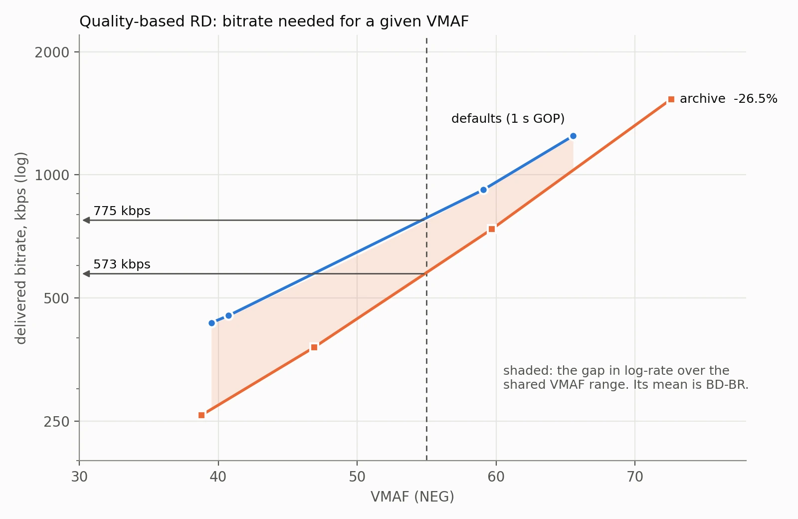

# OpenIPC Wiki
[Table of Content](../README.md)

Majestic encoder tuning
-----------------------

Settings that change *how* the video encoder predicts and structures frames,
rather than how many bits it spends. They live in the per-channel `video0:` /
`video1:` sections of `/etc/majestic.yaml`, alongside `gopSize` and `bitrate`.

Nothing here is specific to FPV, despite where these used to live. Spreading a
keyframe over several frames suits any lossy link, and spending bits on one
region of the frame is what a fixed surveillance camera wants.

> **These moved.** They were a global `fpv:` block until August 2026, and a
> config still naming them there is ignored rather than translated. Only
> `fpv.enabled` remains, being a SigmaStar pipeline switch rather than an
> encoder setting. Which channels accept which knob is in
> [Platform support](#platform-support) below.

### Reference structure — surviving packet loss

By default each P frame predicts from the frame before it, so the chain of
dependencies runs the whole length of the GOP. Lose one packet and every frame
after it is wrong until the next keyframe.

Two settings change that. The base-layer period is fixed at 1:

| setting | meaning |
|---|---|
| `video<N>.refEnhance` | enhancement-layer period |
| `video<N>.refPred` | may base-layer frames reference each other |

The combination worth knowing about is:

```yaml
video0:
  refEnhance: 0      # no enhancement layer
  refPred: false     # base frames do not reference each other
  gopSize: 1.0
```

`refPred: false` makes base-layer frames reference the keyframe instead of their
predecessor. With `refEnhance: 0` there is no enhancement layer, so *every* P
frame becomes what the vendor documentation calls a virtual I-frame — nothing
depends on the frame before it.

A lost frame then costs exactly that frame. Measured on a Hi3516CV500, dropping
one NAL mid-GOP leaves the **very next frame bit-exact**, where the normal
prediction chain stays visibly damaged until the next keyframe.

> **`refEnhance` must be 0 here, not 1.** With `1` the encoder splits base and
> enhancement layers and only half the frames reference the keyframe; the rest
> still propagate errors to the end of the GOP. Note also that the vendor rule
> "enhance 0 means normal prediction" only holds while `refPred` is `true`.

#### Why `gopSize` matters more than usual

Predicting from the keyframe gets worse as that keyframe ages, so the cost
depends on how much the scene changes in between. On a completely still scene it
is free — frame sizes are identical across a five-second GOP. Once the scene
moves, frame size climbs steadily through the GOP.

So bitrate against keyframe interval is **U-shaped**, and the minimum moves with
motion:

| `gopSize` | moderate motion | fast motion |
|---|---|---|
| 0.25 | 0.89 Mbps | 1.14 Mbps |
| 0.5 | 0.61 | **1.03** &larr; best |
| 1.0 | **0.59** &larr; best | 1.78 |
| 2.0 | 0.82 | 2.65 |
| 5.0 | 1.61 | 3.14 |

*(640x360 H.265 at 20 fps, identical content, CBR.)*

> **Rule of thumb:** start at `gopSize: 1.0` and shorten it if the scene moves a
> lot. A fixed camera watching a quiet room can go considerably longer. This is
> the opposite of the usual advice, where a longer GOP always saves bitrate.

#### Is it worth it?

Compared against the conventional way of limiting error propagation — normal
prediction with a short GOP — at its best interval:

| scene | reference-to-keyframe | normal, 5-frame GOP | result |
|---|---|---|---|
| static | 1.25 Mbps @ 5.0 | 3.86 Mbps | **3.1x cheaper** |
| moderate motion | 0.59 Mbps @ 1.0 | 0.84 Mbps | **1.4x cheaper** |
| fast motion | 1.03 Mbps @ 0.5 | 0.99 Mbps | about equal |

and in every case it recovers in one frame where the short GOP takes up to five.
A clear win for fixed cameras, a smaller one under moderate motion, roughly a
wash for fast motion — where you still get the better loss behaviour at the same
bitrate.

#### Use it with error correction

Do not pair this with little or no FEC. Every P frame depends on one keyframe,
and that keyframe is around 90 packets at a 1400-byte MTU, so losing it costs
the whole GOP. Simulated over a lossy link, this with no FEC loses **67% of
frames at 1% packet loss**.

Protect the keyframe heavily and the P frames lightly — not the keyframe alone.
Every unprotected P loss still costs a visible frame, so leaving them bare is
worse than spending a little parity on them.

> **Losing the keyframe is silent.** With it gone the decoder never resets its
> picture order count, resolves the following frames against a stale reference
> and reports no error at all. If you are building on this, detect keyframe loss
> in the transport, not from the decoder.

#### Checking it is active

Raise `gopSize` and watch the bitrate. With normal prediction a longer GOP
lowers bitrate; with `refPred: false` it raises it.

### Temporal layers — `video0.svct`

```yaml
video0:
  svct: off        # off | 2x | 4x
```

Splits the stream into a base layer plus a droppable enhancement layer, in one
conformant bitstream. A consumer that drops the enhancement layer gets half
(`2x`) or a quarter (`4x`) of the frame rate without re-encoding, and the result
still decodes.

Majestic can do the dropping per RTSP session — append `?thin=1` to the stream
URL and that session receives the base layer only, while other clients continue
at full rate.

`svct` and `refEnhance` configure the same part of the encoder on the same
channel, so they are mutually exclusive. Setting both logs a warning and `svct` wins.

### Automatic bitrate — `video<N>.bitrate: 0`

Every stream used to get the same default rate: 4096 kbit/s for the main
stream and 1024 for the substream, whatever the stream was. That starves a
5 MP H.264 stream at 25 fps, and gives a 704x576 substream about twice what
it needs. In builds from October 2026 the default is **0, "Automatic"**. The
camera picks the rate from what the stream actually is: its size and frame
rate as the sensor settled them, its codec and its rate control.

```yaml
video0:
  bitrate: 0        # Automatic; any other number is used exactly as written
```

To check whether a camera's build has it, look for the per-stream gauge that
only those builds publish. It also shows the rate each stream is running at:

```
curl -s -u root:<password> http://<camera>/metrics | grep bitrate_kbps
venc0_bitrate_kbps 4288
venc1_bitrate_kbps 512
```

No `venc0_bitrate_kbps` line means the build still uses the fixed 4096/1024
default.

| stream | old default | Automatic, kbit/s |
|---|---|---|
| 5 MP, 20 fps, H.265 | 4096 | 4992 |
| 5 MP, 25 fps, H.264 | 4096 | 7104 |
| 1080p, 25 fps, H.264 / H.265 | 4096 | 3648 / 2944 |
| 720p, 25 fps, H.264 | 4096 | 1600 |
| 704x576, 15 fps, H.264 (substream) | 1024 | 512 |
| 640x360, 15 fps, H.264 / H.265 (substream) | 1024 | 320 / 256 |

The table is for `rcMode: vbr` and `avbr`. With `cbr` the figure is 0.6 of
these: CBR spends its whole rate, while VBR and AVBR treat the number as a
ceiling and stay well under it on most scenes.



#### How the rate is chosen

```
kbit/s = 4096 × (pixels / 1920x1080)^k × (0.35 + 0.65 × fps / 30) × codec × rc
```

- **k** is 1.0 below 1080p and 0.75 above it.
- **codec** is 1.0 for H.264 and 0.8 for H.265.
- **rc** is 0.6 for CBR and 1.0 otherwise.
- The result is never below 128 kbit/s, and is rounded to 64.

The anchor, 4096 kbit/s for H.264 at 1080p and 30 fps, is the figure both
HiSilicon's sample encoder and Xiongmai's firmware recommend. The shape is
measured. The same day footage was encoded at 1080p, 720p and 640x360, at 25,
12 and 5 fps, and 5 MP footage at 2592x1944 down to 640x480. Each was encoded
at four configured rates and scored (see
[Reading the numbers](#reading-the-numbers-rd-curves-and-bd-br)), and the
question was what configured rate each needs for the same VMAF and PSNR:
- **Resolution.** The rate grows with the pixel count below 1080p, and with
  its 0.75 power above. Both vendors scale by the square root throughout. On
  this footage the square root missed by a factor of 2.3 on average, giving a
  substream three to four times the bits its size needs. This law missed by
  1.2.
- **Frame rate.** About a third of the rate does not depend on the frame
  rate: keyframes and the detail in them are paid for per second, not per
  frame. HiSilicon's sample uses half; Xiongmai scales linearly.
- **Codec.** H.265 needed 0.72-0.78 of H.264's rate at 720p and 1080p, and
  nearer 0.9 at 5 MP, so it gets 0.8.
- **Rate control.** The same picture needed 0.6 of the AVBR figure under CBR,
  because AVBR used only 50-84% of its ceiling.

#### What to expect

- **A number you write is never replaced.** 4096 included: it is used as
  written whatever the stream becomes.
- **An existing configuration keeps its number.** A `majestic.yaml` that
  already names `bitrate: 4096` keeps it after the update. Remove the line, or
  set 0, to take Automatic.
- **Changing the size, frame rate, codec or rate control moves the rate with
  it.** Switching to 0 takes effect without restarting the stream.
- **What the camera reports is the rate in force.** ONVIF's `BitrateLimit`,
  HLS and recording all use the rate the encoder actually runs at. So does the
  `/metrics` gauge `venc0_bitrate_kbps` (and `venc1_bitrate_kbps`), the one
  place that shows what Automatic came to, since the configuration still says 0.
  An NVR that writes the reported value back does not fix it: Automatic stays
  Automatic unless a different number is sent.
- **The [storage saver](#storage-saver--videonstoragesaver) works on top.**
  `max` holds the stream to about a third of whatever the rate is, Automatic or
  not.
- **All platforms** pick the rate the same way, for the size and frame rate
  their encoder actually runs. A platform whose encoder is VBR whatever
  `rcMode` says gets the VBR figure. The measurements were taken on a
  Hi3516EV300 with an IMX335.

### Rate-control defaults on the Hi3516EV200 family

From builds dated 2026-10-05, on the Hi3516EV200, Hi3516EV300, Hi3518EV300
and Hi3516DV200, the encoder spends the same bitrate noticeably better. The
defaults behind that change in three places:

| setting | default before | default now | effect |
|---|---|---|---|
| `video<N>.adaptiveQp` | on | **off** | one quantiser across the whole frame, not one that varies block by block with texture |
| `video<N>.ipQpDelta` | 2 | **6** | the keyframe is coded 6 QP better than the P frames that follow it |
| `video<N>.minQp` (VBR and AVBR) | 28 | **18** | lowest QP the rate controller may use |

#### What it buys

Measured on a Hi3516EV300 with an IMX335, using footage recorded from the
camera's own sensor:
- AVBR at a 1 s GOP; the night clips under slow shutter.
- Each setting was encoded from that identical recorded footage, so no
  difference comes from the scene changing between runs.
- Compared by VMAF at equal quality.
- Day and night 1080p used 6 clips each; day and night 5 MP used 3 clips each.

Bitrate needed for the same picture quality, against the old defaults:

| stream | day | night |
|---|---|---|
| 1080p H.265 | -12% to -15%\* | -3% to -7%\* |
| 1080p H.264 | -15% | -7.5% |
| 2592x1944 H.265 | -8% | -6% |

\* 1080p H.265 was measured with keyframe offsets of 2 and 8 rather than 6.
The range spans the two.

Every configuration in the table won on every clip it was measured on, and the
encoder's frame rate was unchanged. The exact new combination, with an offset
of 6, was measured on 1080p H.264 and on both 5 MP sets. 1080p H.265 was
measured only with the neighbouring offsets.

What each change contributes:
- **`adaptiveQp: false`** gives the bulk of the daytime gain. The encoder's
  texture-driven block adjustment costs more bits than it saves at equal VMAF.
- **`ipQpDelta: 6`** helps most at night. Each P frame predicts from the one
  before it, so in a mostly still scene the detail coded into the keyframe is
  carried forward frame to frame rather than coded again. A better keyframe
  lifts the whole GOP for little extra cost. At 5 MP the best value differs: about 4 by day, 8 at night. 6 is never
  far from either.
- **The lower `minQp` floor** does not change efficiency. It changes what a
  generous bitrate buys: with a floor of 28, AVBR given 4 Mbps at 1080p stopped
  improving at about 2.3 Mbps. With 18 it uses more of what it is given.

#### Other chips

On the other chips that have these keys (see
[Platform support](#platform-support)), the defaults are unchanged:
`adaptiveQp` on, `ipQpDelta` 2, `minQp` 28. The keys work there, but switching
adaptive QP off or raising the keyframe offset has only been measured on the
chips above. Try it on your own footage first. Older chips do not have the keys
at all; a build without them answers `404` to setting one.

A default only applies to a key your configuration does not set. A
`majestic.yaml` that already names `minQp: 28` keeps it after the update; remove
the line to take the new default.

#### Setting them

```
curl 'http://localhost/api/v1/set?video0.adaptiveQp=true'
curl 'http://localhost/api/v1/set?video0.ipQpDelta=4'
```

Like the reference-structure keys, a change restarts that stream's encoder:
viewers reconnect, but Majestic is not restarted, and the other stream is left
alone. `ipQpDelta` accepts -10..30; a value outside that is refused with `400`.
It applies to the normal GOP mode. The dual-P and smart-P GOP modes keep their
own offsets.

To check what the encoder is running with, read the driver's own status file
on the camera:

```
cat /proc/umap/rc
```

It lists the QP window (`MinQp`, `MinIQp`) and `IpQpDelta` per channel. The
per-block thresholds read all zero when `adaptiveQp` is off.

#### What was measured and left alone

- **A longer GOP** saves the most: 20% or more at `gopSize: 2` against 1 s,
  and about 40% at 5 MP by day, where the keyframe is most of the bitrate. It
  also delays recovery after loss, so it is not a default. To trade it for disk
  space, use the [storage saver](#storage-saver--videonstoragesaver) rather
  than `gopSize` alone: it keeps viewer joins and motion clips fast. See the
  reference-structure section above for when a short GOP matters.
- **`rcMode: cbr` and `rcMode: vbr`** both needed more bitrate than AVBR for the
  same quality on this footage. AVBR is the default and remains the best of the
  three.
- **A fixed QP** is about 8% (1080p) to 11% (5 MP) more efficient than AVBR
  at night, even with the new defaults. It holds no bitrate target, though, so
  it is not a default.

### Storage saver — `video<N>.storageSaver`

For cameras whose recordings are kept for weeks, on an SD card or an NVR disk,
where the disk costs more than the picture. It serves the same purpose as the
"H.264+", "H.265+" or "H.265X" modes of other cameras, and works the same way
whether the stream is H.264 or H.265. Off by default, set per stream, in
builds from October 2026:

```yaml
video0:
  storageSaver: off    # off | archive | strong | max
```

| level | what changes | frame rate |
|---|---|---|
| `archive` | a keyframe every 10 s; QP floor of at least 24 | unchanged |
| `strong` | `archive`, plus `maxQp` 44, and by day frames skipped while the stream runs above half of `bitrate` | about 17 of 25 fps on busy footage by day; unchanged at night |
| `max` | `archive`, plus frames skipped at a low threshold day and night, the stream held to about a third of `bitrate`, QP 28-51, and still scenes allowed to go soft | 13-25 fps by day, about 6 of 11 at night |

Bitrate needed for the same picture, against the defaults above (1 s GOP),
as BD-BR by VMAF, with PSNR in brackets — see
[Reading the numbers](#reading-the-numbers-rd-curves-and-bd-br) for what that
means and how it was measured:

| level | H.265 day | H.265 night | H.264 day | H.264 night |
|---|---|---|---|---|
| `archive` | -27% (-27%) | -21% (-25%) | -19% (-21%) | -27% (-28%) |
| `strong` | -36% (-30%) | about as `archive`\* | -28% (-25%) | about as `archive`\* |
| `max` | -53% (-51%†) | -46% (-40%†) | -53%† (-53%†) | -47% (-28%†) |
| the vendor's H.265X / H.264+, still-scene state | -13% (+2%) | -38% (-9%) | -6% (+5%†) | -32% (-1%†) |
| the vendor's H.265X / H.264+, busy-scene state | +22% (+18%) | -15% (-15%) | +32% (+28%) | -16% (-11%) |
| the vendor's Smart H.264 | | | -2% (-9%) | -17% (-19%) |

*Hi3516EV300 with an IMX335, 1080p. 4 day clips at 25 fps and 4 night clips
at 11 fps under slow shutter, recorded from the camera's own sensor and
encoded identically for every level, each played several times over so a
10 s GOP cycles. VMAF and whole-picture PSNR both undercharge a skipped
frame, so the levels that skip are judged again below on the part of the
picture that moves. \* Not measured as such: at night
`strong` runs as `archive` with a `maxQp` of 44 instead of 42. † From fewer
than the four clips: on the others the two curves share no quality range.
The vendor rows are its recipes, cloned on the same encoder — see
[Against Xiongmai's modes](#against-xiongmais-h265x-h264-and-smart-h264).*



**Judged on what moves.** A skipped frame repeats the previous picture. Where
the scene stands still — most of a surveillance view — the repeat is nearly
right, so whole-picture VMAF and PSNR barely charge for it, and a level that
skips frames looks cheaper than it is. Scoring only the parts of the picture
that move in the original footage removes that discount. In decibels of luma
PSNR on the moving parts at equal bitrate, positive = better than the
defaults:

| level | H.265 day | H.265 night | H.264 day | H.264 night | frames kept |
|---|---|---|---|---|---|
| `archive` | +2.1 dB | +3.0 dB | +1.9 dB | +2.6 dB | all |
| `strong` | -0.5 dB | -4.5 dB‡ | -0.3 dB | -2.6 dB‡ | 63-74% |
| the vendor's H.265X / H.264+, still-scene state | -1.6 dB | -4.4 dB | -1.9 dB | -4.7 dB | 50-54% |

*‡ Measured with frame skipping on at night. The released level stops skipping
frames there and runs as `archive` with `maxQp` 44. `max` is not in the table
because it never runs at the defaults' bitrates, so there is no equal rate to
compare at.*

- **`archive` is the level to choose.** It keeps every frame and, where the
  scene moves, gives a better picture than the defaults for the same bitrate.
- **`strong` saves its extra bits by showing motion less well.** By day the
  moving parts come out about as the defaults would at the same bitrate; its
  VMAF figure above overstates it.
- **The vendor's still-scene mode does the same, more so.** VMAF credits it
  with 6-38% saved, while the moving parts are 1.6-4.7 dB worse than the
  defaults at equal bitrate.

`strong` stops skipping frames at night — once slow shutter has lowered the
stream's frame rate by 15% or more — and so saves what `archive` saves there. With
the rate already reduced, skipping a third of what is left gave back nearly
all of its gain. It resumes when the sensor returns to full rate.

On a quiet scene the saving is larger. A 5 MP stream of a still room at
`bitrate: 5102`:

| | H.265 | H.264 |
|---|---|---|
| saver off | 1821 kbps | 2114 kbps |
| `archive` | 846 kbps | 443 kbps |
| `max` | 261 kbps at 13 fps | 224 kbps at 15 fps |
| a Xiongmai camera, same chip and sensor, same scene, in its H.265X / H.264+ mode | 426 kbps at 8 fps | 428 kbps at 10.5 fps |

Xiongmai's H.264+ and H.265X turn out to be the same recipe on this chip,
differing only in the codec.
Its other H.264 option, a "smart" mode built on a 1 s keyframe interval with a
10 s background frame, delivered 654 kbps on that scene.

#### Against Xiongmai's H.265X, H.264+ and Smart H.264

A live capture shows bitrate, not picture quality, so Xiongmai's two recipes
were cloned on the bench: the same encoder, the same clips, the same rate
ladder, with every setting read off its encoder while it ran in each mode on
its own firmware — V5.00.R02, built 2021-03-03, on a Hi3516EV300 + IMX335
camera, the same chip and sensor as the bench.
- **H.265X / H.264+:**
  - a keyframe every 10 s, held as a long-term reference that later frames
    predict from;
  - the configured bitrate ignored: the firmware sets one from how much motion
    it sees, the same at every resolution. For the main stream that is 1600
    kbps for a still scene, then 2000, 2400, 3800 and 3200 as motion grows;
  - in a still or nearly still scene, QP 28-44, still-scene QP 33, motion
    sensitivity 30, keyframe offset 2, and frames skipped above 13.5% of the
    rate;
  - once the scene is busy, no frame skipping, and QP 28-51.
- **Smart H.264:** a keyframe every 1 s plus a background frame every 10 s,
  QP 30-51, and no frame skipping.

Users report that newer Xiongmai firmware also offers "H.265AI", which lowers
the frame rate when nothing moves. The firmware measured here has no such
mode, so it is not compared. The idea itself was tried on the storage saver's
own encoder: on a still 5 MP scene with a keyframe every 10 s, running at 1
fps instead of 15 cut `archive` by 46% on H.265 and 11% on H.264, and `max`
not at all (-5% and +3%). With the frame rate low, the keyframes carry 70-93%
of the bits, and fewer frames per second does not make them smaller. At full
frame rate `max` already delivers what 1 fps would.



Both states were cloned and swept over the same rate ladder, since which one
the vendor's camera is in depends on the scene. Bitrate the storage saver
needs for the same picture as the vendor's H.265X (on H.265) or H.264+ (on
H.264), VMAF with PSNR in brackets:

| level | against | H.265 day | H.265 night | H.264 day | H.264 night |
|---|---|---|---|---|---|
| `archive` | still-scene recipe | -22% (-34%) | +16% (-22%†) | -25% (-35%) | -1% (-32%†) |
| `archive` | busy-scene recipe | -39% (-36%) | -8% (-15%) | -40% (-39%) | -13% (-18%) |
| `max` | still-scene recipe | -33% (-35%) | -8% (-16%) | -28% (-30%) | -16% (-17%) |
| `max` | busy-scene recipe | -68% (-62%) | -31% | -74% (-65%) | -37% (-27%†) |

| frames kept | H.265 day | H.265 night | H.264 day | H.264 night |
|---|---|---|---|---|
| the vendor's still-scene recipe | 50% | 51% | 53% | 54% |
| the vendor's busy-scene recipe | 100% | 100% | 100% | 100% |
| `max` | 59% | 57% | 56% | 56% |
| `archive` | 100% | 100% | 100% | 100% |

- **By day, both levels beat the vendor's mode in either state, on both
  metrics.** Against the busy-scene recipe, where both keep every frame,
  `archive` needs 36-40% fewer bits.
- **At night, VMAF and PSNR disagree about `archive` against the still-scene
  recipe.** That recipe skips half the frames and VMAF hardly notices, so by
  VMAF `archive` needs 16% more bits than it on H.265. PSNR has `archive` 22%
  cheaper, and on the moving parts of the picture `archive` is 6 dB better at
  equal bitrate on both codecs. Against the busy-scene recipe, which keeps
  every frame, `archive` wins on both metrics.
- **`max` beats the vendor's mode in either state, by both metrics, with one
  exception: H.265 at night against the busy state.** There only VMAF can be
  compared, because the PSNR curves share no range. `max` also keeps fewer
  frames there (57% against 100%), and VMAF barely notices a repeated frame,
  so that -31% is VMAF's word alone. On the moving parts of the picture,
  against the still-scene recipe, `max` is level with it at night (+0.0 to
  +0.2 dB at equal bitrate) and slightly ahead by day (+0.3 to +0.4 dB): both
  skip frames, and most of `max`'s lead by VMAF is in the parts that stand
  still.
- **In its busy state the vendor's mode needs more bits than our plain
  defaults by day** (18-32% more on H.265 and H.264), and saves 11-16% at
  night: dropping frame skipping and raising the QP ceiling leaves little of
  the long GOP's gain.
- **The vendor's Smart H.264 saves little** against our defaults: 2% by day,
  17% at night. Its 1 s keyframe interval keeps most of the cost the long
  GOP removes.

**`archive` keeps the picture at the quality an archive normally runs at.**
Its saving comes from the longer keyframe interval, with one limit: its QP
floor of 24 caps how good the picture can get. At ordinary archive bitrates
that ceiling is out of reach. At high bitrates it binds: on H.264 at night
`archive` tops out near VMAF 78, where the defaults go on to 86 at two and a
half times the bitrate. For footage that must stay that sharp, set `minQp`
lower yourself (your value wins) or leave the saver off.

`strong` and `max` sell picture and frame rate for more disk: `strong` shows
motion at a lower frame rate by day, and `max` looks visibly softer. Choose
`max` for footage you will only search, not watch.

What to expect with it on:
- **Viewers still join quickly.** A new RTSP, WebRTC or web viewer gets a
  fresh keyframe on connecting: about 0.1 s over RTSP and 0.5 s to the first
  WebRTC picture, measured. Keyframe requests less than 3 s apart are combined
  into one, so the long interval cannot be worn down by clients. When several
  viewers connect at once, the later ones can wait up to 3 s.
- **`gopSize` becomes a minimum.** The stream uses 10 s, or your `gopSize` if
  it is longer. ONVIF reports the interval the stream really has. An NVR that
  writes that value back does not change `gopSize`, and a shorter one does not
  shorten the interval while the saver is on.
- **Motion clips start at the trigger.** The recorder asks for a keyframe when
  motion starts, so a clip opens on the trigger rather than up to 10 s later.
  The run-up before it (`records.preRollSec`) is kept only if it holds a
  keyframe, and keyframes are now 10 s apart, or `gopSize` apart if that is
  longer. Set `preRollSec` at or above that interval to keep the run-up; the
  recording guide's advice to keep `gopSize` at or below `preRollSec` is not
  enough on its own with the saver on. The run-up is held in RAM, so on a
  small camera the memory cap can still shorten it — see
  [Recording on motion](majestic-streamer.md).
- **HLS segments get longer.** A segment runs from one keyframe to the next on
  the stream HLS describes, so with the saver on that stream it lasts 10 s, or
  `gopSize` if longer. Players with low-latency HLS stay close to live; others
  start further behind and fetch larger segments.
- **Each level brings its own QP window** unless you set `minQp` or `maxQp`
  yourself. Set to anything other than its default, your value wins at every
  level.
- **Frame skipping needs `isp.lowDelay` off.** With low delay on, `strong` and
  `max` run without it.

The floor of 24 is there because, with a 10 s keyframe interval on a still
scene, the rate controller drives the quantiser down to its floor. At the
Hi3516EV200 family's floor of 18, `archive` delivered twice the bitrate of the
saver being off, the extra bits going on sensor noise. A floor of 24 brings it
back to about half.

Setting it restarts that stream's encoder, like the other keys on this page:

```
curl 'http://localhost/api/v1/set?video0.storageSaver=archive'
```

To check it took effect, `cat /proc/umap/rc` on the camera shows the GOP
length in frames (150 at 15 fps). For `strong` and `max` it also shows frame
dropping switched on, with its threshold in bits per second.

Measured on the Hi3516EV300 only. It is available on the other chips listed
under [Platform support](#platform-support), where the same numbers are
expected but have not been measured.

#### Reading the numbers: RD curves and BD-BR

Every saving on this page that is given at equal quality is a
**Bjøntegaard delta bitrate** (BD-BR): how much more or less bitrate a
setting needs, on average, to deliver the *same* picture quality as the
reference. The quiet-room table is different: it gives the bitrates actually
delivered on one live scene, where quality was not measured. It is the standard way to compare encoders,
and it answers the question a disk budget asks. For a longer introduction,
see [What is BDBR?](https://www.vmetrix.tech/2026/01/26/what-is-bdbr/).

**Rate-distortion curves.** Each level was encoded at four target bitrates
(256, 512, 1024 and 2048 kbps), and every encode was scored against its
source. Plotting delivered bitrate against quality gives one curve per level.
A curve that sits higher, or further left, delivers more quality per bit.



The curves look close together, and that is misleading. Draw a horizontal
line at a quality you care about — VMAF 55 here — and read the bitrate where
each curve crosses it. The defaults need about 775 kbps for that picture;
`archive` needs about 573 kbps, 26% less.

**Quality-based curves.** One crossing is one point, and the gap changes along
the curve. Swapping the axes makes the question explicit: for each quality, how
many bits does each setting need? With bitrate on a log scale, a constant
percentage saving is a constant vertical gap.



**BD-BR** is the mean of that gap over the quality range both curves cover —
the shaded area divided by its width, converted back from log-rate to a
percentage. -26.8% means `archive` needs, on average, 26.8% fewer bits than
the defaults for the same VMAF. A positive number would mean it needs more.

How these particular numbers were produced:
- **Identical input.** Clips were recorded from the camera's own sensor at
  near-lossless quality, then fed back through the hardware encoder, one
  configuration at a time. Every level sees byte-identical frames, so no
  difference comes from the scene changing between runs. Clips are played
  three or four times over so that a 10 s keyframe interval actually cycles.
- **Metrics.** VMAF with its NEG model, which gives no credit for sharpening
  and is the right one for comparing encoders; PSNR of the luma as a second
  opinion. Every frame is scored, with no subsampling.
- **Interpolation.** Log-bitrate is fitted as a function of quality with a
  monotone piecewise-cubic (PCHIP) curve rather than Bjøntegaard's original
  cubic polynomial. With four points a polynomial can overshoot between them,
  and PCHIP cannot. The integral is taken only over the quality range both
  curves cover.
- **Averaging.** BD-BR is computed per clip and then averaged over the clips.
  The curves in the figures are the means of the four clips' points, for
  display. Where two curves share no quality range on a clip, there is nothing to
  integrate and that clip is left out; those figures carry a † in the
  tables.
- **Frame skipping.** `strong` and `max` repeat frames under load, and so does
  the vendor's still-scene recipe. VMAF barely penalises a repeated frame, and
  whole-picture PSNR only partly, since most of a surveillance view stands
  still. Those levels are therefore also judged on the moving parts alone. The
  original footage is cut into 16x16-pixel blocks, and for each frame a
  block's change is the mean absolute difference of its luma from the same
  block in the previous frame. A block counts as moving when that change is
  more than three times the median change of all blocks over the clip, and at
  least 2 levels, so sensor noise does not count as motion. Moving-parts PSNR
  is then the luma PSNR over the moving blocks only, with the squared error
  summed over all of them across the clip. That curve hardly rises with
  bitrate for a level that skips frames, so it is compared as quality at equal
  bitrate (BD-PSNR) rather than as bitrate at equal quality. Where the metrics
  disagree sharply, the moving-parts figure is the warning that counts.
  `strong` at night is the case in point: while it still skipped frames there,
  it measured -29% by VMAF but only -1.4% by PSNR on H.265 (-34% and -13% on
  H.264). That measurement is why it no longer skips frames at night, and why
  the table gives it as about `archive` there.

Two features of the curves matter in practice:
- **The defaults cannot go lower.** Their two lowest points sit almost on top
  of each other: asked for 256 kbps, they still deliver about 435. Rate control
  is already at its QP ceiling of 42, and with a keyframe every second that is
  as few bits as the picture can take. With a 10 s interval there is room to go
  much lower.
- **`archive` tops out on H.264 at night.** The quality floor of 24 caps how
  good the picture can get, so the curve flattens near VMAF 78 while the
  defaults go on to 86 at two and a half times the bitrate. Below that ceiling `archive`
  saves 27%. Above it the saver is the wrong tool, but an archive stream rarely
  runs there.

### The rest of the channel knobs

| setting | type | effect |
|---|---|---|
| `noiseLevel` | int | 3DNR strength on the video pipeline. `0` turns it off, which is a value rather than an absence — leaving the key out is not the same thing. |
| `refEnhance` | int | See above. |
| `refPred` | bool | See above. |
| `intraLine` | int | Cyclic intra refresh: how many macroblock rows are re-encoded as intra each frame. Spreads keyframe cost across the GOP instead of spending it in one burst. |
| `intraQp` | bool | Ask the encoder for an I-frame QP on refreshed rows. |
| `roiRect` | list | Up to 8 regions of interest as `XxYxWxH` strings. Coordinates are rounded to multiples of 32 and clamped to the frame. |
| `roiQp` | string | Comma-separated QP delta per region, in the same order as `roiRect`, each clamped to -30..30. Negative means better quality. At most 16 values are read; the rest are ignored. |
| `bypass` | int | ISP IQ API index whose bypass state is **toggled** when applied. Diagnostic. |

Every integer above is skipped when negative, which is also what an absent key
reads back as — so each one is individually opt-in and leaving it out changes
nothing. That is why none of them carries a default: writing one would turn an
opt-in knob into one that always applies.

`fpv.enabled` is the one setting still in the old place. It turns the SigmaStar
FPV path on and **also disables userspace 3A** (auto exposure and white balance)
at startup, so do not enable it just to reach one of the settings above.

### Setting them

All of these are published in the config schema, so they appear in the web UI
under their channel and can be written through the API:

```
curl 'http://localhost/api/v1/set?video0.refEnhance=0'
curl 'http://localhost/api/v1/set?video0.refPred=false'
```

A value outside the range the schema declares is refused with `400` rather than
written, so `video0.refEnhance=99` fails where you typed it instead of sitting
in the config as a number the encoder was never going to use.

### Platform support

| setting | HiSilicon | SigmaStar |
|---|---|---|
| `svct` | all but the Hi3516CV100 family\*, per channel | per channel |
| `refEnhance`, `refPred` | all but the Hi3516CV100 family\*, **per channel** | `video0` only |
| `adaptiveQp` | Hi3516CV500, AV300, DV300; Hi3516EV200, EV300, DV200, Hi3518EV300; Goke GK7205V200, V210, V300, GK7605V100 — per channel | — |
| `ipQpDelta` | the chips above, and Hi3516CV610 — per channel | — |
| `storageSaver` | the chips listed for `adaptiveQp` — per channel | — |
| `noiseLevel`, `intraLine`, `intraQp`, `roiRect`, `roiQp`, `bypass` | — | `video0` only |

\* Hi3516CV100, Hi3518AV100, Hi3518CV100 and Hi3518EV100. Every other HiSilicon
and Goke chip has these keys.

On HiSilicon each encoder reads its own channel, so `video0` and `video1` can
carry different reference structures. On SigmaStar only the main stream applies
them, so only `video0` has them — and they additionally require
`fpv.enabled: true`, which brings the 3A side effect with it. On HiSilicon there is no FPV module and `refEnhance` on its own
is enough.

A knob absent from your camera's schema is not supported by that build; the API
answers `404` rather than accepting a setting nothing would apply.

> The reference-structure measurements on this page were all taken on
> HiSilicon. SigmaStar is given the same parameters, but the behaviour of `refEnhance: 0` with `refPred: false` has
> not been confirmed there on hardware — use the bitrate check above before
> relying on it.

### Applying changes

The reference structure can only be set while a stream's encoder is being set
up, so Majestic sets that encoder up again to apply it. You do not have to
restart anything yourself. Setting either key is enough on its own:

```
curl 'http://localhost/api/v1/set?video0.refEnhance=1'
```

Majestic is not restarted and the camera does not reboot. What you will see is
the streams drop and come back, so viewers reconnect — do it when that is
acceptable, not while something is recording.

Read the value back afterwards rather than assuming it was taken:

```
curl 'http://localhost/api/v1/config.json' | grep -A2 refEnhance
```
