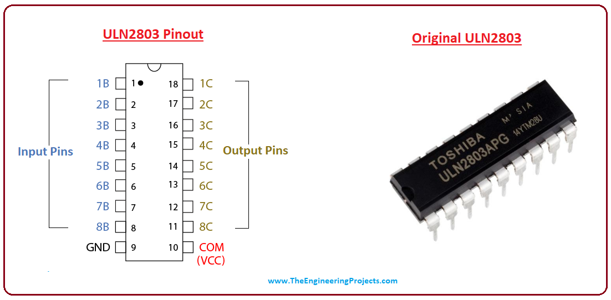

# Motors and PTZ

OpenIPC has support for motors on many devices through a variety of means. Many of these can be found in the [motors](https://github.com/OpenIPC/motors) repo. 

## Types of control

### Vendor binary/module

Some motors can be controlled through a binary or kernel module. [ingenic-motor](https://github.com/OpenIPC/motors/tree/master/ingenic-motor) is an example of this. Hex messages are sent to the module that in turn move the motor. [xm-kmotor](https://github.com/OpenIPC/motors/tree/master/xm-kmotor) does this as well. View their READMEs for more information on configuration. 

### UART

Some motors can be controlled through a UART TTY device. See [xm-uart.](https://github.com/OpenIPC/motors/blob/master/xm-uart/)

### GPIO

This is a simple and direct method to control a stepper motor by setting off GPIOs to a component on the board that assists in driving the motor. As long as you can probe your board and determine which GPIOs are connected to something like a ULN2803, there's a good chance you'll be able to control it. 

#### ULN2003 Pinout

### 24BYJ48 Stepper Motor Diagram

## Configuring ONVIF

With [onvif_simple_server](https://github.com/roleoroleo/onvif_simple_server) you can easily gain access to PTZ controls through ONVIF. Functionality will vary depending on the motor control package you use. See the server's example config in it's repo for all of the available commands. 