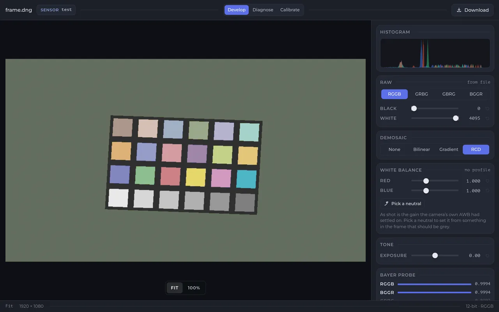
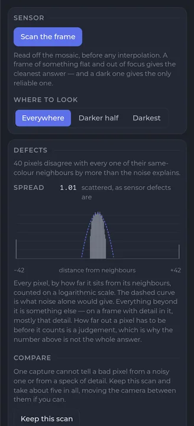
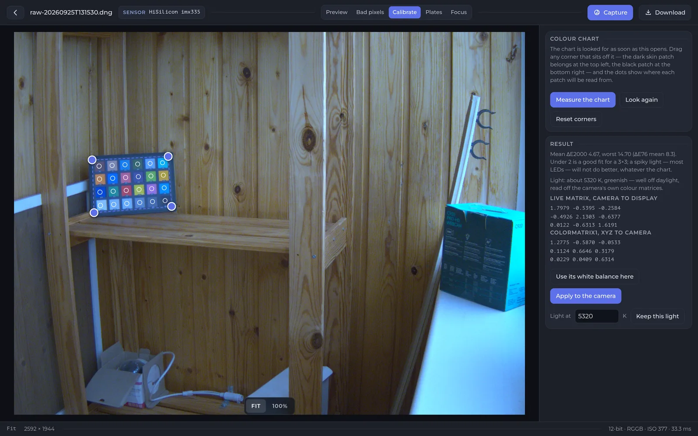

# OpenIPC Wiki
[Table of Content](../README.md)

Raw editor
----------

The camera can hand over what the sensor measured, before any of its own
processing — see [raw sensor data, as Adobe DNG](majestic-streamer.md#raw-sensor-data-as-adobe-dng)
for the endpoint itself. The raw editor is what opens one without leaving the
browser: it develops the frame on your machine, measures the sensor, and can
calibrate the camera's colour from a chart.

It is **not part of the firmware**. The web interface fetches it the first time
you open it, so the camera needs a route to the internet for that one request;
after that the browser caches it. A camera with no route out shows the raw page
with a download button and an explanation instead, which is the page working as
intended rather than a failure.

**Not every camera can do this.** Raw is a **HiSilicon and Goke** feature;
other SoC families do not serve it, and neither do the oldest HiSilicon parts.
The menu entry is there on every camera regardless, so the page itself is where
you find out:

- *This firmware does not serve raw frames* — the hardware cannot, and nothing
  will change that.
- *Raw capture is switched off for this camera* — it can, but `isp.rawMode` is
  `none`. Turn it on in **Settings**, under **Live**, where the image settings
  are drawn.

The [endpoint's own section](majestic-streamer.md#raw-sensor-data-as-adobe-dng)
has a one-line check that answers the same question from a shell.

Where it is available, **Camera → Raw** in the web interface opens it. It takes
a frame straight away, which is several megabytes off the camera and takes a
few seconds — there is nothing to press first.



### Develop

The picture. On current firmware the frame arrives with the camera's own white
balance recorded in it, so the first render is what the camera thought the
scene looked like rather than a neutral one. Older builds write a placeholder
balance of 1:1:1 and a black level of zero instead — the panel shows what your
file actually carries, and
[how good the colour is depends on your firmware](majestic-streamer.md#how-good-the-colour-is-depends-on-your-firmware)
says how to tell which you have.

| | |
|---|---|
| **Raw** | Which corner of the sensor's grid is red. It comes from the file; the Bayer probe at the foot of the panel narrows it to two candidates and cannot settle between them, so if the colours look swapped, try the other. |
| **Black** / **White** | Where the sensor's floor and ceiling sit, taken from the file. Moving White brightens the picture — a rendering choice, not a measurement. |
| **Demosaic** | How the missing two-thirds of each pixel are reconstructed. **RCD** is the default and the closest. **None** shows the mosaic itself, which is what you want when the question is about the sensor rather than the picture. |
| **Pick a neutral** | Click anything in the frame that ought to be grey. This is the fix for a colour cast, and it reads the mosaic rather than the picture on screen, so it measures the scene rather than the balance already applied. |

If the first render has a cast, there are two quite different reasons and the
White balance panel tells them apart. Where it shows a real measured balance,
the cast is the camera's own automatic white balance being wrong, faithfully
recorded — a raw frame carries the balance the camera chose, mistakes included.
Where it shows 1:1:1, the file simply has no balance in it and the cast is the
sensor's raw response, with milky blacks to match because the black level is
zero as well.

Picking a neutral fixes both, and is the quicker route either way.

### Diagnose



Measures the sensor rather than the picture: how many pixels disagree with
their neighbours by more than the noise explains, the black level the frame
implies against the one the file claims, what has already clipped, and how
noisy the rest is.

**Read the number with the two things beside it, not on its own.** Pointed at
an ordinary furnished room the scan will report hundreds of pixels, and almost
all of them are detail in the scene rather than faults in the sensor. Two
things in the panel say which you are looking at:

- **Spread.** Real sensor defects are scattered at random across the frame.
  Detail in a picture is not — it sits wherever the picture had detail. A
  figure near 1 is scattered, as the screenshot above shows; well below 1 means
  the scan is describing the room, and the panel says so in as many words.
- **The histogram.** Every pixel by how far it sits from its neighbours, on a
  logarithmic scale, against the curve noise alone would produce. Where the
  bars follow the curve there is nothing there; the tails are what is left.

**On a 12-bit camera, check your firmware date first.** Builds before
2026-09-17 wrote every second pixel of a raw frame four bits short, which is
precisely the kind of neighbour-to-neighbour disagreement this panel counts —
enough to report a healthy sensor as a defective one. See [12-bit
sensors](majestic-streamer.md#12-bit-sensors-check-your-build-date-before-you-trust-the-numbers)
for how to tell whether it applies to your camera. 10-bit sensors were never
affected.

To get an answer you can act on:

1. **Point it at something plain** — a blank wall, or the lens cap. The flatter
   and darker the frame, the less there is to mistake for a defect.
2. Use **Where to look → Darkest** so the scan only believes the dim parts of
   the frame, where a defect stands out and detail does not.
3. Take **about five captures**, keeping each one, moving the camera between
   them. A faulty pixel appears in all of them wherever the camera points;
   noise appears once and never again; detail moves with the view. The panel
   tallies them and says which it is looking at.

One capture is never enough, and five of the same unchanged view is not either.

#### Is this plate worth reading?

A second card appears here on a camera with the [plate reader](#plates)
configured, once you have picked a plate on the Plates tab. It asks three
questions about that one plate and answers them separately, because the answers
point at different fixes:

- **Sampling** — how many pixels wide the plate is. Below about 45 px there is
  not much to read; 70 px and up is comfortable.
- **Noise** — measured off the plate itself, in sensor counts. A burst brings
  this down; nothing else in the editor does.
- **Sharpness** — the interesting one, and it is an experiment rather than a
  reading. The plate is blurred a little more each time and read again until it
  stops reading, and what is reported is how much blur it survived. Room in
  hand means stacking and a better develop have something to work with. **None
  in hand means they do not**: the plate is already at the edge, and the answer
  is focus, or a shorter shutter if the car is moving, not processing.

It prints the whole sweep underneath, and it is worth looking at rather than
just the verdict. Confidence is not a clean slope against blur — a little blur
is also a denoise, and a plate can dip below the threshold and come back. The
card says so when that happens, and the figure is then roughly where the edge is
rather than exactly.

### Calibrate



Measures the camera's colour against a 24-patch chart and can write the result
back, so the camera's own picture — not just the raw frame — comes out closer.

Put a chart in front of the camera, reasonably flat on and evenly lit, and open
Calibrate. It looks for the chart by itself and puts four corners on it; drag
any that sit off, and the dots show where each patch will be read from. Then
**Measure the chart**.

The result reports a mean and worst ΔE — how far each patch landed from where
it should be. Under 3 is a good fit. A spiky light source, which most LED
lighting is, will not do better whatever the chart, so measure under something
continuous if the number matters.

Writing it to the camera is deliberately hard to regret: the new colour is
applied live and **put back by itself after thirty seconds** unless you confirm
you can still see a sane picture. That is the bargain a display resolution
change makes, for the same reason — a bad colour matrix survives a reboot.

### Plates

Finds number plates in the frame, reads them, and — this is the part worth
having — tells you what is stopping the ones it cannot read.

**The tab is not there by default, and that is a licensing decision rather than
an oversight.** The models are published under
[CC BY-NC 4.0](https://creativecommons.org/licenses/by-nc/4.0/): attribution,
and non-commercial use only. Majestic is a commercial product, so a camera that
fetched them on its own would be making that choice on behalf of everyone
running one, including the vendors who ship cameras for a living. Each owner
opts in instead, once, on the camera:

```
echo 'webui_lpr_base="https://cdn.jsdelivr.net/gh/OpenIPC/lpr-wasm@v0.1.0/dist/"' \
    >> /etc/webui/webui.conf
```

That file is where the camera's own decisions about the web interface live —
see [settings that live on the camera](web-interface.md#settings-that-live-on-the-camera),
which is also worth reading if a Plates tab you had disappears. Any source will
do — a mirror of your own, or a copy on the local network — as long as it is
`http` or `https` and holds the same files. With nothing set, no Plates tab is
built at all, which is the intended behaviour: a tab that could never work is
worse than no tab.

**Everything runs in your browser, not on the camera.** The camera serves the
raw frame and nothing else; about nine megabytes of model, plus the runtime that
executes it, is fetched once and cached. It needs WebAssembly in a worker, which
any current desktop browser has and some locked-down ones do not — where it is
missing the tab says so rather than failing later.

**Find the plates** develops the frame at full size and scans it in overlapping
tiles. Tiles, not the whole picture at once: shrunk to fit the detector, a
50-pixel plate arrives eight pixels wide and nothing is found. Candidates are
listed best read first, each with a thumbnail, its size, and a bar under every
character showing how sure the reader is of that one. A plate the reader is not
confident about is still listed, in italics — it is usually the interesting one,
and the two cards below are about finding out why.

Clicking a candidate in the list marks it on the picture, and the reverse works
too: clicking a marked plate selects its row.

#### Meter the camera here

Points auto-exposure at the plate you picked — see
[telling auto-exposure where to look](majestic-streamer.md#telling-auto-exposure-where-to-look)
for the setting itself. This is the one to reach for when a plate is *lit* —
by headlights, or by a lamp — and clips to white while the rest of the scene is
dark. Metering the plate instead of the whole frame drops the shutter until the
plate is exposed properly and lets the rest of the picture go dark, which is the
right trade when the plate is what you want.

The card says what the camera will really meter before you press anything. The
ISP will not meter a window below **256 × 120**, so a plate-sized rectangle is
grown around its own centre, and the panel reports the grown size and how many
times the plate's own area that is. Forty-odd times is normal for a plate at
this distance; it is still far more selective than the whole frame, but it is
not what you picked.

Arming also pins the exposure ceiling at a millisecond, the gains at 1× and the
strategy to `highlight` — a plate configuration, not just a rectangle. Those
settings survive a reboot, and one of them ruins the very picture you would use
to notice, so the camera **puts itself back after thirty seconds** unless you
confirm you can still see something sane. The same bargain Calibrate makes, for
the same reason.

#### Take a burst and stack it

Averages several frames of the plate's rectangle to bring the noise down, and
shows one frame beside the stack with both read, so you can see what it bought.

**Mean** is done by the camera: one request, up to sixteen consecutive sensor
frames, averaged before they leave it. **Reject** cannot be — an outlier cannot
be found in an average that has already been taken — so it asks for the frames
one at a time, about 0.8 s apart, and throws out the ones that disagree. That is
the mode for a burst something drove through; Mean is the one for everything
else, and it is much faster.

Do not read too much into the difference between the two pictures on the Mean
path. The plain frame is a second capture, taken after the average, so anything
that moved between them is in that number too — the editor says as much rather
than calling it a stacking gain. On the Reject path the single frame is the
burst's own first frame, and there the difference really is the stacking.

There is no alignment, deliberately. A camera on a bracket moves a small
fraction of a pixel across a burst, and correcting for that would cost more than
it could possibly recover.

#### What to expect

On a lab camera — an IMX335 over a car park — a plate 50 px wide read in
daylight at up to 1.00 confidence. **The pixels are not usually the problem.
Blur is**, and it goes over a cliff rather than down a slope. Scored against
ground truth on 150 plate crops at that sampling, degraded to the noise measured
on that camera — once for a single frame, once for what a twenty-frame stack
leaves:

| blur added | one frame | stacked |
| --- | --- | --- |
| none | 91% | 99% |
| +0.6 px | 87% | 99% |
| +0.9 px | 21% | 93% |
| +1.2 px | 0% | 45% |
| +1.6 px | 0% | 1% |

Two things to take from that. Half a pixel of blur is the difference between
reading nearly everything and reading nothing, which is why the
[Diagnose card](#is-this-plate-worth-reading) measures how much blur a plate
survives rather than how sharp it looks. And the burst is worth a great deal —
but only where there is blur headroom to spend it on. At +1.6 px neither column
reads anything, and a plate with no headroom wants the lens seen to, not a
longer burst.

Sharpening makes it worse, not better, on a subject this small — see
[dehaze, sharpening and noise reduction](majestic-streamer.md#dehaze-sharpening-and-noise-reduction)
for the setting that turns the camera's own off.

### When it will not open

The editor is fetched from the internet on first use. If it does not arrive the
raw page says so and still offers the frame as a download, which any desktop
raw converter will open. Nothing else in the web interface depends on it.

Raw capture is also demanding on small cameras — a frame is several megabytes
and the camera needs that much memory while it serves the request. The
[memory notes](majestic-streamer.md#on-a-board-with-little-ram-read-this-before-you-ask-for-one)
beside the endpoint are worth reading before using this on a board with little
RAM.

### Where it comes from

[OpenIPC/raw-editor](https://github.com/OpenIPC/raw-editor). The reasoning
behind the choices here — why RCD is the default demosaic and what the others
cost, why the Bayer probe stops at two candidates, why the neutral picker reads
the mosaic — is in that repository's README, along with what it takes to send a
patch.
