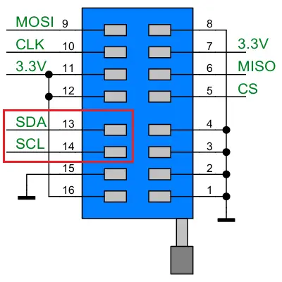
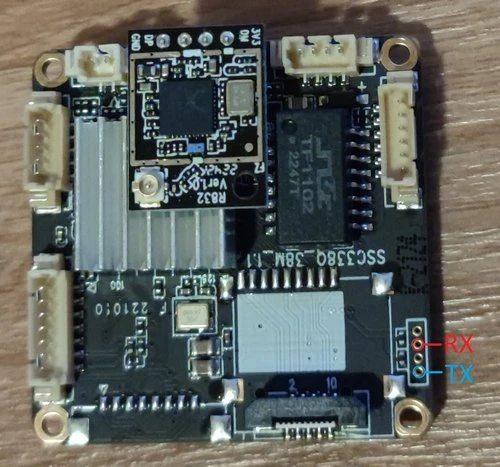
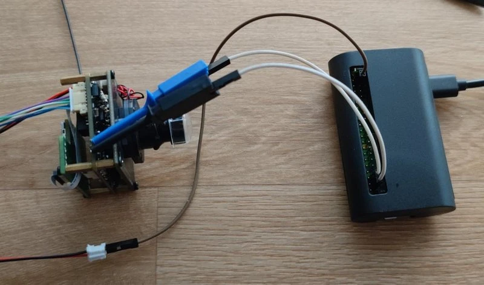
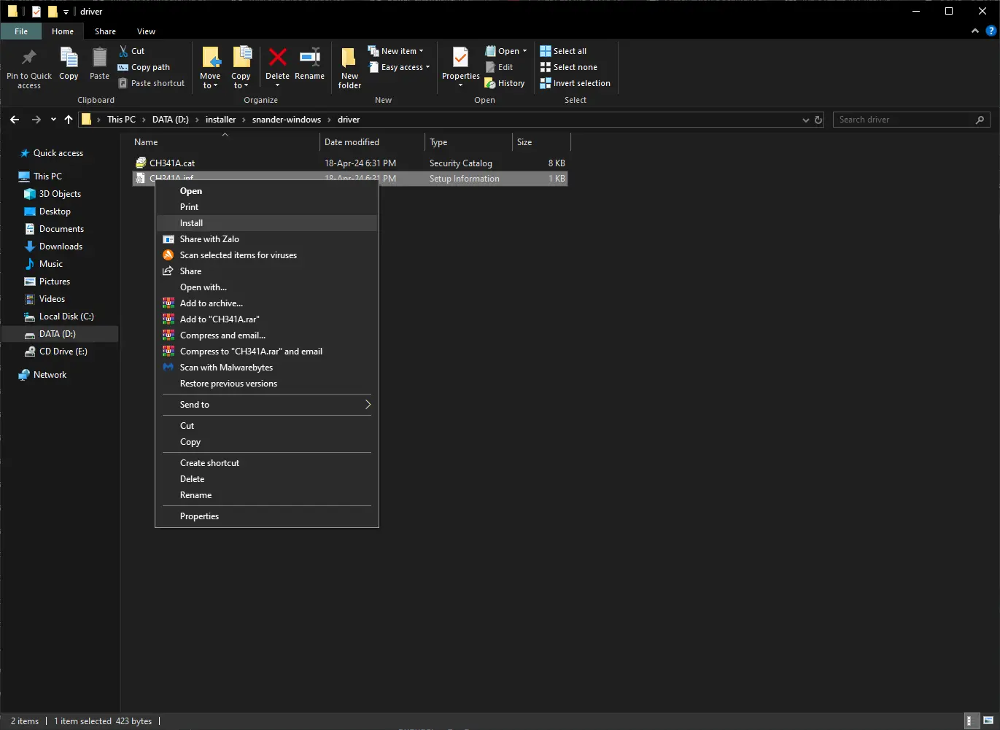
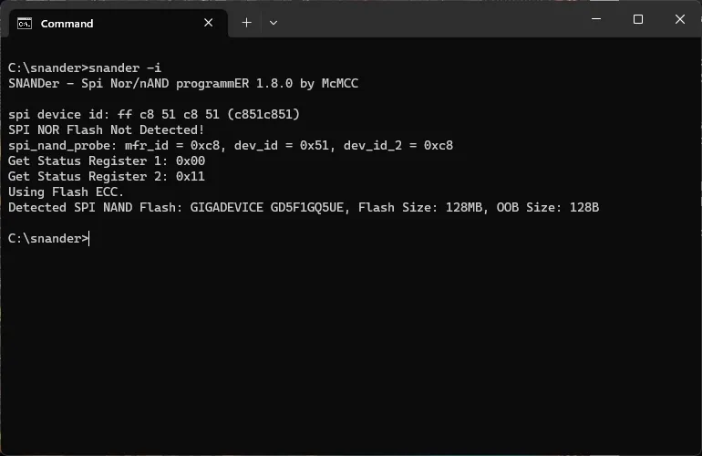
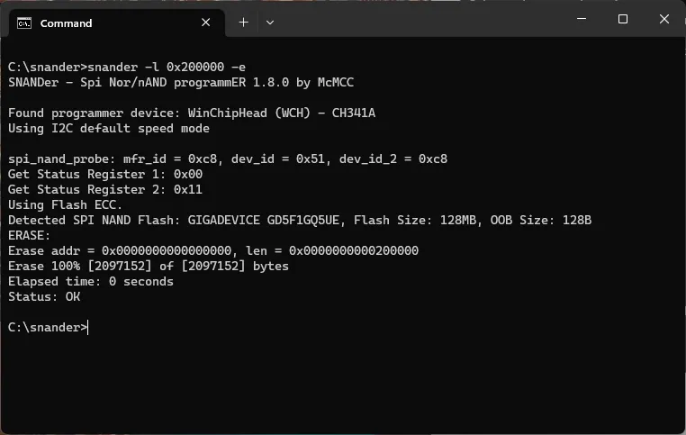
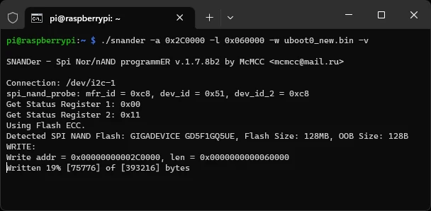

# OpenIPC Wiki
[Table of Content](../README.md)

Sigmastar unbrick
---

**Locate the Sigmastar UART output and connect it to the CH341A I2C:**
- $\color{dimgray}{\texttt{GND -> GND (PIN 1-4)}}$
- $\color{deepskyblue}{\texttt{TX -> SDA I2C (PIN 5)}}$
- $\color{orange}{\texttt{RX -> SCL I2C (PIN 6)}}$





---

**Download snander-mstar:**
- https://github.com/openipc/snander-mstar/releases

<details>
<summary>Install Windows driver</summary>

</details>

---

**Check the device flash with snander:**
- The device must be powered when connected to the programmer.
- Power cycling might help if the device can not be detected.
```
snander -i -q
```



**Erase the boot partition:**
```
snander -l 0x200000 -e
```



**Write the new uboot file:**
- https://github.com/openipc/firmware/releases/tag/latest
- drop the file into the same folder as the program
```
snander -w u-boot-ssc338q-nand.bin
```



---

**I2C devices:**
- 0x49 -> MStar ISP
- 0x59 -> MStar Debug

---

- [Alternative Raspberry method by MarioFPV](https://youtu.be/88C8UvyKQlQ)
