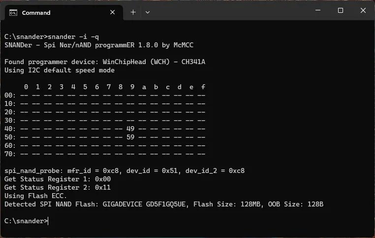

# OpenIPC Wiki
[Table of Content](../README.md)

Sigmastar unbrick
---

**Locate the Sigmastar UART output and connect it to the Raspberry Pi I2C:**
- TX -> SDA I2C (GPIO2)
- RX -> SCL I2C (GPIO3)
- GND -> GND


---

**Enable Raspberry I2C and install I2C tools:**
```
sudo raspi-config
sudo apt-get install -y i2c-tools
```

**Download snander-mstar programmer:**
```
wget https://github.com/viktorxda/snander-mstar/releases/download/latest/snander
chmod 755 snander
```

---

**Use i2cdetect to check for the device:**
- 0x49 -> isp programming
- 0x59 -> serial debugging
```
sudo i2cdetect -y 1
```


**Check the device spinand with snander:**
```
./snander -i
```



**Read uboot with snander:**
```
./snander -a 0x2C0000 -l 0x060000 -r uboot0.bin
```


**Erase uboot partition:**
```
./snander -a 0x2C0000 -l 0x060000 -e
```

**Write and verify new uboot:**
```
./snander -a 0x2C0000 -l 0x060000 -w uboot0_new.bin -v
```


---

**Partition table for spinand:**
```
CIS		0x0000000-0x0020000	128KB
IPL0		0x0140000-0x0200000	768KB
IPL_CUST0	0x0200000-0x0260000	384KB
IPL_CUST1	0x0260000-0x02C0000	384KB
UBOOT0		0x02C0000-0x0320000	384KB
UBOOT1		0x0320000-0x0380000	384KB
ENV		0x0380000-0x03C0000	256KB
KERNEL		0x03C0000-0x08C0000	5120KB
RECOVERY	0x08C0000-0x0DC0000	5120KB
rootfs		0x0DC0000-0x13C0000	6144KB
UBI		0x13C0000-0x8000000	110848KB
```

**Read partitions:**
```
./snander -a 0x000000 -l 0x020000 -r GCIS.bin
./snander -a 0x140000 -l 0x0C0000 -r IPL.bin
./snander -a 0x200000 -l 0x060000 -r IPL_CUST1.bin
./snander -a 0x260000 -l 0x060000 -r IPL_CUST2.bin
./snander -a 0x2C0000 -l 0x060000 -r UBOOT0.bin
./snander -a 0x320000 -l 0x060000 -r UBOOT1.bin
./snander -a 0x380000 -l 0x040000 -r ENV.bin
```

**Write partitions:**
```
./snander -a 0x000000 -l 0x020000 -e
./snander -a 0x000000 -l 0x020000 -w GCIS.bin -v
./snander -a 0x140000 -l 0x0C0000 -e
./snander -a 0x140000 -l 0x0C0000 -w IPL.bin -v
./snander -a 0x200000 -l 0x060000 -e
./snander -a 0x200000 -l 0x060000 -w IPL_CUST1.bin -v
./snander -a 0x260000 -l 0x060000 -e
./snander -a 0x260000 -l 0x060000 -w IPL_CUST2.bin -v
./snander -a 0x2C0000 -l 0x060000 -e
./snander -a 0x2C0000 -l 0x060000 -w UBOOT0.bin -v
./snander -a 0x320000 -l 0x060000 -e
./snander -a 0x320000 -l 0x060000 -w UBOOT1.bin -v
./snander -a 0x380000 -l 0x040000 -e
./snander -a 0x380000 -l 0x040000 -w ENV.bin -v
```
