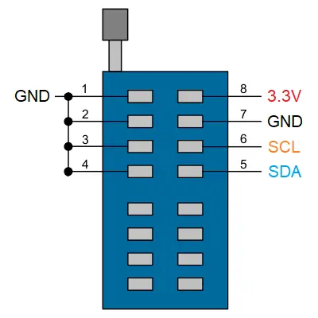

# OpenIPC Wiki
[Table of Content](../README.md)

Sigmastar unbrick
---
**Prerequisite**
- git
- make
- i2c-tools
---
**Disabling ch341 core module loading**

Add the line blacklist ch341 to the file /etc/modprobe.d/blacklist.conf. Update initramfs and reboot the system:
```
sudo update-initramfs -u
reboot
```
---
**Ch341-i2c driver download**
```
git clone https://github.com/frank-zago/ch341-i2c-spi-gpio
make -C ch341-i2c-spi-gpio
sudo insmod ch341-i2c-spi-gpio/ch341-core.ko
sudo insmod ch341-i2c-spi-gpio/i2c-ch341.ko
```
---
**Locate the Sigmastar UART output and connect it to the CH341A I2C:**
- $\color{grey}{\texttt{GND -> GND (PIN 1-4)}}$
- $\color{deepskyblue}{\texttt{TX -> SDA I2C (PIN 5)}}$
- $\color{orange}{\texttt{RX -> SCL I2C (PIN 6)}}$




---

**Download snander-mstar:**
- https://github.com/viktorxda/snander-mstar/releases
```
git clone https://github.com/viktorxda/snander-mstar
```
In the /snander-mstar/src/spi_controller.h file, specify your i2c device in the #define I2C_CONNECTION directive and compile the sources
:
```
make -C snander-mstar
mv snander-mstar/snander .
```
---

**Check the device flash with snander:**
- Power cycling might help if the device can not be detected.
```
snander -i -q
```


**Erase the boot partition:**
```
snander -l 0x200000 -e
```


**Write the new uboot file:**
```
snander -w u-boot-ssc338q-nand.bin
```


---

**I2C devices:**
- 0x49 -> MStar ISP
- 0x59 -> MStar Debug
