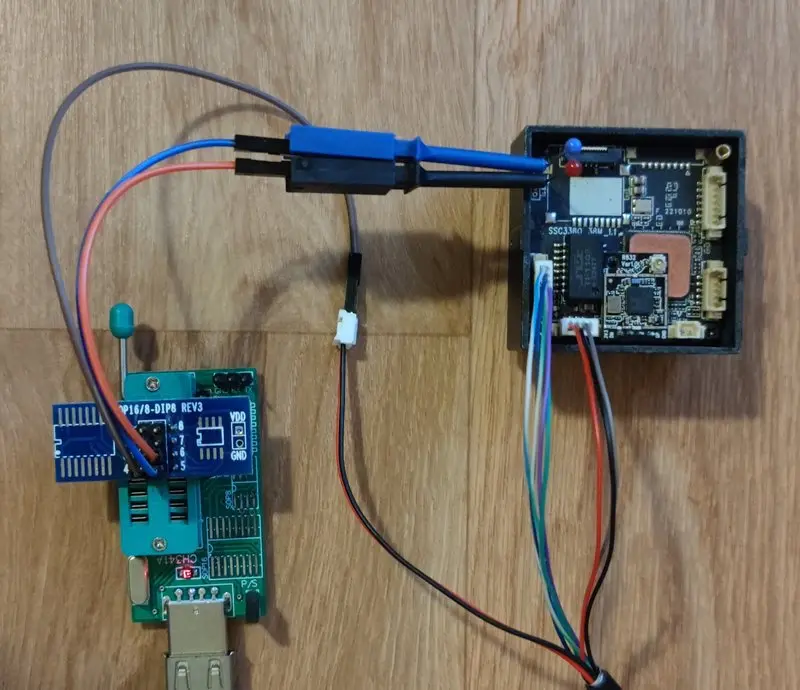
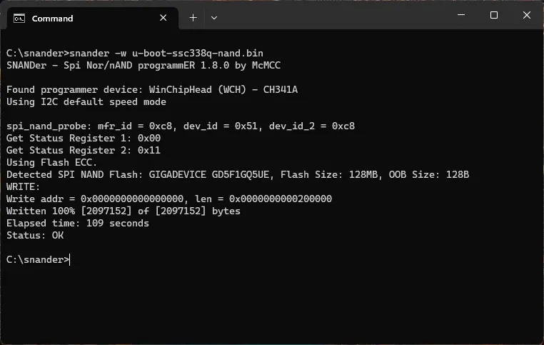

# OpenIPC Wiki
[Table of Content](../README.md)

Sigmastar unbrick
---

**Locate the Sigmastar UART output and connect it to the CH341A I2C:**
- $\color{black}{\texttt{GND -> GND (PIN 1-4)}}$
- $\color{deepskyblue}{\texttt{TX -> SDA I2C (PIN 5)}}$
- $\color{orange}{\texttt{RX -> SCL I2C (PIN 6)}}$




---

**Download ch341-i2c driver:**
```
git clone https://github.com/frank-zago/ch341-i2c-spi-gpio
make -C ch341-i2c-spi-gpio
sudo insmod ch341-i2c-spi-gpio/ch341-core.ko
sudo insmod ch341-i2c-spi-gpio/i2c-ch341.ko
```

**Download snander-mstar programmer:**
```
git clone https://github.com/viktorxda/snander-mstar
make -C snander-mstar/src
mv snander-mstar/src/snander .
```

---

**Use i2cdetect to check for the device:**
- 0x49 -> isp programming
- 0x59 -> serial debugging
```
sudo i2cdetect -y 0
```


**Check the device flash with snander:**
```
sudo ./snander -i
```


**Read original uboot:**
```
sudo ./snander -a 0x000000 -l 0x3C0000 -r boot.bin
```


**Erase, write and verify new uboot:**
```
sudo ./snander -a 0x000000 -l 0x200000 -e
sudo ./snander -a 0x000000 -l 0x200000 -w u-boot-ssc338q-spinand.bin -v
```



---

**Vendor partition table for spinand:**
```
CIS		0x0000000-0x0020000	128KB
IPL0		0x0140000-0x0200000	768KB
IPL_CUST0	0x0200000-0x0260000	384KB
IPL_CUST1	0x0260000-0x02C0000	384KB
UBOOT0		0x02C0000-0x0320000	384KB
UBOOT1		0x0320000-0x0380000	384KB
ENV		0x0380000-0x03C0000	256KB
KERNEL		0x03C0000-0x08C0000	5120KB
RECOVERY	0x08C0000-0x0DC0000	5120KB
rootfs		0x0DC0000-0x13C0000	6144KB
UBI		0x13C0000-0x8000000	110848KB
```
