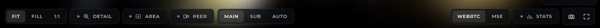
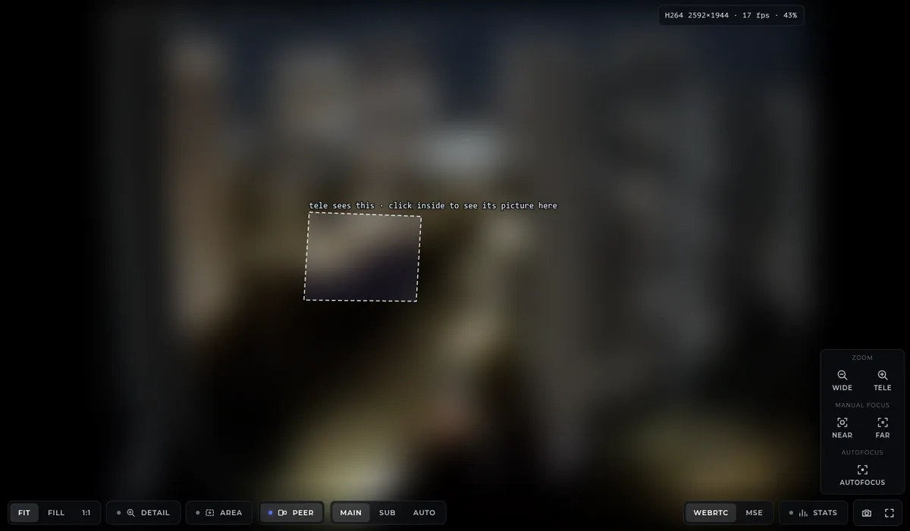
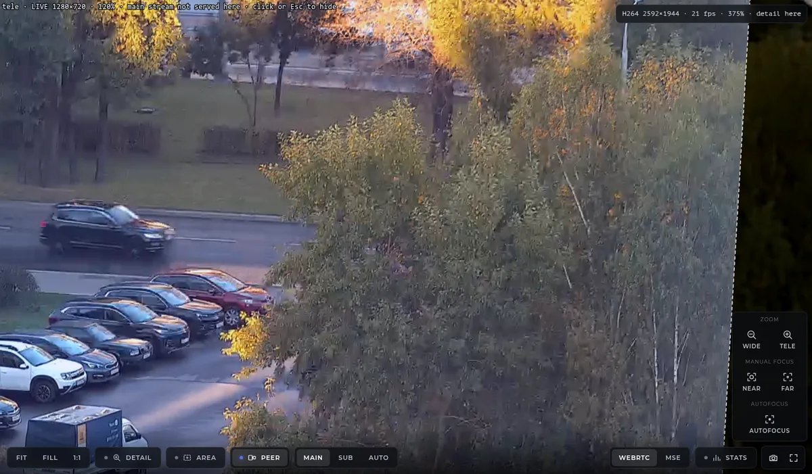
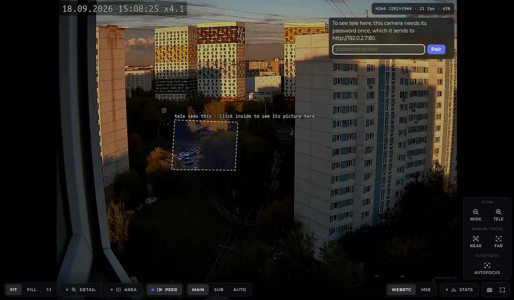

# OpenIPC Wiki
[Table of Content](../README.md)

Two cameras, one scene
----------------------

Two OpenIPC cameras look at the same place from two windows: one has a wide
lens and sees the whole street, the other has a long lens and sees one corner
of it in detail. Since the September 2026 builds of Majestic and the web
interface, the wide camera's live view can show where the narrow camera looks
and, on a click, lay the narrow camera's **live picture** over that part of its
own, aligned with it. Zoom in and you are looking at the narrow camera's pixels
in the wide camera's frame.



Switch **Peer** on and a dotted outline appears on the picture: that is the
part of this scene the other camera sees. Click inside it and the other camera's
video is placed onto exactly that outline.





This page is how to set it up and what to expect from it. Three things have to
be true first: the cameras must see each other on the network, the camera whose
page you use must know **where** the other one looks (a calibration, measured
once), and it must hold a credential for the other camera (a pairing, typed
once). The rest is a click.

### What you need

- Two cameras running OpenIPC with Majestic and the web interface from
  **September 2026 or newer** — on both. Older firmware on either side leaves
  the Peer control hidden, or offers snapshots where there would be video.
- Both cameras claimed, i.e. each has its root password — see
  [Web interface](web-interface.md).
- Both on the same network segment, so each hears the other announce itself.
  The camera switcher in the top bar of the web interface lists the cameras
  that do; so does `/cameras.html`. If the other camera is not in that list,
  nothing below will find it.
- Both mounted **firmly**. The calibration describes where the two pictures
  overlap; a camera that is nudged, or a zoom lens that moves, invalidates
  it. A varifocal lens is fine as long as it is calibrated at the zoom
  position it is used at — see below.
- The other camera's sub stream enabled and set to **H.264**. The overlay
  watches that stream while it is small on screen, because every browser
  plays H.264; a camera with only an H.265 main stream shows video in browsers
  that decode H.265 and snapshots in the rest. The sub stream must show the
  same field of view as the main one — no `crop` on it — or its picture lands
  on the wrong part of the scene.

### Step 1: which camera is which

Call the camera whose page you will use **this** camera, and the one whose
picture you want to see on it **the other** camera. Usually this camera is the
wide one and the other is the narrow one, but nothing requires it; a camera can
be both sides to different neighbours.

Everything is configured on **this** camera. The other camera needs nothing but
its password and an H.264 sub stream.

### Step 2: the calibration

This camera has to be told how a point on the ground in its own picture lands
in the other camera's picture. That relation is one table of nine numbers — a
*homography* — measured from a handful of points that both cameras see. It is
exact for one flat surface, the *ground plane*: a car park, a road, a square.
Things with height (a tree, a lamp post, a wall) will not coincide between the
two pictures, and are not meant to; parked cars, road markings and kerbs will.

The numbers live in this camera's configuration:

```yaml
calibration:
  peers:
    - peer: tele                   # the other camera, by the name the camera switcher lists it under
      mag: ""                      # this camera's zoom readout when measured; empty for a fixed lens
      peerMag: ""                  # the other camera's; empty for a fixed lens
      size: 2592x1944              # the other camera's MAIN stream size, width x height, both even
      homography: "5.21,-0.87,-2577,1.17,5.03,-5408,0.000186,-0.000156,1"
```

`size` is the other camera's main-stream resolution as `WxH`. `homography` is
nine numbers, row by row, and the last of them is 1. You can type the row into
the web interface — **Camera → Events → Calibration** on this camera — or send it:

```
curl -u root:PASSWORD -X POST http://<camera-address>/api/v1/config \
  -H 'Content-Type: application/json' \
  -d '{"calibration":{"peers":[{"peer":"tele","size":"2592x1944","homography":"5.21,-0.87,-2577,1.17,5.03,-5408,0.000186,-0.000156,1"}]}}'
```

It is saved at once and nothing restarts. A row the camera cannot read (a
`size` that is not `WxH`, a homography with fewer than nine numbers) is
skipped with a message in the log, not fatal.

#### Measuring the nine numbers

You need one snapshot from each camera, taken at about the same time, and at
least four points on the ground that you can find in both. Take the snapshots
from `http://<camera-address>/image.jpg` on each camera, at full size. Open
each in an image viewer that shows the cursor position in pixels (GIMP, the
GNOME image viewer, Windows Paint, Preview's inspector on a Mac all do), and
write down where the same ground features are in each: corners of parking
bays, ends of road markings, manhole covers, the foot of a post — features
**on the ground**, spread over as much of the shared area as possible, and
not in a line. Six to eight points give a better fit than four and let you
spot a point you misread.

Put them in a text file, one point per line — its position in **this**
camera's picture, then in the **other** camera's:

```
# x y      x' y'
1204 742   118 90
1530 731   1802 22
1560 1093  1836 1350
1219 1120  83 1372
1381 940   960 690
```

and run:

```python
#!/usr/bin/env python3
# Four or more points that both cameras see, on the ground -> the calibration row.
#   python3 homography.py points.txt
import sys
import numpy as np

pts = np.loadtxt(sys.argv[1], comments="#", ndmin=2)
if pts.shape[0] < 4 or pts.shape[1] != 4:
    sys.exit("need at least four lines of: x y x' y'")
src, dst = pts[:, :2], pts[:, 2:4]

def normalised(p):
    c = p.mean(axis=0)
    s = np.sqrt(2) / np.sqrt(((p - c) ** 2).sum(axis=1)).mean()
    T = np.array([[s, 0, -s * c[0]], [0, s, -s * c[1]], [0, 0, 1.0]])
    return (T @ np.c_[p, np.ones(len(p))].T).T, T

a, Ta = normalised(src)
b, Tb = normalised(dst)
rows = []
for (x, y, _), (u, v, _) in zip(a, b):
    rows.append([-x, -y, -1, 0, 0, 0, u * x, u * y, u])
    rows.append([0, 0, 0, -x, -y, -1, v * x, v * y, v])
_, _, vt = np.linalg.svd(np.array(rows))
H = np.linalg.inv(Tb) @ vt[-1].reshape(3, 3) @ Ta
H /= H[2, 2]

back = (H @ np.c_[src, np.ones(len(src))].T).T
back = back[:, :2] / back[:, 2:]
err = np.sqrt(((back - dst) ** 2).sum(axis=1))
print("homography:", ",".join("%.10g" % v for v in H.ravel()))
print("error per point, in the other camera's pixels:", " ".join("%.1f" % e for e in err))
```

It needs only Python 3 and NumPy. The first line it prints is the value of
`homography`. The second says how far each of your points lands from where
you said it is, in the other camera's pixels: a few pixels is a good fit, and
one point far above the rest is one you should read again.

With OpenCV installed the same thing is `cv2.findHomography(src, dst,
cv2.RANSAC, 3.0)` and it will throw away a bad point for you; if you know
that tool you do not need the script.

#### Checking it

Switch Peer on. The outline should sit on the part of this picture the other
camera shows — compare with the other camera's own live view. Click inside it:
the parked cars, kerbs and road markings in the other camera's picture should
land on the same ones in this picture. Trees and posts will not, and the
mismatch grows with their height; that is the geometry, not an error.

If the overlay sits a little off, add points and measure again. If it is
rotated or the wrong size, one of your points is on the wrong feature, or
the two snapshots were not from the same camera positions as now.

#### A lens that zooms

A motorized zoom lens changes the relation with every zoom position. The row
carries `mag`, the readout of this camera's lens when the row was measured
(`http://<camera-address>/zoom` reports it as `mag=4.4`, and the OSD can
show it), and the camera uses the row measured **nearest** the readout it has
now. Measure one row for each zoom position you use, and always drive the
lens to a position from the same direction before measuring and before
using it — cheap lenses have backlash, and the same readout reached from the
other side is not quite the same picture.

Two things follow from "nearest". A lens parked between two measured
positions is served the nearer row, which is a little wrong. And a lens that
moved overnight — a button pressed, a scheduled preset — makes the outline sit
where the other camera looked at the *old* position. When the overlay is
suddenly rotated or displaced, look at the zoom readout first.

`peerMag` is the same thing for an other camera that zooms; leave both empty
for fixed lenses.

### Step 3: pairing

The first time you click inside the outline, this camera asks for the other
camera's password:



What happens with it: this camera signs in to the other camera **once**, at the
address shown in the prompt, and keeps only the stay-signed-in token the other
camera hands back — not the password. From then on, each time you switch the
overlay on, this camera asks the other camera for a **fifteen-minute pass**
that opens its video and snapshots and nothing else — not its settings, not
its terminal — and gives that pass to your browser. Your browser never signs in
to the other camera and never learns its password. Video from the other camera
is one-way: even where the live view can talk back to a camera, it cannot
through this pass.

Look at the address in the prompt before you type. It is where the password
goes, and it is the address the other camera announced itself from. If it is
not the camera you expect, do not type.

To revoke the pairing, change the other camera's password — the token dies with
it — or tell this camera to forget it:

```
curl -u root:PASSWORD -X POST http://<camera-address>/api/v1/calibration/pair \
  -H 'Content-Type: application/json' -d '{"peer":"tele","forget":true}'
```

### Using it

- **Peer** on: the outline, dimming the rest of the picture a little. The
  label above it names the other camera and says what a click will do.
- **Click inside**: the other camera's picture on the outline. A snapshot comes
  first, the video within a second or two. The label says which you are
  seeing — `LIVE`, `connecting…` or `snapshots` — the size of the picture it
  is showing, and how far in you are looking at it.
- **Zoom as usual**: the wheel, a rectangle under **Fit**, the **Area** tool,
  a drag to pan. Everything works inside the outline as it does outside it.
  With the other camera's picture up, the page lets you zoom until that
  picture is at three times its own pixels — far past where this camera's
  own picture has anything left to show.
- **Main or Sub**: chosen for you. While the other camera's picture is small on
  screen its sub stream is plenty; zoom in past its size and the overlay
  switches to the other camera's main stream, and back when you zoom out. If
  your browser cannot play that main stream (H.265 in a browser without
  hardware decoding for it), the label says `main stream not served here` and
  the sub stream stays.
- **Click again, or Esc**: the picture goes; the outline stays. Esc again
  switches Peer off. Esc takes the picture but leaves your zoom where it is.
- If the other camera restarts while you are watching, the video comes back
  on its own within about half a minute: this camera asks it for a new pass.

### What is not there

- **One flat surface.** The alignment holds on the ground the calibration was
  measured on. Anything above it is displaced, by more the higher it is and
  the closer it is to the cameras.
- **No fusion.** The other camera's picture is laid over this one, it is not
  blended into it or used to sharpen it. Its colours and exposure are its own.
- **One peer at a time on screen.** Several peers can be calibrated; the
  picker beside the Peer control chooses which outline is drawn.
- **A page served over HTTPS cannot show an HTTP camera.** Browsers refuse
  mixed content, silently; the page says so in its note. Use HTTP on both, or
  HTTPS on both.

### When something is off

| You see | It means |
|---|---|
| No Peer control on the live view | This camera has no `calibration.peers` row, or the other camera has not announced itself, or one of the two builds predates the feature. Check the camera switcher in the top bar first. |
| Peer switches on but draws nothing, and a note says this camera has no calibration for the other one | The row's `peer` does not match the name the camera switcher lists, or the row is unreadable. |
| The outline is where the other camera *used to* look | One of the cameras moved, or the zoom lens is not at the position the row was measured at. Look at the zoom readout, then re-measure. |
| The prompt for a password comes back after pairing | The other camera's password changed. Pair again. |
| `snapshots` instead of `LIVE` | Your browser could not play any of the other camera's streams. Enable an H.264 sub stream on it, or use a browser that decodes H.265. |
| `connecting…` for longer than half a minute | The other camera is unreachable from your browser — a different network segment than the camera, a firewall, or HTTPS here and HTTP there. |
| The note says the other camera has no session to spare | The other camera's session table is full of live sessions. It frees itself as they expire; a camera that has to hand out many of these can be given a longer look on `/metrics`. |

### For scripts and integrations

Everything the page does, it does through three requests on this camera.
All need this camera's credential.

- `GET /api/v1/calibration/coverage?peer=<name>` — where the other camera's
  whole picture lies in this one: four corners in this camera's main-stream
  pixels, and the row they came from. 404 when no row names that camera.
- `POST /api/v1/calibration/pair` with `{"peer":"<name>","password":"…"}` —
  pairs, and answers `{"peer":…,"paired":true}`; `{"peer":"<name>","forget":true}`
  unpairs. 403 when the other camera refuses the password, 404 for a camera
  not in the list, 502 when it cannot be reached.
- `GET /api/v1/calibration/peer?peer=<name>` — a fifteen-minute pass for the
  other camera: its address, the pass, when it expires, and the streams it
  offers. Add `&fresh=1` when the other camera has refused the pass you hold
  (it restarted) to get a new one; without it, the same pass is handed out
  again while it is good. 409 `{"paired":false}` when there is no pairing or
  the other camera no longer honours it — the moment to pair again; 503 when
  the other camera has no session to spare.

The pass opens the other camera's `/ws/webrtc`, `/ws/video`, `/image.jpg`,
`/mjpeg` and the rest of its media paths as `?session=<pass>` in the URL, for
fifteen minutes, and nothing else. `GET /api/v1/calibration/map?peer=<name>&rect=XxYxWxH`
answers where a rectangle of this picture lands in the other camera's, for
anything that wants to crop the other camera's snapshot itself.
