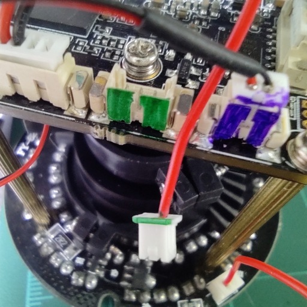
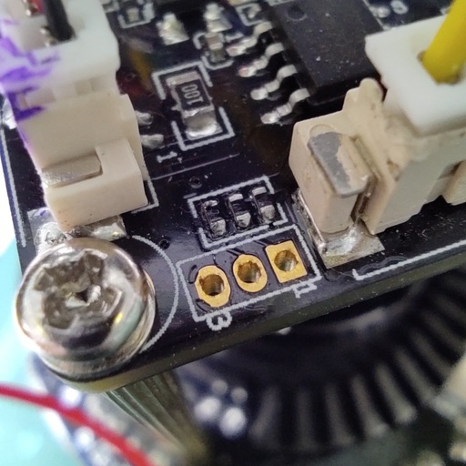

![OpenIPC logo][logo]

# Русская версия

## Прошивка OpenIPC -- что это?

Прошивка OpenIPC (OpenIPC firmware) -- это коллективный труд многих
программистов с целью создания отрытого стека для работы на IP камерах.

## Хочу попробовать. Что для этого требуется?

### IP камера.

Естественно, вам понадобится IP камера. Если вы еще не приобрели камеру,
изучите, на какие именно параметры необходимо обратить внимание перед
покупкой. Если у вас есть сомнения в правильности выбора, попросите помощи у
разработчиков в Telegram-канале.

Убедитесь, что ваша IP камера снабжена процессором, поддерживаемым прошивкой
OpenIPC. [Список таких процессоров][socs] пока ограничен, но быстро расширяется.

Самым надежным способом определения типа процессора является частичный разброр
корпуса. Для большинства камер это довольно простая и безболезненная операция:
пара винтов здесь, пара защелок там, и вы получаете доступ к электронике.

Процессор IP камеры (System on a chip, или SoC) -- это, как правило, крупный чип
на обратной стороне от объектива. Лазерная гравировка на поверхности чипа
подскажет вам, с каким именно процессором вы имеете дело.

Сделайте фотографии всех плат, компонентов, маркировок и наклеек. Они еще не
раз понадобятся вам для идентификации устройств без последующего разбора камеры.

Аккуратно снимите объектив (он держится на двух винтах) и сделайте фото матрицы.
Одни и те же процессоры могут комплектоваться разными типами матриц, каждая из
них требует собственного кофигурационного файла.

Сделайте фотографии разъемов, чтобы не перепутать подключения, если вам
понадобится их разъединить, например для удобного доступа к матрице. _Маленькая
хитрость: сделайте маркировку на обеих частях разъема цветным фломастером для
пластика, так вы точно будете знать, какой штекер от какого разъема._

### Знание Linux.

Необходимым условием для установки на вашу IP камеру прошивки OpenIPC является
ваше умение работать в среде Linux. Прошивка OpenIPC построена на базе Linux.
И хотя мы стремимся сделать нашу прошивку максимально простой и понятной обычному
пользователю, проект находится в ранней стадии разработки. А это значит, что
каждый день мы вносим изменения в код, и некоторые из них требуют ручного
вмешательства на уровне системы.

### Паяльник и умение с ним работать.

Самый простой способ получения доступа к загрузчику и операционной системе
камеры -- подключение к её порту UART. Это довольно простая процедура,
требующая недорогого [адаптера][g-usbttl] для серийного подключения с порта USB вашего
компьютера.

Большинство камер идут с нераспаянным, а зачастую и немаркированным портом
UART. Как правило, это группа из трех, реже четырех контактных площадок,
расположенных на самом краю платы.

Вам нужно будет самостоятельно определить порт на плате, выяснить его
распиновку, и либо распаять на него коннектор, либо припаять провода напрямую
к контактам порта. Так же можно использовать прищепку с пружинными щупами для
подключения адаптера к камере. В любом случае, соединение должно быть надежным,
иначе пропадание контакта во время записи/чтения может обернуться искажением
передаваемых данных, что в свою очередь может обернуться порчей содержимого
флэш-памяти и вывести камеру из строя. И тогда вам потребуется программатор
микросхем и паяльная станция.

**Прежде чем подключать адартер к камере, убедитесь, что переключатель уровня
рабочего напряжения на адартере установлен в 3.3 вольта!** Иногда для этого
достаточно выставить положение джампера, иногда надо перепаять ключ на
контактной площадке. Некоторые адартеры работают только с напряжением 5 вольт.
В этом случае вам понадобится дополнительный [конвертер][g-3.3ttl] уровня сигналов TTL,
включенный между адартером и портом UART камеры.

Один из нужных вам контактов порта UART -- GND. Его легко определить, проверив
мультиметром неразрывность цепи на любой другой известный контакт GND. Нашли?
Тогда остаётся найти ещё два контакта -- RX и TX, они используются для
получения и передачи данных, соответственно. Соедините GND камеры с контактом
GND адаптера, подключите USB разъём адаптера к порту USB вашего компьютера,
запустите на компьютере программу подключения к серийному порту и установите
соединение с адаптером. Используйте скорость подключения 115200 bps. После
этого соедините контакт RX адаптера с предполагаемым контактом TX порта UART.
Подайте питание на камеру. Если вы угадали правильно, на экране появится лог
загрузки. Если же экран остался чистым -- повторите процедуру с другим
свободным контактом UART. После того, как вы определили порт RX, подключите
порт TX адаптера к оставшемуся свободному контакту порта UART. Попробуйте
прервать загрузку камеры нажатием комбинации клавиш на клавиатуре компьютера.
Если все получилось -- поздравляем, вы получили доступ к камере.

Четвертым контактом порта UART может быть VCC. Он используется для подачи
напряжения во время прошивки камеры на заводе. Мы настоятельно советуем
__не подключать питание камеры через VCC порт UART__, а использовать для
этого штатный разъем питания.

В критических ситуациях хорошим подспорьем будет умение работать с паяльником
и программатором микросхем. Паяльная станция также может пригодиться вам для
замены некоторых компонентов с целью достижения лучшей совместимостью камеры
с нашей прошивкой: например для замены модуля WiFi или микросхемы флэш-памяти.

### TFTP сервер.

Мы советуем вам настроить в своей сети сервер TFTP. Его удобно использовать для
загрузки в камеру файлов новой прошивки, для сохранения дампа оригинальной,
поставляемой вместе с камерой, прошивки, а так же для хранения самописанных
часто используемых скриптов -- таким образом вы сможете быстро восстановить
привычную рабочую среду после очередной перепрошивки с очисткой системы.

**Обязательно сохраните оригинальную прошивку!** Она позволит вам вернуть
камеру в исходное состояние, если вас что-то не устроит в прошивке OpenIPC.
Вы так же сможете использовать её для сравнительных тестов, если решите принять
участие в разработке нашей прошивки.

### Любопытство, кураж и терпение.

Следует понимать, что на нынешней стадии разработки прошивка OpenIPC -- это ещё
не готовый продукт, а R&D, НИОКР. Как правило, производители камер не раскрывают
свои секреты, не дают пароли для доступа к штатным прошивкам, даже не делятся
документацией со сторонними разработчиками. Поэтому мы экспериментируем, пробуем
разные подходы, изучаем и анализируем накопленные знания. Это даёт свои плоды,
но так же иногда приводит к сбоям. Если что-то хорошо и стабильно работает
сегодня вечером, то оно может быть сломано завтра утром, и снова починено к
следующему вечеру.

Устанавливая прошивку OpenIPC сегодня, вы должны отдавать себе отчет, что это
путь к прекрасному открытому будущему, но мы не обещаем, что именно сейчас
дорога будет легкой.

OpenIPC -- это увлекательный эксперимент, в котором вы можете принять участие.
Помогайте нам, и однажды OpenIPC станет самой стабильной, гибкой и открытой
прошивкой для всех IP камер.

## Что можно прочитать про прошивку OpenIPC?

* [Часто задаваемые вопросы и ответы на них][faq1]
* [Заметки от Игоря Залатова][faq2]

## Установка прошивки OpenIPC.

Итак, если вы всё ещё хотите попробовать прошивку OpenIPC на своей камере,
вам поможет [пошаговая инструкция](/ru/installation.md).

[logo]: https://cdn.themactep.com/images/logo_openipc.png
[socs]: https://github.com/OpenIPC/firmware/wiki/supported_devices
[faq1]: https://github.com/OpenIPC/camerasrnd/blob/master/docs/FAQ-ru.md
[faq2]: https://github.com/OpenIPC/wiki/blob/master/ru/discussion.md
[g-usbttl]: https://google.com/search?q=ftdi+usb+ttl
[g-3.3ttl]: https://google.com/search?q=logic+level+converter+3.3v+5v
