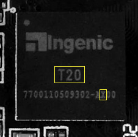

# OpenIPC Wiki
[Оглавление](../index.md)

Установка OpenIPC. Шаг за шагом.
--------------------------------

### Шаг 1. Определите тип процессора.




_Пример маркировки процессоров Hisilicon Hi3518EV100 и Ingenic T20.
Значимые символы обведены жёлтым._

### Шаг 2. Скачайте прошивку.

Найдите свой тип процессора на странице <https://github.com/OpenIPC/firmware>
и убедитесь, что для него есть готовая прошивка. Если вам повезло, и такая
прошивка существует -- скачайте её на свой компьютер.

### Шаг 3. Установите и настройте сервер TFTP.

TFTP расшифровывается как Trivial File Transfer Protocol. Как следует уже из
названия, это очень простой протокол, предназначенный для передачи файлов по
компьютерной сети. TFTP не поддерживает аутентификацию. Его код настолько прост
и компактен, что TFTP клиенты используются в сетевых и встроенных системах для
получения загрузочных образов с сетевых серверов.

#### Если на вашем компьютере Linux.

Если на вашем компьютере установлен Linux, то здесь всё просто. Скомпилированный
и готовый к использованию пакет сервера TFTP уже лежит в репозитории, и вам
только надо установить его и настроить:

```
sudo apt install tftpd-hpa
sudo sed -i '/^TFTP_OPTIONS/s/"$/ --create"/' /etc/default/tftpd-hpa
sudo systemctl restart tftpd-hpa.service
```

Теперь у вас есть свой TFTP сервер, который работает с файлами в директории
`/srv/tftp`. Разверните архив с прошивкой, скачанный в п.2 в эту директорию.

```
sudo tar -C /srv/tftp/ -xvf openipc.*.tgz
```

### Шаг 4. Подключитесь к порту UART камеры.

Для подключения к камере через порт UART вам понадобится [адаптер][ftdi] для
создания подключения с серийного порта вашего компьютера.

__Прежде чем подключать адаптер к камере, убедитесь, что переключатель уровня
рабочего напряжения на адаптере установлен в 3.3 вольта!__ Иногда для этого
достаточно выставить соответствующее положение джампера, иногда надо перепаять
ключ на контактной площадке. Некоторые адаптеры работают только с напряжением 5
вольт. В этом случае вам понадобится дополнительный [конвертер][tllc] уровня
сигналов TTL, включенный между адаптером и портом UART камеры.

Один из нужных вам контактов порта UART -- `GND`. Его легко определить, проверив
мультиметром неразрывность цепи на любой другой известный контакт `GND`. Нашли?
Тогда остаётся найти ещё два контакта -- `RX` и `TX`, они используются для
получения и передачи данных, соответственно. Соедините `GND` камеры с контактом
`GND` адаптера, подключите USB разъём адаптера к порту USB вашего компьютера,
запустите на компьютере программу подключения к серийному порту и установите
соединение с адаптером. Используйте скорость подключения 115200 bps. После этого
соедините контакт `RX` адаптера с предполагаемым контактом `TX` порта UART.
Подайте питание на камеру. Если вы угадали правильно, на экране появится лог
загрузки. Если же экран остался чистым -- повторите процедуру с другим свободным
контактом UART. После того как вы определили порт `RX`, подключите порт `TX`
адаптера к оставшемуся свободному контакту порта UART. Попробуйте прервать
загрузку камеры нажатием комбинации клавиш на клавиатуре компьютера. Если всё
получилось -- поздравляем, вы получили доступ к камере.

Четвертым контактом порта UART может быть `VCC`. Он используется для подачи
напряжения во время прошивки камеры на заводе. Мы настоятельно советуем не
подключать питание камеры через `VCC` порт UART, а использовать для этого
штатный разъем питания.

### Шаг 5. Получите доступ к консоли загрузчика.

Перегрузите камеру и постарайтесь получить доступ к консоли загрузчика нажав
требуемую комбинацию клавиш между моментом начала загрузки и до старта ядра
Линукс. В большинстве случаев это комбинация `Ctrl-C`. Реже -- `Enter`, Esc`
или просто любая клавиша. Но некоторые камеры требуют более экзотические
комбинации. Читайте надписи на экране во время загрузки. Если внимательное
чтение лога не помогло -- попросите помощи на нашем канале Телеграм. Скорее
всего, мы уже имели дело с подобной камерой.

Начиная с этого момента мы настоятельно советуем вам вести записи всего, что
вы делаете. Включите сохранение логов сессии в вашем консольном клиенте. Но для
еще большей надежности создайте текстовый файл на вашем компьютере и заносите в
него все выполняемые команды и ответы системы.

### Шаг 6. Сохраните заводскую прошивку.

После того как вы получили доступ в консоль загрузчика, наберите `help`, чтобы
вывести список доступных вам команд. Убедитесь, что в списке команд присутствует
`tftp`. Если такая команда есть, то сохранение оригинальной прошивки не должно
доставить проблем. Надо только настроить сетевой доступ камеры к вашему серверу
TFTP.

NB! Если в вашем загрузчике нет tftp, вы всё ещё можете сделать копию
оригинальной прошивки. [Подробности здесь](help-uboot.md).

Проверьте настройки системного окружения командой `printenv`. Вас интересуют
настройки сетевого подключения: `ipaddr`, `netmask`, `gatewayip` и `serverip`.
Первые три параметра задают IP адрес и сетевую маску вашей камеры, IP адрес
сетевого шлюза для подключения в локальную сеть. Четвёртый параметр -- IP адрес
сервера TFTP, с которого и на который будут передаваться файлы командой `tftp`.
Установите нужные значения командой `setenv` (используйте IP адреса и сетевую
маску соответствующие вашей сети). Сохраните установленные значения командой
`saveenv`.

```
setenv ipaddr 192.168.1.253
setenv netmask 255.255.255.0
setenv gatewayip 192.168.1.1
setenv serverip 192.168.1.254
saveenv
```

Большинство IP камер сегодня комплектуются чипами Nor или Nand флэш-памяти
объемом 8 или 16 мегабайтов. Вы можете увидеть тип и размер установленной на
вашей камере микросхемы в выводе лога загрузчика. Там будет что-то вроде этого:

```
U-Boot 2010.06-svn (Oct 21 2016 - 11:21:29)

Check Flash Memory Controller v100 ... Found
SPI Nor(cs 0) ID: 0xс2 0x20 0x18
spi_general_qe_enable(294): Error: Disable Quad failed! reg: 0x2
Block:64KB Chip:16MB Name:"MX25L128XX"
SPI Nor total size: 16MB
```

Чтобы сохранить содержимое флэш-памяти в файл, необходимо сначала загрузить это
содержимое в оперативную память. Очистите содержимое региона оперативной памяти 
достаточно большое чтобы вместить содержимое флэш-памяти, затем считайте содержимое
флэш-памяти в подготовленный участок оперативной памяти, и выгрузите считанные 
данные из оперативной памяти в виде файла на сервер TFTP.

Разные процессоры, разные размеры микросхем памяти, разные адреса загрузки не позволяют
привести здесь универсальный набор команд. Для получения списка команд, подходящих для
вашей конкретной конфиругации, воспользуйтесь [автоматическим генератором инструкций](https://openipc.org/supported-hardware/)
на нашем сайте.

### Шаг 7. Установите прошивку OpenIPC.

Разные модели камер имеют разные наборы компонентов. Самые значимые из них --
процессор и сенсор, -- напрямую влияют на качество изображения и набор функций,
присущих той или иной камере. Но и казалось бы менее значимые детали могут
устанавливать ограничения на возможности камеры и её прошивки. Например, у
разных камер могут отличаться установленные микросхемы флэш-памяти. Одни камеры
могут иметь флэш-память объемом 8 МБ, в то время как другие - 16 МБ, а то и
больше. В больший объем флэш-памяти можно поместить большее количество
программного кода, позволить камере запускать дополнительные сервисы, которые
недоступны на камерах с меньшим объёмом флэш-памяти. Поэтому мы решили
собирать два варианта нашей прошивки: базовую версию (_Lite_) для камер с
объемом флэш-памяти 8 МБ и расширенную версию (_Ultimate_) с дополнительными
возможностями для камер с увеличенным объемом флэш-памяти.

Процедура установка прошивки на разные модели камер отличается используемыми
адресами памяти и разными параметрами, устанавливаемыми в переменные окружения,
поэтому прежде чем продолжить, определите, какой именно тип процессора, какая
модель сенсора, какой объем памяти установлены на вашей камере.

Для получения списка команд, подходящих для вашей конкретной конфиругации,
воспользуйтесь [автоматическим генератором инструкций](https://openipc.org/supported-hardware/)
на нашем сайте.

### Шаг 8. Первая загрузка.

Если все предыдущие шаги выполнены правильно, ваша камера должна стартовать уже
с новой прошивкой. Добро пожаловать в OpenIPC!

После первой загрузки с новой прошивкой вам нужно очистить перекрывающий раздел,
запустив для этого программу

```
firstboot
```

[logo]: ../images/logo_openipc.png
[ftdi]: https://www.google.com/search?q=ftdi+usb+ttl
[tllc]: https://google.com/search?q=logic+level+converter+3.3v+5v
