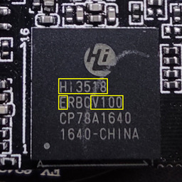

# OpenIPC Wiki
[Оглавление](index.md)

Установка OpenIPC. Шаг за шагом.
--------------------------------

### Шаг 1. Определите тип процессора.



_Пример маркировки процессора Hisilicon Hi3518EV100.
Значимые символы обведены жёлтым._

### Шаг 2. Скачайте прошивку.

Найдите свой тип процессора на странице <https://github.com/OpenIPC/firmware>
и убедитесь, что для него есть готовая прошивка. Если вам повезло, и такая
прошивка существует -- скачайте её на свой компьютер.

### Шаг 3. Установите и настройте сервер TFTP.

TFTP расшифровывается как Trivial File Transfer Protocol. Как следует уже из
названия, это очень простой протокол, предназначенный для передачи файлов по
компьютерной сети. TFTP не поддерживает аутентификацию. Его код настолько прост
и компактен, что TFTP клиенты используются в сетевых и встроенных системах для
получения загрузочных образов с сетевых серверов.

#### Если на вашем компьютере Linux.

Если на вашем компьютере установлен Linux, то здесь всё просто. Скомпилированный
и готовый к использованию пакет сервера TFTP уже лежит в репозитории, и вам
только надо установить его и настроить:

```
sudo apt install tftpd-hpa
sudo sed -i '/^TFTP_OPTIONS/s/"$/ --create"/' /etc/default/tftpd-hpa
sudo systemctl restart tftpd-hpa.service
```

Теперь у вас есть свой TFTP сервер, который работает с файлами в директории
`/srv/tftp`. Разверните архив с прошивкой, скачанный в п.2 в эту директорию.

```
sudo tar -C /srv/tftp/ -xvf openipc.*.tgz
```

### Шаг 4. Подключитесь к порту UART камеры.

Для подключения к камере через порт UART вам понадобится [адаптер][ftdi] для
создания подключения с серийного порта вашего компьютера.

__Прежде чем подключать адаптер к камере, убедитесь, что переключатель уровня
рабочего напряжения на адаптере установлен в 3.3 вольта!__ Иногда для этого
достаточно выставить соответствующее положение джампера, иногда надо перепаять
ключ на контактной площадке. Некоторые адаптеры работают только с напряжением 5
вольт. В этом случае вам понадобится дополнительный [конвертер][tllc] уровня
сигналов TTL, включенный между адаптером и портом UART камеры.

Один из нужных вам контактов порта UART -- `GND`. Его легко определить, проверив
мультиметром неразрывность цепи на любой другой известный контакт `GND`. Нашли?
Тогда остаётся найти ещё два контакта -- `RX` и `TX`, они используются для
получения и передачи данных, соответственно. Соедините `GND` камеры с контактом
`GND` адаптера, подключите USB разъём адаптера к порту USB вашего компьютера,
запустите на компьютере программу подключения к серийному порту и установите
соединение с адаптером. Используйте скорость подключения 115200 bps. После этого
соедините контакт `RX` адаптера с предполагаемым контактом `TX` порта UART.
Подайте питание на камеру. Если вы угадали правильно, на экране появится ло
загрузки. Если же экран остался чистым -- повторите процедуру с другим свободным
контактом UART. После того как вы определили порт `RX`, подключите порт `TX`
адаптера к оставшемуся свободному контакту порта UART. Попробуйте прервать
загрузку камеры нажатием комбинации клавиш на клавиатуре компьютера. Если всё
получилось -- поздравляем, вы получили доступ к камере.

Четвертым контактом порта UART может быть `VCC`. Он используется для подачи
напряжения во время прошивки камеры на заводе. Мы настоятельно советуем не
подключать питание камеры через `VCC` порт UART, а использовать для этого
штатный разъем питания.

### Шаг 5. Получите доступ к консоли загрузчика.

Перегрузите камеру и постарайтесь получить доступ к консоли загрузчика нажав
требуемую комбинацию клавиш между моментом начала загрузки и до старта ядра
Линукс. В большинстве случаев это комбинация `Ctrl-C`. Реже -- `Enter`, Esc`
или просто любая клавиша. Но некоторые камеры требуют более экзотические
комбинации. Читайте надписи на экране во время загрузки. Если внимательное
чтение лога не помогло -- попросите помощи на нашем канале Телеграм. Скорее
всего, мы уже имели дело с подобной камерой.

Начиная с этого момента мы настоятельно советуем вам вести записи всего, что
вы делаете. Включите сохранение логов сессии в вашем консольном клиенте. Но для
еще большей надежности создайте текстовый файл на вашем компьютере и заносите в
него все выполняемые команды и ответы системы.

### Шаг 6. Сохраните заводскую прошивку.

После того как вы получили доступ в консоль загрузчика, наберите `help`, чтобы
вывести список доступных вам команд. Убедитесь, что в списке команд присутствует
`tftp`. Если такая команда есть, то сохранение оригинальной прошивки не должно
доставить проблем. Надо только настроить сетевой доступ камеры к вашему серверу
TFTP.

NB! Если в вашем загрузчике нет tftp, вы всё ещё можете сделать копию
оригинальной прошивки. [Подробности здесь](help-uboot.md).

Проверьте настройки системного окружения командой `printenv`. Вас интересуют
настройки сетевого подключения: `ipaddr`, `netmask`, `gatewayip` и `serverip`.
Первые три параметра задают IP адрес и сетевую маску вашей камеры, IP адрес
сетевого шлюза для подключения в локальную сеть. Четвёртый параметр -- IP адрес
сервера TFTP, с которого и на который будут передаваться файлы командой `tftp`.
Установите нужные значения командой `setenv` (используйте IP адреса и сетевую
маску соответствующие вашей сети). Сохраните установленные значения командой
`saveenv`.

```
setenv ipaddr 192.168.1.253
setenv netmask 255.255.255.0
setenv gatewayip 192.168.1.1
setenv serverip 192.168.1.254
saveenv
```

Большинство IP камер сегодня комплектуются чипами Nor или Nand флэш-памяти
объемом 8 или 16 мегабайтов. Вы можете увидеть тип и размер установленной на
вашей камере микросхемы в выводе лога загрузчика. Там будет что-то вроде этого:

```
U-Boot 2010.06-svn (Oct 21 2016 - 11:21:29)

Check Flash Memory Controller v100 ... Found
SPI Nor(cs 0) ID: 0xс2 0x20 0x18
spi_general_qe_enable(294): Error: Disable Quad failed! reg: 0x2
Block:64KB Chip:16MB Name:"MX25L128XX"
SPI Nor total size: 16MB
```

Чтобы сохранить содержимое флэш-памяти в файл, необходимо сначала загрузить это
содержимое в оперативную память.

```
sf probe 0
mw.b 0x82000000 ff 0x1000000
sf read 0x82000000 0x0 0x1000000
```

Первая из приведенных выше команд инициализирует флэш-память, вторая очищает
содержимое региона оперативной памяти с адреса 0x82000000 длиной 0x1000000
байтов, подготавливая его для загрузки содержимого флэш-памяти, а затем третья
считывает содержимое флэш-памяти начиная с адреса 0x0 и помещает его в
подготовленный участок оперативной памяти. Остается только выгрузить данные из
оперативной памяти в виде файла на сервер TFTP.

```
tftp 0x82000000 firmware-full.bin 0x1000000
```

### Шаг 7. Установите прошивку OpenIPC.

Разные модели камер имеют разные наборы компонентов. Самые значимые из них --
процессор и сенсор, -- напрямую влияют на качество изображения и набор функций,
присущих той или иной камере. Но и казалось бы менее значимые детали могут
устанавливать ограничения на возможности камеры и её прошивки. Например, у
разных камер могут отличаться установленные микросхемы флэш-памяти. Одни камеры
могут иметь флэш-память объемом 8 МБ, в то время как другие - 16 МБ, а то и
больше. В больший объем флэш-памяти можно поместить большее количество
программного кода, позволить камере запускать дополнительные сервисы, которые
недоступны на камерах с меньшим объёмом флэш-памяти. Поэтому мы решили
собирать два варианта нашей прошивки: базовую версию (_Lite_) для камер с
объемом флэш-памяти 8 МБ и расширенную версию (_Ultimate_) с дополнительными
возможностями для камер с увеличенным объемом флэш-памяти.

Процедура установка прошивки на разные модели камер отличается используемыми
адресами памяти и разными параметрами, устанавливаемыми в переменные окружения,
поэтому прежде чем продолжить, определите, какой именно тип процессора, какая
модель сенсора, какой объем памяти установлены на вашей камере.

Дальше мы описываем процедуру установки прошивки OpenIPC Lite на примере камеры
c 8 МБ флэш-памяти. Даже если ваша камера имеет больший объем флэш-памяти, не
перелистывайте это текст. Прочитайте его внимательно, чтобы понять принцип и
последовательность действий. Конкретные команды, подходящие для вашей камеры,
мы дадим во второй части этого раздела.

##### Часть первая. Пример.

Для примера мы взяли камеру на процессоре hi3518ev100 с матрицей ov9712 и
64 мегабайтами памяти. Подключитесь к камере через порт UART и получите
доступ к консоли загрузчика. Установите параметры компонентов в соответствующие
переменные окружения:

```
setenv soc hi3518ev100
setenv sensor ov9712
setenv totalmem 64M
```

Установите переменные окружения для загрузки ядра и корневой файловой системы
новой прошивки:

```
setenv osmem 32M
setenv bootargs 'mem=${osmem:-32M} console=ttyAMA0,115200 panic=20 root=/dev/mtdblock3 rootfstype=squashfs init=/init mtdparts=hi_sfc:256k(boot),64k(env),2048k(kernel),5120k(rootfs),-(rootfs_data)'
setenv bootcmd 'setenv setargs setenv bootargs ${bootargs}; run setargs; sf probe 0; sf read 0x82000000 0x50000 0x200000; bootm 0x82000000'
```

Установите переменные окружения для доступа камеры в сеть, где `ethaddr` --
оригинальный MAC адрес вашей камеры, `ipaddr` -- IP адрес камеры в локальной
сети, `netmask` -- сетевая маска локальной сети, `gatewayip` -- IP адрес
маршрутизатора для доступа в сеть, `serverip` -- IP адрес сервера TFTP в
локальной сети.

```
setenv ethaddr 00:12:16:00:00:00
setenv ipaddr 192.168.1.10
setenv netmask 255.255.255.0
setenv gatewayip 192.168.1.1
setenv serverip 192.168.1.254
```

Сохраните сделанные изменения во флэш-память.

```
saveenv
```

Дальше идет собственно сама процедура установки прошивки.

Сначала очистите регион памяти с адреса 0x82000000 длиной 0x1000000 байтов,
записав в него шестнадцатеричное значение 0xff.

```
mw.b 0x82000000 ff 1000000
```

Затем получите с сервера TFTP файл с ядром для камеры и поместите его в память
начиная с адреса 0x82000000.

```
tftp 0x82000000 uImage.${soc}
```

Значение `$soc` в имени запрашиваемого файла подставляется из переменных
окружения, созданных выше по тексту. В нашем примере с сервера должен скачаться
файл с именем `uImage.hi3518ev100`.

Внимательно читайте сообщения на экране терминала! Если какая-то из команд
завершилась ошибкой, выясните, что именно пошло не так. Может вы допустили
опечатку? В любом случае не продолжайте процедуру, пока все предыдущие команды
не отработают безошибочно. В противном случае вы можете остаться с неработающей
камерой!

Итак, вы убедились, что файл скачан и размещен в оперативной памяти камеры.
Теперь вам необходимо записать его во флэш-память. Для этого надо открыть доступ
к флэш-памяти:

```
sf probe 0
```

...затем стереть содержимое раздела с адреса 0x50000 длиной 0x200000 байтов:

```
sf erase 0x50000 0x200000
```

...и записать в раздел флэш-памяти, начинающийся с адреса 0x50000, содержимое
оперативной памяти с адреса 0x82000000 длиною в размер файла ядра:

```
sf write 0x82000000 0x50000 ${filesize}
```

Далее, надо проделать такую же манипуляцию с образом корневой файловой системы,
записав его в следующий раздел флэш-памяти, начинающийся с адреса 0x250000 и
имеющий длину 0x500000 байтов (5242880 байтов в десятеричной системе, что
соответствует 5120 килобайтов, именно столько мы отвели под раздел rootfs в
параметрах bootargs). Порядок действий прост, и его довольно легко запомнить,
если понимать, какие именно действия вы производите и зачем: очистить память,
скачать файл, открыть доступ к флэш-памяти, стереть содержимое раздела,
записать скачанный файл.

```
mw.b 0x82000000 ff 1000000
tftp 0x82000000 rootfs.squashfs.${soc}
sf probe 0
sf erase 0x250000 0x500000
sf write 0x82000000 0x250000 ${filesize}
```

После того как оба раздела успешно записаны во флэш-память и сделана необходимые
изменения в загрузчике для старта новой прошивки, наступило время перезагрузить
камеру. Для этого наберите в консоли следующую команду:

```
reset
```

##### Часть вторая.

Если вы прочитали первую часть этого раздела (если нет -- идите и прочитайте),
то вы уже знаете, какие манипуляции и почему вам необходимо сделать, чтобы
установить прошивку OpenIPC. И всё, что вам нужно -- это команды, подходящие
для вашей конкретной камеры.

Вот примеры команд для камер на процессорах [Goke](#goke),
[HiSilicon](#hisilicon), [SigmaStar/MStar](#sigmastarmstar), [XM](#xm).

###### Goke

Процессоры gk7202v300, gk7205v200, gk7205v300.

```
setenv soc <processor>   # gk7202v300, gk7205v200, or gk7205v300.
setenv sensor <sensor>   #
setenv totalmem <memory> # 64M for gk7202v300, gk7205v200, 128M for gk7205v300.

setenv osmem 32M
setenv bootargs 'mem=${osmem:-32M} console=ttyAMA0,115200 panic=20 root=/dev/mtdblock3 rootfstype=squashfs init=/init mtdparts=sfc:256k(boot),64k(env),2048k(kernel),5120k(rootfs),-(rootfs_data)'
setenv bootcmd 'setenv setargs setenv bootargs ${bootargs}; run setargs; sf probe 0; sf read 0x42000000 0x50000 0x200000; bootm 0x42000000'

setenv ethaddr 00:00:00:00:00:00
setenv ipaddr 192.168.1.10
setenv netmask 255.255.255.0
setenv gatewayip 192.168.1.1
setenv serverip 192.168.1.254

saveenv

mw.b 0x42000000 ff 1000000
tftp 0x42000000 uImage.${soc}
sf probe 0
sf erase 0x50000 0x200000
sf write 0x42000000 0x50000 ${filesize}

mw.b 0x42000000 ff 1000000
tftp 0x42000000 rootfs.squashfs.${soc}
sf probe 0
sf erase 0x250000 0x500000
sf write 0x42000000 0x250000 ${filesize}

reset
```

###### HiSilicon

Процессоры hi3516ev200, hi3516ev300, hi3518ev300.

```
setenv soc <processor>   # hi3516ev200, hi3516ev300, or hi3518ev300.
setenv sensor <sensor>   #
setenv totalmem <memory> # 64M for hi3516ev200, hi3518ev300, 128M for hi3516ev300.

setenv osmem 32M
setenv bootargs 'mem=${osmem:-32M} console=ttyAMA0,115200 panic=20 root=/dev/mtdblock3 rootfstype=squashfs init=/init mtdparts=hi_sfc:256k(boot),64k(env),2048k(kernel),5120k(rootfs),-(rootfs_data)'
setenv bootcmd 'setenv setargs setenv bootargs ${bootargs}; run setargs; sf probe 0; sf read 0x42000000 0x50000 0x200000; bootm 0x42000000'

setenv ethaddr 00:00:00:00:00:00
setenv ipaddr 192.168.1.10
setenv netmask 255.255.255.0
setenv gatewayip 192.168.1.1
setenv serverip 192.168.1.254

saveenv

mw.b 0x42000000 ff 1000000
tftp 0x42000000 uImage.${soc}
sf probe 0
sf erase 0x50000 0x200000
sf write 0x42000000 0x50000 ${filesize}

mw.b 0x42000000 ff 1000000
tftp 0x42000000 rootfs.squashfs.${soc}
sf probe 0
sf erase 0x250000 0x500000
sf write 0x42000000 0x250000 ${filesize}

reset
```

##### SigmaStar/MStar

Процессоры ssc325, ssc335, ssc337.

```
setenv soc <processor>   # ssc325, ssc335, or ssc337.
setenv sensor <sensor>   # gc2053, imx307, or sc3335.
setenv totalmem 64M

setenv osmem 32M
setenv bootargs 'mem=${osmem:-32M} console=ttyS0,115200 panic=20 root=/dev/mtdblock3 rootfstype=squashfs init=/init LX_MEM=0x3fe0000 mma_heap=mma_heap_name0,miu=0,sz=0x1C00000 mma_memblock_remove=1 mtdparts=NOR_FLASH:256k(boot),64k(tech),2048k(kernel),5120k(rootfs),-(rootfs_data)'
setenv bootcmd 'setenv setargs setenv bootargs ${bootargs}; run setargs; sf probe 0; sf read 0x21000000 0x50000 0x200000; bootm 0x21000000'

setenv ethaddr 00:00:00:00:00:00
setenv ipaddr 192.168.1.10
setenv netmask 255.255.255.0
setenv gatewayip 192.168.1.1
setenv serverip 192.168.1.254

saveenv

mw.b 0x21000000 ff 1000000
tftpboot 0x21000000 uImage.${soc}
sf probe 0
sf erase 0x50000 0x200000
sf write 0x21000000 0x50000 ${filesize}

mw.b 0x21000000 ff 1000000
tftpboot 0x21000000 rootfs.squashfs.${soc}
sf probe 0
sf erase 0x250000 0x500000
sf write 0x21000000 0x250000 ${filesize}

reset
```

##### XM

Процессоры xm510, xm530, xm550.

```
setenv soc <processor>   # xm510 for xm510, xm530 for both xm530 and xm550.
setenv sensor <sensor>   #
setenv totalmem <memory> # 32M for xm510, 64M for xm530, 128M for xm550.

setenv osmem <osmemory>  # 18M for xm510, 35M for xm530, 64M for xm550.
setenv bootargs 'mem=$(osmem) console=ttyAMA0,115200 panic=20 root=/dev/mtdblock3 rootfstype=squashfs init=/init mtdparts=xm_sfc:256k(boot),64k(env),2048k(kernel),5120k(rootfs),-(rootfs_data)'
setenv bootcmd 'sf probe 0; sf read 0x80007fc0 0x50000 0x200000; bootm 0x80007fc0'

setenv ethaddr 00:00:00:00:00:00
setenv ipaddr 192.168.1.10
setenv netmask 255.255.255.0
setenv gatewayip 192.168.1.1
setenv serverip 192.168.1.254

saveenv

mw.b 0x80007fc0 ff 1000000
tftp 0x80007fc0 uImage.${soc}
sf probe 0
sf erase 0x50000 0x200000
sf write 0x80007fc0 0x50000 ${filesize}

mw.b 0x80007fc0 ff 1000000
tftp 0x80007fc0 rootfs.squashfs.${soc}
sf probe 0
sf erase 0x250000 0x500000
sf write 0x80007fc0 0x250000 ${filesize}

reset
```

### Шаг 8. Первая загрузка.

Если все предыдущие шаги выполнены правильно, ваша камера должна стартовать уже
с новой прошивкой. Добро пожаловать в OpenIPC!

После первой загрузки с новой прошивкой вам нужно очистить перекрывающий раздел,
запустив для этого программу

```
firstboot
```

### Шаг в сторону.

Для облегчения последующих процедур обновления прошивки из консоли загрузчика,
создайте два макро, записав в них последовательности команд, необходимых для
загрузки с сервера TFTP и записи во флэш-память ядра и корневой файловой системы
для вашей модели камеры.

Мы будем использовать `uk` и `ur` для имен макро, что можно расшифровать как
`update kernel` и `update rootfs`. Легко запомнить.

Вы помните, что в примере с установкой прошивки на камеру с hi3518ev100 мы
использовали следующие команды для установки ядра:

```
mw.b 0x42000000 ff 1000000
tftp 0x42000000 uImage.${soc}
sf probe 0
sf erase 0x50000 0x200000
sf write 0x42000000 0x50000 ${filesize}
```

Чтобы создать макро `uk`, соберите все команды в одну строку, чередуя их
точками-с-запятой. Для дополнительной защиты от записи неверных данных во
флэш-память в том случае, когда не удалось скачать файл с сервера TFTP,
замените точку-с-запятой перед командой `sf probe 0` на оператор логической И
(`&&`). В таком случае выполнение макро прервется, если скачивании файла
завершилось с ошибкой.

```
fw_setenv uk 'mw.b 0x42000000 ff 1000000; tftp 0x42000000 uImage.${soc} && sf probe 0; sf erase 0x50000 0x200000; sf write 0x42000000 0x50000 ${filesize}'
```

Проделайте то же с командами установки корневой файловой системы

```
mw.b 0x82000000 ff 1000000
tftp 0x82000000 rootfs.squashfs.${soc}
sf probe 0
sf erase 0x250000 0x500000
sf write 0x82000000 0x250000 ${filesize}
```

..., записав результат в макро `ur`:

```
fw_setenv ur 'mw.b 0x42000000 ff 1000000; tftp 0x42000000 rootfs.squashfs.${soc} && sf probe 0; sf erase 0x250000 0x500000; sf write 0x42000000 0x250000 ${filesize}'
```

Естественно, для создания своих собственных макро, вы должны использовать
команды для вашей конкретной камеры, не бездумно копируя вышеприведенные строки,
но используя их как пример и понимая суть совершаемых действий.

Обратите внимание, что хоть эти команды и создают макро для запуска в консоли
загрузчика, выполнить их надо в среде линукса. Таким образом мы избегаем
ограничений на количество аргументов в команде `setenv` в некоторых старых
версиях загрузчиков.

Теперь вы сможете запускать прошивку ядра и корневой файловой системы из
консоли загрузчика с последующей перезагрузкой камеры командой

```
run uk; run ur; reset
```

_...to be continued._


** ПРОВЕРИТЬ ВСЕ КОМАНДЫ НА ЖИВОЙ СИСТЕМЕ!***


[logo]: ../images/logo_openipc.png
[ftdi]: https://www.google.com/search?q=ftdi+usb+ttl
[ttlc]: https://google.com/search?q=logic+level+converter+3.3v+5v
