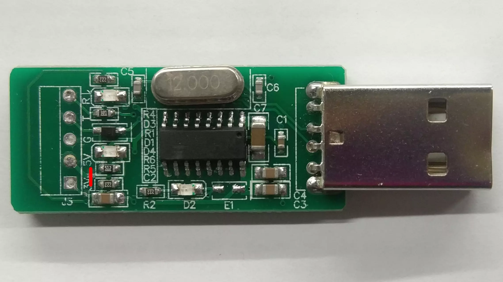
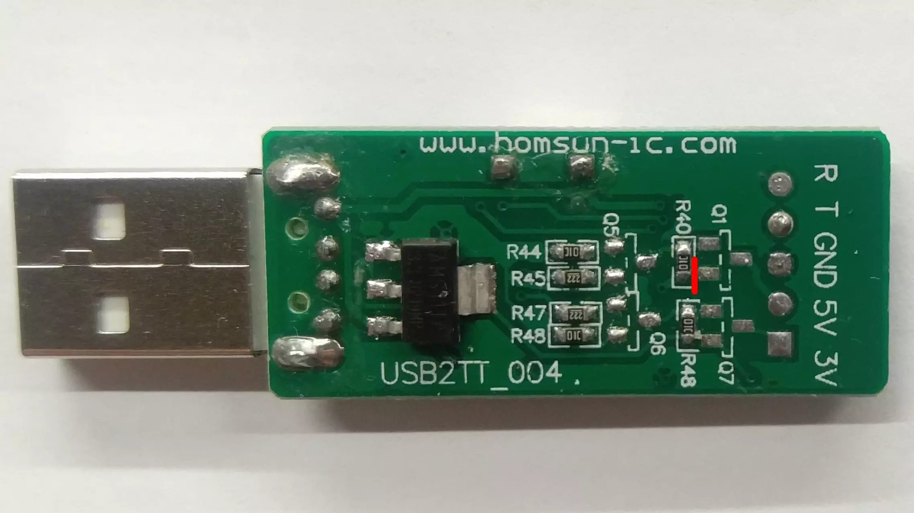
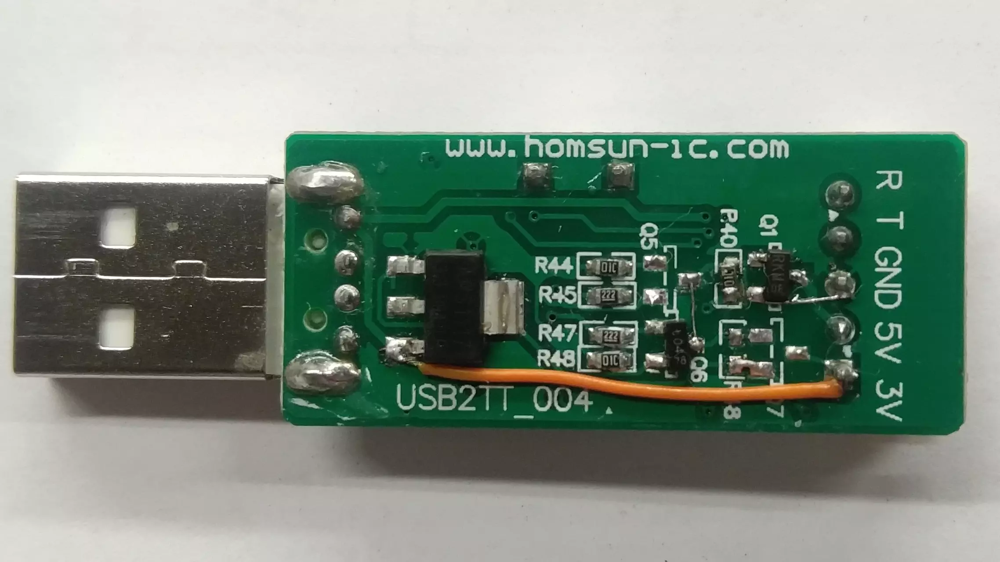

# OpenIPC Wiki
[Оглавление](../README.md)

Модернизация адаптера USB2TT_004 для управления питанием.
--------------------------------

Данная доработка позволит программно управлять питанием подключенного к переходнику устройства.

### Вариант 1: размыкание цепи по линии 5В.



_Необходимо перерезать дорожку, ведущую к выводу 5В_


_Припаиваем P-канальный MOSFET в корпусе sot-23, например, APM2307A и перемычку_

Общий провод камеры подключается к GND, а питание к выводу 5В.

### Вариант 2: размыкание цепи по общему проводу.

Этот метод сложнее, но позволяет запитывать камеры от 12В. При 5В у транзистора 2N7002 сопротивление в открытом состоянии велико, и камера не запустится. NPN транзистор подойдёт любой.


_Перерезаем дорожки, ведущию к выводам 3.3В и 5В_



_Перерезать дорожку между резистором R40 и транзистором Q1_



_Впаиваем N-канальный MOSFET на место Q1 и биполярный NPN-типа на место Q6.
Припаиваем одну перемычку от общего провода к истоку Q1 и вторую от коллектора Q6 к затвору Q1_

Общий провод камеры подключается к 5В. Питание берётся от внешнего источника, либо от вывода 3.3В, соединённого перемычкой с 5В usb-порта.

### Работа с адаптером под ОС Linux.

Установите minicom и выдайте пользователю права:

```
sudo apt install minicom
sudo usermod -a -G dialout USERNAME
```

Для перезагрузки устройства по питанию, нажмите `Ctrl+A H`. Для выхода без выключения питания `Ctrl+A Q`.

При подключении адаптера к usb-порту, питание отключено. Для его включения можно выполнить такую программму:

```
#include <sys/ioctl.h>
#include <fcntl.h>
int main()
{
  int fd;
  fd = open("/dev/ttyUSB0", O_RDWR | O_NOCTTY);  
  int DTR_flag;
  DTR_flag = TIOCM_DTR;
  ioctl(fd, TIOCMBIS, &DTR_flag);
  close(fd);
}
```

### Работа с адаптером под ОС Windows.

Установите программу терминал, позволяющую управлять отдельными выводами COM-порта, например, Br@y. Переключайте состояние питания нажатием на кнопку DTR.

#### Дополнение

База транзистора Q5 подключена к выводу RTS. Если припаять транзистор к нему, то можно управлять питанием ещё одного устройства или подавать цифровой сигнал 0/1, например, для отладки.

Линия Q5-Q1 подключена к выводу RTS и имеет подтяжку к 3.3В.
Линия Q6-Q7 подлюкчена к выводу DTS и имеет подтяжку к 5В.
