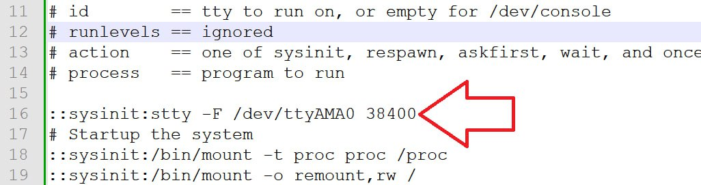

## Заметка об отличной от 115200 скорости uart для телеметрии
  
TipoMan столкнулся с проблемой: камера зависала при подаче на uart телеметрии на скорости, отличной от 115200. Решение: установка нужной скорости в `/etc/inittab`.

