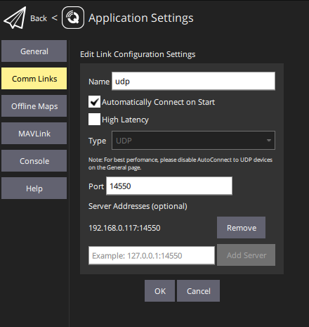

### Заметки по постройке видеолинка с двухсторонней телеметрией mavlink

Воздушная часть линка представляет из себя камеру [gk7205v200](https://sl.aliexpress.ru/p?key=e1sTwWg) с подключенным по USB wifi-адаптером на чипе rtl8812au, например ASUS USB AC-56 или [недорогого более слабого адаптера с ali](https://sl.aliexpress.ru/p?key=8CsTwDB).
Наземная часть - это [видеорегистратор](https://sl.aliexpress.ru/p?key=L1sTwWG) на базе чипа hisilicon hi3536dv100 либо ev100, к которому точно так же подключен по USB адаптер rtl8812au или rtl8814au. Для РФ дешевле и быстрее заказать камеру и регистратор у [@ser177](https://t.me/ser177).
Данная статья описывает нюансы создания подобного линка, и является дополнением к [этой статье](https://github.com/OpenIPC/wiki/blob/master/ru/fpv.md).


### Возможности

Данный линк способен передавать видео 
[(youtube)](https://youtu.be/ldfQ9CLE86I) с воздушной части форматом (разрешение@частота кадров) 1920x1080@30 или 1280x720@50 кодеками h264 либо h265 и телеметрию mavlink в обе стороны. Общая схема процессов для передачи видео выглядит так:


Передача видео на текущий момент возможна двумя способами. Классический - streamer `majestic` через udp порт 5600 засылает RTP/h264 или RTP/h265 поток  в [wfb-ng](https://github.com/svpcom/wfb-ng) или [OpenHD-wfb](https://github.com/OpenHD/wifibroadcast) для передачи на землю, где принимается ответной частью wfb и отправляется для воспроизведения на PC или планшет / смартфон по LAN или USB ethernet (tethering). Формат RTP свободно воспроизводится программами для GS, такими как [QGroundControl](https://github.com/mavlink/qgroundcontrol), [Mission Planner](https://ardupilot.org/planner/), [QOpenHD](https://openhdfpv.org/download/) или [FPV-VR](https://github.com/Consti10/FPV_VR_OS). Но его пока невозможно вывести в порт HDMI регистратора, поскольку он построен на специализированном чипе со своим SDK и обычными способами, например через GStreamer как обычно выводят видео в случае Raspberry Pi, этого не сделать.

<sub>QGroundControl имеет баг при воспроизведении h265, проявляющийся в зависании картинки при входе в меню. Это лечится до перезапуска программы выбором потока видео h264 и назад h265.</sub>

Andrey Bezborodov из команды OpenIPC предоставил на тесты скомпилированные примеры *vencoder* и *vdecoder*, вытащенные из Hisilicon SDK и в оригинальном виде расположенные [тут](https://github.com/OpenIPC/silicon_research). `venc` запускается на камере и формирует поток h264 с фрагментацией HAL вместо `majestic`, `vdec` на регистраторе выводит этот поток в HDMI. Все работает, но естественно нет OSD и подобный нестандартный поток невозможно воспроизвести сторонними плеерами. Это очень перспективный путь, поскольку имеет возможности к снижению задержки передачи видео. На текущий момент она составляет от 110 до 130 мсек. На "классической схеме" задержки составляют обычно от 150 до 230 мсек, [вот пример 133 мсек](https://github.com/OpenIPC/sandbox-fpv/raw/master/notes_files/Screenshot_1.png), в зависимости от разрешения и наземных условий воспроизведения.

Этот вопрос можно решить, "научив" `vdec` распознавать RTP/h26[4-5] с помощью библиотеки *libavformat/avformat.h* и по прежнему "стримить" на камере через `majestic`. Для этого нужна помощь программиста C++, если вы желаете помочь проекту с этим - [обращайтесь](https://t.me/+BMyMoolVOpkzNWUy).

Пример настройки *GStreamer* на Mission Planner для воспроизведения h265: `udpsrc port=5600 buffer-size=32768 ! application/x-rtp ! rtph265depay ! avdec_h265 ! videoconvert ! video/x-raw,format=BGRA ! appsink name=outsink`

Поддерживаются частоты от 5,2ghz до 5,85ghz, на atheros 2.3 - 2.4ghz.

### Как все запускается?

При загрузке linux стартует в числе сервисов из `init.d` сервис `S98datalink`, который и является отправной точкой. Он запускает скрипт `/usr/bin/wifibroadcast`, который определяет через lsusb какой адаптер подключен, загружает его драйвер, переключает в режим монитора, стартует `wfb` на передачу или прием, для наземки определяя подключения по usb, второму адаптеру wifi или просто начиная передачу видео на `udp_addr`. Данные о настройках он берет из `/etc/wfb.conf`. Также, при включенной телеметрии, он запускает скрипт `/usr/bin/telemetry`, который занимается тем же но для телеметрийных целей, беря настройки из `/etc/telemetry.conf`.

### Нюансы на камере

Для данной камеры существует два драйвера сенсора - "медленный" 1080p@30fps и "быстрый" 720p@50fps. Их можно переключать на ходу скриптами из примеров в [root](https://github.com/OpenIPC/sandbox-fpv/tree/master/gk7205v200/root), если залить на камеру ["быстрый" драйвер](gk7205v200/lib/sensors/libsns_imx307_2l_720p.so) под отдельным именем и исправить к нему путь в его конфиге [`imx307_i2c_2l_720p_50fps.ini`](gk7205v200/etc/sensors/imx307_i2c_2l_720p_50fps.ini#L15). Все файлы по данной камере находятся в каталоге `gk7205v200`. Если запускать камеру с "быстрым" драйвером в настройках majestic, то передача видео идет рывками, поэтому при старте камеры через `S95goke` прописываются настройки "медленного" драйвера, после чего уже можно включить "быстрый". На текущий момент [ведется работа](notes_cam_control.md) по управлению подобными настройками камеры через RC каналы в mavlink.

### Нюансы на регистраторе
Так как регистратор относительно камеры имеет шикарные 16мб памяти spi flash, из которых мы можем использовать около 5мб, то нам доступен [драйвер адаптеров RTL](https://github.com/OpenIPC/sandbox-fpv/tree/master/hi3536dv100/88XXau-ko) который поддерживает rtl8814au в дополнение к популярному rtl8812au. Для этого нужно залить его поверх штатного в `lib/modules/4.9.37/extra`, не забыв переименовать. 

Перекомпилирован [`mavlink-router`](https://github.com/OpenIPC/sandbox-fpv/tree/master/hi3536dv100/usr/bin), так как комплектный из прошивки собран на musl для воздушной части (где он не используется), а прошивка регистратора на glibc.

Также необходимо [отключить hisilicon watchdog](note_nvr_wdt.md).

###  Нюансы телеметрии
Текущая схема работы телеметрии выглядит так:


~~С применением mavlink-routerd на текущий момент возможна только односторонняя телеметрия по udp, поскольку он не умеет использовать разные rx/tx udp порты в рамках одного endpoint, как того требует wfb, будучи запущенным разными процессами `telemetry_rx` и `telemetry_tx`.~~
Будучи запущенным разными процессами, `telemetry_rx` и `telemetry_tx` используют разные порты для приема и передачи данных (кстати, это просто символьные ссылки на wfb_rx и wfb_tx, создаваемые скриптом [запуска телеметрии](hi3536dv100/usr/bin/telemetry)), и mavlink-router требует в [конфигурации](hi3536dv100/etc/mavlink.conf) два UDP-endpoint, которые должны быть сгуппированны:
```
[UdpEndpoint telemetry_tx]
Group=wfb
Mode = Normal
Address = 127.0.0.1
Port = 14550

[UdpEndpoint telemetry_rx]
Group=wfb
Mode = Server
Address = 127.0.0.1
Port = 14551
```

Остальные endpoint нужны для связи с наземной станцией, например tcp:5760 для приема подключений от Mission Planner. Для [приложенного конфига](hi3536dv100/etc/mavlink.conf) в настройках UDP-линка нужно указать адрес регистратора:



Остается переключить в /usr/bin/telemetry на использование mavlink-routerd и подключать uart регистратора более не нужно.

```
  /usr/bin/mavlink-routerd -c /etc/mavlink.conf &
  #/usr/sbin/mavfwd --master ${serial} --baudrate ${baud} --out 127.0.0.1:${port_tx} --in 127.0.0.1:${port_rx} &
```

Если же вы хотите использовать uart, то можете настроить endpoint на /dev/ttyAMA0 или переключиться на mavfwd.
В таком случае необходимо отключить ssh консоль от uart в /etc/inittab, закомментировав строчку:

```
#console::respawn:/sbin/getty -L  console 0 vt100 # GENERIC_SERIAL
```
Тогда телеметрия станет доступна на uart регистратора взамен или дополнительно к udp по сети, и ее можно будет использовать через usb-uart адаптер как serial port. На QGC для подключения к serial нужно отключить flow control в advanced, иначе загружает примерно половину параметров и выдает ошибку.

Я скомпилировал `mavfwd` для регистратора, поддерживающий скорости b230400, b500000, b921600 и b1500000, для поддержки более высокой скорости при работе с Mission Planner, проверил на b500000 при b115200 / b230400 на камере. Для регистратора его можно забрать [здесь](hi3536dv100/usr/sbin). Для камеры: [здесь](https://github.com/OpenIPC/sandbox-fpv/tree/master/gk7205v200/usr/sbin). [Исходник](https://github.com/OpenIPC/sandbox-fpv/tree/master/mavfwd). На камере удалось получить устойчивую связь с полетником на скорости 230400, выше stm32f4 не смог. Установка скорости полетника под ardupilot производится параметром `SERIALx_BAUD`, в моем случае: "230". Также не забывайте установить параметр `TELEM_DELAY` на 10 (секунд задержки перед началом выдачи телеметрии), иначе телеметрия может остановит загрузчик. К сожалению, если в полете камера перезапустится по какой то причине отдельно от полетника, то телеметрия ~~не даст ей загрузиться~~ может не дать ей загрузиться. ~~Необходимо доработать загрузчик u-boot, чтобы он не останавливал загрузку по любому символу.~~ ~~C [новым u-boot](gk7205v200_u-boot-7502v200-for-telemetry.md),~~ который прерывается только по Ctrl+C, и `bootdelay=0` этой проблемы по тестам нет. Этот U-boot уже включен во все FPV прошивки OpenIPC.

Также я [заложил в него](notes_cam_control.md) основы для наблюдения за выбранными каналами RC mavlink и передачи их значений при изменении в `/root/channels.sh` как параметров $1 (канал) и $2 (значение).

### Текущие проблемы
Если при загрузке камеры в majestic выбран "быстрый" драйвер 720p, то видео идёт рывками, поэтому в S95goke (автозапуск majestic) перед стартом идёт установка "обычного" драйвера 1080p. Если вы хотите использовать при загрузке камеры 720p@50 по умолчанию, вставьте после загрузки majestic вызов скрипта переключения в [`/etc/init.d/S95majestic`](gk7205v200/etc/init.d/S95majestic#L35) в функции `load_majestic`:
```
yaml-cli -s .isp.sensorConfig /etc/sensors/imx307_i2c_2l_1080p.ini
yaml-cli -s .video0.size 1920x1080
yaml-cli -s .video0.fps 30

start-stop-daemon -b -m -S -q -p "$PIDFILE" -x "/usr/bin/$DAEMON" \
	-- $DAEMON_ARGS
status=$?
if [ "$status" -eq 0 ]; then
	echo "OK"
else
	echo "FAIL"
fi

sleep .5
/root/720.sh

return "$status"
```

