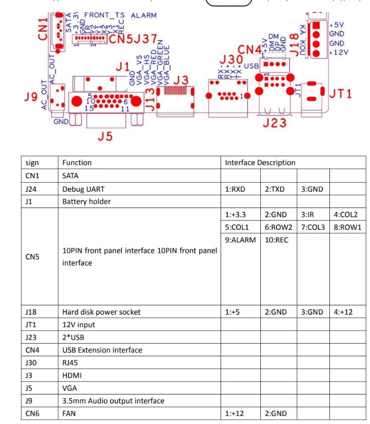

## Настройка кнопок со своим функционалом на регистраторе


Регистратор имеет на борту разъем для подключения фронт-панели с кнопками, ir-ресивером:



Разъем cn5 подписан с обратной стороны. С назначением +3.3в и GND понятно, IR задействовать не удалось, остальные пины ведут на GPIO процессора:
```
Y2    ^17
Y1    ^6
X2    ^13
Y3    ^8
X1    ^7
ALARM 10
REC   11
```

Символ `^` означает подтяжку резистором к +3.3, значит кнопкой эти пины надо замыкать на GND и ловить значение 0. Это реализовано в файле [`root/gpio_monitor.sh`](hi3536dv100/root/gpio_monitor.sh).
По замыканию пина Y1 на землю он производит рестарт сервиса [wfb](hi3536dv100/etc/init.d/S98wfb), который следом рестартует [телеметрию](hi3536dv100/usr/bin/telemetry), для более удобного подключения смартфона или планшета [по USB](usb-tethering.md), или после смены wifi-адаптера. Скрипт мониторинга ведет лог нажатий, который можно наблюдать по `tail -f /tmp/gpio.log`.
Примеры использования GPIO на выход можно посмотреть в [`testgpio.sh`](hi3536dv100/root/testgpio.sh), и можно подключить пин ALARM или REC к малмощному светодиоду с резистором для индикации процессов, например перезапуска wfb-ng как сделано в `gpio_monitor.sh`.

Для запуска монитора как системного демона создадим файл [`/etc/init.d/S99gpio_monitor`](hi3536dv100/etc/init.d/S99gpio_monitor) откуда и будем запускать наш [`root/gpio_monitor.sh`](hi3536dv100/root/gpio_monitor.sh):
```
#!/bin/sh
#
# Start gpio monitor
#

case "$1" in
  start)
    echo "Starting gpio_monitor daemon..."
    /root/gpio_monitor.sh &
    ;;
  stop)
    echo "Stopping gpio_monitor daemon..."
    kill -9 $(pidof {exe} ash /root/gpio_monitor.sh)
    ;;
    *)
    echo "Usage: $0 {start|stop}"
    exit 1
esac
```

Перезагружаемся без wifi адаптера и/или usb modem, активируем их уже после загрузки и убеждаемся, что по нажатию кнопки (хотя бы полсекунды подержите) сервисы запускаются.
Список запущенных процессов всегда можно посмотреть командой `ps axww`.
