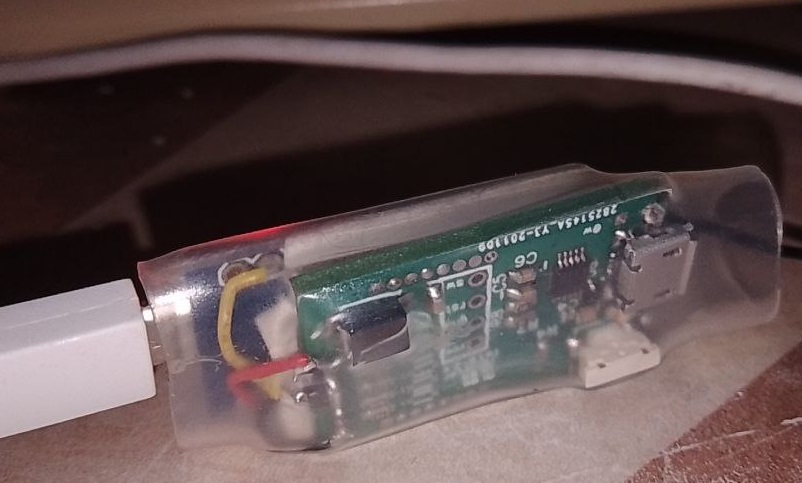
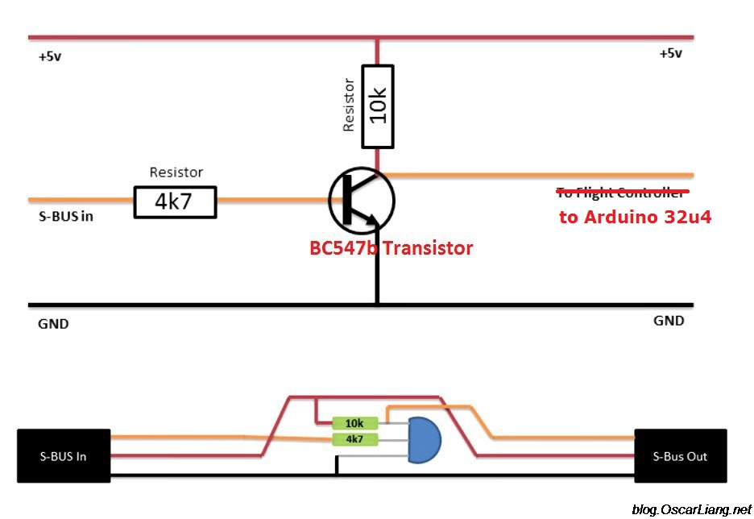

## USB-джойстик из обычной радиоапппаратуры с приемником SBUS на arduino pro micro

Сигнал SBUS от приемника подключать на rx, нужен неинвертированный. Если у вас "обычный" инвертированный, вам придется использовать транзистор для инверсии.

Я использую "цифровые" транзисторы dtc144eka или bcr533 и не ставлю резистор в базу. В качестве передатчика и приемника sbus я использую qczek, вы можете использовать любой приемник.
Его задача - передать значения каналов от аппаратуры до USB регистратора через [arduino](https://docs.arduino.cc/hardware/micro) на 32u4 ([ali](https://aliexpress.ru/item/1005003622414316.html)), которая определяется как hid-usb-joystick. При этом немного вырастает задержка за счет дополнительного
процесса по приему и передаче значений, но вы не привязаны к регистратору проводом, что удобно.

Скетч, доработанная под 10 каналов осей библиотека джойстика (остальные каналы заполняются кнопками), [тут](https://github.com/OpenIPC/sandbox-fpv/tree/master/sbus-to-usb-joystick).
