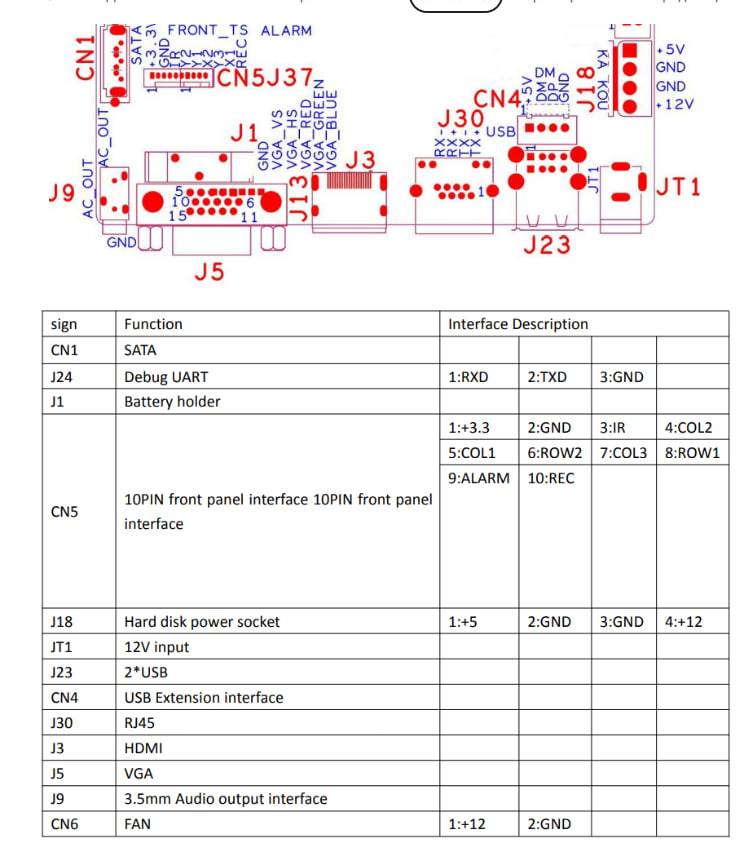

## Setting up buttons with their own functionality on the recorder


The recorder has a connector on board for connecting a front panel with buttons, an IR receiver:



The cn5 connector is signed on the back. The purpose of +3.3v and GND is clear, IR could not be used, the remaining pins lead to the processor GPIO:
```
Y2 ^17
Y1 ^6
X2 ^13
Y3 ^8
X1 ^7
ALARM 10
REC   11
```

The symbol `^` means a pull-up resistor to +3.3, which means these pins need to be shorted to GND with the button and the value 0 should be caught. This is implemented in the file [`root/gpio_monitor.sh`](hi3536dv100/root/gpio_monitor.sh).
When pin Y1 is shorted to ground, it restarts the [wfb](hi3536dv100/etc/init.d/S98wfb) service, which then restarts [telemetry](hi3536dv100/usr/bin/telemetry), for more convenient connection of a smartphone or tablet [via USB](usb-tethering.md), or after changing the wifi adapter. The monitoring script keeps a log of clicks, which can be observed by `tail -f /tmp/gpio.log`.
Examples of using GPIO output can be found in [`testgpio.sh`](hi3536dv100/root/testgpio.sh), and you can connect the ALARM or REC pin to a low-power LED with a resistor to indicate processes, such as restarting wfb-ng as done in `gpio_monitor.sh`.

To run the monitor as a system daemon, we will create the file [`/etc/init.d/S99gpio_monitor`](hi3536dv100/etc/init.d/S99gpio_monitor) from where we will run our [`root/gpio_monitor.sh`](hi3536dv100/root/gpio_monitor.sh):
```
#!/bin/sh
#
# Start gpio monitor
#

case "$1" in
  start)
    echo "Starting gpio_monitor daemon..."
    /root/gpio_monitor.sh &
    ;;
  stop)
    echo "Stopping gpio_monitor daemon..."
    kill -9 $(pidof {exe} ash /root/gpio_monitor.sh)
    ;;
    *)
    echo "Usage: $0 {start|stop}"
    exit 1
esac
```

We reboot without a wifi adapter and/or usb modem, activate them after booting and make sure that by pressing the button (hold it for at least half a second) the services start.
The list of running processes can always be viewed using the command `ps axww`.