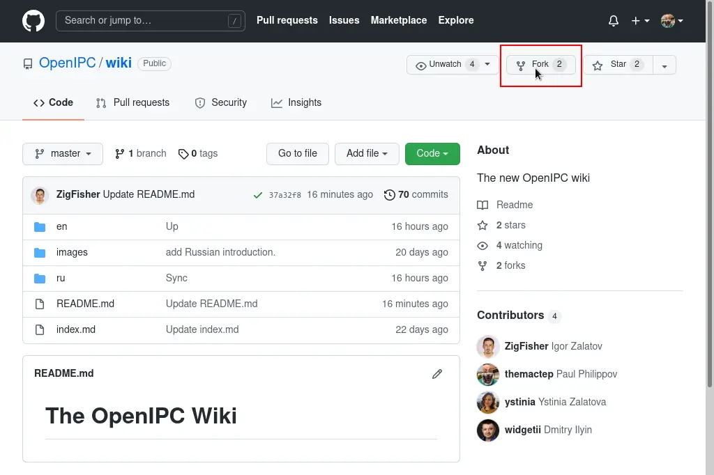
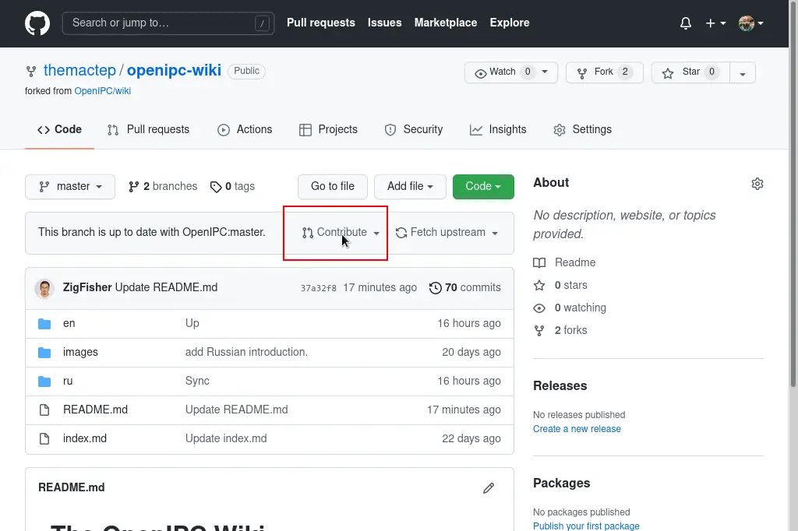
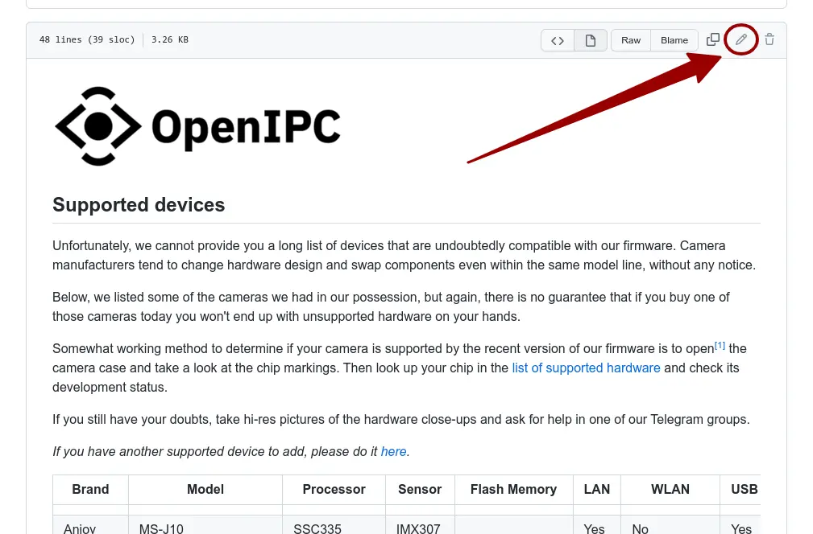

## OpenIPC Wiki
[Mục lục](../README.md)

> "Cải thiện thế giới, từng bản vá một."

Hướng dẫn
---

### Đây là một dự án mở, vì vậy bạn cũng có thể giúp đỡ.

Chúng tôi cố gắng thu thập, tổ chức và chia sẻ càng nhiều thông tin liên quan đến các khía cạnh khác nhau của dự án càng tốt. Nhưng đôi khi chúng tôi bỏ sót những điều có vẻ hiển nhiên đối với chúng tôi, những nhà phát triển, nhưng lại không quá rõ ràng đối với người dùng cuối, những người ít quen thuộc với các chi tiết kỹ thuật đằng sau hậu trường. Đó là lý do tại sao chúng tôi thiết lập wiki này và cho phép bất kỳ ai có tài khoản GitHub thực hiện các bổ sung và cải tiến cho cơ sở kiến thức.

### Cách đóng góp.

Đăng nhập vào tài khoản GitHub của bạn hoặc [tạo một tài khoản][gh-signup] nếu bạn chưa có. Nó hoàn toàn miễn phí.

Truy cập [kho lưu trữ wiki](https://github.com/openIPC/wiki/) và fork nó.

Thực hiện các thay đổi (sửa lỗi chính tả, thêm một bản ghi khác vào bảng hoặc viết một bài viết mới) và commit chúng vào fork kho lưu trữ của riêng bạn.

Từ kho lưu trữ của bạn, hãy tạo một pull request để chúng tôi có thể xem xét và kết hợp các thay đổi của bạn vào phiên bản wiki của chúng tôi.

### Sửa lỗi nhỏ, lỗi chính tả.

Việc xử lý các chỉnh sửa nhỏ khi sử dụng GitHub thậm chí còn dễ dàng hơn. Phát hiện lỗi chính tả? Có ý tưởng về cách diễn đạt tốt hơn? Nhận thấy một liên kết bị hỏng? Chỉ cần nhấn nút hình bút chì này và thực hiện các chỉnh sửa.

[gh-signup]: https://github.com/signup
