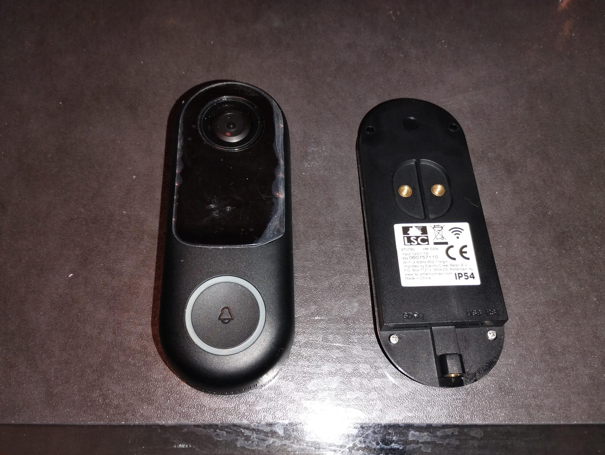
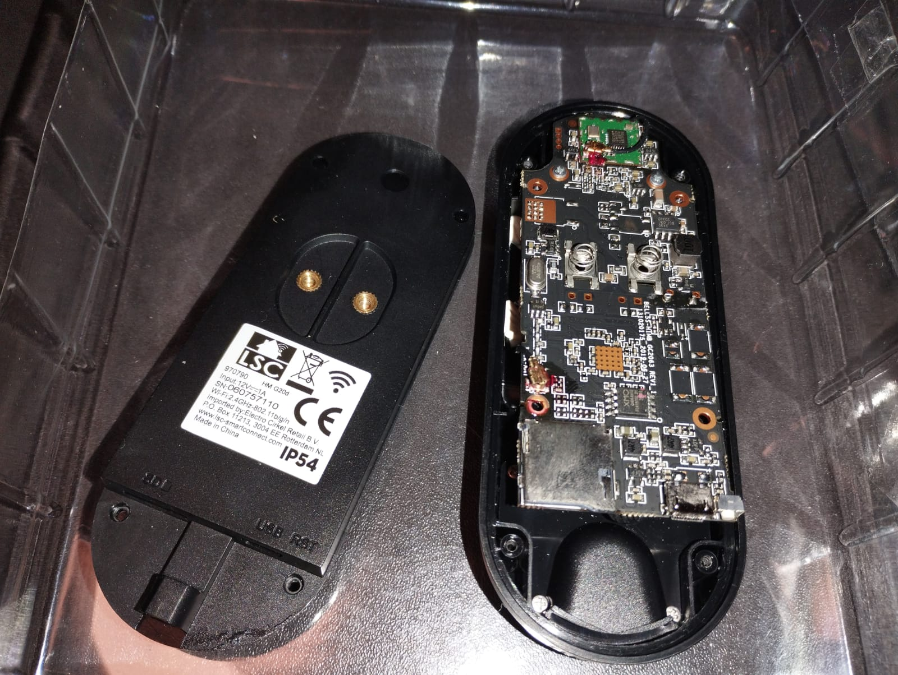
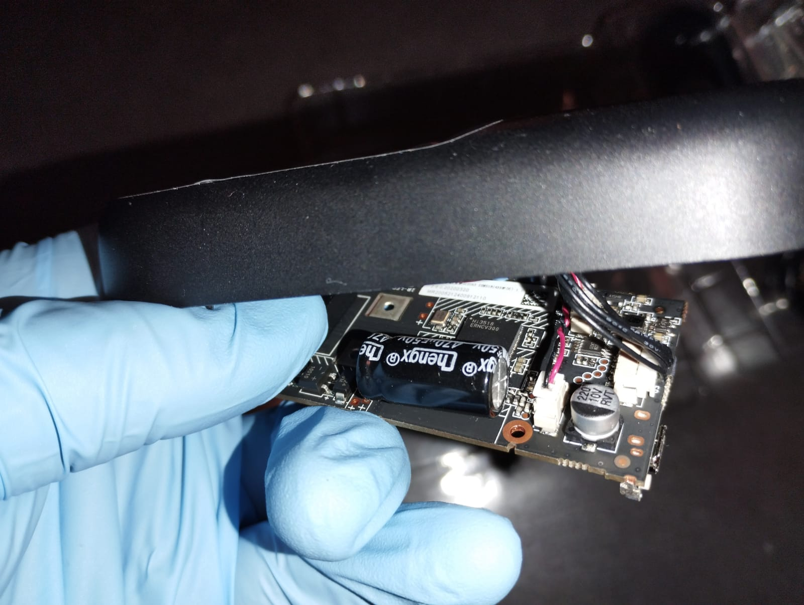
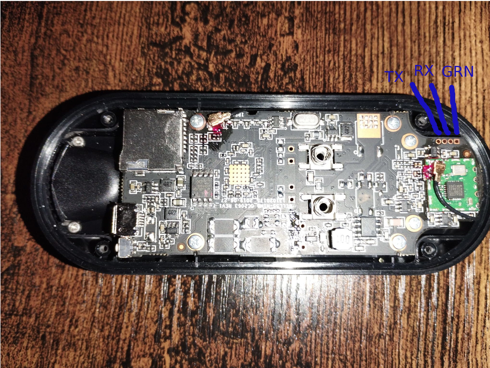

# LSC Smart Connect Chuông Cửa Có Hình (phiên bản 2021)







Thiết lập phần cứng và phần mềm rất giống với: [chacron ipcam](device-chacon-ipcam-ri01.md)

## Phần cứng

| Hệ thống | Mô tả                          |
|--------|--------------------------------------|
| SoC    | HI3518EV300                          |
| Cảm biến | JXF23                                |
| Flash  | 8Mb (XM25QH64A)                      |
| WiFi   | RTL8188FU                            |

### Trạng thái OpenIPC

| Thành phần     | Trạng thái                                                   |
|---------------|----------------------------------------------------------|
| WiFi          | [Hoạt động]                                                |
| Đèn LED đỏ/xanh | [Hoạt động](#đèn-led)                                         |
| Đèn LED IR        | Hoạt động                                                  |
| Cắt IR        | Hoạt động                                                  |


### Kết nối serial



### Wifi
* RTL8188FU

### Nor flash
[XM25QH64A](https://datasheet.lcsc.com/lcsc/XMC-XM25QH64AHIG_C328461.pdf)
- NOR Flash 8MB

### GPIO

| nr        | Mô tả   |
|-----------|---------------|
| 0x0f (15) | irCut_1       |
| 0x0c (12) | irCut_2       |
| 0x28 (40) | Đèn LED IR        |
| 0x33 (51) | Đèn LED đỏ       |
| 0x32 (50) | Đèn LED xanh      |
| 0x0d (13) | nguồn wlan    |
| 0x3B (59) | Nút chuông cửa  |

### Đầu ra [ipctool](https://github.com/OpenIPC/ipctool) (flash 8Mb):

```
---
chip:
  vendor: HiSilicon
  model: 3518EV300
  id: 022c40875e0038e9a770030ad8188d942567d818418e29e3
board:
  vendor: OpenIPC
  version: 2.3.12.28
  possible-IR-cut-GPIO: 12,15
ethernet:
  mac: ""
  u-mdio-phyaddr: 1
  phy-id: 0x00000000
  d-mdio-phyaddr: 0
rom:
- type: nor
  block: 64K
  partitions:
    - name: boot
      size: 0x40000
      sha1: e959aa47
    - name: env
      size: 0x10000
      sha1: 0d98dab2
      contains:
        - name: uboot-env
          offset: 0x0
    - name: kernel
      size: 0x200000
      sha1: 4fbf4879
    - name: rootfs
      size: 0x500000
      sha1: d90b9fb5
    - name: rootfs_data
      size: 0xb0000
      path: /overlay,jffs2,rw
  size: 8M
  addr-mode: 3-byte
ram:
  total: 64M
  media: 32M
firmware:
  kernel: "4.9.37 (Thu Dec 28 11:19:02 UTC 2023)"
  toolchain: buildroot-gcc-12.3.0
  sdk: "Hi3516EV200_MPP_V1.0.1.2 B030 Release (Oct 18 2019, 18:21:00)"
sensors:
- vendor: GalaxyCore
  model: GC2053
  control:
    bus: 0
    type: i2c
    addr: 0x6e
  data:
    type: MIPI
    input-data-type: DATA_TYPE_RAW_10BIT
    lane-id:
      - 0
      - 1
    image: 1920x1080
  clock: 27MHz
```

## Cài đặt OpenIPC

Đã flash bằng bộ lập trình CH341A

### Đèn LED

Camera có đèn LED hai màu (đỏ/xanh lam) được kết nối với GPIO 50 và 51.
Để điều khiển các đèn LED đó, bạn có thể sử dụng API /sys:
```
# làm cho GPIO có thể truy cập được
echo 50 > /sys/class/gpio/export
# và đặt hướng (chỉ cần thực hiện một lần)
echo out > /sys/class/gpio50/direction
echo out > /sys/class/gpio51/direction

# bật đèn LED xanh lam
echo 1 > /sys/class/gpio50/value
# tắt đèn LED xanh lam
echo 0 > /sys/class/gpio50/value

# bật đèn LED đỏ
echo 1 > /sys/class/gpio51/value
# tắt đèn LED đỏ
echo 0 > /sys/class/gpio51/value
```

### Hỗ trợ Home Assistant

Một MQTT Client tùy chỉnh đã được viết để xử lý sự kiện chuông cửa và gửi nó đến Home Assistant bằng MQTT.
Bạn có thể tìm thấy dự án tại đây: [lscdoorbellmqtt](https://github.com/berobloom/lscdoorbellmqtt)

## Nguồn:

* https://github.com/OpenIPC/wiki/blob/master/en/device-chacon-ipcam-ri01.md
* https://github.com/berobloom/lscdoorbellmqtt

