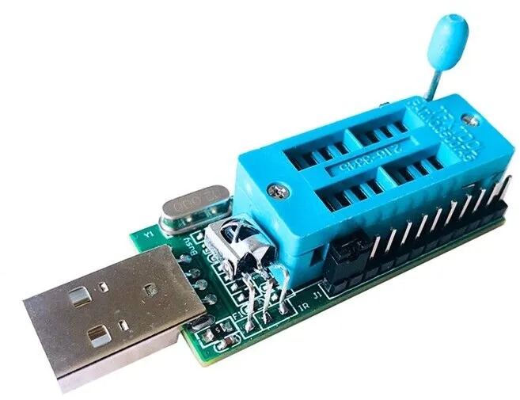

# OpenIPC Wiki
[Mục lục](../README.md)

Thiết bị để flash
----------------------

### Trạm hàn lại với các phụ kiện.

Trong khi một số kỹ thuật viên cứng rắn sẽ khăng khăng hoàn thành công việc
với một mỏ hàn kilowatt của ông nội, chúng tôi khuyên bạn nên mua
một [trạm hàn hiện đại với luồng khí nóng](https://www.aliexpress.com/premium/soldering-station-hot-air.html)
và kiểm soát nhiệt độ. Bạn không cần phải cầu kỳ, một trạm hàn cấp cơ bản
như YIHUA 882D, hoặc JCD 8898, hoặc YOUYUE 8586 
cũng làm được, và nó sẽ không quá tốn kém với mức giá khoảng 50-70 đô la, ít hơn 
hoặc nhiều hơn.

Sắm thêm một tấm silicon, một tuýp flux không cần làm sạch, một hộp thiếc hàn,
bấc đồng khử hàn, nhíp gốm, tăm bông không dệt và một chai
cồn isopropyl. Nhiều thứ trong số này đã có thể được bao gồm
trong gói sản phẩm với trạm hàn.

### Một bộ lập trình để flash chip nhớ.

Một lần nữa, một số người sẽ nói rằng bạn cần một bộ lập trình có thương hiệu trị giá hàng nghìn đô la nhưng trong thực tế, [bộ lập trình USB CH341A rẻ nhất](https://www.aliexpress.com/w/wholesale-ch341a-programmer.html)
hoạt động rất tốt, đặc biệt là sau khi bạn [khắc phục lỗi điện áp][1].

Hoặc bạn có thể mua một mô hình cải tiến, phiên bản 1.7 trở lên, nơi
vấn đề đó đã được khắc phục trong thiết kế.

Thêm [bộ chuyển đổi ổ cắm SOP8 208mil sang DIP8](https://www.aliexpress.com/w/wholesale-SOP8-208mil-to-DIP8-socket-adapter.html).

Ngoài ra, nên có một loạt [chip nhớ flash dự phòng](https://www.aliexpress.com/w/wholesale-25Q128-SOP8.html).

[1]: hardware-programmer-ch341a-voltage-fix.md
