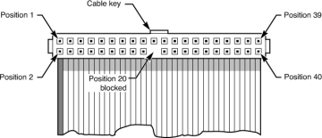
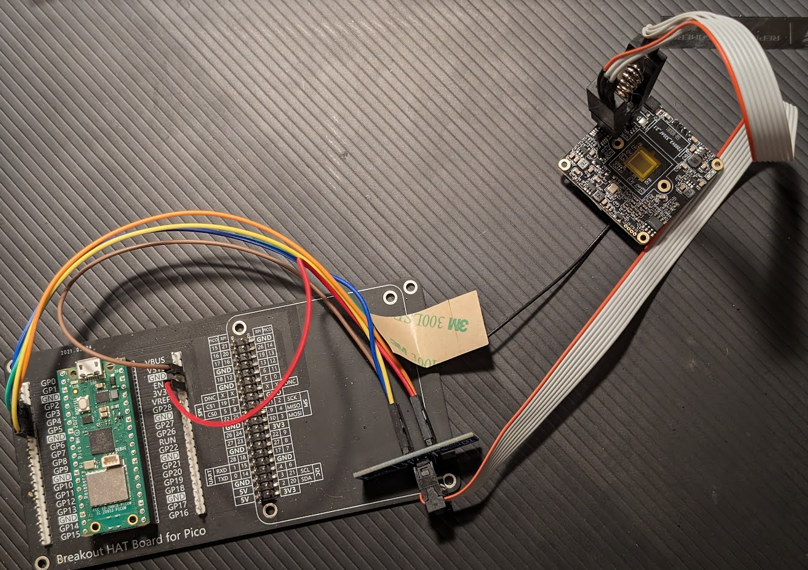

# OpenIPC Wiki
[Mục lục](../README.md)

Giao tiếp Chip Flash
--------------------

Đây là một chủ đề nâng cao liên quan đến việc xác định, đọc, ghi, xác minh và
xóa chip flash bằng cách giao tiếp trực tiếp với chip flash bằng bộ lập trình.
Đây không phải là phương pháp ưa thích để flash firmware, nhưng nó chắc chắn có thể hữu ích
khi các phương pháp khác thất bại.

Nếu bạn mới bắt đầu, có lẽ bạn đang ở sai chỗ: hãy xem
[Cài đặt](installation.md) và [Ví dụ về Burn](burn-example.md) để có điểm bắt đầu tốt hơn.


Chip SOIC8
--------------------
SOIC8 là một gói phổ biến cho chip flash. Nó là một gói nhỏ với 8 chân, và
các chân cách nhau 1,27mm. Các chân được đánh số ngược chiều kim đồng hồ bắt đầu
từ góc trên cùng bên trái với dấu chấm. Chân trên cùng bên trái là chân 1, chân trên cùng bên phải là chân 2,

Như đã đề cập trong [Trợ giúp: U-Boot](help-uboot.md), chip flash SOIC8 đôi khi có thể bị lừa
để chuyển thẳng sang chế độ u-boot và sơ đồ sau được hiển thị:


Kẹp SOIC8
--------------------

Kẹp SOIC8 là một cách thuận tiện để giao tiếp với chip SOIC8. Chúng rẻ và phần nào dễ sử dụng.
Tuy nhiên, hãy nhớ rằng kẹp yêu cầu bộ lập trình hoạt động như giao diện giữa kẹp và máy tính của bạn.

Có thể gây nhầm lẫn khi nhìn vào cáp ruy băng của kẹp, bởi vì hai hàng chân - nó được ánh xạ như thế nào?
Nhìn vào hình ảnh sau của một cáp ruy băng, có một dây màu đỏ cho biết chân 1 và các chân được đánh số
so với rãnh khóa cáp. Đừng nhầm lẫn khi nghĩ rằng màu đỏ phải là điện áp, trong trường hợp này, nó phải
ánh xạ tới chân một của chip SOIC8 và bộ chuyển đổi chân-cáp. Bằng cách này, bạn có thể hình dung các chân của bộ chuyển đổi giống hệt
với thông số kỹ thuật của chip flash SOIC8.



Đây là một ví dụ về kẹp SOIC8 được nối dây với Raspberry Pi Pico:



**Cảnh báo:** Thường thì bo mạch camera có các chip kiểu SOIC8 khác ngoài chip flash,
và bạn cần chắc chắn xác định đúng chip trước khi bắt đầu công việc của mình.


Chọn bộ lập trình
--------------------


### CH341A
Có nhiều bộ lập trình có sẵn và tất cả chúng đều có ưu và nhược điểm riêng. Phổ biến nhất
bộ lập trình là bo mạch tận dụng CH341A, là một chipset rẻ và dễ sử dụng. Để biết thêm chi tiết về CH341A,
xem [Bộ lập trình phần cứng CH341A](hardware-programmer.md).


### Raspberry Pi Pico
Raspberry Pi Pico là một bo mạch vi điều khiển có cổng USB và một số chân GPIO. Nó cũng rẻ và dễ sử dụng,
và có thể bạn đã có một cái nằm xung quanh. Không thành vấn đề nếu đó là phiên bản không dây hay không, cả hai đều hoạt động như nhau.
Để sử dụng Pico làm bộ lập trình, bạn sẽ cần đưa pico vào chế độ bootloader bằng cách giữ nút BOOTSEL
trong khi cắm nó vào máy tính của bạn. Pico sẽ hiển thị dưới dạng ổ USB và bạn có thể kéo và thả tệp uf2 vào ổ.
Hiện tại, thư viện pico-serprog tốt nhất để sử dụng là một nhánh của [pico-serprog](https://github.com/opensensor/pico-serprog)
đã khắc phục một số vấn đề gặp phải với bản gốc.

Có nhiều hướng dẫn hơn trên Github pico-serprog, tuy nhiên firmware pico-serprog sẽ cấp cho bạn
một cổng USB COM bổ sung ánh xạ tới các GPIO sau.

| Chân | Chức năng |
|-----|----------|
| 7   | CS       |
| 6   | MISO     |
| 5   | MOSI     |
| 4   | SCK      |

Vì hầu hết các chip flash SOIC8 là 3,3v, bạn sẽ cần kết nối với đường ray 3,3 V của PICO là chân 36,
và nhớ kết nối cả chân GND, có nhiều chân GND trên pico, chẳng hạn như chân 38.
* Lưu ý: nếu vì lý do nào đó chip của bạn cần 5V, bạn có thể sử dụng VSYS là chân 40 thay vì 3,3V, nhưng hãy đảm bảo bạn đọc thông số kỹ thuật của chip flash cụ thể của mình.


Chương trình Flashrom
--------------------
Flashrom là một chương trình có thể được sử dụng để đọc, ghi, xóa và xác minh chip flash. Nó có sẵn cho Linux, Windows và Mac.
Nói chung ngày nay, bạn cần biên dịch nó cho nền tảng mà bạn định sử dụng nó. Nó là một chương trình dòng lệnh, và
có nhiều tùy chọn có sẵn. Sau đây là một số ví dụ về cách sử dụng flashrom.

Hướng dẫn này tập trung vào việc sử dụng flashrom và hiện không giải thích việc xây dựng flashrom, nhưng bạn có thể tìm thấy hướng dẫn trên [trang web flashrom](https://flashrom.org/).

### Xác định cổng COM của bạn

Đối với windows, bạn có thể sử dụng trình quản lý thiết bị để xác định cổng COM mà bộ lập trình của bạn được kết nối.

Đối với Linux, bạn có thể sử dụng lệnh `dmesg` để xác định cổng COM mà bộ lập trình của bạn được kết nối.

### Đọc chip flash

Để đọc chip flash, đôi khi bạn cần biết loại chip flash mà bạn đang đọc.

Hãy thử chạy thăm dò đơn giản để xác minh bạn có kết nối với bộ lập trình hay không. pico-serprog là một serprog (hoặc bộ lập trình nối tiếp) và điều đó cần được chỉ định cho flashrom.
Trong ví dụ này, bộ lập trình được kết nối với COM23 và tốc độ baud là 2000000, được biết là hoạt động tốt và có thể đọc chip flash 16MB trong 2-3 phút.
```bash
./flashrom.exe -p serprog:dev=COM23:2000000 -V
```

Đây là một ví dụ về việc đọc chip flash. Trong ví dụ này, flashrom đã cho chúng tôi biết chúng tôi phải chọn giữa ba chip khác nhau và chúng tôi đã chọn "GD25B128B/GD25Q128B".
```bash
# ./flashrom.exe -p serprog:dev=COM23:2000000 -c "GD25B128B/GD25Q128B" -r gokev300-camera-12242023.bin -VV --force
flashrom 1.4.0-devel (git:v1.2-1386-g5106287e) trên Windows 10.0 (x86_64)
flashrom là phần mềm miễn phí, hãy tải mã nguồn tại https://flashrom.org

Sử dụng clock_gettime cho vòng lặp trễ (clk_id: 1, độ phân giải: 100ns).
flashrom được xây dựng với GCC 13.2.0, little endian
Dòng lệnh (8 args): C:\msys64\home\matte\flashrom\flashrom.exe -p serprog:dev=COM23:2000000 -c GD25B128B/GD25Q128B -r gokev300-camera-12242023.bin -VV --force
Khởi tạo bộ lập trình serprog
Tốc độ baud là 2000000.
serprog: đã kết nối - đang cố gắng đồng bộ hóa
.
serprog: Đã đồng bộ hóa
serprog: Phiên bản giao diện ok.
serprog: Hỗ trợ bus: parallel=off, LPC=off, FWH=off, SPI=on
serprog: Độ dài ghi-n tối đa là 32
serprog: Độ dài đọc-n tối đa là 32
serprog: Tên bộ lập trình là "pico-serprog"
serprog: Kích thước bộ đệm nối tiếp là 64
Cảnh báo: Kiểm tra tự động khả dụng lệnh không thành công cho cmd 0x07 - sẽ không thực thi cmd
Cảnh báo: NAK để truy vấn kích thước bộ đệm hoạt động
serprog: kích thước bộ đệm hoạt động là 300
serprog: Cảnh báo: Bộ lập trình không hỗ trợ bật tắt trình điều khiển đầu ra của nó
Các giao thức sau được hỗ trợ: SPI.
Dò tìm GigaDevice GD25B128B/GD25Q128B, 16384 kB: compare_id: id1 0xc8, id2 0x4018
Đã thêm mục bố cục 00000000 - 00ffffff có tên flash hoàn chỉnh
Đã tìm thấy chip flash GigaDevice "GD25B128B/GD25Q128B" (16384 kB, SPI) trên serprog.
Thanh ghi trạng thái chip là 0x00.
Thanh ghi trạng thái chip: Tắt ghi thanh ghi trạng thái (SRWD, SRP, ...) không được đặt
Thanh ghi trạng thái chip: Bảo vệ khối 4 (BP4) không được đặt
Thanh ghi trạng thái chip: Bảo vệ khối 3 (BP3) không được đặt
Thanh ghi trạng thái chip: Bảo vệ khối 2 (BP2) không được đặt
Thanh ghi trạng thái chip: Bảo vệ khối 1 (BP1) không được đặt
Thanh ghi trạng thái chip: Bảo vệ khối 0 (BP0) không được đặt
Thanh ghi trạng thái chip: Chốt cho phép ghi (WEL) không được đặt
Thanh ghi trạng thái chip: Ghi đang tiến hành (WIP/BUSY) không được đặt
Chip này có thể chứa bộ nhớ lập trình một lần. flashrom không thể đọc
và có thể không bao giờ có thể ghi vào nó, do đó nó có thể không thể hoàn toàn
nhân bản nội dung của chip này (xem trang man để biết chi tiết).
===
Phần flash này có trạng thái CHƯA THỬ NGHIỆM cho các hoạt động: WP
Trạng thái thử nghiệm của chip này có thể đã được cập nhật trong bản phát triển mới nhất
phiên bản của flashrom. Nếu bạn đang chạy phiên bản phát triển mới nhất,
vui lòng gửi email báo cáo đến flashrom@flashrom.org nếu bất kỳ hoạt động nào ở trên
hoạt động chính xác cho bạn với chip flash này. Vui lòng bao gồm tệp nhật ký flashrom
cho tất cả các hoạt động bạn đã thử nghiệm (xem trang man để biết chi tiết) và đề cập
bo mạch chủ hoặc bộ lập trình nào bạn đã thử nghiệm trong dòng chủ đề.
Cảm ơn bạn đã giúp đỡ!
serprog_delay đã được sử dụng, nhưng bộ lập trình không hỗ trợ độ trễ nguyên bản - đang mô phỏng
Bảo vệ khối bị vô hiệu hóa.
Đọc flash... read_flash: vùng (00000000..0xffffff) có thể đọc được, đang đọc phạm vi (00000000..0xffffff).
hoàn thành.
```

### Ghi chip flash

Ghi chip flash khá giống với đọc nó. Bạn cần chỉ định cổng COM, tốc độ baud và có thể là loại chip.
Đơn giản chỉ cần thay đổi các đối số của bạn thành flashrom để bao gồm tùy chọn -w và tệp mà bạn muốn ghi vào chip flash.

```bash
./flashrom.exe -p serprog:dev=COM23:2000000 -c "GD25B128B/GD25Q128B" -w openipc-hi3516ev300-ultimate-16mb.bin -VV --force
```

Trong quá trình ghi, flashrom sẽ đọc toàn bộ chip trước, sau đó xóa và ghi chip, rồi đọc lại để xác minh.
Luôn đảm bảo bạn sao lưu thành công và hoàn thành chu kỳ đọc trước khi thử ghi vào chip.


### Phần kết luận
Hướng dẫn này không có nghĩa là một hướng dẫn đầy đủ về cách sử dụng flashrom, mà là điểm khởi đầu cho những ai quan tâm đến việc sử dụng nó,
và cũng là nguồn cảm hứng cho những ai có raspberry pico nằm xung quanh và muốn sử dụng chúng cho một cái gì đó hữu ích.

Nếu bạn thích ví dụ pico-serprog, có lẽ bạn cũng sẽ thực sự thích [pico-uart-bridge](https://github.com/Noltari/pico-uart-bridge)
cung cấp nhiều cổng COM qua một kết nối USB duy nhất, cho mục đích kết nối các thiết bị đầu cuối UART.


