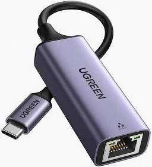
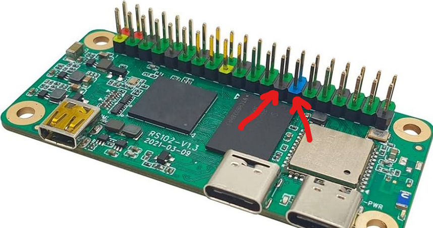

# OpenIPC Wiki
[Mục lục](../README.md)

Trạm mặt đất OpenIPC FPV
--------------------------

<p align="center">
  
</p>

Đây là [hướng dẫn bắt đầu](https://wiki.radxa.com/Zero/getting_started) hữu ích nếu bạn không quen thuộc với Radza.

### Cài đặt

* Thẻ SD
[Liên kết](https://github.com/OpenIPC/sbc-groundstations/releases) đến bản mới nhất

* EMMC
[Cách flash hình ảnh vào emmc trên bo mạch của bạn](https://github.com/OpenIPC/sbc-groundstations/blob/master/radxa_pi_zero_3w/flashing_to_the_onboard_memory.md)


### Wifi

Bạn có thể [thiết lập wifi trên bo mạch](https://github.com/OpenIPC/sbc-groundstations/blob/master/radxa_pi_zero_3w/headless_setup.md#setup-of-autoconnect-on-boot) để kết nối SSH. (quy tắc udev và networkmanager đã được cấu hình trong hình ảnh này, bạn chỉ cần thực hiện các lệnh nmcli)

Lưu ý: đối với RubyFPV, bạn sẽ cần Dongle mạng USB như bên dưới

 

hoặc truy cập bảng điều khiển nối tiếp, vui lòng kiểm tra [tại đây](https://wiki.radxa.com/Zero/dev/serial-console) về cách thực hiện.

### DVR với firmware FPV

Chức năng DVR; Nó yêu cầu cài đặt một nút nhấn vào tiêu đề gpio giữa các chân vật lý 25 và 27 như sau:




Để ghi DVR, hãy nhấn nút một lần. Luồng sẽ bắt đầu và DVR sẽ bắt đầu ghi. Khi hoàn tất, hãy nhấn nút một lần để dừng ghi và lưu tệp.

DVR được lưu vào thư mục Video trong thư mục chính của bạn. Có thể truy cập DVR tại /home/radxa/Videos hoặc thông qua máy chủ phương tiện. Kết nối trạm mặt đất của bạn với mạng gia đình và có thể truy cập nó qua trình duyệt web tại x.x.x.x:8080 -- thay thế x.x.x.x bằng địa chỉ ip cục bộ của trạm mặt đất của bạn.

Kết nối đầu dẫn dài của Led với +5v, đầu dẫn ngắn của Led qua điện trở 1k với GPIOAO_2 (Chân XANH LAM khác trên Radxa),

```bash
sudo gpioset gpiochip4 11=0      # bật đèn LED
sudo gpioset gpiochip4 11=1      # tắt đèn LED (thực ra nó rất 
                             # đơn giản sáng vì tôi đoán mức logic 0 không phải là 0 vôn)
```

Lắp dây mạch: +5v —>  +Led- —-> điện trở 1k —> chân 28 trên Radxa z3w (còn gọi là chân màu xanh lam khác)

<hr>

Lưu ý về ghi DVR trong hình ảnh này. Để giảm bớt căng thẳng cho bộ xử lý, chúng tôi ghi vào tệp ts thay vì mp4 hoặc mkv. Do đó, không có hiệu ứng "nhòe" nào được ghi lại, các khung hình không được chụp đơn giản là bị loại bỏ. Bạn có thể nhận thấy các bước nhảy trong bản ghi của mình ở những nơi không có thông tin khung hình.

### Liên kết đến một số công cụ hữu ích

* [Công cụ Windows](https://dl.radxa.com/zero/tools/windows/)
* [Khác, Tất cả hệ điều hành](https://dl.radxa.com/tools/)

### RubyFPV
xem [Phần cứng RubyFPV](https://rubyfpv.com/hardware.php)