# A step-by-step installation guide for an FPV setup

When considering installing OpenIPC for FPV use, we can basically break the process down into 6 key steps.

1. Flashing the Camera and groundstation with OpenIPC
2. Connecting additional hardware (wifi adapters and BECS)
3. Generating and installing the key pairing for WFB-NG
4. Editing wfb.conf to set the correct wifi channel
5. Configuring vdec.conf on the groundstation
6. Configuring the majestic.yaml file on the camera
7. Testing out the configuration
8. Video tutorial and next steps

Parts 1 and 2 covers the setup of the hardware - although there are many substeps involved, so you can consider this the "hard bit".  Although the software side of things (steps 3 - 6) has more steps, it's essentially editing some files and thus we can consider that the "easy bit"

### Hardware Requirements
For this step-by-step guide, I'm using specific hardware, and although the procedure to flash cameras and groundstations are broadly the same, each one can be quite different in terms of the UART connection you can use, as well as the chip set and memory being different - so make sure you check this carefully for your devices.  On a basic level, you'll need a groundsation, a camera, 2 wifi adapters, up to 4 UBECS and an FTDI board.

As a reference for my camera, I ordered an SSC338 based board with a Sony IMX415 sensor.  

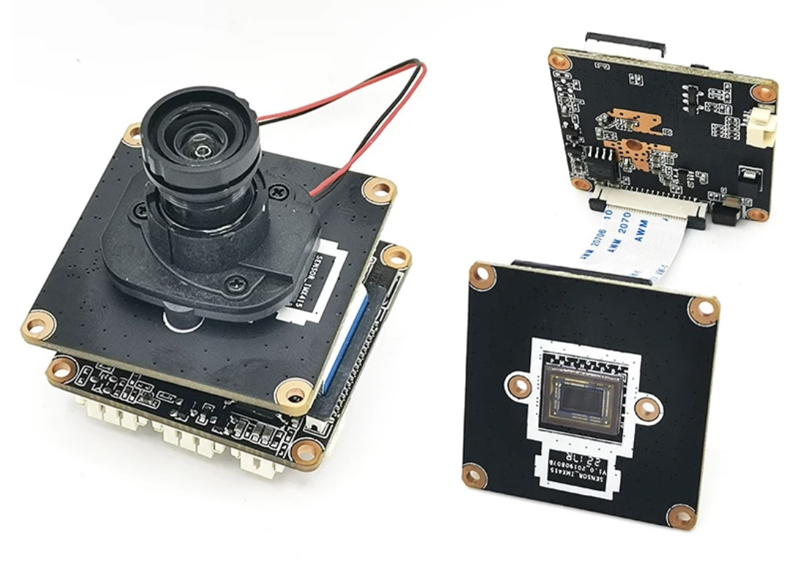

I ordered this with a 2.8mm lens (which seems a bit narrow for FPV, but it's the widest that was available) and with the 12V Lan cable.  This cable is very important for flashing the camera.  This camera was chosen as it could do a range of frame rates and resolutions, and also had a decent sensor. I bought this from AliExpress, the specific URL for the link is [here](https://www.aliexpress.com/item/1005004350557805.html)

For the groundstation I chose an Nvr board - which seems to be fairly popular in the OpenIPC community and is very low cost.   Again, the specific model I bought is [here](https://www.aliexpress.com/item/1005004023376532.html)

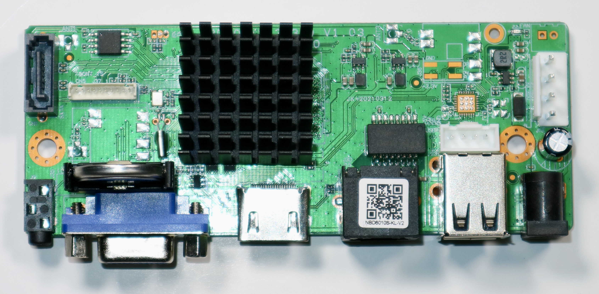

Both the camera and groundstaion need a wifi adapter in order to send your FPV signal over the air, so another low-cost solution was the RTL8812AU.  Specifically, I ordered 2 of [these](https://www.aliexpress.com/item/1005005638445796.html) 

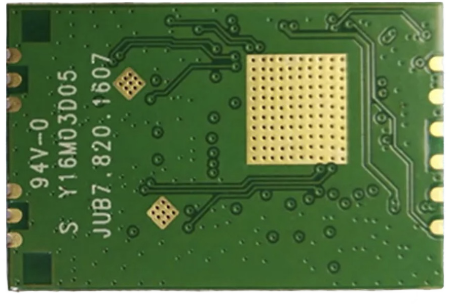

Because we will need to run the camera and Nvr at 12v, and the wifi adapters on 3.3v, I ordered some simple BECS that could be configured to put out either 3.3v, 12v, or anything in between.  Lots of options are available here.  I picked up 4 of [these](https://www.ebay.co.uk/itm/254153188189) from my local eBay site.

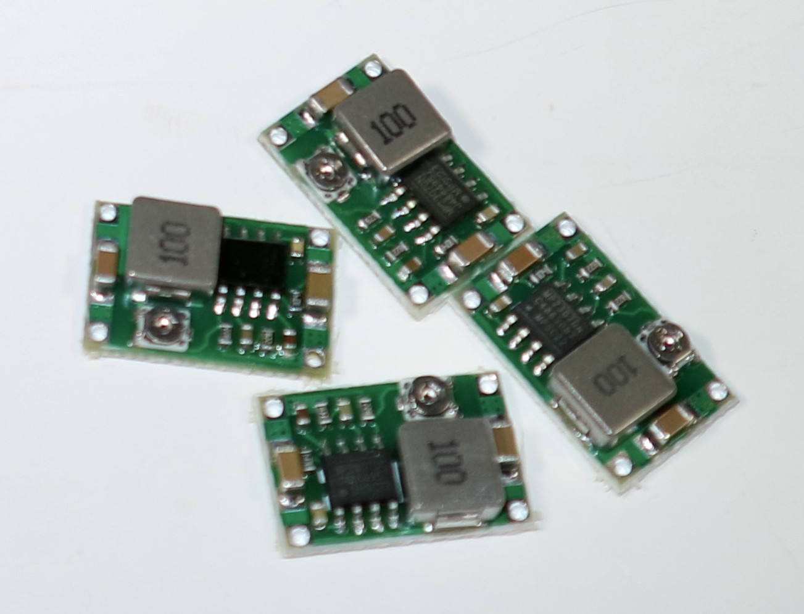

The FTDI adapter is essential for being able to get a console on the device in order to start the flashing process.  These are widely available on eBay quite cheaply [here's an example](https://www.ebay.co.uk/itm/203581591537?hash=item2f66688ff1) You should make sure the FTDI adapter you chose has a jumper that can move it between 5v and 3.3v though

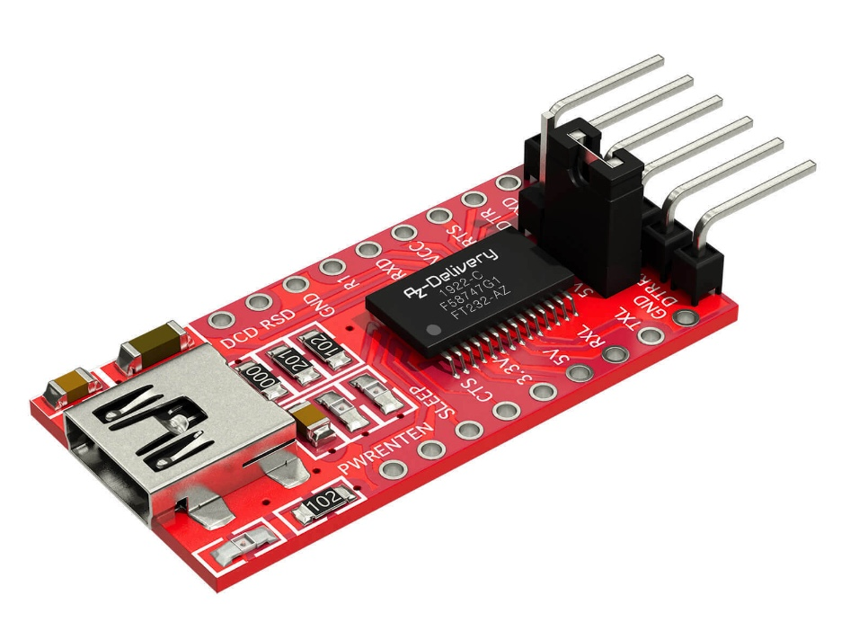

Aside from this, there are obviously a few general requirements - wire to connect things up, a soldering iron, your chosen connector for supplying power (most probably an XT60 - but the choice is yours here)

### Step 1: Flashing the Camera and groundstation with OpenIPC
We're going to break this down into a few substeps and separate out the camera and the groundstation.  So let's start with the the trickier part.

### Step 1.1: Flashing the Camera

First, let's examine the camera and all its various points of connection.

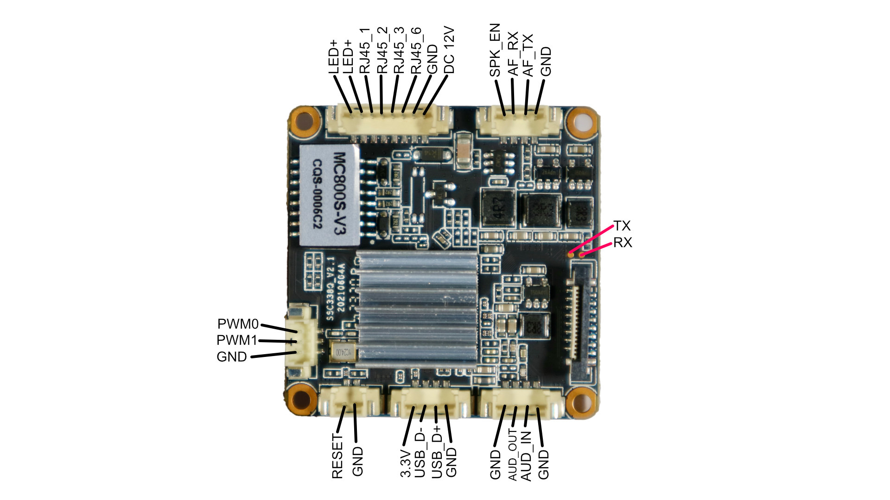

To flash OpenIPC we need to use the FTDI adapter to open up a console connection on the camera, and then break into the bootloader.  This sounds more complex than it is - all we have to do is solder up a few wires and press RETURN at the right point.

One thing that makes this more challenging on this particular camera is the location of the pins we need to connect to.  It is, of course, the 2 very small solder pads on the right hand side of the board (as pictured)  You can, very carefully, solder directly to these pads - but be very careful about not using too much heat as these pads can easily be lifted off!

An alternative to soldering, if you aren't confident about it, is to use some pogo pins in order to make a temporary connection whilst you do the flashing.  I designed a simple 3D printable tool in order to achieve this which can be downloaded from Thingiverse [here](https://www.thingiverse.com/thing:6358225)  You will also need some pogo pins to complete this tool.  I ordered [these](https://www.amazon.co.uk/dp/B08NT88C3G) from Amazon (only available in 100!)  Note: Solder the wires to the pogo pins before you push them into the 3D print.  If you solder them whilst in the print, the PLA will melt and it's a hassle getting the pins right again.

You need to push the pogo pins in just enough so you have to flex the tool a little to place it over the board, and when you let go the pins should come down and make good contact with the solder pads (note: this picture was taken whilst I was testing it for fit - at this stage, you should have soldered wires to the pogo pins already)

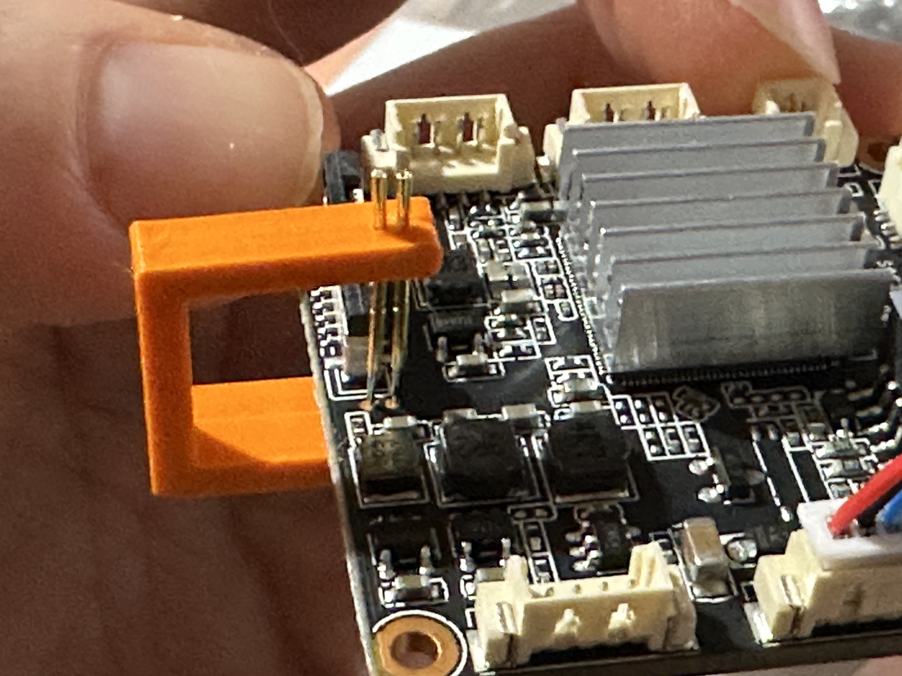

Ok, so whether you've soldered or used the tool, you now want to connect up to your FTDI adapter.  First, set the jumper on your FTDI adapter to 3.3v and then connect from the TX pad on the camera to the RX pin on the FTDI adapter, the RX pad on the camera to the TX pin on the FTDI adapter, and any ground connection on the camera to the ground pin on the FDTI adapter.

If you are now thinking "Hang about, which ground pin?".  Let me show you my slightly refined pin-out diagram of the camera which I call the "useful pins"

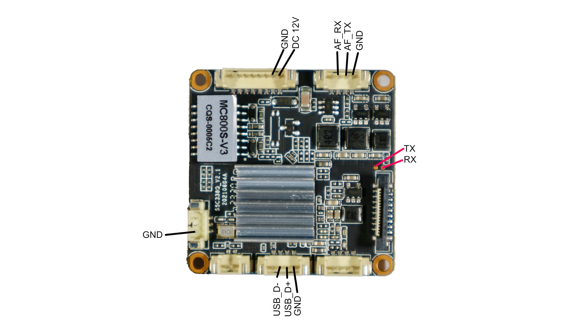

What we have here are the pins that actually have some relevance to us when wiring up this camera.  We've already connected the TX/RX, so if you have an old 3 pins connector from an FPV camera it may be just the right size to put into the socket containing the GND on the left of the pictured board.  This is what I did at least.  If you don't have any JST connectors like this - get some. Where possible I like to avoid soldering around these tiny components as much as possible.

You'll need to also connect the camera to your wired network via the ethernet port in the cable it should have come with (hence ordering the 12V Lan cable) and this is where you'd also need to power it - using a 12v barrel plug.

With everything connected, it should look something like this.  But just before we go ahead and plug in the 12v power need to have the software available to open up a serial console so we can break into the bootloader and actually run some commands.

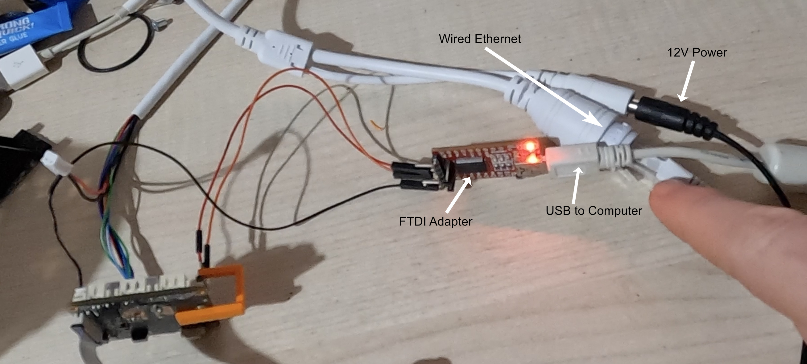

On a Mac (or Linux) this is pretty easy as we have all the commands built in.  I'm just going to cover MacOS and Windows in the step-by-step documentation.  Linux should be very similar to MacOS, but if you are running Linux as your primary OS, then I'd kind of expect you to know the commands already!

### Step 1.2 Setting up serial terminal emulation

**MacOS**

First up, plug in your FTDI adapter (but keep the camera powered off for now) this will allow the FDTI adapter to be identified by the system.  First off, we'll need to open up a terminal. You can find this in your Applications folder inside the Utilities sub directory.  Once you have this terminal open we need to find out which device out FTDI adapter is.  To do this type

```
$ ls -l /dev/tty.usbserial*
crw-rw-rw-  1 root  wheel    9,  10 20 Dec 10:31 /dev/tty.usbserial-A50285BI
```

As you can see, my device is called /dev/tty.usbserial-A50285BI.  But yours maybe different, we need the name of this device to use in the next command which actually opens up a serial emulator on that device and will allow us to communicate with the camera. Do do this, we can use the screen command.  On your command line, type 

`$ screen /dev/tty.usbserial-A50285BI 115200`

115200 is the baud rate we're using.  Ok, we should now have a blank screen with a cursor up the top waiting for something to appear.  You can skip over to section 1.3

**Windows**

Windows needs a bit of extra software installed as it has nothing in the base OS that can get the job done.  For both serial terminal emulation as well as ssh and scp (we'll use these latter two later on) I'd suggest using Putty which you can download [here](https://www.chiark.greenend.org.uk/~sgtatham/putty/latest.html)  Once you have this downloaded, installed and running - plug in the FTDI adapter, but keep the camera powered off for now.  First off, we need to find which COM port Windows has allocated the FTSI adapter, to check this you can go into Device Manager to find this out (just type device manager in the search bar) 

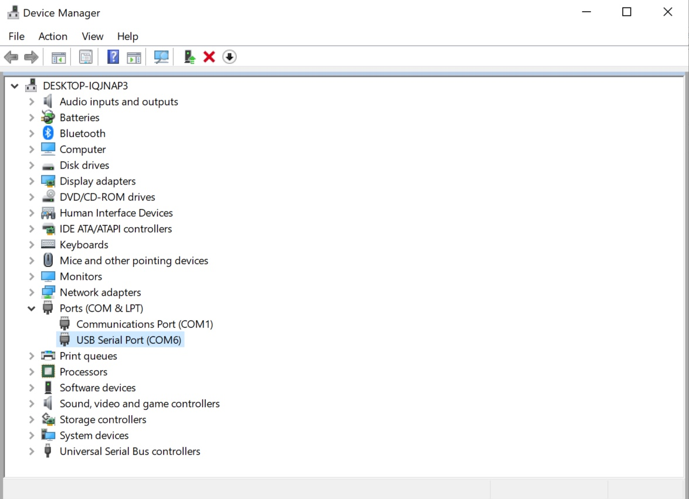

In my case, you can see that the FTDI adapter was configured as COM6.  Back in the Putty screen change the connection type to Serial, put the COM port you see for you FTDI adapter into the Serial Line text box, and set the Speed to 115200.  It's useful to save this so it can just be double clicked to open up this terminal in the future.  So if you type Serial OpenIPC (or whatever you want to call it) in the Saved Session text box and click on Save.  

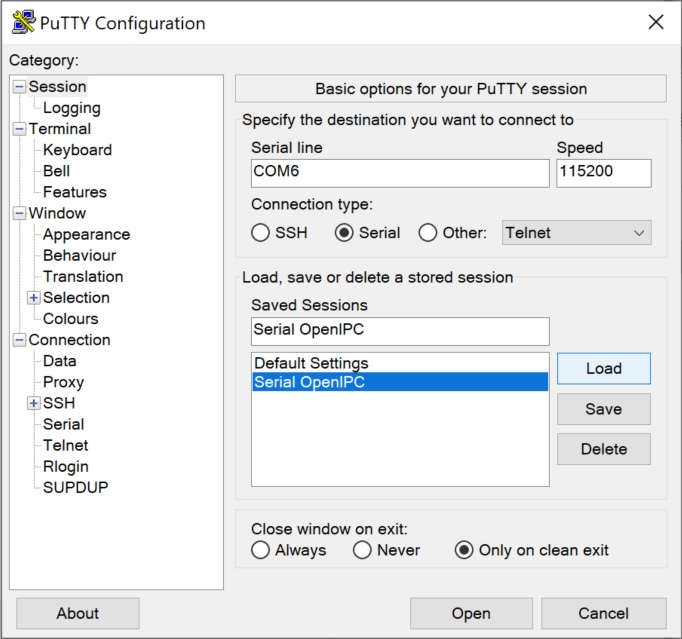

Now if we double click that saved session, it will open up a new screen ready to talk to the camera.

### Step 1.3 Setting up a tftp server

tftp stands for "Trivial file transfer protocol".  You've probably used the more full functioned ftp protocol in the past.  tftp has traditionally been used in the past to "net booting" remote workstations.  On bootup, all these clients would know how to do is ask and server on a specific ip address for a boot file, and it would download and run that.  There's no passwords involved or any other commands to run, it's just a case of "give me this file" hence it's trivial.  The normal worry for people when running any sort of server on their system is will it compromise the security of your system?  The answer is no, it shouldn't do.  You only need to receive connections on your local network, and besides - this protocol is very old and understood.  Any security exploits that may have been there have been found years ago and patched.

**MacOS**

MacOS has its own tftp server ready to run, but it's not started by default.  To start it up, type

`$ sudo launchctl load -F /System/Library/LaunchDaemons/tftp.plist
`

The sudo command means run as root, so you will get prompted here to type in your root password in order for the command to run successfully.  MacOS will use the /private/tftpboot directory to serve files from, so we'll be putting our bootimage in this directory later on.

**Windows**

As you might expect, Windows needs more software installed to run a tftp server.  There are a lot of options out there, I used from the company Solarwinds which you can get to [here](https://www.solarwinds.com/free-tools/free-tftp-server?) While it is a free download, the company asks for registration information.  What you choose to put in the registration information is, of course, entirely up to you - as it has no bearing on actually getting the download link to get the software.  Once you have the software and have installed and run it you should get a window like this.

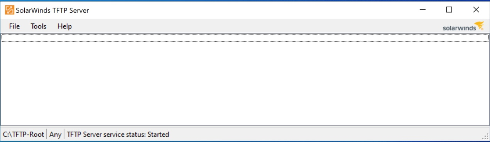

The server will use the C:\TFTP-Root directory to serve files from, so we'll be putting our bootimage in this directory later.

### Step 1.4 Getting the correct firmware image

The SOC for this particular camera is a SigmaStar SSC338Q.  Identifying exactly what SOC is on your camera is obviously very important as the firmware is specific to each SOC.  Happily, in the case of my camera (and if you look at the pinout diagram above) you can see it written on the board.  To find the firmware for your camera, from the main OpenIPC [webpage](https://openipc.org/) go to the Precompiled binary files link, which will take you to this [page](https://openipc.org/supported-hardware/featured) from here, we can see the SigmaStar SSC338Q on the featured page, but depending on the model of SOC you have, you can show pick the appropriate manufacturer in the links along the top of the page.  Whichever one you have, the next move is to click on Generate an installation guide.  In this case, it takes us to [this](https://openipc.org/cameras/vendors/sigmastar/socs/ssc338q) page

The picture shows this page **after** I've changed the options for the specific firmware version I need.


A few notes about these changes.  When you first come to this page, the MAC address field will be blank - so click on generate a valid MAC address to populate this.  For the camera IP address, we need to give it an unused address on the same subnet that our PC is running on.  In most cases, your home network will be on a 192.168.0.x or 192.168.1/x network.  If you are not sure about what your subnet is, then we need to also find the address of our PC for the tftpserver, so that's one way of finding out.

On MacOS I can simply use

```
$ ifconfig en0
en0: flags=8863<UP,BROADCAST,SMART,RUNNING,SIMPLEX,MULTICAST> mtu 1500
	options=50b<RXCSUM,TXCSUM,VLAN_HWTAGGING,AV,CHANNEL_IO>
	ether 3c:cd:36:5b:d4:80 
	inet6 fe80::c78:ab18:b66d:b615%en0 prefixlen 64 secured scopeid 0x4 
	inet 192.168.0.10 netmask 0xffffff00 broadcast 192.168.0.255
	nd6 options=201<PERFORMNUD,DAD>
	media: autoselect (1000baseT <full-duplex,flow-control,energy-efficient-ethernet>)
	status: active
```

On Windows you can use a similar command from the command prompt (type cmd in the search bar)

```
C:\>ipconfig

Windows IP Configuration


Ethernet adapter Ethernet0:

   Connection-specific DNS Suffix  . : localdomain
   Link-local IPv6 Address . . . . . : fe80::e34e:48bb:9e79:90b2%12
   IPv4 Address. . . . . . . . . . . : 192.168.0.10
   Subnet Mask . . . . . . . . . . . : 255.255.255.0
   Default Gateway . . . . . . . . . : 192.168.0.1

Ethernet adapter Bluetooth Network Connection:

   Media State . . . . . . . . . . . : Media disconnected
   Connection-specific DNS Suffix  . :
```

From this command, we can see that my PC's IP address is 192.168.0.10 and my subnet is 192.168.0.  So I can fill in my TFTP server IP address field, and for the Camera IP address field, I just need to pick one that's not already being used.  I used the 192.168.0.123 because it wasn't being used.  If you are not sure, you can try pinging this address to check.

```
$ ping 192.168.0.123
PING 192.168.0.123 (192.168.0.123): 56 data bytes
Request timeout for icmp_seq 0
Request timeout for icmp_seq 1
Request timeout for icmp_seq 2
```

These timeouts generally indicate that there's no host at that address, and it should be safe to use.

For the rest of the options, this camera has 16MB of flash RAM (we can see how to verify this later), I've changed the Firmware Version to FPV, and the Network interface and SD card slot are the default values.  So now, let's click on Generate Installation Guide.  Which will show you a guide like this.

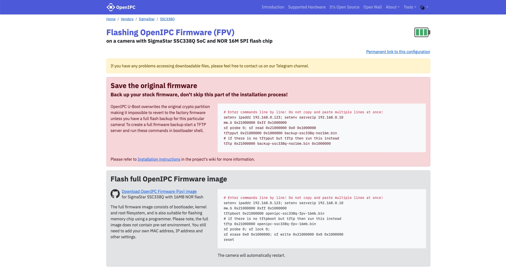

The idea of this installation guide is once you have the console on the camera open, you can simply cut and paste the commands into the console window to perform the backup and the firmware flash.  There's only one issue with this, and that's a few errors in the guide.  To be fair since I did my flash, it's improved, but there are still a few errors that need to be sorted out.

First off, the entire section of Save the original firmware will not work.  This is because there's neither a tftpput command or a tftp command on the cameras limited OS, so we have no way of moving the backup of the camera off of the camera itself.  It means that we have to ignore this entire section.  I'm told that the devs have this backup somewhere - just in case you need to restore it. If you really want to create a backup there is a [working method](help-uboot.md#saving-original-firmware-without-using-tftp), but it will take a couple of hours to transfer the data.  

Happily, the actual flashing should work, but before we start, we need to click on the *Download OpenIPC Firmware (Fpc) image* link.  In the case of this example, we'll download the openipc-ssc338q-fpv-16mb.bin file.  As per the tftp server guide, on MacOS you need to place this file in /private/tftpboot and on Windows, put it in the C:\TFTP-Root directory.  On MacOS the OS will give you a permission denied when attempting to copy this over as your own user, so you'll most likely need to use the sudo command again.

`$ sudo cp $HOME/Downloads/openipc-ssc338q-fpv-16mb.bin /private/tftpboot/`

Windows blocks all incoming connections by default with its Microsoft Defender Firewall, so we need to temporarily disable this.  If you type Windows Security into the search bar and run the Windows Security app, and then choose Firewall & Network Protection.  The next part is down to how you've configured Windows.  If you have configured your local network as private, then you can click on Private Network and disable the Microsoft Defender Firewall.  I've left my own Windows 10 (Virtual Machine) as defaults and so it doesn't have a private network configured and treats everything as a public network, so in my case I click Public Network and siable the firewall.

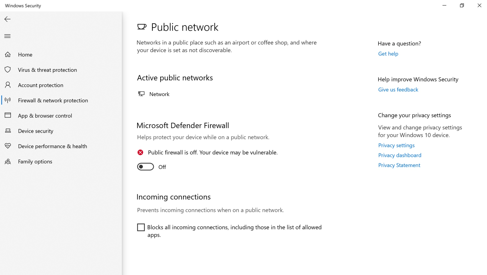

### Step 1.5 Opening a console and doing the flash!

It's finally time to get this camera flashed.  So if you still have your FTDI adapter connected to your PC and the camera, along with a serial console open you are good to go (if not go back to 1.2 and get the serial terminal open)  All you should need to do know is plug in the 12v power to the camera and you should see a lot of boot up messages appearing on the serial console.  The idea here is that you hit the return key lots of times as soon as the boot messages appear.  If you miss it and the camera continues to boot you'll eventually see a login prompt like this.

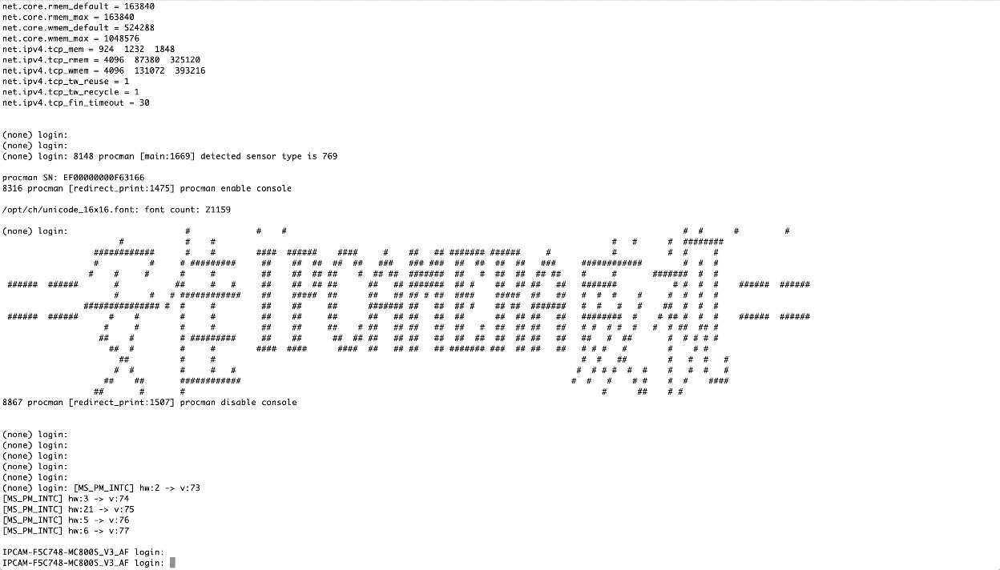

While it does mean you were too slow on your return key bashing, it does show that the console is working and the camera is booting up as normal.  Not to worry, just recycle power to the camera and try again.  If you were fast enough this time, you should see something like this.


Ok, now we're cooking!  But wait, what if you didn't get anything on the console and you are looking at a completely blank screen?  Well, the most likely place to get wrong here is getting your TX/RX connections crossed over on the FTDI board.  As long as the camera appears to boot up (there's an LED or two, and my one even made a little noise on boot up) then try swapping over your TX/RX leads on the FTDI board and see if that cures the problem.  For the rest of us, it's time to start feeding in the commands from the installation guide.

These are the lines the guide shows us to run one at a time.  I'll show you the response you are likely to get and which parts to not run.

```
# Enter commands line by line! Do not copy and paste multiple lines at once!
setenv ipaddr 192.168.0.123; setenv serverip 192.168.0.10
mw.b 0x21000000 0xff 0x1000000
tftpboot 0x21000000 openipc-ssc338q-fpv-16mb.bin
# if there is no tftpboot but tftp then run this instead
tftp 0x21000000 openipc-ssc338q-fpv-16mb.bin
sf probe 0; sf lock 0;
sf erase 0x0 0x1000000; sf write 0x21000000 0x0 0x1000000
reset
```

Let's run the first few lines.  On my camera I know that the tftpboot command does exist, so we can ignore the next command using tftp

```
Anjoy # setenv ipaddr 192.168.0.123; setenv serverip 192.168.0.10
Anjoy # mw.b 0x21000000 0xff 0x1000000
Anjoy # tftpboot 0x21000000 openipc-ssc338q-fpv-16mb.bin
Using sstar_emac device
TFTP from server 192.168.0.10; our IP address is 192.168.0.123
Filename 'openipc-ssc338q-fpv-16mb.bin'.
Load adress: 0x21000000
Loading: #################################################################
         #################################################################
         #################################################################
         #################################################################
         #################################################################
         #################################################################
         #################################################################
         #################################################################
         #################################################################
         #################################################################
         #################################################################
         #################################################################
         #################################################################
         #################################################################
         #################################################################
         #################################################################
         #######################################
         2.3 MiB/s
         
done
Bytes transferred = 16777216 (1000000 hex)
```

Once you run the tftpboot command, you should see rows of #'s appearing as the file is pulled from your server.  But what if it doesn't work?  On a Mac, the most common issue would be the file permissions - does the file have world read permissions so it can be read with the tftp daemon.  We can set open permission on the file by running

`$ sudo chmod 777 /private/tftpboot/openipc-ssc338q-fpv-16mb.bin`

On Windows, the SolarWinds TFTP server will log connections and any attempts to get files in its window, so you can examine this to help determine the issue.  If there's nothing in it at all, then the request isn't getting to the server.  Did you turn off that pesky firewall? (if the IP addresses in this image look weird, it's because I'm running Windows in a virtual machine which creates its own network connection that bridges to the hosts)

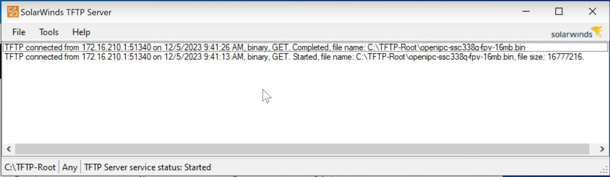

The next command, according to the instructions is to run

`sf probe 0; sf lock 0;`

This won't work, as the 'lock'  part of the command isn't implemented.  So what we do need to run here is simply the first part of the command.

```
Anjoy # sf probe 0
Flash is detected (0x0B05, 0xC8, 0x40, 0x18)
SF: Detected nor0 with total size 16Mib
```

If you weren't sure how large the flash on your camera is, then running sf probe 0 is a great way to check that.  If it's anything different to what you'd put into the Create Install Guide page, then you can simply return to that page, and put the correct information in to generate new instructions and a new install guide.  Reboot your camera and start again.

```
Anjoy # sf erase 0x0 0x1000000; sf write 0x21000000 0x0 0x1000000
_spi_flash_erase: addr 0x0, len 0x10000000 100%(cost 25076 ms)
SF: 16777216 bytes @ 0x0 Erased: OK
_spi_flash_write to 0x0, len 0x1000000 from 0x21000000 100%(cost 14084 ms)
SF: 16777216 bytes @ 0x0 Written: OK
```

This action takes a few minutes, but this is the actual exciting flashing part down.  If all went well all you need to do now is reboot the board by typing the last command.

`Anjoy # reset`

At this point, the camera will reboot several times.  You will see lots of messages on the console until it all stops, probably with the message

`No usb wifi card detected.  Check wifi stick connection, usb power or possible bad soldering.`

This is expected.  We get no login prompt here, as part of the OpenIPC install turns off being able to login over this serial connection (although it's simple to turn back on) However, a better way to login now is via SSH as we camera should have asked your DHCP server (usually your router) fo ran IP address.  If you look for lines on the console starting with uhdcpc, you should be able to see which IP address the camera has been allocated.  In my case, I could see

```
udhcpc: started, v1.36.1
udhcpc: broadcasting discover
udhcpc: broadcasting select for 192.168.0.50, server 192.168.0.1
udhcpc: lease of 192.168.0.50 obtained from 192.168.0.1, lease time 86400
```

This tells us that our ip address is 192.168.0.50, so let's now connect to it over the network.  On MacOS use

`$ ssh root@192.168.0.50`

On Windows, use Putty.  It's a useful idea to create a saved session so you can just double click on it to open the ssh window - as pictured here.

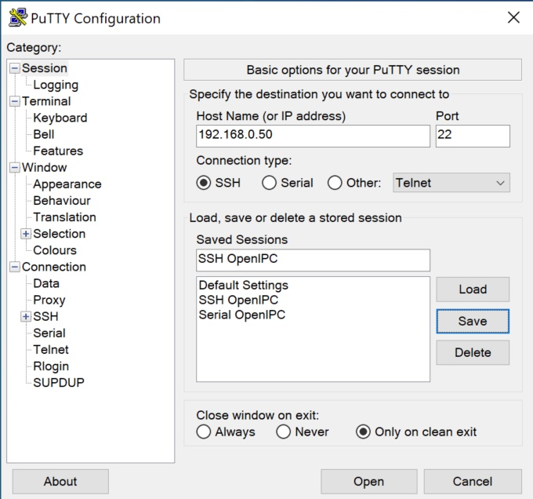

You'll be prompted for the root password when ssh'ing to the camera, it's 12345  After you enter the password and everything has gone right, you should be greeted with a screen like this

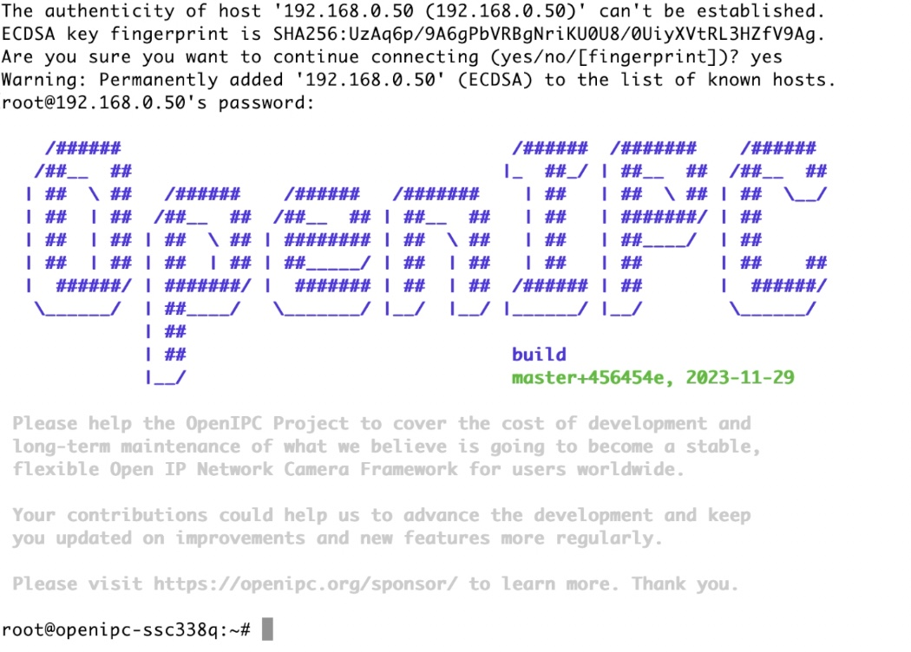

The first thing you need to do here is change the root password.  You can do it on the command like entering the command passwd  This will prompt for the current root password, and then ask you to type the new one in and confirm it.  Alternatively, you can use the web interface.  To do this go to a browser on your PC and type the IP address of the camera, so in the case of the address I've got for my camera 192.168.0.50:85.  You will be prompted for the user name (root) and the password (12345 if you haven't changed it)

If you haven't yet changed the password, then it will ask you to do so - just type your new password in the Save Changes


Once you change your password (or if it's already been changed via the command line, the web interface will change.  You'll notice the option to change your MAC address - you can go ahead and do this, but see the warning about your IP address likely changing.  Once again, you can look for this in the console boot messages.  At this point, the flashing of the OpenIPC software to the camera is complete - well done.  We will need to return to the camera for some more config changes, which we can do via an ssh session, but for now, you can unplug the camera and disconnect the FTDI adapter as we now have to repeat this process with the groundstation.

### Step 1.6 Flashing the groundstation

Now that you've gone through the act of flashing the camera, you should find the Nvr board much more straightforward in comparison.  First off, we've already got our tftp server running and are now familiar with using the serial emulation software, so all we really need to do is repeat the process of getting a console login in order to tftp the new firmware over and install it!

The connections for the console are much easier to work with on the Nvr board and are even labeled for us.

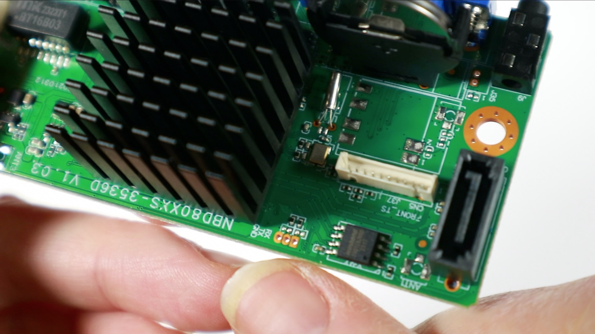

These connections are a lot more robust than the solder pads on the camera, so I didn't feel any sort of tool using pogo pins was needed.  They are still quite small, and it can be easy to short the pads together - but easily workable for soldering a few wires on.  This is precisely what we need to do.  Solder the GND/TX/RX from these connections so you can attach them to your FTDI board - once again remembering to cross over the wires so that TX on the board goes to RX on the FTDI and visa versa.

At this point, we are just about ready to go.  You'll need to plug the FTDI adapter in, attach the ethernet cable we used before, and get ready to attach the 12v power. If you want to,  you can also plug an HDMI connector into the Nvr board and connect it to a monitor.  You can't see console messages via the HDMI connection, but it will display some stuff on the screen. Once ready, you will need to open up the same serial terminal emulator we used to flash the camera (screen command on MacOS, Putty on Windows)  

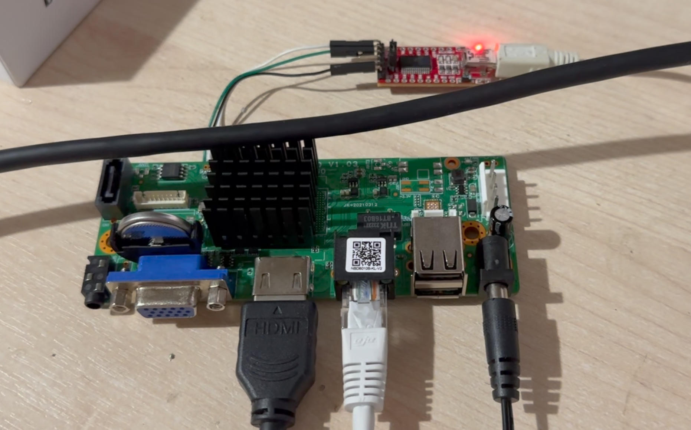

Once you plug the power in you need to start hitting CTRL-C on the console screen (not RETURN as we did for the camera - caught me out on my first try).  If you are too late, the last message you'll see on the console is "Starting Kernel", but if you catch it correctly, you should see something like 

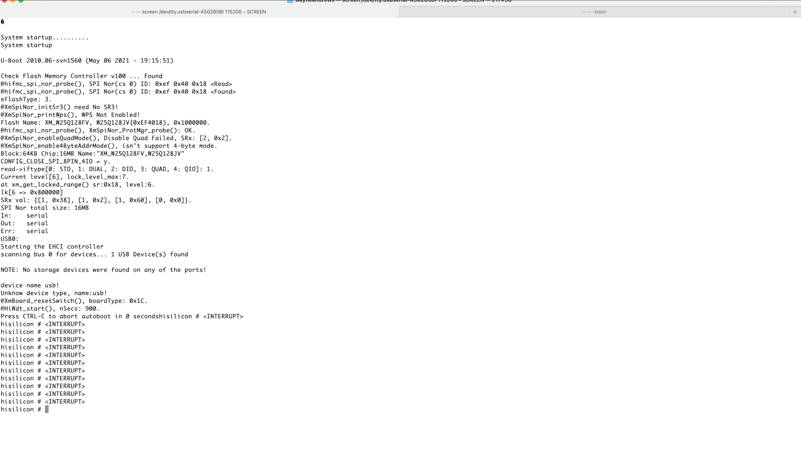

The Nvr flashing is documented in a separate document [here](https://github.com/OpenIPC/wiki/blob/master/en/fpv-nvr.md) While it doesn't go into great detail, all the commands work, and there's a single image to download as the Nvr board is well known piece of hardware with a single configuration.  Download the firmware file [here](https://openipc.org/cameras/vendors/hisilicon/socs/hi3536dv100/download_full_image?flash_size=16&flash_type=nor&fw_release=fpv) or grab it from the page I previously linked to and place this in your tftpserver directory (/private/tftpboot on MacOS and C:\TFTP-Root on Windows)

The instructions on the OpenIPC website are as follows. 

```
# Сhanging the ip address of the NVR board and the ip address of your TFTP server
setenv ipaddr 192.168.1.10; setenv serverip 192.168.1.254
mw.b 0x82000000 0xff 0x1000000
tftp 0x82000000 openipc-hi3536dv100-fpv-16mb.bin
sf probe 0; sf lock 0;
sf erase 0x0 0x1000000; sf write 0x82000000 0x0 0x1000000
reset
```

It mentions changing the IP addresses for the Nvr board and that of your tftp server, so I'll be using the same addresses as previously used for the camera.  Obviously subsitute these with your own ones.  What I'll show you next is the commands typed in, along with the responses you should expect from running all these commands.  

```
hisilicon # setenv ipaddr 192.168.0.123; setenv serverip 192.168.0.10
hisilicon # mw.b 0x82000000 0xff 0x1000000
hisilicon # tftp 0x82000000 openipc-hi3536dv100-fpv-16mb.bin
Hisilicon ETH net controller
MAC:   00-0B-3F-00-00-01
eth0 : phy status change : LINK=DOWN : DUPLEX=FULL : SPEED=100M
eth0 : phy status change : LINK=UP : DUPLEX = FULL : SPEED=100M
TFTP from server 192.168.0.10; our IP address is 192.168.0.123
Download Filename 'openipc-hi3536dv100-fpv-16mb.bin'.
Download to address: 0x82000000
Downloading: #################################################
done
Bytes transferred = 16777216 (100000 hex)
hisilicon # sf probe 0; sf lock 0;
16384 KiB hi_fmc at 0:0 is now current device
unlock all block
at XmSpiNor_disableWps() <Enter>.
@XmSpiNor_printWps(), WPS Not Enabled!
Current level[0], lock_level_max:7.
unlock all.
hisilicon # sf erase 0x0 0x1000000; sf write 0x82000000 0x0 0x1000000
Erasing at 0x10000 --   0% complete.stMaxRect.u32Width:1024, stMaxRect.u32Height:768.
DVR_HDMI_ProdCrgAllResetSet udelay(20000).
HDMI_INFO:DispFmt2HdmiTiming[419] ,Non CEA video timing:17
HDMI_INFO:Hdmi_PixelFreqSearch[163] ,u32Fmt17.
Erasing at 0x1000000 -- 100% complete.
Writing at 0x1000000 -- 100% complete.
hisilicon # reset
```

After the reset command, the Nvr board will reboot and give you a login prompt.  You should be able to login again with the user root and the password 12345.  Take note as well of the udhcpc lines in the console messages as you will be able to see what IP address the Nvr board now has.  In the case of the image below, you can see it's 192.168.0.51

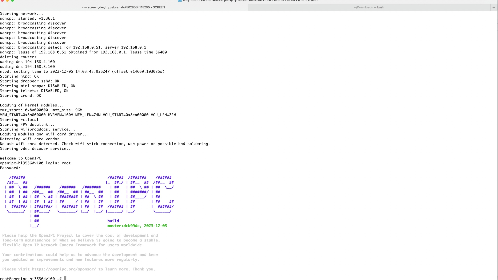

What you should do at this point is change the root password.  Type the `passwd` command and the system will prompt you to put in the current password, your new password, and then confirmation of your new password.  If you have connected to a monitor via an HDMI connection you should also see an exciting OpenIPC OSD display

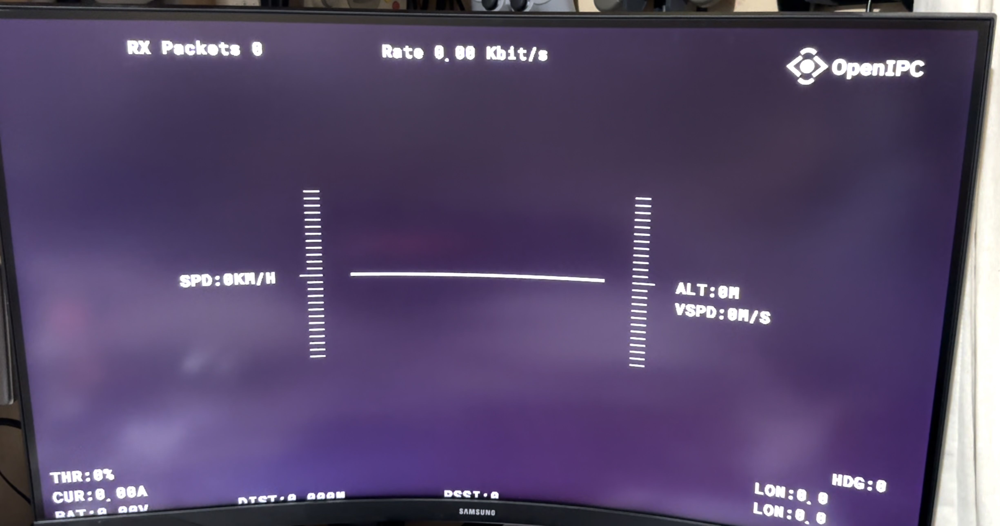

Ok, that's the Nvr flashed!!  At this point, you shouldn't need your tftp server any longer, so Windows users can turn their firewall back on.


### Step 2 Connecting additional hardware (wifi adapters and BECs)

Our camera and groundstation need a wifi connection in order to talk to each other, so in this step, we'll connect the little wifi modules up.  The important point about these modules is they are powered by 3.3v and not 5v.  This means we can't simply power the wifi module via the USB connector on the Nvr, and although there is a 3.3v pin on the camera, it apparently doesn't provide power, so we must use BECs to do this

### Step 2.1 Configuring the BECs

If you've already bought specific BECs that work on 12v and 3.3v, then there's nothing to do here - other than add the appropriate wire/connectors so you can add power and connect to the wifi board.  If you went ahead and purchased the BECs that I listed in the hardware requirements, then they require some configuration before you use them.

You'll need to solder in ground and power wires to both the inputs and output terminals.  Connect up a battery to the input and a multimeter to the outputs.  There is a small screw on the BEC that can be turned to configure the BEC to a specific voltage.  It's quite sensitive, but with a little patience, you can get the voltage pretty accurate.  I let these run for 20 minutes and then tried powering on the next day to see if there was any difference in the voltage, but they do hold pretty accurately.

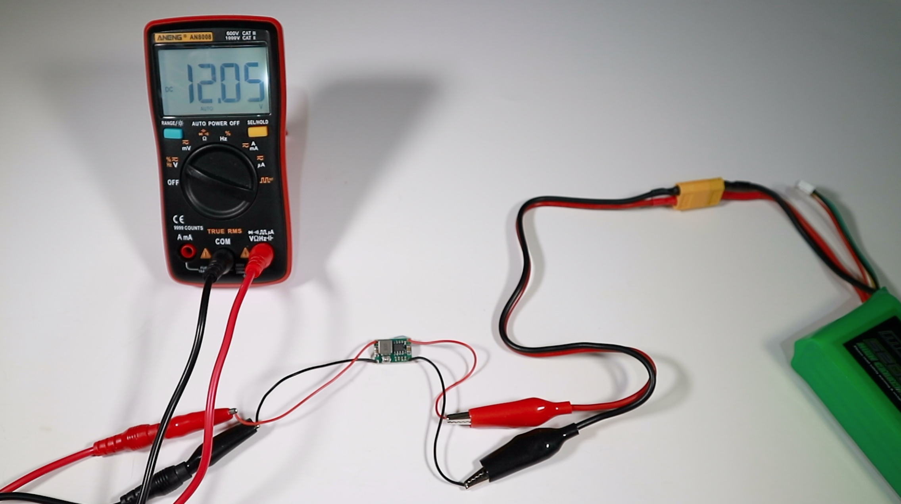

We'll need a total of 4 BECs, both the camera and groundstation will need one at 12v and another at  3.3v - so it's a good idea to configure all of these at this stage.

### Step 2.2 Wiring up the Wifi Modules

If we take another look at our wifi board picture, this time with some pinouts labeled up.  
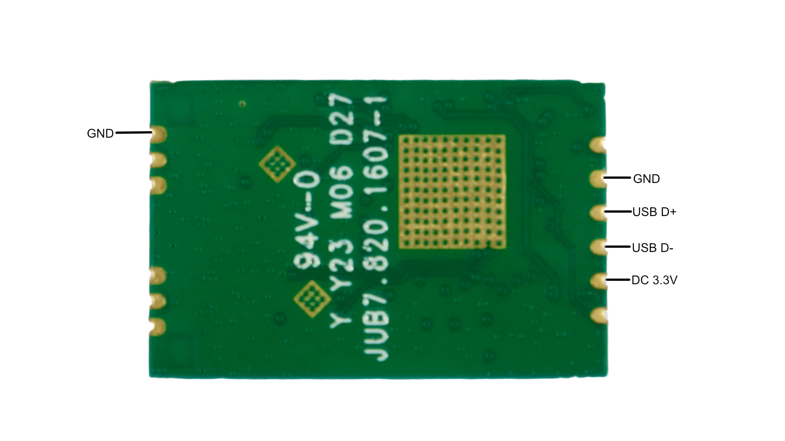
You will be able to see the wiring is fairly trivial and the soldering is pretty easy, we're attaching our 3.3v and GND from the BEC.  For wiring this to the camera, if you take a look at the camera pin-out in section 1.1 (specifically the one I call the "useful pins") you'll see at the bottom of the board we have a USB D+, USB D- and a GND.  These are the pins we have left over on the wifi board, so you'll need a jst connection to plug into the camera and then connect up USB D+ on the camera to USB D+ on the wifi board, USB D- on the camera to USB D- on the wifi board, and connect the 2 grounds together.

The following image shows my completed air side wired up with the wifi adapter (although as this is for testing on the bench, I'm using a temporary connection to an XT60 adapter)  You will see my 3.3v BEC connected to the wifi adapter, with the USB wiring connected to a JST connector ready to plug into the camera board.  Also, note that you must have antennas connected to the wifi board when you power it on.  Failure to do so can cause damage to the wifi board.  I've just found a few 5.8Ghz antennas with a UFL connector on.  In this picture, I've also added the 12V BEC to the power source which is connected to another jst connected ready to power the camera.

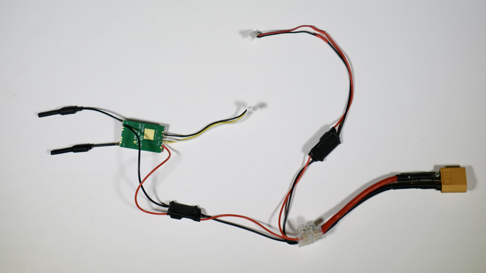

On the ground side, it's a very similar story in terms of wiring - but because the Nvr board has actual USB connectors I used part of an old USB cable I had lying around (amongst the 100's of USB cables I seem to accumulate) and simply snipped the end off to wire up.  This also has the advantage of being a cable that's also nicely shielded.  If you are unaware of the USB pinout, here's a picture to help.  Usually, you'll find that the cables are coloured in a sensible way, so red is 5v and black is ground, so it's just a case of using a multimeter to work out which colour is D+ and D-

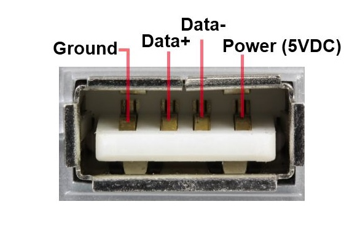

As mentioned, the wifi board uses 3.3v power, so we need to make sure we snip the 5v wire off and just connect the ground/D+/D- between the wifi board and the USB connector and power the wifi board separately via the 3.3v BEC.  This is illustrated in the following image.  unlike the previous example, I've not attached the 12V BEC for powering the Nvr board.  Because I was doing this on the bench, I carried on using the 12V mains adapter, although obviously, this will change when I do a "real" test.

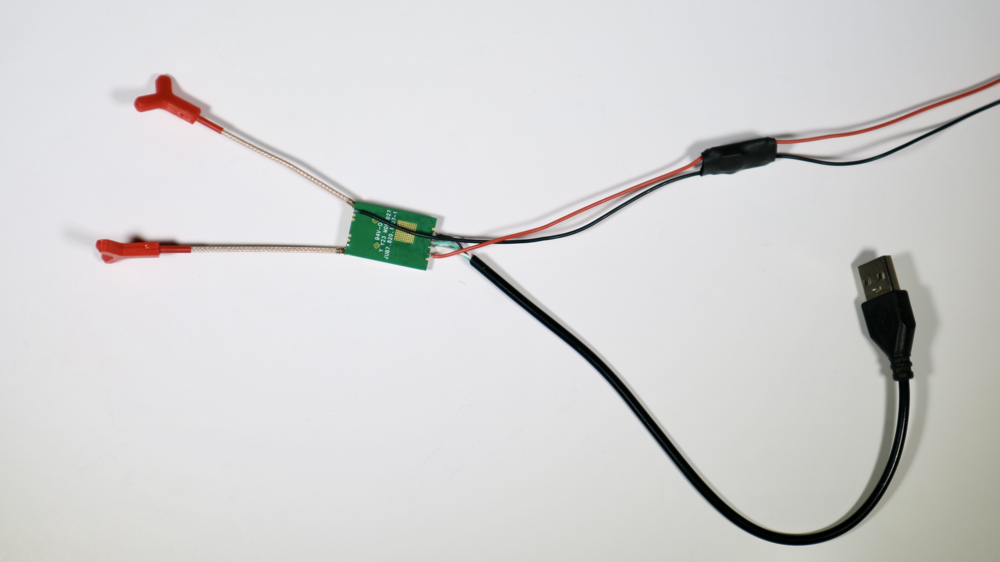

### Step 2.3 Checking the WiFi modules are recognised

It should go without saying that before powering on for the first time, check your connections, check them again, make sure you have the right power going to the right device, and ensure you have antennas on the wifi boards.  I would also suggest using a small desk fan to point a the wifi boards, as these are prone get get fairly hot without airflow.

Ok, so at this point you can power on.  Now if you've left the serial connection attached to either the camera or the Nvr board, you may notice messages about the board flying by.  But another simple way of checking if things are working is to ssh in and run a few commands (obviously you will need the physical ethernet cable attached for this).  Once you ssh in, type the following commands.

`root@openipc# wifibroadcast stop`

Depending on whether your card is recognised or not will show some different messages, so just ignore these and focus on the output from the next command.

`root@openipc# wifibroadcast start`

If you get output similar to 

```
Loading modules and wifi card driver...
Detecting wifi card vendor...
Detected: realtek
Awaiting interface wlan0 in system...
Preparing interface wlan...
drone key exist...
Starting Wifibroadcast service...
Done.
Using data frames
Listen on 5600 for wlan0
Loading MAVLink telemetry server...
Done.
Using data frames
Listen on 14550 for wlan0
```

Then the board has been detected and is working (this is the output from the air side, the ground side is very similar though).  In either case, if the board is not detected, the error is the same, so if you have output similar to.

```
Loading modules and wifi card driver...
Detecting wifi card vendor...
No usb wifi card detected.  Check wifi stick connection, usb power or possible bad soldering.
```

Then something is wrong.  The usual culprit is having D-/D+ crossed over, so if you are confident you have power to the wifi module, then switching over the wires would be the first thing to try.

### Step 3 Generating and installing the key pairing for WFB-NG

What is WFB-NG?  Well, WFB is wifibroadcast... you may remember that command from the previous step.  It was the project that really started off OpenSoure HD FPV.  WFB-NG is Wifibroadcast Next Generation - a new and improved version of wifibroadcast, then OpenIPC uses for FPV.  WFB-NG also uses encryption when sending/receiving data between the ground/air so it's necessary for us to generate some keys to use and then move them into the correct places for WFB-NG to work.

Default keys will be automatically installed after groundstation and camera was flashed, so video link will work without generating new key pair. Howewer defaut keys is not secure (it is ok to leave it for bench testing or if you dont care about encryption). If you want to setup individual true encryption follow next instruction.

Login to your groundstation via ssh and run the command

`root@openipc# wfb_keygen`

Which should give you the output

```
Drone keypair (drone sec + gs pub) saved to drone.key
GS keypair (gs sec + drone pub) saved to gs.key
```

What we need to do with these keys is move the drone.key to the /etc directory of the camera and the gs.key to the /etc directory of the groundstation.  As we are already on the groundstation, this is s simple case of typing in the command

`root@openipc# cp gs.key /etc`

(you won't get any response from this command unless you've made an error in typing it) The question is how we get the drone.key file over to the camera.  This is where the command called scp comes in.  If we leave the groundstation powered on, and go back to your PC to type the command

`scp root@192.168.0.51:/root/drone.key .`

I'm using 192.168.0.51 as an example here, don't forget to substitute this IP address with the one for your groundstation.  scp is a built in command for MacOS users.  on Windows, installing Putty will have also installed the scp command, so this is just a case of opening up a CMD window and typing the command. It will prompt you for the root password for the root user of the groundstation. In both cases, the dot (.) at the end of the command means the drone.key will copy to your current directory - just in case you are wondering where it's been stored.  Keep that window open, as we're going to copy it back from the PC to the camera.  But to do this, you'll want to power up your camera and connect this to your ethernet cable (there's no need to have the groundstation powered up for this part)

Once the camera is powered up (you can check this by connecting via ssh) back on your PC use the command

`scp ./drone.key root@192.168.0.50:/etc`

Again, the IP address used here is just an example - and you'll be prompted to enter the password for the root user of the camera in.  To double check the files are in the right place, you can ssh to both the camera and groundstation and run 

`root@openipc# ls -l /etc`

and look for the drone.key on the camera and gs.key on the groundstation

### Step 4 Editing wfb.conf to set the correct wifi channel

There's a bit more to the wifibroadcast configuration than just getting the keys correct.  There's a config file to edit on both the camera and the groundstation.  To do this it's necessary to use the text editor called vi.  This might be a bit new and strange for Windows users as it's not your typical editor and has a few commands for you to delete characters, insert, append things, and save the file.  There's a basic vi tutorial [here](https://www.guru99.com/the-vi-editor.html) that will hopefully help you new users through.  Luckily we don't have a huge amount of edits to make in this file.

```
You need this vi commands
press i on keyboard to enter edit mode
press esc on keyboard to exit edit mode after edited parameters
press shift+zz to save file and exit vi
```

You'll open up the file for editing on both the camera and groundstation with the command

`root@openipc# vi /etc/wfb.conf`

At this point I have to say that there are things I don't know about this file that I'd like to - so consider this very much a work in process.  The other things that look interesting in this file relate to the transmission power, suck as txpower and driver_txpower_override.  What I would like (and like to present here) is an explanation of what each line is used for and what are the relevant ones we might want to change.  One that we definitely have to change is the channel number, you will see in the file this is listed as its default

`channel=14`

Channel refers to the wifi channel that we will use.  Channel 14 is in the 2.4Ghz spectrum.  Whilst the wifi module I'm using as an example in this case does support both 2.4Ghz and 5.8Ghz, I want to use a 5.8 channel as I have antennas that support this.  The one I've chosen is channel 161, which is equivalent to the frequency 5805Mhz - which should be nicely tuned for the 5.8 antennas you may have lying around.  So in the case on both the groundstation and the camera, I changed this line to read 

`channel=161`

#### Configuring the TX power

In the same wfb.conf file you will see 2 parameters with txpower setting. Availiable range for this paramaters is 20-58. Be carefull do not set maximum power when testing on bench as you can simply burn your wifi cards! Use fan for testing.

txpower - for atheros wifi card

tx_power_owerride - for 8812au card

### Step 5 Configuring vdec.conf on the groundstation

At this point, if you were to test the video stream, you would see on the groundstation the number of RX packets received, along with the data rate.  What you wouldn't see is an actual picture from the camera.  The reason for this is yet more files we have to edit to set the camera up as we like and tell the groundstation what to expect.  The first of these we do on the groundstation with the vdec.conf file.

This is a fairly small file where it's pretty obvious what most of the options mean.  Although there are some options about the osd here where I'd like to understand how to design my custom one.  For the camera we are using here, there's just one change to make.  By default, you'll see the line

`codec=h264`

Change this to 

`codec=h265`

You'll also see some video modes to expect the incoming stream to be in.  We're going to stick here to 

`mode=720p60`

Ok, this file is done.  On to the next one.


### Step 6 Configuring the majestic.yaml file on the camera

Majestic Streamer is the video streaming application used by OpenIPC.  If you ssh to the camera and look at the /etc/majestic.full file you will find a long and extensive list of configuration options.  Whilst a good number of these will make sense - there's also a lot more that need more extensive documentation and perhaps a list to let us know which ones are the more relevant to FPV.  The file we actually edit is called majestic.yaml  As it's not too large I'm going to show you my version of the file with all the changes that were made.  This will at least let us get our video streaming from the camera to the groundstation.

```
system:                                                                                                                                                                                                       
  webAdmin: disabled                                                                                                                                                                                          
  buffer: 1024                                                                                                                                                                                                
image:                                                                                                                                                                                                        
  mirror: false                                                                                                                                                                                               
  flip: false                                                                                                                                                                                                 
  rotate: none                                                                                                                                                                                                
  contrast: 70                                                                                                                                                                                                
  hue: 50                                                                                                                                                                                                     
  saturation: 70                                                                                                                                                                                              
  luminance: 50                                                                                                                                                                                               
osd:                                                                                                                                                                                                          
  enabled: false                                                                                                                                                                                              
  template: "%a %e %B %Y %H:%M:%S %Z"                                                                                                                                                                         
nightMode:                                                                                                                                                                                                    
  enabled: false                                                                                                                                                                                              
records:                                                                                                                                                                                                      
  enabled: false                                                                                                                                                                                              
  path: /mnt/mmcblk0p1/%F/%H.mp4                                                                                                                                                                              
  maxUsage: 95                                                                                                                                                                                                
video0:                                                                                                                                                                                                       
  enabled: true                                                                                                                                                                                               
  bitrate: 12288                                                                                                                                                                                              
  codec: h265                                                                                                                                                                                                 
  rcMode: cbr                                                                                                                                                                                                 
  gopSize: 1.5                                                                                                                                                                                                
  size: 1280x720                                                                                                                                                                                              
  fps: 60                                                                                                                                                                                                     
video1:                                                                                                                                                                                                       
  enabled: false                                                                                                                                                                                              
jpeg:                                                                                                                                                                                                         
  enabled: false                                                                                                                                                                                              
mjpeg:                                                                                                                                                                                                        
  size: 640x360                                                                                                                                                                                               
  fps: 5                                                                                                                                                                                                      
  bitrate: 1024                                                                                                                                                                                               
audio:                                                                                                                                                                                                        
  enabled: false                                                                                                                                                                                              
  volume: auto                                                                                                                                                                                                
  srate: 8000                                                                                                                                                                                                 
rtsp:                                                                                                                                                                                                         
  enabled: false                                                                                                                                                                                              
  port: 554                                                                                                                                                                                                   
hls:                                                                                                                                                                                                          
  enabled: false                                                                                                                                                                                              
youtube:                                                                                                                                                                                                      
  enabled: false                                                                                                                                                                                              
motionDetect:                                                                                                                                                                                                 
  enabled: false                                                                                                                                                                                              
  visualize: true                                                                                                                                                                                             
  debug: true                                                                                                                                                                                                 
ipeye:                                                                                                                                                                                                        
  enabled: false                                                                                                                                                                                              
watchdog:                                                                                                                                                                                                     
  enabled: true                                                                                                                                                                                               
  timeout: 10                                                                                                                                                                                                 
isp:                                                                                                                                                                                                          
  exposure: 60                                                                                                                                                                                                
  drc: 350                                                                                                                                                                                                    
  IPQPDelta: -8                                                                                                                                                                                               
outgoing:                                                                                                                                                                                                     
  enabled: true                                                                                                                                                                                               
  server: udp://127.0.0.1:5600                                                                                                                                                                                
```

If you were to look at the differences between the original file and this one, you'd see that the most important changes are in the video0 section, where we define our stream settings from the camera - and ties up with what we told the groundstation to expect in the previous section.

### Step 7 Testing out the configuration

Ok, we've done all our basic configuration at this point so we should be able to send video from the camera and have the groundstation show it on a screen.  to test it we just need to plug everything in and power it on.  So we'll need the groundstation connected to its wifi module and via HDMI to a screen and the camera connected to it's wifi module.  That should be it.

If you've been following along with the same config as me, then odds on your desk now looks something like this - although I should say there's no need to have the FTDI adapter connected to the camera, or the ethernet cable attached to the Nvr board, these were purely to debug things.

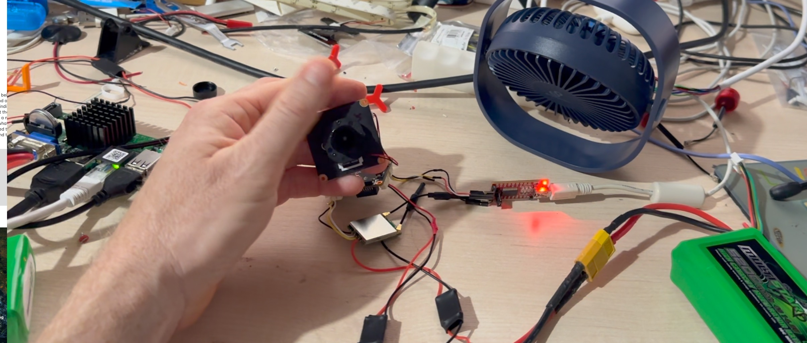

What you should get now is a live video image - hopefully not with my face in it as per the following screen shot.

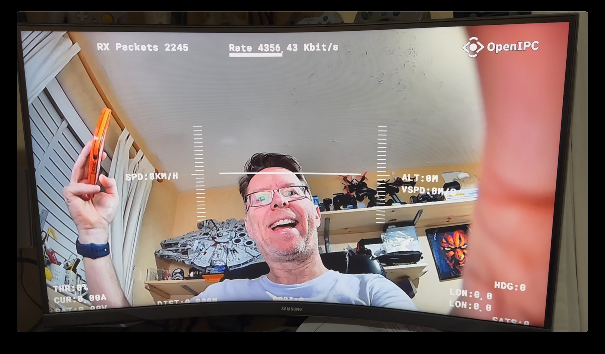

Ok, but what if you don't?  Well, there's things in this image that might point us to different things to check.  For example, if you have no image but you do see the RX packets increase, then it's likely an issue with your majestic.yaml and/or the vdec.conf file.  If the packet count isn't going up at all then take a step back and check Steps 3 & 4.  If that checks out keep moving backwards through the steps provided here - log into the devices and check if the wifi module has been detected.

### Step 8 Video tutorial and next steps

I write this step-by-step guide after filming a YouTube tutorial which you can see [here](https://www.youtube.com/watch?v=libsusKy6zc&lc=Ugx2sDfGe3gd_vaeqXZ4AaABAg) This video has me making many mistakes and so there's a bit more problem solving in there as well, but it's quite a lengthy thing to watch.  But it may be useful to some to use both and see extra visuals that this guide can't give you.

This is the basic setup that gives you streaming video.  It's not ready for FPV yet - we need to connect our telemetry so the OSD gets populated and think about how to stuff that large camera in a model.  I'll be tackling this at a later date.


### Powering camera by 5 volt

To power your camera by 5 volts power supply, you should solder wire as shown on picture below.

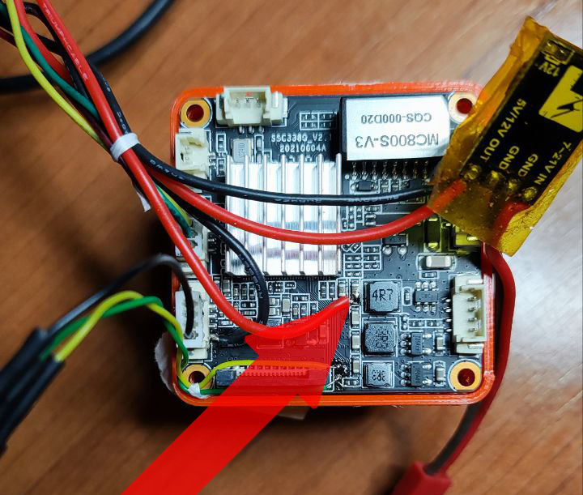


### Utilizing 2nd UART for telemetry

It is not so convenient to use those small pads for telemetry. Here is instruction how to enable 2nd UART port.

1. edit /etc/init.d/S95majestic, insert next strings like on screenshot

```
devmem 0x1F207890 16 0x8
stty -F /dev/ttyS2 115200 raw -echo -onlcr
```
   
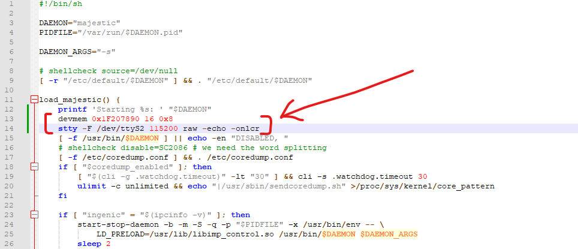

2. edit /etc/telemetry.conf Change ttyS0 to ttyS2 (see the screenshot)
   
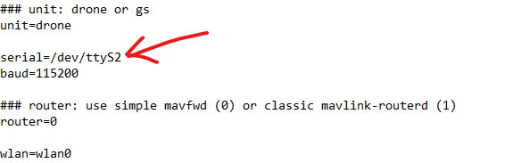

Make sure you set mavlink telemetry with 115200 boudrate in your FC
