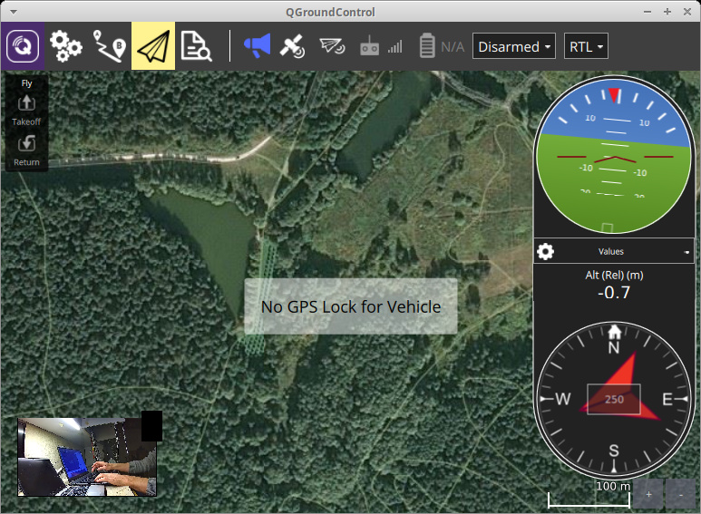

# OpenIPC Wiki
[Mục lục](../README.md)

Sử dụng OpenIPC làm liên kết video giá rẻ cho hệ thống FPV
---------------------------------------------------

<p align="center">
  
</p>

Vào năm 2015, người đam mê Befi người Đức đã [đề xuất ý tưởng về một máy bay không người lái nguồn mở](https://befinitiv.wordpress.com/wifibroadcast-analog-like-transmission-of-live-video-data/), nơi ông đề xuất sử dụng các bộ điều hợp WiFi thông thường, số lượng đã đạt đến con số hàng tỷ chiếc trên toàn thế giới và giá đã giảm đến mức chúng trở thành loại máy thu phát kỹ thuật số có giá cả phải chăng nhất.

Ý tưởng chính không phải là bản thân các adapter WiFi, mà là một phương pháp sử dụng chúng độc đáo: từ chối thiết lập kết nối mạng và chuyển sang chế độ phát sóng, khi một adapter đóng vai trò là bộ phát tín hiệu kỹ thuật số, trong khi adapter thứ hai là bộ thu.

Người ta đã đề xuất lấy một Raspberry Pi SBC giá rẻ, kết nối camera với nó thông qua giao diện MIPI và một dongle USB WiFi trong số những dongle được đề xuất, và ở phía bên kia trên bộ thu - một mô-đun WiFi tương tự với màn hình HDMI. Trong trường hợp này, thay vì giao thức UDP truyền thống để truyền video có độ trễ thấp, một giao thức cấp thấp hơn đã được sử dụng để quản lý dữ liệu linh hoạt: kiểm soát băng thông, công suất bộ phát và khả năng khôi phục dữ liệu nếu gói bị [hỏng một phần](https://en.wikipedia.org/wiki/Error_detection_and_correction) trong quá trình truyền. Một trong những vấn đề kỹ thuật là không phải mọi bộ điều hợp WiFi đều có thể hoạt động ở chế độ cấp thấp này, hơn nữa: bạn gần như luôn phải cài đặt các driver đặc biệt chỉ tồn tại cho Linux.

Bộ thu ở chế độ này hoạt động ở cái gọi là `chế độ giám sát`, nơi nó nhận và truyền đến hệ điều hành mỗi gói của một kênh WiFi nhất định, nơi nó quyết định nên giải mã hay loại bỏ nó. Bộ điều hợp bộ phát WiFi phải hoạt động ở `chế độ tiêm`, nơi kernel của hệ điều hành không thực sự tham gia vào việc tạo gói mạng theo quy định của mô hình mạng ISO. Một số bộ điều hợp hỗ trợ cả hai chế độ, một số chỉ hỗ trợ một số, do đó có thể chỉ đứng ở phía bộ phát hoặc bộ thu.

<p align="center">
  
</p>


## Lời khuyên dành cho người mới
<span style="color:red;">
OpenIPC FPV vẫn đang được phát triển. Yêu cầu kỹ năng Linux để cài đặt và sử dụng/kiểm tra.
Nếu không có những kỹ năng này hoặc bạn không muốn học hỏi, thì tốt hơn hết là bạn nên mua và sử dụng thiết bị FPV chuyên nghiệp, hoạt động ngay khi xuất xưởng.
</span>

Bạn nên có những kỹ năng sau:
* Kết nối với IP camera / NVR bằng SSH (Secure Shell)
* Trao đổi tệp qua SCP (Sao chép an toàn)
* Sử dụng [Trình soạn thảo VIM](https://github.com/vim/vim)
* Xem nội dung của tệp bằng lệnh CAT
* Kỹ năng trong việc điều chỉnh hoặc tạo tập lệnh bash


Có rất nhiều sách, trang web và video hay có sẵn có thể được sử dụng để học hỏi.

* [Khóa học cơ bản về Linux](https://github.com/kodekloudhub/linux-basics-course)
* [Video: Giới thiệu về Linux – Khóa học đầy đủ dành cho người mới bắt đầu](https://www.youtube.com/watch?v=sWbUDq4S6Y8)


## Cuộc cách mạng từ OpenIPC

Cài đặt cổ điển trong dự án [OpenHD](https://openhdfpv.org/) (và các dự án tương tự khác) bao gồm camera MIPI hoặc USB được kết nối với Raspberry Pi, đóng vai trò như bộ mã hóa video và bộ định tuyến cho hệ thống trên không và lần lượt được kết nối với bộ điều hợp WiFi qua USB và với bộ điều khiển bay qua UART. Trạm mặt đất thường bao gồm một bộ điều hợp WiFi tương tự, Raspberry Pi thứ hai hoặc máy tính xách tay Linux x86 và màn hình hoặc kính bảo hộ có độ tương phản cao.

Đôi khi, camera MIPI hoặc USB được thay thế bằng camera IP, vừa mạnh hơn (có bộ mã hóa phần cứng riêng) vừa rẻ hơn với các đặc điểm tương tự. Hầu hết các camera IP hiện đại đều là những thiết bị điển hình có Linux trên bo mạch (nhưng kích thước RAM và bộ nhớ flash khiêm tốn hơn nhiều so với Raspberry Pi), cho phép bạn biên dịch lại và chạy hầu hết mọi phần mềm di động trên chúng.

Trong khi làm việc với công nghệ này, ý tưởng đơn giản hóa hệ thống bay và chuyển tất cả phần mềm cần thiết trực tiếp sang camera IP đã xuất hiện. Về mặt kỹ thuật, firmware FPV của dự án OpenIPC là một bản build đặc biệt với hai loại driver của các adapter WiFi phổ biến, Majestic Streamer (thực hiện vai trò của GStreamer trong sơ đồ cổ điển trên hệ thống phát) và [WFB-ng](https://github.com/svpcom/wifibroadcast).

### Lợi ích

* Giảm chi phí hệ thống (camera IP H.265 so với camera MIPI H.264 với Raspberry Pi)
* Giảm mức tiêu thụ tổng thể và tăng độ tin cậy của hệ thống bằng cách đơn giản hóa mạch
* Giảm độ trễ video: trong các thử nghiệm Glass-to-Glass của chúng tôi, chúng tôi nhận được độ trễ khoảng 80ms đối với 1080p@60 (trên camera tầm trung) và khoảng 60 ms đối với 720p@60 và khoảng 100 ms đối với 1080p@30 (đối với camera giá rẻ nhất).
* Có khả năng điều chỉnh bộ mã hóa phần cứng, ví dụ, hình thành khung I thường xuyên hơn (chi tiết cụ thể phụ thuộc vào nhà cung cấp camera IP)
* Cộng đồng đã tích lũy được nhiều kinh nghiệm trong việc [sửa chữa camera IP](https://t.me/ExIPCam), điều này giúp giảm chi phí vận hành hệ thống hơn nữa.

### Nhược điểm

* Do tài nguyên hạn chế (RAM đã cài đặt và bộ nhớ vĩnh viễn), hầu hết các ngôn ngữ lập trình thịnh hành (như Java, Python, NodeJS) sẽ không được camera hỗ trợ. Nếu bạn thích viết bằng các ngôn ngữ này (hoặc muốn chuyển phần mềm được viết bằng các ngôn ngữ này sang camera), bạn sẽ phải sử dụng thêm NanoPi và sử dụng camera OpenIPC như một camera IP thông thường được kết nối với NanoPi (https://www.aliexpress.com/item/1005004679805441.html).
Thay thế bộ nhớ flash bằng bộ nhớ lớn hơn là một lựa chọn khác:
* Bạn sẽ phải thực hiện một số hàn để thay thế bộ nhớ trên bo mạch, nhưng tôi chắc chắn rằng không ai trong thế giới FPV sẽ bị điều này làm nản lòng.
* Trong hầu hết các hệ thống, phiên bản kernel Linux bị giới hạn bởi nhà cung cấp camera IP do thực tế là một số module được cung cấp ở dạng nhị phân. Việc phát triển driver kernel cho adapter WiFi mới hoặc thiết bị ngoại vi cụ thể có thể tốn nhiều thời gian.
* Trên các camera giá rẻ (mà firmware FPV được phát triển chủ yếu), tài nguyên rất hạn chế, vì vậy tại thời điểm viết bài viết này, không có khả năng chạy mạng nơ-ron. Tình hình sẽ thay đổi trong tương lai gần.

### Thành phần

* Camera IP. Xét đến mức độ phổ biến của model [VEYE 307](http://www.veye.cc/en/product/cs-mipi-imx307/) trong cộng đồng FPV, chúng tôi khuyên bạn nên mua board camera IP IVG-G2S do công ty XiongMai sản xuất với chính xác cảm biến IMX307, nhưng [với mức giá dễ chịu hơn](https://aliexpress.com/item/1005003386137528.html) (hoặc thậm chí [dễ chịu hơn nữa](https://item.taobao.com/item.htm?id=660122799616), nếu có khả năng mua trên Taobao, ví dụ: [thông qua trung gian](https://www.youcanbuy.ru/)). Khi đặt hàng board, hãy chỉ định tiêu cự của ống kính mà người bán sẽ đặt cho đơn hàng của bạn (tiêu cự lớn hơn - độ phóng đại lớn hơn, nhưng góc nhìn nhỏ hơn).
Trong tương lai, ống kính có thể được thay đổi sang ống kính khác có cùng ren, hoặc mua ngay một số model để lựa chọn (tiêu chuẩn trong thế giới giám sát video được coi là 3,6mm).
Board camera IP được cấp nguồn từ 12V (thực tế 5V là đủ, nếu bạn không sử dụng nó như một camera video có đèn nền) và đối với các thử nghiệm ban đầu, bạn nên sử dụng cáp nguồn-Ethernet kết hợp, có hai loại: 12V với [nguồn điện qua jack cắm](https://aliexpress.com/item/32961238897.html) và PoE 48V chủ động (chọn tùy thuộc vào khả năng của bộ chuyển mạch mạng của bạn).

* Adapter WiFi. Hiện tại, firmware FPV hỗ trợ hai loại driver cho chip RT8812au và AR9271 (nhưng về nguyên tắc, không ai cản trở việc thêm các adapter khác). Bạn nên sử dụng các adapter giống nhau ở cả hai phía của liên kết (hơn nữa, hãy lấy chúng từ cùng một lô theo cặp) và chỉ sử dụng tần số 5GHz do băng tần 2.4GHz đã quá tải. Firmware được thử nghiệm với hai adapter trên [RT8812au](https://aliexpress.ru/item/32664378094.html) và [AR9271](https://aliexpress.co/item/32884675724.html) (chip được đề cập cuối cùng chỉ hoạt động trên tần số 2.4GHz).

* [Bộ chuyển đổi UART-USB](https://aliexpress.com/item/1005001625391776.html) ở mức 3.3V. Lưu ý rằng việc sử dụng adapter 5V có thể làm hỏng camera của bạn. Không mua/sử dụng adapter dựa trên [PL2303](https://aliexpress.com/item/704553060.html), mặc dù chúng rẻ hơn, nhưng chúng sẽ không hoạt động với SoC này. Bộ lập trình được đề cập trong đoạn trước có thể hoạt động với adapter UART, vì vậy nếu bạn có, bạn không cần phải mua một adapter riêng.

* [Đầu nối với đầu nối loại JST 1.25](https://aliexpress.com/item/32863841787.html) trong cấu hình `3 chân` và `8 chân` để kết nối với cổng UART của camera và thay thế cáp nguồn-Ethernet tiêu chuẩn trong phiên bản bay.

Tùy chọn:

* Chip bộ nhớ flash SPI NOR 16 megabyte trở lên để thay thế chip 8 megabyte tiêu chuẩn. Chúng tôi khuyên dùng [W25Q128FVIQ](https://www.aliexpress.com/item/1005003093500630.html) hoặc [bất kỳ chip nào khác](https://www.winbond.com/hq/product/code-storage-flash-memory/serial-nor-flash/?__locale=en&selected=128Mb#Density) tương thích với firmware (có thể thêm module mới vào dự án bằng ID chip). Xin lưu ý rằng có rất nhiều hàng nhái Winbond trên thị trường và bạn nên chọn người bán cẩn thận.

* [Bộ lập trình SPI NOR cho bộ nhớ flash](https://aliexpress.com/item/32902635911.html). Về nguyên tắc, bạn có thể thực hiện mà không cần nó bằng cách sử dụng dự án [burn][github_burn], cho phép bạn flash tệp hệ thống vào flash trống/hỏng (xem phần [Điền hình ảnh vào flash trống/hỏng](https://github.com/OpenIPC/burn), phần [Flash hình ảnh vào flash trống bằng burn](#đổ-hình-ảnh-lên-flash-trống-bằng-burn-nếu-bạn-không-có-bộ-lập-trình)). Lưu ý rằng mặc dù nhiều bộ lập trình có "kẹp quần áo" trong bộ dụng cụ, nhưng hoàn toàn không thể dump/lập trình bộ nhớ flash trực tiếp trên board, do bộ lập trình bên cạnh chip cũng sẽ cấp nguồn cho phần còn lại của board (có cách để khắc phục vấn đề này bằng cách cắt chân VCC).

* [Bộ tản nhiệt SoC](https://aliexpress.com/item/32859349038.html) được khuyến khích (thường không được nhà sản xuất cài đặt do muốn giảm giá thành).

* [Ống kính nhanh F0.95](https://aliexpress.com/item/32876034491.html) (các tùy chọn khác là [một](https://aliexpress.com/item/32957334039.html) và [hai](https://aliexpress.com/item/4000142214594.html)) để tận dụng tối đa cảm biến Sony IMX307 và tận hưởng chuyến bay vào ban đêm.

* [Ống kính zoom 2.8-12mm](https://aliexpress.com/item/32809397197.html). Xin lưu ý rằng bộ dụng cụ đi kèm với board camera IP dựa trên HiSilicon 3516EV100 lỗi thời, cũng có thể được flash lại thành OpenIPC. Vì board điều khiển động cơ giao tiếp với board chính thông qua UART, bạn sẽ phải giải quyết một cách sáng tạo vấn đề ghép kênh hai cổng UART hoặc xuất ra các chân chưa hàn.

* [Đầu nối FPC 16 chân](https://aliexpress.com/item/33013766973.html) để hàn kết nối với adapter USB tốt hơn và [cáp](https://aliexpress.com/item/32958943450.html) tương ứng.

Có hai cách để sử dụng firmware OpenIPC trên board đang xem xét: thay thế bộ nhớ flash bằng bộ nhớ có dung lượng cao hơn (để cài đặt chương trình của riêng bạn) và không cần thay thế (dễ dàng hơn, nhưng trong trường hợp này, khả năng mở rộng hơn nữa của hệ thống mới sẽ rất hạn chế). Cả hai tùy chọn này sẽ được thảo luận từng bước bên dưới:

### Cài đặt trên camera (bắt đầu chung)

* Kết nối cáp với camera và kiểm tra xem nó có hoạt động không (địa chỉ IP mặc định là 192.168.1.10, liên kết cho VLC `"rtsp://192.168.1.10/user=admin&password=&channel=0&stream=0"`).
* Hàn đầu nối UART ba dây vào các miếng đệm trống trên board camera

<p align="center">

</p>

* Kết nối bộ chuyển đổi UART-USB với máy tính (tốc độ cổng 115200N1, điều khiển luồng bị vô hiệu hóa, adapter nên được đặt thành 3.3V, không phải 5V) và kiểm tra xem khi bật camera, dữ liệu đang được xuất ra và bạn có thể hủy tải xuống bằng `Ctrl-C` (cả hai dòng RX và TX đều hoạt động).

### Cài đặt bằng IP Cam DMS (không hàn flash)

* Tải xuống, giải nén kho lưu trữ và chạy chương trình [IP Cam DMS](https://team.openipc.org/ipcam_dms/IPCam_DMS_20201121_EN.zip), cho phép bạn điều khiển camera bằng giao thức của nhà sản xuất camera.
* Tải xuống [kho lưu trữ đặc biệt](https://github.com/OpenIPC/coupler/releases/download/latest/000659A7_fpv_IPC_GK7205V200_50H20AI_S38.bin) và thực hiện nâng cấp firmware, điều này sẽ giúp chuyển đổi liền mạch từ firmware gốc sang OpenIPC.

> Lưu ý! Mặc dù đây là cách dễ nhất để flash firmware, nhưng nó có một số nhược điểm:
> * Nó sẽ không sao lưu firmware gốc. Có khả năng bạn cần bản sao lưu để trích xuất một số thông số quan trọng từ firmware gốc. Vì vậy, ngay cả khi bạn chắc chắn 100% rằng bạn không cần firmware gốc, thì việc có bản sao lưu vẫn là một ý tưởng hay.
> * Trên thực tế, chỉ có phiên bản FPV được build sẵn dành cho board IPC_GK7205V200_50H20AI_S38. Đối với các board khác, bạn cần tìm và flash phiên bản lite trước. Vì vậy, việc sử dụng loại cài đặt này cho các board khác ngoài IPC_GK7205V200_50H20AI_S38 là vô nghĩa.

### Cài đặt bằng burn (không hàn flash)

Cách này sẽ hoạt động ngay cả khi bạn đã khóa bootloader hoặc flash bootloader sai vào flash SPI.
* Trên máy trạm, cài đặt máy chủ TFTP.
* Tìm SoC của bạn trên [openIPC][supported_hardware] và Tạo `Hướng dẫn Cài đặt` (lưu ý: chọn chip nhớ NOR 8M ngay cả khi bạn có chip 16M hoặc 32M vì không có phiên bản FPV cho những cấu hình đó. Đừng lo lắng sau lần khởi động đầu tiên, hệ thống tệp overlay sẽ được mở rộng.)
* Có một video hướng dẫn cho tiện ích [burn][github_burn]: [Danh sách phát Tiện ích OpenIPC BURN][youtube_burn]. Chỉ cần chọn video cho hệ điều hành của bạn và làm theo hướng dẫn.
* Ở cuối video hướng dẫn, bạn sẽ ở terminal với bootloader đã được mở khóa. Đừng đóng nó, bạn sẽ cần nó sau.
* Đảm bảo máy chủ TFTP đang chạy và bạn đã tải xuống firmware OpenIPC từ `Hướng dẫn Cài đặt` vào đúng vị trí.
* Làm theo `Hướng dẫn Cài đặt` từ bước thứ hai đến:
  - Lưu firmware gốc.
  - Flash image Firmware OpenIPC đầy đủ.

### Cài đặt trên camera (thay thế flash)

* Tắt camera, tháo chip flash SPI NOR 8 MB ban đầu và dump nó bằng bộ lập trình để phòng trường hợp. Nên tháo chip bằng [súng hàn khí nóng](https://aliexpress.com/item/32980690787.html), nhưng nếu bạn thực sự muốn, bạn có thể sử dụng mỏ hàn thông thường [như Alexey Tolstov đề xuất](https://www.youtube.com/watch?v=M69JiBtuqq8) hoặc [như thế này](https://www.youtube.com/watch?v=dspjVDv7hck). Sau khi tháo chip, các miếng đệm phải được làm sạch cặn hàn bằng một đoạn cáp đồng.
Khi làm việc với súng hàn khí nóng, bạn nên tháo ống kính và cách ly các thành phần khác, đặc biệt là các đầu nối bằng nhựa bằng [băng keo Kapton](https://aliexpress.com/item/1005003563721341.html) (trong trường hợp cực đoan, bằng giấy bạc thanh sô cô la). Không bao giờ [sử dụng hợp kim Rose](https://habr.com/ru/post/437778/). Nếu bạn không giỏi sử dụng ngón tay, cách dễ nhất là đến dịch vụ sửa chữa điện thoại di động gần nhất và cho thợ xem một phần của hướng dẫn này.

<p align="center">

</p>

* Flash [U-Boot](https://github.com/OpenIPC/firmware/releases/download/latest/u-boot-gk7205v200-universal.bin) vào flash 16 megabyte mới (ở đầu bộ nhớ) và hàn nó vào board. Xác minh rằng U-Boot khởi động và bạn đến được dấu nhắc lệnh.
* Trên máy trạm, cài đặt máy chủ TFTP, tải xuống và giải nén [kho lưu trữ](https://github.com/OpenIPC/firmware/releases/download/latest/openipc.gk7205v200-nor-fpv.tgz) chứa firmware FPV.
* Nhập các lệnh trong U-Boot (trong đó `192.168.1.17` là địa chỉ máy chủ TFTP của bạn và `192.168.1.33` là địa chỉ IP tạm thời của camera):

```
  setenv ipaddr 192.168.1.33; setenv serverip 192.168.1.17; saveenv
  run setnor16m
  #
  run uknor16m; run urnor16m
```

### Cài đặt trên camera (hoàn thiện chung)

* Sau khi khởi động hệ thống, hãy xác minh rằng nó đã nhận được địa chỉ IP qua Ethernet (có thể truy cập qua SSH thông qua `root@<địa chỉ IP của camera>` mà không cần mật khẩu hoặc mật khẩu: 12345). Sử dụng hệ điều hành hiện đại và tên `openipc.local`, bạn có thể tìm thấy camera trong mạng cục bộ mà không cần biết địa chỉ IP của nó.
* Hàn GND, DP và DM vào các miếng đệm USB (nguồn điện USB 5V không nên được kết nối với board do mức tiêu thụ điện năng cao của adapter) và riêng biệt 5V và GND để cấp nguồn cho adapter WiFi (có thể thông qua bộ chuyển đổi DC-DC bổ sung tùy thuộc vào mạch của bạn). Dây USB đi đến board phải được cố định bằng dây buộc cáp để tránh làm gãy các chân trên miếng đệm tiếp xúc:

<p align="center">
  

</p>

* Kiểm tra xem thiết bị mới đã xuất hiện sau khi khởi động thông qua lệnh `lsusb`.
* Kiểm tra xem lệnh `free -m` có cung cấp __ít nhất__ 34 megabyte RAM hệ thống hay không (phần còn lại là bộ nhớ video), nếu không, bạn có thể gặp phải trình diệt OOM khi đang bay (có thể khắc phục bằng cách sử dụng `fw_printenv bootargs / fw_setenv` với hiệu chỉnh `osmem=40M`):

```
root@openipc-gk7205v200:~# free -m
              total        used        free      shared  buff/cache   available
Mem:             34          21           2           0           9           9
Swap:             0           0           0
```

### Kiểm tra hoạt động của trạm mặt đất (trên máy tính để bàn)

* Kết nối adapter thứ hai với máy tính để bàn và biên dịch driver hoạt động ở chế độ giám sát (xem tài liệu dự án có liên quan) và tải nó qua `insmod` nếu cần.
* Kích hoạt giao diện (trong ví dụ này là `wlan0` và chỉ định [kênh](https://en.wikipedia.org/wiki/List_of_WLAN_channels)) (trong ví dụ này là `14`):
```
sudo ip link set wlan0 down
sudo iw wlan0 set monitor control
sudo iwconfig wlan0 channel 14
sudo ip link set wlan0 up
```
* Đảm bảo rằng cùng một tần số được đặt trên adapter WiFi của camera và máy tính để bàn thông qua lệnh `iwconfig`, nếu cần, hãy thay đổi tần số bằng cách chỉnh sửa `/etc/wfb.conf` trên camera (tham số `channel`) hoặc `sudo iwconfig <tên adapter> channel <số>` trên máy tính để bàn.
* Biên dịch từ nguồn [WFB-ng](https://github.com/svpcom/wifibroadcast), **phải sử dụng nhánh stable**, sao chép `./etc/gs.key` từ camera IP sang máy tính để bàn và chạy nhận `sudo ./wfb_rx -p 0 -u 5600 -K gs.key -i 7669206 wlan0`.
* Kiểm tra xem đầu ra của console
```
32168228	PKT	0:0:0:0:0:0
32169229	PKT	0:0:0:0:0:0
32170230	PKT	0:0:0:0:0:0
32171231	PKT	0:0:0:0:0:0
32172232	PKT	0:0:0:0:0:0
32173233	PKT	0:0:0:0:0:0
```
thay đổi thành
```
32178236	ANT	1	282:-54:-52:-50
32178236	ANT	0	282:-48:-46:-44
32178236	PKT	283:0:283:2:0:0
32179236	ANT	1	244:-54:-52:-50
32179236	ANT	0	244:-48:-45:-44
32179236	PKT	245:0:245:0:0:0
32180236	ANT	1	250:-54:-52:-50
32180236	ANT	0	250:-48:-45:-44
```
* Chạy Gstreamer `gst-launch-1.0 -vvvv udpsrc port=5600 ! application/x-rtp,encoding-name=H264,payload=96 ! rtph264depay ! h264parse ! queue ! avdec_h264 ! autovideosink sync=false -e` và kiểm tra chất lượng hình ảnh.

### Phát triển trạm mặt đất, telemetry

Giả sử máy Linux đã cài đặt wfb-ng theo hướng dẫn từ [bắt đầu nhanh bằng Ubuntu](https://github.com/svpcom/wfb-ng#quick-start-using-ubuntu-ground-station). Các ví dụ sau sử dụng Ubuntu 18.04 LTS và wfb-ng 22.09.

* Chạy wfb-ng, khởi động console wfb-cli:
```
sudo systemctl restart wifibroadcast@gs
wfb-cli gs
```
* Đảm bảo rằng các gói video đang phát trực tuyến. Tại đây, bạn cũng có thể thấy các giá trị RSSI của ăng-ten bộ chuyển đổi WiFi:


Nếu giá trị `recv` vẫn bằng 0 và giá trị `d_err` tăng lên, thì có thể các khóa của camera và trạm mặt đất không khớp. Đảm bảo rằng `/etc/gs.key` đã được sao chép vào trạm mặt đất. Nếu không có gói nào xuất hiện, hãy đảm bảo rằng `channel=xx` trong `/etc/wfb.conf` trên camera và `wifi_channel=xx` trong `/etc/wifibroadcast.cfg` trên trạm mặt đất có cùng giá trị. Đối với dải tần 5,8 GHz của bộ chuyển đổi RTL8812AU, nên sử dụng các kênh từ 60 trở lên.

* Cấu hình bộ điều khiển bay trong ArduPilot để xuất dữ liệu đo từ xa ở định dạng mavlink1 với tốc độ 115200, ví dụ: trên cổng Serial1. Trong trường hợp đo từ xa một chiều (chỉ liên kết xuống), hãy đảm bảo rằng bộ điều khiển bay (FC) xuất ra luồng dữ liệu đo từ xa theo yêu cầu theo mặc định, mà không cần kết nối với trạm mặt đất. Điều này được thực hiện thông qua việc cài đặt các tham số `SR1_xxx`, hãy xem [tham số mavlink SR_]. [tham số mavlink SR_](https://ardupilot.org/dev/docs/mavlink-requesting-data.html).
* Kết nối Serial1 của FC với UART của camera, rx với tx, tx với rx. Trong trường hợp FC hiện đại trên STM32F4/7, mức điện áp giống nhau (3,3V), trong trường hợp APM 5V, sẽ cần chuyển đổi mức. Điểm tinh tế là bootloader U-Boot của camera sẽ dừng khi khởi động sau khi nhận được bất kỳ byte nào trên đầu vào UART. PC nên bắt đầu xuất ra dữ liệu đo từ xa bị trì hoãn vài giây, thông qua việc đặt tham số `TELEM_DELAY`. Trên bảng, dễ dàng hơn để tạo một khoảng trống trong đường dây từ FC đến camera.
* Trên camera, trong tệp `/etc/datalink.conf`, hãy đặt tham số `telemetry=true`, trong tệp `/etc/telemetry.conf`, hãy đặt tham số `one_way=true` cho đo từ xa một chiều hoặc `one_way=false` cho đo từ xa hai chiều tương ứng. Cách đơn giản nhất để chỉnh sửa tệp trên camera là Shell Link trong Midnight Commander:
* 

* Khởi động lại camera và dịch vụ wfb-ng. Luồng dữ liệu thứ hai - đo từ xa - sẽ xuất hiện trong wfb-cli:


* Cài đặt QGroundControl. Phiên bản 4.0.11 được sử dụng ở đây vì các phiên bản mới nhất không hoạt động bình thường với video trong 18.04 LTS. Không cần tạo Comm Links mới. QGC sẽ thấy kết nối PC và hiển thị luồng đầu vào dữ liệu đo từ xa:





Trong trường hợp đo từ xa hai chiều, QGC sẽ tải xuống các tham số, cho phép thay đổi chúng, cho phép chuyển đổi chế độ bay và tải và dỡ tải nhiệm vụ:


Bạn có thể thấy rằng QGS cũng đã hiển thị video. Độ trễ trong 4.0.11 là khá đáng kể do xử lý luồng hoàn toàn bằng phần mềm, bạn nên thử các phiên bản hiện đại trong Ubuntu 20.04 trở lên.

### Xử lý sự cố

* Thông qua lệnh `sudo tcpdump -i wlan0` trên máy tính để bàn mà không cần chạy WFB-NG, bạn có thể xác minh rằng bộ phát thực sự đang gửi các gói qua mạng không dây:


### Flash image vào flash trống bằng cách sử dụng burn (nếu bạn không có bộ lập trình)

Chạy [burn](https://github.com/OpenIPC/burn) với bảng đã tắt:
```
./burn --chip gk7205v200 --file=u-boot-gk7205v200-universal.bin -d ; screen -L /dev/ttyUSB0 115200
```

Bật nguồn cho board và đợi U-Boot được điền và dòng lệnh xuất hiện. Sau đó, chúng ta thực thi các lệnh sau, trong đó `192.168.0.8` là địa chỉ máy chủ TFTP và `192.168.0.200` là địa chỉ IP tạm thời của camera.

```
setenv ipaddr 192.168.0.200
setenv serverip 192.168.0.8

sf probe 0; sf lock 0
mw.b 0x42000000 ff 1000000; tftpboot 0x42000000 u-boot-gk7205v200-universal.bin; sf probe 0
sf erase 0x0 0x50000; sf write 0x42000000 0x0 ${filesize}
reset

run setnor16m

setenv ipaddr 192.168.0.200
setenv serverip 192.168.0.8

run uknor16m ; run urnor16m

saveenv
reset
```

### Tinh chỉnh thêm

#### Phát triển bảng adapter

Có tính đến việc theo văn bản ở trên, chúng tôi đã hoàn thiện board từ một camera giám sát video giá rẻ thông thường và việc lắp đặt đầu nối USB được thực hiện mà không có đầu nối của nhà máy, người ta đề xuất tạo thêm một board đặc biệt (tương tự như [board có adapter WiFi tích hợp](https://aliexpress.com/item/1005002369013873.html), sẽ có đầu nối cho USB (có thể có thêm hub) và thẻ SD. Điều này sẽ cho phép phát sóng video với độ trễ tối thiểu ở 720p, đồng thời ghi lại bản gốc ở 1080p để xuất bản sau trên YouTube). Nếu bạn có khả năng thiết kế board như vậy và chia sẻ mạch với cộng đồng, chúng tôi sẽ rất biết ơn.

### Câu hỏi thường gặp

#### Camera tiêu thụ bao nhiêu năng lượng trong quá trình hoạt động?

Mức tiêu thụ phụ thuộc vào việc cảm biến có được bật hay không (bản thân nó là một trong những bộ phận tiêu thụ nhiều năng lượng) và theo các phép đo của chúng tôi là 1,7W ở chế độ hoạt động và 1,1W khi cảm biến bị tắt (nhưng hệ thống chính đang chạy). Từ đó, chúng ta có thể kết luận rằng nếu cần thiết, chúng ta có thể tắt/bật trình phát trực tuyến theo chương trình để giảm mức tiêu thụ hệ thống hơn nữa vào những thời điểm cần thiết.

Ngoài ra, cần xem xét:
* Khả năng tắt bộ điều hợp Ethernet theo chương trình N phút sau khi hệ thống khởi động (sắp xếp hoạt động ngay sau khi khởi động để cho phép thay đổi cấu