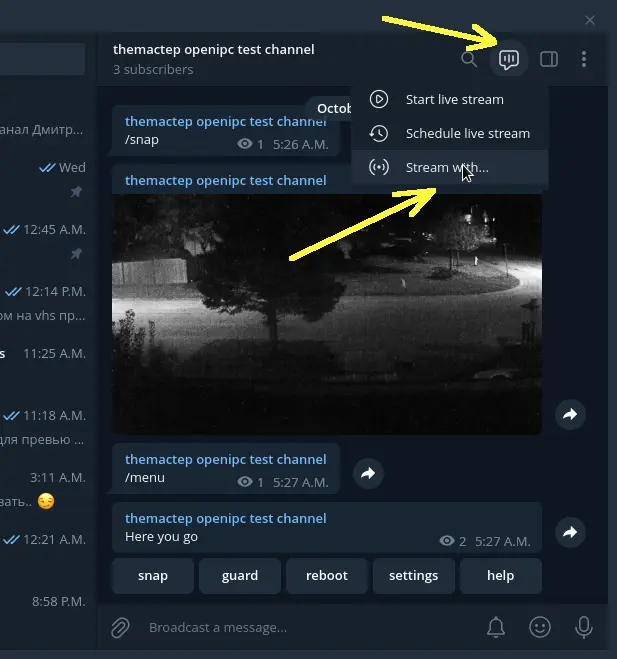
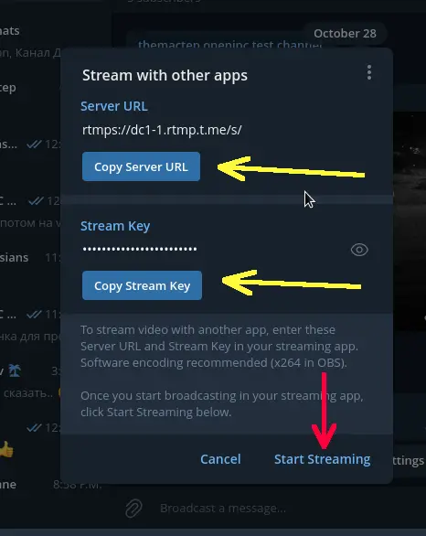
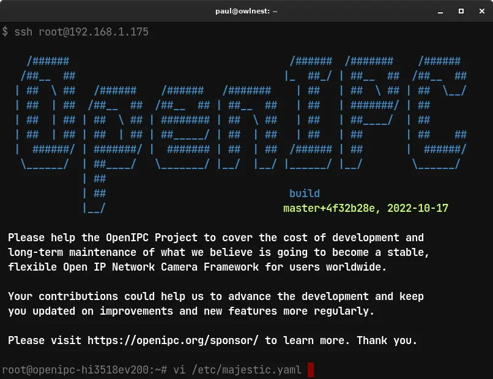
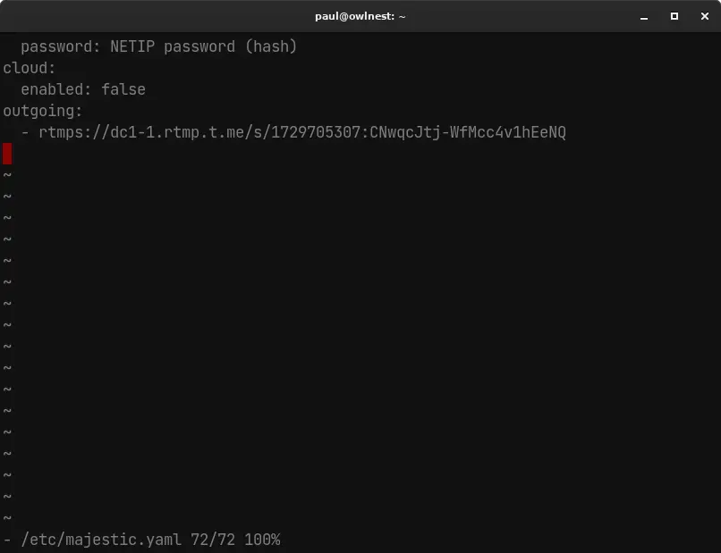
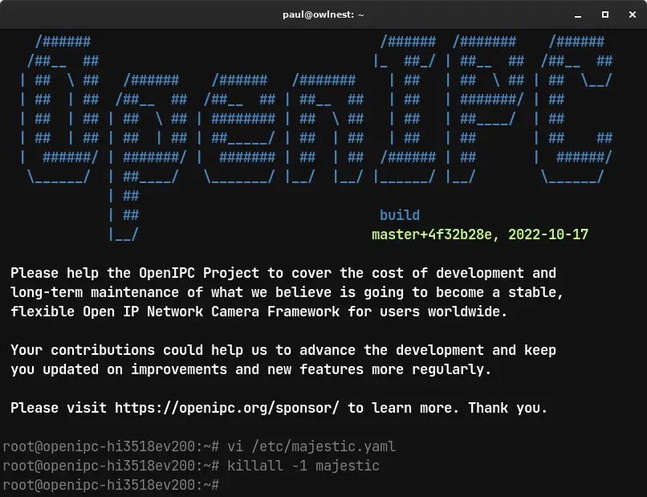
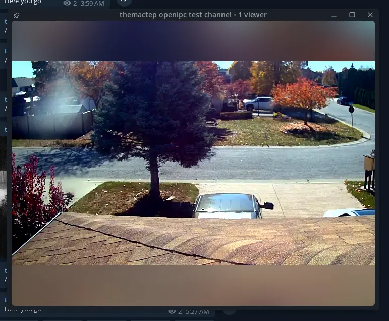

## Wiki OpenIPC
[Mục lục](../README.md)

## Phát trực tiếp lên Telegram

Mở kênh mà bạn muốn phát trực tiếp. Bắt đầu phiên phát trực tiếp.

Sao chép URL máy chủ và Khóa luồng từ Cài đặt.

Mở `/etc/majestic.yaml` trên camera và thêm URL và khóa vào phần `outgoing` của cấu hình.

**Lưu ý:** Nó sẽ phát trực tiếp `video0`. Nó **phải** được cấu hình thành codec video: `h264`.

**Lưu ý:** Đừng quên thêm dấu `-` trước các tham số!

**Lưu ý:** Phần `outgoing` có thể ảnh hưởng đến việc thêm phần khác. Hãy nhớ điều đó!

Khởi động lại trình phát trực tiếp majestic.

Tận hưởng luồng.

**Giải thích thuật ngữ:**

* **Telegram:** Là một ứng dụng nhắn tin tập trung vào tốc độ và bảo mật.
* **Streaming:** Phát trực tiếp, là quá trình truyền dữ liệu liên tục từ máy chủ đến máy khách.
* **Server URL:** URL máy chủ, là địa chỉ của máy chủ phát trực tiếp.
* **Stream key:** Khóa luồng, là một mã bí mật được sử dụng để xác thực luồng phát trực tiếp.
* **majestic.yaml:** Là tệp cấu hình cho trình phát trực tiếp majestic.
* **outgoing:** Là một phần trong tệp cấu hình majestic.yaml, được sử dụng để định cấu hình các luồng phát trực tiếp ra bên ngoài.
* **video0:** Là ID của luồng video mặc định.
* **h264:** Là một codec video phổ biến.
* **codec:** Bộ mã hóa/giải mã, là một thuật toán được sử dụng để nén và giải nén dữ liệu.

