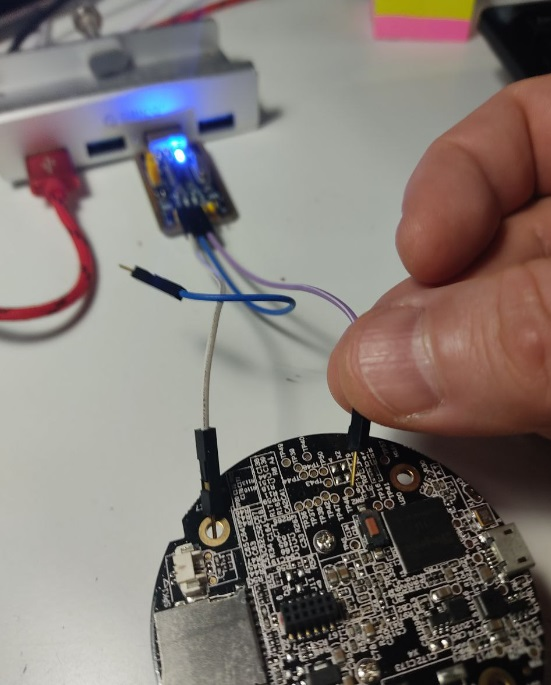
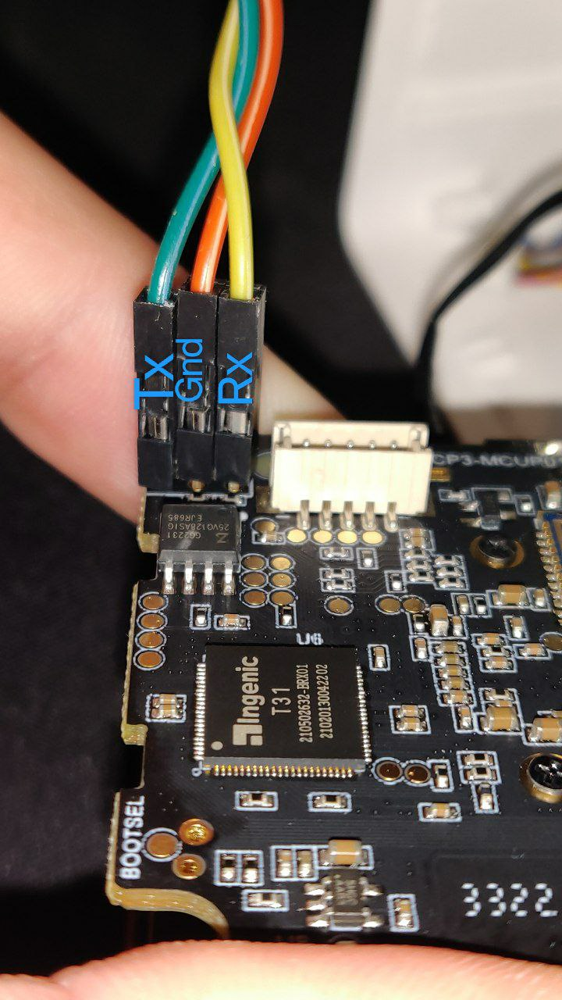

# Mô tả chân Serial UART

## Kiểm tra nhanh

Cấu hình cổng nối tiếp -> 8N1 Tốc độ Baud 115200

Đây là một bài kiểm tra nhanh. Nối đất với đất, tx từ bộ chuyển đổi không được kết nối, rx dò tìm các pad và bạn kiểm tra đầu ra trong ứng dụng terminal.

## Chân UART của camera

### T31 -- Đổi thương hiệu Wyze Cam Pan v3 

