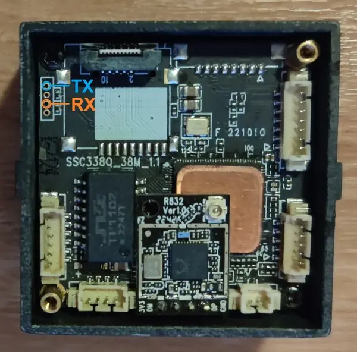
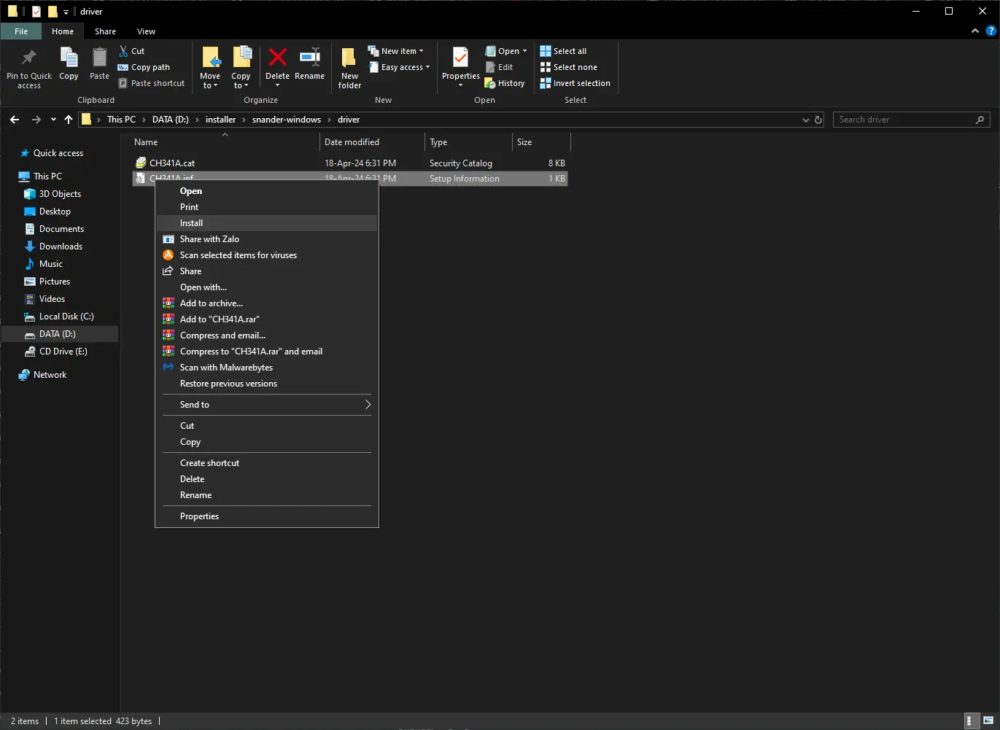

# OpenIPC Wiki
[Mục lục](../README.md)

Phục hồi Sigmastar
---

**Xác định vị trí đầu ra UART của Sigmastar và kết nối nó với CH341A I2C:**
- $\color{dimgray}{\texttt{GND -> GND (Chân 1-4)}}$
- $\color{deepskyblue}{\texttt{TX -> SDA I2C (Chân 5)}}$
- $\color{orange}{\texttt{RX -> SCL I2C (Chân 6)}}$





---

**Tải xuống snander-mstar:**
- https://github.com/openipc/snander-mstar/releases

<details>
<summary>Cài đặt trình điều khiển Windows</summary>

</details>

---

**Kiểm tra flash của thiết bị bằng snander:**
- Thiết bị phải được cấp nguồn khi kết nối với bộ nạp.
- Tắt/bật nguồn có thể hữu ích nếu thiết bị không được phát hiện.
```
snander -i -q
```


**Xóa phân vùng khởi động:**
```
snander -l 0x200000 -e
```


**Ghi tệp u-boot mới:**
- https://github.com/openipc/firmware/releases/tag/latest
- Thả tệp vào cùng thư mục với chương trình
```
snander -w u-boot-ssc338q-nand.bin
```


---

**Thiết bị I2C:**
- 0x49 -> MStar ISP
- 0x59 -> MStar Debug

---

- [Phương pháp thay thế bằng Raspberry Pi của MarioFPV](https://youtu.be/88C8UvyKQlQ)


